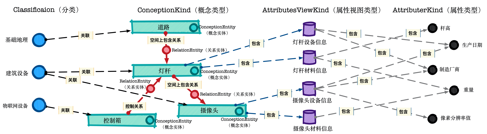

###### Data Ocean & Cloud Graph  数海云图

***
# <span style="color:#CE0000;"> Core Realm  </span>Java SDK API 说明

#### ➜ 术语 - Term 

DOCG 数据分析平台的业务模型使用以下的术语来描述实现一个业务领域模型所需要的各种对象的概念。通过组合使用这些对象的功能，可以实现针对特定领域模型的全部数据管理与分析相关的业务需求。

**概念类型**（*ConceptionKind*）：表示特定领域模型中能够包含的任意真实或逻辑概念的类型表达。包含该类型的对象中能够包含的所有属性视图类型以及该类型的对象上能够执行的关系附着规则类型定义。

**概念实体**（*ConceptionEntity*）：概念实体是一个特定概念类型的真实数据表达，表示一个真实世界中存在的客观事物或一个逻辑概念中存在的虚拟事物。

**属性类型**（*AttributeKind*）：表示一个概念类型中包含的一项数据信息的基本结构。属性类型包含该项属性的名称，描述以及属性的数据类型。

**属性视图类型**（*AttributesViewKind*）：属性视图类型是包含若干属性类型的视图容器，在一个属性视图类型中可以包含多个属性类型。属性视图类型与概念类型直接关联，描述一个概念类型中包含的某一个特定类别的属性信息集合。

**关系类型**（*RelationKind*）:关系类型描述概念实体之间的一种特定的关联方式，例如两个实体对象在空间上的包含关系，或者两个实体对象在逻辑上的依赖关系。

**关系实体**（*RelationEntity*）:关系实体是一个特定关系类型的真实数据表达，它表示特定领域模型中两个概念实体之间的一个客观关联。

**关系附着规则类型**（*RelationAttachKind*）：表示将两种特定概念类型的实体数据相互关联的具体执行规则。

**分类**（*Classification*）：代表一类客观存在的，不依赖具体的业务和分析目标而变化的字典类概念，例如性别,人种，建筑类型分类等。它普遍性的与特定领域模型中的各种概念类型的实体对象产生交互，是在领域模型中进行多维数据分析的一个重要目标。

**时间流**（*TimeFlow*）：实体化的表示一段连续的时间。时间流上包含一系列的各种颗粒度的时间刻度实体，通过时间流可以使用多种方式创建，遍历，获取时间刻度实体。时间流是在领域模型中进行时域分析的重要方式。

**时间刻度实体**（*TimeScaleEntity*）：是一种特殊的概念实体，每一个时间刻度实体代表一个固定的时间点，例如一个特定的年份或者分钟。一系列连续的时间刻度实体相互关联，构成时间流的一个片段。通过时间刻度事件，一个时间刻度实体可以与任意数量的概念实体关联，表述时域分析所需的时间相关信息。

**时间刻度事件**（*TimeScaleEvent*）：代表一个常规概念实体在特定时刻上的与时间相关的事件。一个常规概念实体通过一个唯一的时间刻度事件与一个特定的表述该时间点的时间刻度实体相关联，来表述概念实体在特定时间点上的业务信息。

**地理空间区域**（*GeospatialRegion*）：实体化的表示一个地理空间的区域范围。地理空间区域中包含一系列的各种颗粒度的代表不同级别行政区划的地理空间刻度实体，通过地理空间区域可以使用多种方式创建，遍历，获取地理空间刻度实体。地理空间区域是在领域模型中进行空间分析的重要方式。

**地理空间刻度实体**（*GeospatialScaleEntity*）：是一种特殊的概念实体，每一个地理空间刻度实体代表一个特定的行政区划，例如一个特定的国家或者街道社区。一系列连续的地理空间刻度实体相互关联，构成地理空间区域的一个组中部分。通过地理空间刻度事件，一个地理空间刻度实体可以与任意数量的概念实体关联，表述空间分析所需的地理位置相关信息。

**地理空间刻度事件**（*GeospatialScaleEvent*）：代表一个常规概念实体在特定地理位置上的与空间相关的事件。一个常规概念实体通过一个唯一的地理空间刻度事件与一个特定的表述该地理位置所属行政区划的地理空间刻度实体相关联，来表述概念实体在特定地理位置上的业务信息。


各个术语代表的对象间的基本交互关系示例：



#### ➜ JAVA SDK

###### *数据建模类对象*

- CoreRealm：定义，维护业务领域模型中的各类对象
- ConceptionKind：定义，维护概念类型
- AttributesViewKind：定义，维护属性视图类型
- AttributeKind：定义，维护属性类型
- RelationKind：定义，维护关系类型
- RelationAttachKind：定义，维护基本关联关系创建规则

**对象方法概述**

###### ↳ CoreRealm

---

```java
   /**
     * 获取底层图数据库的实现技术，可能的类型有 NEO4J ,TUGRAPH 或 MEMGRAPH
     *
     * @return 底层图数据库实现技术枚举
     */
    public CoreRealmStorageImplTech getStorageImplTech();

    /**
     * 获取核心领域名称
     *
     * @return 核心领域名称
     */
    public String getCoreRealmName();

    /**
     * 根据名称获取概念类型对象
     *
     * @param conceptionKindName String 需要获取的概念类型名称
     *
     * @return 概念类型对象
     */
    public ConceptionKind getConceptionKind(String conceptionKindName);

    /**
     * 创建新的概念类型
     *
     * @param conceptionKindName String 需要创建的概念类型名称，不能与已有概念类型重名
     * @param conceptionKindDesc String 需要创建的概念类型描述
     *
     * @return 概念类型对象
     */
    public ConceptionKind createConceptionKind(String conceptionKindName,String conceptionKindDesc);

    /**
     * 创建新的概念类型并指定父概念类型，该方法在 NEO4J 实现类型下无效
     *
     * @param conceptionKindName String 需要创建的概念类型名称，不能与已有概念类型重名,非空输入值
     * @param conceptionKindDesc String 需要创建的概念类型描述
     * @param parentConceptionKindName String 父概念类型名称
     *
     * @return 概念类型对象
     */
    public ConceptionKind createConceptionKind(String conceptionKindName,String conceptionKindDesc,String parentConceptionKindName) throws CoreRealmFunctionNotSupportedException;

    /**
     * 根据名称删除概念类型
     *
     * @param conceptionKindName String 需要删除的概念类型名称
     * @param deleteExistEntities boolean 是否删除该概念类型的全部已经存在的概念实体对象
     *
     * @return 如果操作成功返回 true
     */
    public boolean removeConceptionKind(String conceptionKindName,boolean deleteExistEntities) throws CoreRealmServiceRuntimeException;

    /**
     * 重命名指定的概念类型名称及描述，操作完成后该类型下所有的概念实体的类型名称均会改为新的类型名称
     *
     * @param originalConceptionKindName String 原概念类型名称，必须为已存在概念类型,非空输入值
     * @param newConceptionKindName String 需要修改为的概念类型名称，不能与已有概念类型重名,非空输入值
     * @param newConceptionKindDesc String 需要修改为的概念类型描述
     *
     * @return 如果操作成功返回 true
     */
    public boolean renameConceptionKind(String originalConceptionKindName,String newConceptionKindName,String newConceptionKindDesc) throws CoreRealmServiceRuntimeException;

    /**
     * 根据输入的自定义配置项内容，匹配条件查询概念类型对象
     *
     * @param itemName String 需要查询的自定义配置项名称
     * @param itemValue Object 需要查询的的自定义配置项值,如该值输入非空,则执行精确值匹配。如该值输入为空,则忽略具体值,执行自定义配置项存在查询
     *
     * @return 概念类型对象列表
     */
    public List<ConceptionKind> getConceptionKindsByMetaConfigItemMatch(String itemName,Object itemValue);

    /**
     * 根据对象唯一ID获取属性视图类型对象
     *
     * @param attributesViewKindUID String 需要获取的属性视图类型唯一ID
     *
     * @return 属性视图类型对象
     */
    public AttributesViewKind getAttributesViewKind(String attributesViewKindUID);

    /**
     * 创建新的属性视图类型
     *
     * @param attributesViewKindName String 需要创建的属性视图类型名称，能够与已有属性视图类型重名,非空输入值
     * @param attributesViewKindDesc String 需要创建的属性视图类型描述
     * @param attributesViewKindDataForm AttributesViewKindDataForm 需要创建的属性视图类型的数据存储结构,默认为 SINGLE_VALUE 类型
     *
     * @return 属性视图类型对象
     */
    public AttributesViewKind createAttributesViewKind(String attributesViewKindName,String attributesViewKindDesc, AttributesViewKind.AttributesViewKindDataForm attributesViewKindDataForm);

    /**
     * 根据唯一ID删除属性视图类型
     *
     * @param attributesViewKindUID String 需要删除的属性视图类型唯一ID
     *
     * @return 如果操作成功返回 true
     */
    public boolean removeAttributesViewKind(String attributesViewKindUID) throws CoreRealmServiceRuntimeException;

    /**
     * 根据输入条件查询属性视图类型对象,所有查询条件均为可选输入，各个查询条件精确匹配输入值，互相间为 AND 的组合关系
     *
     * @param attributesViewKindName String 需要查询的属性视图类型名称
     * @param attributesViewKindDesc String 需要查询的的属性视图类型描述
     * @param attributesViewKindDataForm AttributesViewKindDataForm 需要查询的属性视图类型的数据存储结构
     *
     * @return 属性视图类型对象列表
     */
    public List<AttributesViewKind> getAttributesViewKinds(String attributesViewKindName, String attributesViewKindDesc, AttributesViewKind.AttributesViewKindDataForm attributesViewKindDataForm);

    /**
     * 根据输入的自定义配置项内容，匹配条件查询属性视图类型对象
     *
     * @param itemName String 需要查询的自定义配置项名称
     * @param itemValue Object 需要查询的的自定义配置项值,如该值输入非空,则执行精确值匹配。如该值输入为空,则忽略具体值,执行自定义配置项存在查询
     *
     * @return 属性视图类型对象列表
     */
    public List<AttributesViewKind> getAttributesViewKindsByMetaConfigItemMatch(String itemName,Object itemValue);

    /**
     * 根据对象唯一ID获取属性类型对象
     *
     * @param attributeKindUID String 需要获取的属性类型唯一ID
     *
     * @return 属性类型对象
     */
    public AttributeKind getAttributeKind(String attributeKindUID);

    /**
     * 根据输入的自定义配置项内容，匹配条件查询属性类型对象
     *
     * @param itemName String 需要查询的自定义配置项名称
     * @param itemValue Object 需要查询的的自定义配置项值,如该值输入非空,则执行精确值匹配。如该值输入为空,则忽略具体值,执行自定义配置项存在查询
     *
     * @return 属性类型对象列表
     */
    public List<AttributeKind> getAttributeKindsByMetaConfigItemMatch(String itemName,Object itemValue);

    /**
     * 创建新的属性类型
     *
     * @param attributeKindName String 需要创建的属性类型名称，能够与已有属性类型重名,非空输入值
     * @param attributeKindDesc String 需要创建的属性类型描述
     * @param attributeDataType AttributeDataType 需要创建的属性类型的数据类型,非空输入值
     *
     * @return 属性类型对象
     */
    public AttributeKind createAttributeKind(String attributeKindName,String attributeKindDesc, AttributeDataType attributeDataType);

    /**
     * 根据唯一ID删除属性类型
     *
     * @param attributeKindUID String 需要删除的属性类型唯一ID
     *
     * @return 如果操作成功返回 true
     */
    public boolean removeAttributeKind(String attributeKindUID) throws CoreRealmServiceRuntimeException;

    /**
     * 根据输入条件查询属性类型对象,所有查询条件均为可选输入，各个查询条件精确匹配输入值，互相间为 AND 的组合关系
     *
     * @param attributeKindName String 需要查询的属性类型名称
     * @param attributeKindDesc String 需要查询的的属性类型描述
     * @param attributeDataType AttributesViewKindDataForm 需要查询的属性类型的数据类型
     *
     * @return 属性类型对象列表
     */
    public List<AttributeKind> getAttributeKinds(String attributeKindName,String attributeKindDesc,AttributeDataType attributeDataType);

    /**
     * 根据名称获取关系类型对象
     *
     * @param relationKindName String 需要获取的关系类型名称
     *
     * @return 关系类型对象
     */
    public RelationKind getRelationKind(String relationKindName);

    /**
     * 创建新的关系类型
     *
     * @param relationKindName String 需要创建的关系类型名称，不能与已有关系类型重名
     * @param relationKindDesc String 需要创建的关系类型描述
     *
     * @return 关系类型对象
     */
    public RelationKind createRelationKind(String relationKindName,String relationKindDesc);

    /**
     * 创建新的关系类型并指定父关系类型，该方法在 NEO4J 实现类型下无效
     *
     * @param relationKindName String 需要创建的关系类型名称，不能与已有关系类型重名,非空输入值
     * @param relationKindDesc String 需要创建的关系类型描述
     * @param parentRelationKindName String 父关系类型名称
     *
     * @return 关系类型对象
     */
    public RelationKind createRelationKind(String relationKindName,String relationKindDesc,String parentRelationKindName)
            throws CoreRealmFunctionNotSupportedException;

     /**
     * 重命名指定的关系类型名称及描述，操作完成后该类型下所有的关系实体的类型名称均会改为新的类型名称
     *
     * @param originalRelationKindName String 原关系类型名称，必须为已存在概念类型,非空输入值
     * @param newRelationKindName String 需要修改为的关系类型名称，不能与已有关系类型重名,非空输入值
     * @param newRelationKindDesc String 需要修改为的关系类型描述
     *
     * @return 如果操作成功返回 true
     */
    public boolean renameRelationKind(String originalRelationKindName,String newRelationKindName,String newRelationKindDesc)
            throws CoreRealmServiceRuntimeException;

    /**
     * 根据名称删除关系类型
     *
     * @param relationKindName String 需要删除的关系类型名称
     * @param deleteExistEntities boolean 是否删除该关系类型的全部已经存在的关系实体对象
     *
     * @return 如果操作成功返回 true
     */
    public boolean removeRelationKind(String relationKindName, boolean deleteExistEntities) throws CoreRealmServiceRuntimeException;

    /**
     * 根据输入的自定义配置项内容，匹配条件查询关系类型对象
     *
     * @param itemName String 需要查询的自定义配置项名称
     * @param itemValue Object 需要查询的的自定义配置项值,如该值输入非空,则执行精确值匹配。如该值输入为空,则忽略具体值,执行自定义配置项存在查询
     *
     * @return 关系类型对象列表
     */
    public List<RelationKind> getRelationKindsByMetaConfigItemMatch(String itemName,Object itemValue);

     /**
     * 根据输入条件查询关系附着规则类型对象,所有查询条件均为可选输入，各个查询条件精确匹配输入值，互相间为 AND 的组合关系
     *
     * @param relationAttachKindName String 需要查询的关系附着规则类型名称
     * @param relationAttachKindDesc String 需要查询的关系附着规则类型描述
     * @param sourceConceptionKindName String 需要查询的关联关系源概念类型名称
     * @param targetConceptionKindName String 需要查询的关联关系目标概念类型名称
     * @param relationKindName String 需要查询的关联关系类型名称
     * @param allowRepeatableRelationKind Boolean 需要查询的关系附着规则类型是否允许重复创建相同关系类型的关联
     *
     * @return 关系附着规则类型列表
     */
    public List<RelationAttachKind> getRelationAttachKinds(String relationAttachKindName, String relationAttachKindDesc, String sourceConceptionKindName, String targetConceptionKindName,String relationKindName,Boolean allowRepeatableRelationKind);

     /**
     * 根据对象唯一ID获取关系附着规则类型对象
     *
     * @param relationAttachKindUID String 需要获取的关系附着规则类型唯一ID
     *
     * @return 关系附着规则类型
     */
    public RelationAttachKind getRelationAttachKind(String relationAttachKindUID);

    /**
     * 创建新的关系附着规则类型
     *
     * @param relationAttachKindName String 需要创建的关系附着规则类型名称，不能与已有关系附着规则类型重名,非空输入值
     * @param relationAttachKindDesc String 需要创建的关系附着规则类型描述
     * @param sourceConceptionKindName String 关联关系源概念类型名称,非空输入值
     * @param targetConceptionKindName String 关联关系目标概念类型名称,非空输入值
     * @param relationKindName String 关联关系类型名称,非空输入值
     * @param allowRepeatableRelationKind boolean 是否允许重复创建相同关系类型的关联
     *
     * @return 关系附着规则类型
     */
    public RelationAttachKind createRelationAttachKind(String relationAttachKindName, String relationAttachKindDesc, String sourceConceptionKindName, String targetConceptionKindName,String relationKindName,boolean allowRepeatableRelationKind)
            throws CoreRealmFunctionNotSupportedException;

    /**
     * 根据对象唯一ID删除关系附着规则类型
     *
     * @param relationAttachKindUID String 需要删除的关系附着规则类型唯一ID
     *
     * @return 如果操作成功返回 true
     */
    public boolean removeRelationAttachKind(String relationAttachKindUID) throws CoreRealmServiceRuntimeException;

    /**
     * 根据名称获取分类对象
     *
     * @param classificationName String 需要获取的分类名称
     *
     * @return 分类对象
     */
    public Classification getClassification(String classificationName);

    /**
     * 创建新的分类
     *
     * @param classificationName String 需要创建的分类名称，不能与已有分类重名
     * @param classificationDesc String 需要创建的分类描述
     *
     * @return 分类对象
     */
    public Classification createClassification(String classificationName,String classificationDesc);

    /**
     * 创建新的分类并指定父分类
     *
     * @param classificationName String 需要创建的分类名称，不能与已有分类重名
     * @param classificationDesc String 需要创建的分类描述
     * @param parentClassificationName String 需要创建的分类的父分类名称
     *
     * @return 分类对象
     */
    public Classification createClassification(String classificationName,String classificationDesc,String parentClassificationName)
            throws CoreRealmServiceRuntimeException;

    /**
     * 根据名称删除分类
     *
     * @param classificationName String 需要删除的分类名称
     *
     * @return 如果操作成功返回 true
     */
    public boolean removeClassification(String classificationName) throws CoreRealmServiceRuntimeException;

    /**
     * 根据名称删除分类及所有后代分类
     *
     * @param classificationName String 需要删除的分类名称
     *
     * @return 如果操作成功返回 true
     */
    public boolean removeClassificationWithOffspring(String classificationName) throws CoreRealmServiceRuntimeException;

    /**
     * 创建一个属于多概念类型的概念实体对象
     *
     * @param conceptionKindNames String[] 所属的概念类型数组
     * @param conceptionEntityValue ConceptionEntityValue 概念实体属性值
     * @param addPerDefinedRelation boolean 是否根据预定义的关联逻辑建立关系链接
     *
     * @return 概念实体对象
     */
    public ConceptionEntity newMultiConceptionEntity(String[] conceptionKindNames,ConceptionEntityValue conceptionEntityValue, boolean addPerDefinedRelation) throws CoreRealmServiceRuntimeException;

    /**
     * 创建一个属于多概念类型的概念实体对象并根据输入的关系附着规则类型建立关系链接
     *
     * @param conceptionKindNames String[] 所属的概念类型数组
     * @param conceptionEntityValue ConceptionEntityValue 概念实体属性值
     * @param relationAttachKindList List<RelationAttachKind> 建立链接所需的关系附着规则类型列表
     * @param entityRelateRole EntityRelateRole 概念实体在关系中的角色
     *
     * @return 概念实体对象
     */
    public ConceptionEntity newMultiConceptionEntity(String[] conceptionKindNames,ConceptionEntityValue conceptionEntityValue,List<RelationAttachKind> relationAttachKindList, RelationAttachKind.EntityRelateRole entityRelateRole) throws CoreRealmServiceRuntimeException;

    /**
     * 创建多个属于多概念类型的概念实体对象
     *
     * @param conceptionKindNames String[] 所属的概念类型数组
     * @param conceptionEntityValues List<ConceptionEntityValue> 概念实体属性值列表
     * @param addPerDefinedRelation boolean 是否根据预定义的关联逻辑建立关系链接
     *
     * @return 实体对象操作返回结果
     */
    public EntitiesOperationResult newMultiConceptionEntities(String[] conceptionKindNames,List<ConceptionEntityValue> conceptionEntityValues, boolean addPerDefinedRelation) throws CoreRealmServiceRuntimeException;

    /**
     * 创建多个属于多概念类型的概念实体对象
     *
     * @param conceptionKindNames String[] 所属的概念类型数组
     * @param conceptionEntityValues List<ConceptionEntityValue> 概念实体属性值列表
     * @param relationAttachKindList List<RelationAttachKind> 建立链接所需的关系附着规则类型列表
     * @param entityRelateRole EntityRelateRole 概念实体在关系中的角色
     *
     * @return 实体对象操作返回结果
     */
    public EntitiesOperationResult newMultiConceptionEntities(String[] conceptionKindNames,List<ConceptionEntityValue> conceptionEntityValues, List<RelationAttachKind> relationAttachKindList, RelationAttachKind.EntityRelateRole entityRelateRole) throws CoreRealmServiceRuntimeException;

    /**
     * 根据自定义查询条件获取实体的属性信息
     *
     * @param customQuerySentence String 用户自定义的查询语句，必须确保返回的实体为概念实体或关系实体
     *
     * @return 查询结果实体数据列表，具体数据格式依查询语句的返回条件而定
     */
    public List<Map<String,Map<String,Object>>> executeCustomQuery(String customQuerySentence) throws CoreRealmServiceRuntimeException;

    /**
     * 根据自定义查询条件获取实体的统计类信息
     *
     * @param customQuerySentence String 用户自定义的查询语句，必须确保返回的实体为统计类汇总数值信息
     *
     * @return 查询结果统计信息，具体数据格式依查询语句的返回条件而定
     */
    public Map<String,Number> executeCustomStatistic(String customQuerySentence)throws CoreRealmServiceRuntimeException;

    /**
     * 获取默认时间流,如默认时间流不存在则自动创建
     *
     * @return 时间流对象
     */
    public TimeFlow getOrCreateTimeFlow();

    /**
     * 获取用户自定义时间流,如自定义时间流不存在则自动创建
     *
     * @param timeFlowName String 用户自定义时间流名称
     *
     * @return 时间流对象
     */
    public TimeFlow getOrCreateTimeFlow(String timeFlowName);

    /**
     * 删除默认时间流以及所有包含其中的时间刻度实体
     *
     * @return 删除的时间流实例以及该时间流中包含的时间刻度实体数量的总和
     */
    public long removeTimeFlowEntities();

    /**
     * 删除用户自定义时间流以及所有包含其中的时间刻度实体
     *
     * @param timeFlowName String 用户自定义时间流名称
     *
     * @return 删除的时间流实例以及该时间流中包含的时间刻度实体数量的总和
     */
    public long removeTimeFlowEntities(String timeFlowName);

    /**
     * 获取领域所有时间流
     *
     * @return 时间流对象列表
     */
    public List<TimeFlow> getTimeFlows();

    /**
     * 获取默认地理空间区域,如默认地理空间区域不存在则自动创建
     *
     * @return 地理空间区域对象
     */
    public GeospatialRegion getOrCreateGeospatialRegion();

    /**
     * 获取用户自定义地理空间区域,如自定义地理空间区域不存在则自动创建
     *
     * @param geospatialRegionName String 用户自定义地理空间区域名称
     *
     * @return 地理空间区域对象
     */
    public GeospatialRegion getOrCreateGeospatialRegion(String geospatialRegionName);

    /**
     * 删除默认地理空间区域以及所有包含其中的地理空间刻度实体
     *
     * @return 删除的地理空间区域实例以及该区域中包含的地理空间刻度实体数量的总和
     */
    public long removeGeospatialRegionWithEntities();

    /**
     * 删除用户自定义地理空间区域以及所有包含其中的地理空间刻度实体
     *
     * @param geospatialRegionName String 用户自定义地理空间区域名称
     *
     * @return 删除的地理空间区域实例以及该区域中包含的地理空间刻度实体数量的总和
     */
    public long removeGeospatialRegionWithEntities(String geospatialRegionName);

    /**
     * 获取领域所有地理空间区域
     *
     * @return 地理空间区域对象列表
     */
    public List<GeospatialRegion> getGeospatialRegions();

    /**
     * 获取领域中所有 ConceptionKind 的实体统计信息
     *
     * @return ConceptionKind的实体统计信息列表
     */
    public List<EntityStatisticsInfo> getConceptionEntitiesStatistics() throws CoreRealmServiceEntityExploreException;

    /**
     * 获取领域中所有 RelationKind 的实体统计信息
     *
     * @return RelationKind的实体统计信息列表
     */
    public List<EntityStatisticsInfo> getRelationEntitiesStatistics() throws CoreRealmServiceEntityExploreException;

	/**
     * 获取领域中所有 ConceptionKind 的实体之间的相关关系信息
     *
     * @return 各个关联的概念类型结对与相关的关系类型信息的列表
     */
    public List<ConceptionKindCorrelationInfo> getConceptionKindsCorrelation();

    /**
     * 获取当前领域的跨类型数据操作器
     *
     * @return 当前领域的跨类型数据操作器
     */
    public CrossKindDataOperator getCrossKindDataOperator();

    /**
     * 获取当前领域的系统维护操作器
     *
     * @return 当前领域的系统维护操作器
     */
    public SystemMaintenanceOperator getSystemMaintenanceOperator();

    /**
     * 获取当前领域的数据科学操作器
     *
     * @return 当前领域的数据科学操作器
     */
    public DataScienceOperator getDataScienceOperator();

    /**
     * 获取当前领域的实体数据交换操作器
     *
     * @return 当前领域的实体数据交换操作器
     */
    public EntitiesExchangeOperator getEntitiesExchangeOperator();

    /**
     * 获取当前领域的全部概念类型元数据信息
     *
     * @return 当前领域的全部概念类型元数据信息列表
     */
    public List<KindMetaInfo> getConceptionKindsMetaInfo() throws CoreRealmServiceEntityExploreException;

    /**
     * 获取当前领域的全部关系类型元数据信息
     *
     * @return 当前领域的全部关系类型元数据信息列表
     */
    public List<KindMetaInfo> getRelationKindsMetaInfo();

    /**
     * 获取当前领域的全部属性类型元数据信息
     *
     * @return 当前领域的全部属性类型元数据信息列表
     */
    public List<AttributeKindMetaInfo> getAttributeKindsMetaInfo() throws CoreRealmServiceEntityExploreException;

    /**
     * 获取当前领域的全部属性视图类型元数据信息
     *
     * @return 当前领域的全部属性视图类型元数据信息列表
     */
    public List<AttributesViewKindMetaInfo> getAttributesViewKindsMetaInfo() throws CoreRealmServiceEntityExploreException;

    /**
     * 获取当前领域的全部分类元数据信息
     *
     * @return 当前领域的全部分类元数据信息列表
     */
    public List<ClassificationMetaInfo> getClassificationsMetaInfo() throws CoreRealmServiceEntityExploreException;

    /**
     * 开启全局会话，此操作会创建一个持久化的后端数据库连接，执行该操作后由当前 CoreRealm 所创建的所有对象（以及这些对象创建的后续对象）将继承性的共享该持久化后端数据库连接。
     */
    public void openGlobalSession();

    /**
     * 关闭全局会话，此操作会关闭由 openGlobalSession() 创建的持久化后端数据库连接。该操作后由当前 CoreRealm 所创建的所有对象（以及这些对象创建的后续对象）将各自分别独立的维护其内部的瞬态后端数据库连接。
     */
    public void closeGlobalSession();
```
###### ↳ ConceptionKind

---
```java
    /**
     * 获取当前概念类型对象名称
     *
     * @return 概念类型对象名称
     */
    public String getConceptionKindName();

    /**
     * 获取当前概念类型对象描述
     *
     * @return 概念类型对象描述
     */
    public String getConceptionKindDesc();

    /**
     * 更新当前概念类型对象描述
     *
     * @param kindDesc String 新的概念类型描述
     *
     * @return 如操作成功，返回结果为 true
     */
    public boolean updateConceptionKindDesc(String kindDesc);

    /**
     * 计算当前概念类型的所有概念实体数量
     *
     * @return 概念实体数量
     */
    public Long countConceptionEntities() throws CoreRealmServiceRuntimeException;

    /**
     * 计算当前概念类型（包含所有后代概念类型）的所有概念实体数量，该方法在 NEO4J 实现类型下无效
     *
     * @return 概念实体数量
     */
    public Long countConceptionEntitiesWithOffspring() throws CoreRealmFunctionNotSupportedException;

    /**
     * 获取当前概念类型的所有子概念类型对象，该方法在 NEO4J 实现类型下无效
     *
     * @return 概念类型对象列表
     */
    public List<ConceptionKind> getChildConceptionKinds() throws CoreRealmFunctionNotSupportedException;

    /**
     * 获取当前概念类型的父概念类型对象，该方法在 NEO4J 实现类型下无效
     *
     * @return 概念类型对象
     */
    public ConceptionKind getParentConceptionKind() throws CoreRealmFunctionNotSupportedException;

    /**
     * 获取当前概念类型的所有后代概念类型对象，该方法在 NEO4J 实现类型下无效
     *
     * @return 概念类型对象继承树
     */
    public InheritanceTree<ConceptionKind> getOffspringConceptionKinds() throws CoreRealmFunctionNotSupportedException;

    /**
     * 创建一个属于当前概念类型的概念实体对象
     *
     * @param conceptionEntityValue ConceptionEntityValue 概念实体属性值
     * @param addPerDefinedRelation boolean 是否根据预定义的关联逻辑建立关系链接
     *
     * @return 概念实体对象
     */
    public ConceptionEntity newEntity(ConceptionEntityValue conceptionEntityValue, boolean addPerDefinedRelation);

    /**
     * 创建一个属于当前概念类型的概念实体对象
     *
     * @param conceptionEntityValue ConceptionEntityValue 概念实体属性值
     * @param relationAttachKindList List<RelationAttachKind> 建立链接所需的关系附着规则类型列表
     * @param entityRelateRole EntityRelateRole 概念实体在关系中的角色
     *
     * @return 概念实体对象
     */
    public ConceptionEntity newEntity(ConceptionEntityValue conceptionEntityValue,List<RelationAttachKind> relationAttachKindList, RelationAttachKind.EntityRelateRole entityRelateRole);

    /**
     * 创建多个属于当前概念类型的概念实体对象
     * @param conceptionEntityValues List<ConceptionEntityValue> 概念实体属性值列表
     * @param addPerDefinedRelation boolean 是否根据预定义的关联逻辑建立关系链接
     *
     * @return 实体对象操作返回结果
     */
    public EntitiesOperationResult newEntities(List<ConceptionEntityValue> conceptionEntityValues, boolean addPerDefinedRelation);

    /**
     * 创建多个属于当前概念类型的概念实体对象
     *
     * @param conceptionEntityValues List<ConceptionEntityValue> 概念实体属性值列表
     * @param relationAttachKindList List<RelationAttachKind> 建立链接所需的关系附着规则类型列表
     * @param entityRelateRole EntityRelateRole 概念实体在关系中的角色
     *
     * @return 实体对象操作返回结果
     */
    public EntitiesOperationResult newEntities(List<ConceptionEntityValue> conceptionEntityValues, List<RelationAttachKind> relationAttachKindList, RelationAttachKind.EntityRelateRole entityRelateRole);

    /**
     * 更新一个当前概念类型的概念实体对象的属性信息
     *
     * @param conceptionEntityValueForUpdate ConceptionEntityValue 需要更新的概念实体信息
     *
     * @return 更新后的概念实体对象
     */
    public ConceptionEntity updateEntity(ConceptionEntityValue conceptionEntityValueForUpdate) throws CoreRealmServiceRuntimeException;

    /**
     * 更新多个当前概念类型的概念实体对象的属性信息
     *
     * @param entityValues List<ConceptionEntityValue> 需要更新的概念实体信息
     *
     * @return 实体对象操作返回结果
     */
    public EntitiesOperationResult updateEntities(List<ConceptionEntityValue> entityValues);

    /**
     * 更新多个当前概念类型的符合查询条件的概念实体对象的属性信息
     *
     * @param attributesParameters AttributesParameters 查询过滤条件
     * @param entitiesAttributesMap Map<String,Object> 需要更新的概念实体属性信息
     *
     * @return 实体对象操作返回结果
     */
    public EntitiesOperationResult updateEntities(AttributesParameters attributesParameters,Map<String,Object> entitiesAttributesMap) throws CoreRealmServiceEntityExploreException;

    /**
     * 删除一个当前概念类型的概念实体对象
     *
     * @param conceptionEntityUID String 需要删除的概念实体的唯一ID
     *
     * @return 如操作成功，返回结果为 true
     */
    public boolean deleteEntity(String conceptionEntityUID) throws CoreRealmServiceRuntimeException;

    /**
     * 更新多个当前概念类型的概念实体对象
     *
     * @param conceptionEntityUIDs List<String> 需要删除的概念实体的唯一ID列表
     *
     * @return 实体对象操作返回结果
     */
    public EntitiesOperationResult deleteEntities(List<String> conceptionEntityUIDs) throws CoreRealmServiceRuntimeException;

    /**
     * 删除当前概念类型的所有概念实体
     *
     * @return 实体对象操作返回结果
     */
    public EntitiesOperationResult purgeAllEntities() throws CoreRealmServiceRuntimeException;

    /**
     * 删除当前概念类型的所有独享的概念实体，如目标概念实体同时属于其他的概念类型，将其从本概念类型中撤出，但不删除实体
     *
     * @return 实体对象操作返回结果
     */
    public EntitiesOperationResult purgeExclusiveEntities() throws CoreRealmServiceRuntimeException;

    /**
     * 计算符合过滤条件的当前概念类型的概念实体对象数量
     *
     * @param attributesParameters AttributesParameters 查询过滤条件
     * @param isDistinctMode boolean 是否不允许重复数据
     *
     * @return 概念实体数量
     */
    public Long countEntities(AttributesParameters attributesParameters,boolean isDistinctMode) throws CoreRealmServiceEntityExploreException, CoreRealmServiceRuntimeException;

    /**
     * 查询符合过滤条件的当前概念类型的概念实体对象
     *
     * @param queryParameters QueryParameters 查询过滤条件
     *
     * @return 概念实体查询结果集
     */
    public ConceptionEntitiesRetrieveResult getEntities(QueryParameters queryParameters) throws CoreRealmServiceEntityExploreException;

    /**
     * 计算符合实体过滤条件，并且与指定的概念类型的实体通过特定的关系类型能够关联匹配的当前概念类型的概念实体对象数量
     *
     * @param attributesParameters AttributesParameters 查询过滤条件
     * @param isDistinctMode boolean 是否不允许重复数据
     * @param relationMatchParameters RelationMatchParameters 概念实体关联关系的匹配条件
     *
     * @return 概念实体数量
     */
    public Long countEntitiesWithRelationsMatch(AttributesParameters attributesParameters,boolean isDistinctMode, RelationMatchParameters relationMatchParameters) throws CoreRealmServiceEntityExploreException, CoreRealmServiceRuntimeException;

    /**
     * 查询符合实体过滤条件，并且与指定的概念类型的实体通过特定的关系类型能够关联匹配的当前概念类型的概念实体对象
     *
     * @param queryParameters QueryParameters 概念实体查询过滤条件
     * @param relationMatchParameters RelationMatchParameters 概念实体关联关系的匹配条件
     *
     * @return 概念实体查询结果集
     */
    public ConceptionEntitiesRetrieveResult getEntitiesWithRelationsMatch(QueryParameters queryParameters, RelationMatchParameters relationMatchParameters) throws CoreRealmServiceEntityExploreException;

    /**
     * 查询符合实体过滤条件，并且通过特定的关系类型附着在指定的分类上的当前概念类型的概念实体对象数量
     *
     * @param attributesParameters AttributesParameters 概念实体查询过滤条件
     * @param isDistinctMode boolean 是否不允许重复数据
     * @param classificationAttachParametersSet Set<ClassificationAttachParameters> 概念实体附着分类的匹配条件
     *
     * @return 概念实体查询结果集
     */
    public Long countEntitiesWithClassificationsAttached(AttributesParameters attributesParameters, boolean isDistinctMode,Set<ClassificationAttachParameters> classificationAttachParametersSet) throws CoreRealmServiceEntityExploreException;

    /**
     * 查询符合实体过滤条件，并且通过特定的关系类型附着在指定的分类上的当前概念类型的概念实体对象
     *
     * @param queryParameters QueryParameters 概念实体查询过滤条件
     * @param classificationAttachParametersSet Set<ClassificationAttachParameters> 概念实体附着分类的匹配条件
     *
     * @return 概念实体查询结果集
     */
    public ConceptionEntitiesRetrieveResult getEntitiesWithClassificationsAttached(QueryParameters queryParameters, Set<ClassificationAttachParameters> classificationAttachParametersSet) throws CoreRealmServiceEntityExploreException;

    /**
     * 查询符合实体过滤条件，并且通过特定的关系类型附着在指定的分类上的当前概念类型的概念实体对象,根据输入的属性类型返回相应的属性值
     *
     * @param attributeNames List<String> 属性类型列表
     * @param queryParameters QueryParameters 概念实体查询过滤条件
     * @param classificationAttachParametersSet Set<ClassificationAttachParameters> 概念实体附着分类的匹配条件
     *
     * @return 概念实体属性查询结果集
     */
    public ConceptionEntitiesAttributesRetrieveResult getSingleValueEntityAttributesByAttributeNamesWithClassificationsAttached(List<String> attributeNames, QueryParameters queryParameters, Set<ClassificationAttachParameters> classificationAttachParametersSet) throws CoreRealmServiceEntityExploreException;

    /**
     * 查询符合实体过滤条件，并且通过特定的关系类型附着在指定的分类上的当前概念类型的概念实体对象,并根据输入的 SINGLE_VALUE 数据存储结构的属性视图类型列表，合并其中包含的属性类型返回相应的属性值
     *
     * @param attributesViewKindNames List<String> 属性视图类型列表
     * @param queryParameters QueryParameters 概念实体查询过滤条件
     * @param classificationAttachParametersSet Set<ClassificationAttachParameters> 概念实体附着分类的匹配条件
     *
     * @return 概念实体属性查询结果集
     */
    public ConceptionEntitiesAttributesRetrieveResult getSingleValueEntityAttributesByViewKindsWithClassificationsAttached(List<String> attributesViewKindNames, QueryParameters queryParameters, Set<ClassificationAttachParameters> classificationAttachParametersSet) throws CoreRealmServiceEntityExploreException;

    /**
     * 查询符合实体过滤条件，并且通过特定的关系类型附着在指定的分类上的当前概念类型的概念实体对象数量
     *
     * @param attributesParameters AttributesParameters 概念实体查询过滤条件
     * @param isDistinctMode boolean 是否不允许重复数据
     * @param classificationAttachParametersSet Set<ClassificationAttachParameters> 概念实体附着分类的匹配条件
     * @param fixConceptionEntityAttachParameters FixConceptionEntityAttachParameters 目标概念实体必须同时附着的另一固定概念实体的匹配条件
     *
     * @return 概念实体查询结果集
     */
    public Long countEntitiesWithClassificationsAttached(AttributesParameters attributesParameters, boolean isDistinctMode, Set<ClassificationAttachParameters> classificationAttachParametersSet, FixConceptionEntityAttachParameters fixConceptionEntityAttachParameters) throws CoreRealmServiceEntityExploreException;
    
    /**
     * 查询符合实体过滤条件，并且通过特定的关系类型附着在指定的分类上的当前概念类型的概念实体对象
     *
     * @param queryParameters QueryParameters 概念实体查询过滤条件
     * @param classificationAttachParametersSet Set<ClassificationAttachParameters> 概念实体附着分类的匹配条件
     * @param fixConceptionEntityAttachParameters FixConceptionEntityAttachParameters 目标概念实体必须同时附着的另一固定概念实体的匹配条件
     *
     * @return 概念实体查询结果集
     */
    public ConceptionEntitiesRetrieveResult getEntitiesWithClassificationsAttached(QueryParameters queryParameters, Set<ClassificationAttachParameters> classificationAttachParametersSet, FixConceptionEntityAttachParameters fixConceptionEntityAttachParameters) throws CoreRealmServiceEntityExploreException;

     /**
     * 查询符合实体过滤条件，并且通过特定的关系类型附着在指定的分类上的当前概念类型的概念实体对象,根据输入的属性类型返回相应的属性值
     *
     * @param attributeNames List<String> 属性类型列表
     * @param queryParameters QueryParameters 概念实体查询过滤条件
     * @param classificationAttachParametersSet Set<ClassificationAttachParameters> 概念实体附着分类的匹配条件
     * @param fixConceptionEntityAttachParameters FixConceptionEntityAttachParameters 目标概念实体必须同时附着的另一固定概念实体的匹配条件
     *
     * @return 概念实体属性查询结果集
     */
    public ConceptionEntitiesAttributesRetrieveResult getSingleValueEntityAttributesByAttributeNamesWithClassificationsAttached(List<String> attributeNames, QueryParameters queryParameters, Set<ClassificationAttachParameters> classificationAttachParametersSet, FixConceptionEntityAttachParameters fixConceptionEntityAttachParameters) throws CoreRealmServiceEntityExploreException;

    /**
     * 查询符合实体过滤条件，并且通过特定的关系类型附着在指定的分类上的当前概念类型的概念实体对象,并根据输入的 SINGLE_VALUE 数据存储结构的属性视图类型列表，合并其中包含的属性类型返回相应的属性值
     *
     * @param attributesViewKindNames List<String> 属性视图类型列表
     * @param queryParameters QueryParameters 概念实体查询过滤条件
     * @param classificationAttachParametersSet Set<ClassificationAttachParameters> 概念实体附着分类的匹配条件
     * @param fixConceptionEntityAttachParameters FixConceptionEntityAttachParameters 目标概念实体必须同时附着的另一固定概念实体的匹配条件
     *
     * @return 概念实体属性查询结果集
     */
    public ConceptionEntitiesAttributesRetrieveResult getSingleValueEntityAttributesByViewKindsWithClassificationsAttached(List<String> attributesViewKindNames, QueryParameters queryParameters, Set<ClassificationAttachParameters> classificationAttachParametersSet,FixConceptionEntityAttachParameters fixConceptionEntityAttachParameters) throws CoreRealmServiceEntityExploreException;

	/**
     * 根据唯一ID获取当前概念类型的概念实体对象
     *
     * @param conceptionEntityUID String 需要获取的概念实体唯一ID
     *
     * @return 概念实体对象
     */
    public ConceptionEntity getEntityByUID(String conceptionEntityUID);

    /**
     * 查询符合过滤条件的当前概念类型的概念实体对象,并根据输入的 SINGLE_VALUE 数据存储结构的属性视图类型列表，合并其中包含的属性类型返回相应的属性值
     *
     * @param attributesViewKindNames List<String> 属性视图类型列表
     * @param exploreParameters QueryParameters 查询过滤条件
     *
     * @return 概念实体属性查询结果集
     */
    public ConceptionEntitiesAttributesRetrieveResult getSingleValueEntityAttributesByViewKinds(List<String> attributesViewKindNames, QueryParameters exploreParameters) throws CoreRealmServiceEntityExploreException;

    /**
     * 查询符合过滤条件的当前概念类型的概念实体对象,并根据输入的属性类型返回相应的属性值
     *
     * @param attributeNames List<String> 属性类型列表
     * @param exploreParameters QueryParameters 查询过滤条件
     *
     * @return 概念实体属性查询结果集
     */
    public ConceptionEntitiesAttributesRetrieveResult getSingleValueEntityAttributesByAttributeNames(List<String> attributeNames, QueryParameters exploreParameters) throws CoreRealmServiceEntityExploreException;

    /**
     * 查询符合实体过滤条件，并且与指定的概念类型的实体通过特定的关系类型能够关联匹配的当前概念类型的概念实体对象,并根据输入的 SINGLE_VALUE 数据存储结构的属性视图类型列表，合并其中包含的属性类型返回相应的属性值
     *
     * @param attributesViewKindNames List<String> 属性视图类型列表
     * @param exploreParameters QueryParameters 查询过滤条件
     *
     * @return 概念实体属性查询结果集
     */
    public ConceptionEntitiesAttributesRetrieveResult getSingleValueEntityAttributesByViewKindsWithRelationsMatch(List<String> attributesViewKindNames, QueryParameters exploreParameters, RelationMatchParameters relationMatchParameters) throws CoreRealmServiceEntityExploreException;

    /**
     * 查询符合实体过滤条件，并且与指定的概念类型的实体通过特定的关系类型能够关联匹配的当前概念类型的概念实体对象,并根据输入的属性类型返回相应的属性值
     *
     * @param attributeNames List<String> 属性类型列表
     * @param exploreParameters QueryParameters 查询过滤条件
     *
     * @return 概念实体属性查询结果集
     */
    public ConceptionEntitiesAttributesRetrieveResult getSingleValueEntityAttributesByAttributeNamesWithRelationsMatch(List<String> attributeNames, QueryParameters exploreParameters, RelationMatchParameters relationMatchParameters) throws CoreRealmServiceEntityExploreException;

    /**
     * 为当前概念类型附加属性视图类型
     *
     * @param attributesViewKindUID String 需要附加的属性视图类型唯一ID
     *
     * @return 如操作成功，返回结果为 true
     */
    public boolean attachAttributesViewKind(String attributesViewKindUID) throws CoreRealmServiceRuntimeException;

    /**
     * 获取当前概念类型附加的全部属性视图类型
     *
     * @return 属性视图类型对象列表
     */
    public List<AttributesViewKind> getContainsAttributesViewKinds();

    /**
     * 获取当前概念类型附加的全部符合名称查询条件的属性视图类型
     *
     * @param attributesViewKindName String 需要返回的属性视图类型名称，本查询的数值匹配规则为 Equal 匹配
     *
     * @return 属性视图类型对象列表
     */
    public List<AttributesViewKind> getContainsAttributesViewKinds(String attributesViewKindName);

    /**
     * 从当前概念类型上移除已经附加的属性视图类型
     *
     * @param attributesViewKindUID String 需要移除的属性视图类型唯一ID
     *
     * @return 如操作成功，返回结果为 true
     */
    public boolean detachAttributesViewKind(String attributesViewKindUID) throws CoreRealmServiceRuntimeException;

    /**
     * 获取当前概念类型包含的全部 SINGLE_VALUE 数据存储结构的属性视图类型中包含的属性类型
     *
     * @return 属性类型对象列表
     */
    public List<AttributeKind> getContainsSingleValueAttributeKinds();

    /**
     * 获取当前概念类型包含的全部符合名称查询条件的 SINGLE_VALUE 数据存储结构的属性视图类型中包含的属性类型
     *
     * @param attributeKindName String 需要返回的属性类型名称，本查询的数值匹配规则为 Equal 匹配
     *
     * @return 属性类型对象列表
     */
    public List<AttributeKind> getContainsSingleValueAttributeKinds(String attributeKindName);   

	/**
     * 查询符合过滤条件的与当前概念类型的实体对象直接关联的其他实体对象
     *
     * @param startEntityUIDS List<String> 当前概念类型实体对象 UID 列表，只有与该列表中UID定义的实体对象关联的数据才会计入查询过滤结果，如传入 null 则忽略特定实体关联，从类型上执行全局查询
     * @param relationKind String 关联的关系类型名称
     * @param relationDirection RelationDirection 关联方向
     * @param aimConceptionKind List<String> 查询目标概念类型名称，入传入 null 则忽略类型
     * @param queryParameters QueryParameters 查询返回的概念实体过滤参数
     *
     * @return 概念实体查询结果集
     */
    public ConceptionEntitiesRetrieveResult getKindDirectRelatedEntities(List<String> startEntityUIDS,String relationKind,RelationDirection
            relationDirection,String aimConceptionKind,QueryParameters queryParameters) throws CoreRealmServiceEntityExploreException;

	/**
     * 查询符合过滤条件的与当前概念类型的实体对象直接关联的其他实体对象,并根据输入的属性类型返回相应的属性值
     *
     * @param startEntityUIDS List<String> 当前概念类型实体对象 UID 列表，只有与该列表中UID定义的实体对象关联的数据才会计入查询过滤结果，如传入 null 则忽略特定实体关联，从类型上执行全局查询
     * @param attributeNames List<String> 返回属性类型列表
     * @param relationKind String 关联的关系类型名称
     * @param relationDirection RelationDirection 关联方向
     * @param aimConceptionKind List<String> 查询目标概念类型名称，如传入 null 则忽略类型
     * @param queryParameters QueryParameters 查询返回的概念实体过滤参数
     *
     * @return 概念实体属性查询结果集
     */
    public ConceptionEntitiesAttributesRetrieveResult getAttributesOfKindDirectRelatedEntities(List<String> startEntityUIDS,List<String> attributeNames,String relationKind,RelationDirection
            relationDirection,String aimConceptionKind,QueryParameters queryParameters) throws CoreRealmServiceEntityExploreException;

	/**
     * 查询与符合过滤条件的目标概念类型实体直接关联的实体对象
     *
     * @param relationKind String 关联的关系类型名称
     * @param relationDirection RelationDirection 关联方向
     * @param aimConceptionKind List<String> 查询目标概念类型名称，如传入 null 则忽略类型
     * @param queryParameters QueryParameters 查询的目标关联概念实体过滤参数
     *
     * @return 概念实体查询结果集
     */
    public ConceptionEntitiesRetrieveResult getEntitiesByDirectRelations(String relationKind,RelationDirection
            relationDirection,String aimConceptionKind,QueryParameters queryParameters) throws CoreRealmServiceEntityExploreException;

	/**
     * 根据采样率获取部分概念实体数据并统计其中包含的属性分布统计信息
     *
     * @param sampleRatio double 采样率，介于0到1之间的小数，代表当前概念类型中需要采样数据的百分比
     *
     * @return 属性分布统计的结果信息
     */
    public Set<KindAttributeDistributionInfo> getKindAttributesDistributionStatistics(double sampleRatio) throws CoreRealmServiceRuntimeException;

    /**
     * 根据采样率获取部分概念实体数据并统计其中包含的属性与关联关系数据的分布统计信息
     *
     * @param sampleRatio double 采样率，介于0到1之间的小数，代表当前概念类型中需要采样数据的百分比
     *
     * @return 属性与关联关系数据分布统计的结果信息
     */
    public Set<KindDataDistributionInfo> getKindDataDistributionStatistics(double sampleRatio) throws CoreRealmServiceRuntimeException;

    /**
     * 统计当前概念类型实体与其他概念类型实体之间的实时关联关系信息
     *
     * @return 当前概念类型与其他概念类型之间的关联关系信息集合
     */
    public Set<ConceptionKindCorrelationInfo> getKindRelationDistributionStatistics();

    /**
     * 随机获取若干当前概念类型下的概念实体
     *
     * @param entitiesCount int 需要获取的概念实体数量
     *
     * @return 概念实体集合
     */
    public Set<ConceptionEntity>  getRandomEntities(int entitiesCount) throws CoreRealmServiceEntityExploreException;

    /**
     * 随机获取若干符合过滤条件的当前概念类型的概念实体
     *
     * @param attributesParameters AttributesParameters 查询过滤条件
     * @param isDistinctMode boolean 是否不允许重复数据
     * @param entitiesCount int 需要获取的概念实体数量
     *
     * @return 概念实体集合
     */
    public Set<ConceptionEntity> getRandomEntities(AttributesParameters attributesParameters,boolean isDistinctMode,int entitiesCount) throws CoreRealmServiceEntityExploreException, CoreRealmServiceRuntimeException;

    /**
     * 为当前概念类型的所有概念实体添加指定的属性，如属性已经存在，则用新的值覆盖原有属性
     *
     * @param attributes Map<String, Object> 需要添加的所有属性
     *
     * @return 操作执行状况的统计结果
     */
    public EntitiesOperationStatistics setKindScopeAttributes(Map<String, Object> attributes) throws CoreRealmServiceRuntimeException;

    /**
     * 从当前概念类型的所有概念实体中删除指定的属性
     *
     * @param attributeNames Map<String, Object> 需要删除的所有属性的名称集合
     *
     * @return 操作执行状况的统计结果
     */
    public EntitiesOperationStatistics removeEntityAttributes(Set<String> attributeNames) throws CoreRealmServiceRuntimeException;

    /**
     * 将当前概念类型的所有概念实体中指定的属性转换为 Int 类型，如当前属性值无法合法转换则删除该属性
     *
     * @param attributeName String 需要转换的属性名称
     *
     * @return 操作执行状况的统计结果
     */
    public EntitiesOperationStatistics convertEntityAttributeToIntType(String attributeName);

    /**
     * 将当前概念类型的所有概念实体中指定的属性转换为 Float 类型，如当前属性值无法合法转换则删除该属性
     *
     * @param attributeName String 需要转换的属性名称
     *
     * @return 操作执行状况的统计结果
     */
    public EntitiesOperationStatistics convertEntityAttributeToFloatType(String attributeName);

    /**
     * 将当前概念类型的所有概念实体中指定的属性转换为 Boolean 类型，如当前属性值无法合法转换则删除该属性
     *
     * @param attributeName String 需要转换的属性名称
     *
     * @return 操作执行状况的统计结果
     */
    public EntitiesOperationStatistics convertEntityAttributeToBooleanType(String attributeName);

    /**
     * 将当前概念类型的所有概念实体中指定的属性转换为 String 类型
     *
     * @param attributeName String 需要转换的属性名称
     *
     * @return 操作执行状况的统计结果
     */
    public EntitiesOperationStatistics convertEntityAttributeToStringType(String attributeName);

    /**
     * 将当前概念类型的所有概念实体中指定的属性的 String 数据类型的表达转换为 Temporal 时间类类型
     *
     * @param attributeName String 需要转换的属性名称
     * @param dateTimeFormatter DateTimeFormatter 需要转换的属性的时间类型数据格式
     * @param temporalScaleType TemporalScaleLevel 需要转换为的时间类类型
     *
     * @return 操作执行状况的统计结果
     */
    public EntitiesOperationStatistics convertEntityAttributeToTemporalType(String attributeName, DateTimeFormatter dateTimeFormatter,TemporalScaleCalculable.TemporalScaleLevel temporalScaleType) throws CoreRealmServiceRuntimeException;

    /**
     * 将当前概念类型所有概念实体中指定属性的值复制到新的属性中，如已经存在与新属性同名的属性值，则该值将被覆盖
     *
     * @param originalAttributeName String 需要被复制的属性名称
     * @param newAttributeName String 复制目标新属性的名称
     *
     * @return 操作执行状况的统计结果
     */
    public EntitiesOperationStatistics duplicateEntityAttribute(String originalAttributeName, String newAttributeName) throws CoreRealmServiceRuntimeException;

    /**
     * 为当前概念类型的特定概念实体在指定的时间流上附加时间刻度事件
     *
     * @param queryParameters QueryParameters 概念实体查询过滤条件
     * @param timeEventAttributeName String 在时间流上确定具体时间点的属性名称，该属性类型应当为时间类或 String 类型
     * @param dateTimeFormatter DateTimeFormatter 当 timeEventAttributeName 属性为 String 类型时，需要使用本属性提供日期时间获取的格式信息
     * @param timeFlowName String 指定时间流名称,输入 null 则选择默认时间流
     * @param eventComment String 事件备注
     * @param eventData Map<String, Object> 事件数据
     * @param timeScaleGrade TimeFlow.TimeScaleGrade 事件时间刻度
     *
     * @return 操作执行状况的统计结果
     */
    public EntitiesOperationStatistics attachTimeScaleEvents(QueryParameters queryParameters, String timeEventAttributeName, DateTimeFormatter dateTimeFormatter,String timeFlowName, String eventComment, Map<String, Object> eventData, TimeFlow.TimeScaleGrade timeScaleGrade) throws CoreRealmServiceRuntimeException;

    /**
     * 为当前概念类型的特定概念实体在指定的时间流上附加时间刻度事件
     *
     * @param queryParameters QueryParameters 概念实体查询过滤条件
     * @param timeEventYearAttributeName String 在时间流上确定具体时间点年份的属性名称，概念实体的该属性值应当为数值类型，范围在年份概念内，否则将在操作中忽略该概念实体
     * @param timeEventMonthAttributeName String 在时间流上确定具体时间点月份的属性名称，概念实体的该属性值应当为数值类型，范围在 1 至 12 之间，否则将在操作中忽略该概念实体
     * @param timeEventDayAttributeName String 在时间流上确定具体时间点的日属性名称，概念实体的该属性值应当为数值类型，范围在 1 至 31 之间，否则将在操作中忽略该概念实体
     * @param timeEventHourAttributeName String 在时间流上确定具体时间点的小时属性名称，该属性类型应当为数值类型，范围在 0 至 23 之间，否则将在操作中忽略该概念实体
     * @param timeEventMinuteAttributeName String 在时间流上确定具体时间点的分钟属性名称，概念实体的该属性值应当为数值类型，范围在 0 至 59 之间，否则将在操作中忽略该概念实体
     * @param timeFlowName String 指定时间流名称,输入 null 则选择默认时间流
     * @param eventComment String 事件备注
     * @param eventData Map<String, Object> 事件数据
     * @param timeScaleGrade TimeFlow.TimeScaleGrade 事件时间刻度
     *
     * @return 操作执行状况的统计结果
     */
    public EntitiesOperationStatistics attachTimeScaleEvents(QueryParameters queryParameters, String timeEventYearAttributeName, String timeEventMonthAttributeName,String timeEventDayAttributeName,String timeEventHourAttributeName,String timeEventMinuteAttributeName,String timeFlowName, String eventComment, Map<String, Object> eventData, TimeFlow.TimeScaleGrade timeScaleGrade) throws CoreRealmServiceRuntimeException, CoreRealmServiceEntityExploreException;
    
    /**
     * 为当前概念类型的特定概念实体在指定的地理空间区域上附加地理空间刻度事件
     *
     * @param queryParameters QueryParameters 概念实体查询过滤条件
     * @param geospatialEventAttributeName String 在地理空间区域上确定具体地理空间目标的属性名称，该属性类型应当为 String 类型
     * @param geospatialPropertyType GeospatialRegion.GeospatialProperty 确定属性 geospatialEventAttributeName 内容表示的具体地理空间属性类型
     * @param geospatialRegionName String 指定地理空间区域名称,输入 null 则选择默认地理空间区域
     * @param eventComment String 事件备注
     * @param eventData Map<String, Object> 事件数据
     * @param geospatialScaleGrade GeospatialRegion.GeospatialScaleGrade 事件地理空间刻度等级
     *
     * @return 操作执行状况的统计结果
     */
    public EntitiesOperationStatistics attachGeospatialScaleEvents(QueryParameters queryParameters, String geospatialEventAttributeName, GeospatialRegion.GeospatialProperty geospatialPropertyType,String geospatialRegionName, String eventComment, Map<String, Object> eventData, GeospatialRegion.GeospatialScaleGrade geospatialScaleGrade) throws CoreRealmServiceRuntimeException, CoreRealmServiceEntityExploreException;

    /**
     * 根据当前概念类型实体的地理空间 WKT 数据计算其与系统内置的地理空间区域实体（行政区划）的特定空间关系，并在符合计算逻辑的地理空间区域实体与概念类型实体之间附加地理空间刻度事件
     *
     * @param queryParameters QueryParameters 概念实体查询过滤条件
     * @param spatialScaleLevel GeospatialScaleCalculable.SpatialScaleLevel 空间计算使用的地理空间尺度参考坐标系
     * @param spatialPredicateType GeospatialScaleCalculable.SpatialPredicateType 空间计算使用的空间拓扑关系定义
     * @param geospatialScaleGrade GeospatialRegion.GeospatialScaleGrade 空间计算的目标地理空间区域实体的地理空间刻度等级
     * @param geospatialRegionName String 指定地理空间区域名称,输入 null 则选择默认地理空间区域
     * @param eventComment String 事件备注
     * @param eventData Map<String, Object> 事件数据
     *
     * @return 操作执行状况的统计结果
     */
    public EntitiesOperationStatistics attachGeospatialScaleEventsByEntityGeometryContent(QueryParameters queryParameters,GeospatialScaleCalculable.SpatialScaleLevel spatialScaleLevel,GeospatialScaleCalculable.SpatialPredicateType spatialPredicateType, GeospatialRegion.GeospatialScaleGrade geospatialScaleGrade,String geospatialRegionName,String eventComment, Map<String, Object> eventData) throws CoreRealmServiceRuntimeException, CoreRealmServiceEntityExploreException;
    
    /**
     * 获取当前概念类型实体对象上附着的时间刻度事件与概念实体配对
     *
     * @param queryParameters QueryParameters 时间刻度事件查询条件
     *
     * @return 时间刻度实体与概念类型实体配对返回结果集
     */
    public TimeScaleEventAndConceptionEntityPairRetrieveResult getAttachedTimeScaleEventAndConceptionEntityPairs(QueryParameters queryParameters);

    /**
     * 获取当前概念类型实体对象上附着的时间刻度事件
     *
     * @param queryParameters QueryParameters 时间刻度事件查询条件
     *
     * @return 时间刻度事件返回结果集
     */
    public TimeScaleEventsRetrieveResult getAttachedTimeScaleEvents(QueryParameters queryParameters);

    /**
     * 计算符合过滤条件的当前概念类型实体对象上附着的时间刻度事件数量
     *
     * @param attributesParameters AttributesParameters 时间刻度事件查询条件
     * @param isDistinctMode boolean 是否不允许重复数据
     *
     * @return 时间刻度事件数量
     */
    public Long countAttachedTimeScaleEvents(AttributesParameters attributesParameters,boolean isDistinctMode) throws CoreRealmServiceEntityExploreException, CoreRealmServiceRuntimeException;
    
    /**
     * 获取当前概念类型实体对象上附着的地理空间刻度事件与概念实体配对
     *
     * @param queryParameters QueryParameters 地理空间刻度事件查询条件
     *
     * @return 地理空间刻度事件与概念实体配对返回结果集
     */
    public GeospatialScaleEventAndConceptionEntityPairRetrieveResult getAttachedGeospatialScaleEventAndConceptionEntityPairs(QueryParameters queryParameters);

    /**
     * 获取当前概念类型实体对象上附着的地理空间刻度事件
     *
     * @param queryParameters QueryParameters 地理空间刻度事件查询条件
     *
     * @return 地理空间刻度事件返回结果集
     */
    public GeospatialScaleEventsRetrieveResult getAttachedGeospatialScaleEvents(QueryParameters queryParameters);

    /**
     * 计算符合过滤条件的当前概念类型实体对象上附着的地理空间刻度事件数量
     *
     * @param attributesParameters AttributesParameters 地理空间刻度事件查询条件
     * @param isDistinctMode boolean 是否不允许重复数据
     *
     * @return 地理空间刻度事件数量
     */
    public Long countAttachedGeospatialScaleEvents(AttributesParameters attributesParameters,boolean isDistinctMode) throws CoreRealmServiceEntityExploreException, CoreRealmServiceRuntimeException;

    /**
     * 将当前概念类型全部实体对象加入更多的概念类型中
     *
     * @param newKindNames String[] 需要加入的概念类型列表
     *
     * @return 操作执行状况的统计结果
     */
    public EntitiesOperationStatistics joinConceptionKinds(String[] newKindNames) throws CoreRealmServiceRuntimeException;

    /**
     * 将当前概念类型全部实体对象退出指定概念类型
     *
     * @param kindName String 需要退出的概念类型
     *
     * @return 操作执行状况的统计结果
     */
    public EntitiesOperationStatistics retreatFromConceptionKind(String kindName) throws CoreRealmServiceRuntimeException;

	/**
     * 查询当前概念类型中实体数据具有的数据操作能力
     *
     * @return 当前概念类型中概念实体数据可以执行的数据操作能力统计
     */
    public ConceptionKindDataCapabilityInfo getConceptionKindDataCapabilityStatistics();
```
###### ↳ RelationKind

---
```java
    /**
     * 获取当前关系类型对象名称
     *
     * @return 关系类型对象名称
     */
    public String getRelationKindName();

    /**
     * 获取当前关系类型对象描述
     *
     * @return 关系类型对象描述
     */
    public String getRelationKindDesc();

    /**
     * 更新当前关系类型对象描述
     *
     * @param kindDesc String 新的关系类型描述
     *
     * @return 如操作成功，返回结果为 true
     */
    public boolean updateRelationKindDesc(String kindDesc);

    /**
     * 获取当前关系类型的父关系类型对象，该方法在 NEO4J 实现类型下无效
     *
     * @return 关系类型对象
     */
    public RelationKind getParentRelationKind() throws CoreRealmFunctionNotSupportedException;

    /**
     * 获取当前关系类型的所有子关系类型对象，该方法在 NEO4J 实现类型下无效
     *
     * @return 关系类型对象列表
     */
    public List<RelationKind> getChildRelationKinds() throws CoreRealmFunctionNotSupportedException;

    /**
     * 获取当前关系类型的所有后代关系类型对象，该方法在 NEO4J 实现类型下无效
     *
     * @return 关系类型对象继承树
     */
    public InheritanceTree<RelationKind> getOffspringRelationKinds() throws CoreRealmFunctionNotSupportedException;

    /**
     * 计算当前关系类型的所有关系实体数量
     *
     * @return 关系实体数量
     */
    public Long countRelationEntities() throws CoreRealmServiceRuntimeException;

    /**
     * 计算当前关系类型（包含所有后代关系类型）的所有关系实体数量，该方法在 NEO4J 实现类型下无效
     *
     * @return 关系实体数量
     */
    public Long countRelationEntitiesWithOffspring() throws CoreRealmFunctionNotSupportedException;

    /**
     * 计算符合过滤条件的当前关系类型的关系实体对象数量
     *
     * @param attributesParameters AttributesParameters 查询过滤条件
     * @param isDistinctMode boolean 是否不允许重复数据
     * @return 关系实体数量
     */
    public Long countRelationEntities(AttributesParameters attributesParameters, boolean isDistinctMode)  throws CoreRealmServiceEntityExploreException, CoreRealmServiceRuntimeException;

    /**
     * 查询符合过滤条件的当前关系类型的关系实体对象
     *
     * @param queryParameters QueryParameters 查询过滤条件
     *
     * @return 关系实体查询结果集
     */
    public RelationEntitiesRetrieveResult getRelationEntities(QueryParameters queryParameters)  throws CoreRealmServiceEntityExploreException;

    /**
     * 删除当前关系类型的所有关系实体
     *
     * @return 实体对象操作返回结果
     */
    public EntitiesOperationResult purgeAllRelationEntities() throws CoreRealmServiceRuntimeException;  

    /**
     * 查询符合过滤条件的当前概念类型的关系实体对象,并根据输入的 SINGLE_VALUE 数据存储结构的属性视图类型列表，合并其中包含的属性类型返回相应的属性值
     *
     * @param attributesViewKindNames List<String> 属性视图类型列表
     * @param exploreParameters QueryParameters 查询过滤条件
     *
     * @return 关系实体属性查询结果集
     */
    public RelationEntitiesAttributesRetrieveResult getEntityAttributesByViewKinds(List<String> attributesViewKindNames, QueryParameters exploreParameters) throws CoreRealmServiceEntityExploreException;

    /**
     * 查询符合过滤条件的当前关系类型的关系实体对象,并根据输入的属性类型返回相应的属性值
     *
     * @param attributeNames List<String> 属性类型列表
     * @param exploreParameters QueryParameters 查询过滤条件
     *
     * @return 关系实体属性查询结果集
     */
    public RelationEntitiesAttributesRetrieveResult getEntityAttributesByAttributeNames(List<String> attributeNames, QueryParameters exploreParameters) throws CoreRealmServiceEntityExploreException;

    /**
     * 根据唯一ID获取当前关系类型的关系实体对象
     *
     * @param relationEntityUID String 需要获取的关系实体唯一ID
     *
     * @return 关系实体对象
     */
    public RelationEntity getEntityByUID(String relationEntityUID);

    /**
     * 计算当前关系类型的所有关系实体的度分布
     *
     * @param relationDirection RelationDirection 关系关联方向
     *
     * @return 关系实体度分布信息对象
     */
    public RelationDegreeDistributionInfo computeRelationDegreeDistribution(RelationDirection relationDirection);

	/**
     * 统计使用当前关系类型关联的各个概念类型之间的实时关联信息
     *
     * @return 使用当前关系类型的各个概念类型之间的实体关联信息集合
     */
    public Set<ConceptionKindCorrelationInfo> getConceptionKindsRelationStatistics();

    /**
     * 随机获取若干当前关系类型下的关系实体
     *
     * @param entitiesCount int 需要获取的关系实体数量
     *
     * @return 关系实体集合
     */
    public Set<RelationEntity> getRandomEntities(int entitiesCount) throws CoreRealmServiceEntityExploreException;

    /**
     * 随机获取若干符合过滤条件的当前关系类型的关系实体
     *
     * @param attributesParameters AttributesParameters 查询过滤条件
     * @param isDistinctMode boolean 是否不允许重复数据
     * @param entitiesCount int 需要获取的关系实体数量
     *
     * @return 关系实体集合
     */
    public Set<RelationEntity> getRandomEntities(AttributesParameters attributesParameters,boolean isDistinctMode,int entitiesCount) throws CoreRealmServiceEntityExploreException, CoreRealmServiceRuntimeException;

    /**
     * 为当前关系类型的所有关系实体添加指定的属性，如属性已经存在，则用新的值覆盖原有属性
     *
     * @param attributes Map<String, Object> 需要添加的所有属性
     *
     * @return 操作执行状况的统计结果
     */
    public EntitiesOperationStatistics setKindScopeAttributes(Map<String, Object> attributes) throws CoreRealmServiceRuntimeException;

    /**
     * 删除当前关系类型的关系实体，这些关系实体指向的源概念实体与目标概念实体相同 (具有相同的唯一ID)
     *
     * @return 操作删除的关系实体数量
     */
    public long purgeRelationsOfSelfAttachedConceptionEntities();

    /**
     * 删除一个当前关系类型的关系实体对象
     *
     * @param relationEntityUID String 需要删除的关系实体的唯一ID
     *
     * @return 如操作成功，返回结果为 true
     */
    public boolean deleteEntity(String relationEntityUID) throws CoreRealmServiceRuntimeException;

    /**
     * 更新多个当前关系类型的关系实体对象
     *
     * @param relationEntityUIDs List<String> 需要删除的关系实体的唯一ID列表
     *
     * @return 删除实体对象操作返回结果
     */
    public EntitiesOperationResult deleteEntities(List<String> relationEntityUIDs) throws CoreRealmServiceRuntimeException;

    /**
     * 从当前关系类型的所有关系实体中删除指定的属性
     *
     * @param attributeNames Map<String, Object> 需要删除的所有属性的名称集合
     *
     * @return 操作执行状况的统计结果
     */
    public EntitiesOperationStatistics removeEntityAttributes(Set<String> attributeNames) throws CoreRealmServiceRuntimeException;

    /**
     * 将当前关系类型的所有关系实体中指定的属性转换为 Int 类型，如当前属性值无法合法转换则删除该属性
     *
     * @param attributeName String 需要转换的属性名称
     *
     * @return 操作执行状况的统计结果
     */
    public EntitiesOperationStatistics convertEntityAttributeToIntType(String attributeName);

    /**
     * 将当前关系类型的所有关系实体中指定的属性转换为 Float 类型，如当前属性值无法合法转换则删除该属性
     *
     * @param attributeName String 需要转换的属性名称
     *
     * @return 操作执行状况的统计结果
     */
    public EntitiesOperationStatistics convertEntityAttributeToFloatType(String attributeName);

    /**
     * 将当前关系类型的所有关系实体中指定的属性转换为 Boolean 类型，如当前属性值无法合法转换则删除该属性
     *
     * @param attributeName String 需要转换的属性名称
     *
     * @return 操作执行状况的统计结果
     */
    public EntitiesOperationStatistics convertEntityAttributeToBooleanType(String attributeName);

    /**
     * 将当前关系类型的所有关系实体中指定的属性转换为 String 类型
     *
     * @param attributeName String 需要转换的属性名称
     *
     * @return 操作执行状况的统计结果
     */
    public EntitiesOperationStatistics convertEntityAttributeToStringType(String attributeName);

    /**
     * 将当前关系类型的所有关系实体中指定的属性的 String 数据类型的表达转换为 Temporal 时间类类型
     *
     * @param attributeName String 需要转换的属性名称
     * @param dateTimeFormatter DateTimeFormatter 需要转换的属性的时间类型数据格式
     * @param temporalScaleType TemporalScaleLevel 需要转换为的时间类类型
     *
     * @return 操作执行状况的统计结果
     */
    public EntitiesOperationStatistics convertEntityAttributeToTemporalType(String attributeName, DateTimeFormatter dateTimeFormatter,TemporalScaleCalculable.TemporalScaleLevel temporalScaleType) throws CoreRealmServiceRuntimeException;

    /**
     * 将当前关系类型所有关系实体中指定属性的值复制到新的属性中，如已经存在与新属性同名的属性值，则该值将被覆盖
     *
     * @param originalAttributeName String 需要被复制的属性名称
     * @param newAttributeName String 复制目标新属性的名称
     *
     * @return 操作执行状况的统计结果
     */
    public EntitiesOperationStatistics duplicateEntityAttribute(String originalAttributeName, String newAttributeName) throws CoreRealmServiceRuntimeException;

    /**
     * 为当前关系类型附加属性视图类型
     *
     * @param attributesViewKindUID String 需要附加的属性视图类型唯一ID
     *
     * @return 如操作成功，返回结果为 true
     */
    public boolean attachAttributesViewKind(String attributesViewKindUID) throws CoreRealmServiceRuntimeException;

    /**
     * 获取当前关系类型附加的全部属性视图类型
     *
     * @return 属性视图类型对象列表
     */
    public List<AttributesViewKind> getContainsAttributesViewKinds();

    /**
     * 获取当前关系类型附加的全部符合名称查询条件的属性视图类型
     *
     * @param attributesViewKindName String 需要返回的属性视图类型名称，本查询的数值匹配规则为 Equal 匹配
     *
     * @return 属性视图类型对象列表
     */
    public List<AttributesViewKind> getContainsAttributesViewKinds(String attributesViewKindName);

    /**
     * 从当前关系类型上移除已经附加的属性视图类型
     *
     * @param attributesViewKindUID String 需要移除的属性视图类型唯一ID
     *
     * @return 如操作成功，返回结果为 true
     */
    public boolean detachAttributesViewKind(String attributesViewKindUID) throws CoreRealmServiceRuntimeException;

    /**
     * 获取当前关系类型包含的全部 SINGLE_VALUE 数据存储结构的属性视图类型中包含的属性类型
     *
     * @return 属性类型对象列表
     */
    public List<AttributeKind> getContainsSingleValueAttributeKinds();

    /**
     * 获取当前关系类型包含的全部符合名称查询条件的 SINGLE_VALUE 数据存储结构的属性视图类型中包含的属性类型
     *
     * @param attributeKindName String 需要返回的属性类型名称，本查询的数值匹配规则为 Equal 匹配
     *
     * @return 属性类型对象列表
     */
    public List<AttributeKind> getContainsSingleValueAttributeKinds(String attributeKindName);
```
###### ↳ AttributesViewKind
---
```java
    /**
     * 属性视图类型的数据存储结构
     * SINGLE_VALUE : 该视图中包含的属性值为单值，每一个 Entity 对象中该视图中包含的属性只有一个值。属性值存储在实体对象内部。
     * LIST_VALUE : 该视图中包含的属性值为列表值，每一个 Entity 对象中该视图中包含的属性可以有多个值。属性值存储在实体对象内部。
     * RELATED_VALUE :该视图中包含的属性值为列表值，每一个 Entity 对象中该视图中包含的属性可以有多个值。属性值存储在与该实体相关的其他实体对象中。
     * EXTERNAL_VALUE :该视图中包含的属性值为列表值，每一个 Entity 对象中该视图中包含的属性可以有多个值。属性值存储在与该实体相关的其他外部数据源中。
     */
    public enum AttributesViewKindDataForm {SINGLE_VALUE, LIST_VALUE, RELATED_VALUE, EXTERNAL_VALUE}

    /**
     * 获取当前属性视图类型对象唯一ID
     *
     * @return 属性视图类型对象唯一ID
     */
    public String getAttributesViewKindUID();

    /**
     * 获取当前属性视图类型对象名称
     *
     * @return 属性视图类型对象名称
     */
    public String getAttributesViewKindName();

    /**
     * 获取当前属性视图类型对象描述
     *
     * @return 属性视图类型对象描述
     */
    public String getAttributesViewKindDesc();

    /**
     * 更新当前属性视图类型对象描述
     *
     * @param kindDesc String 新的属性视图类型描述
     *
     * @return 如操作成功，返回结果为 true
     */
    public boolean updateAttributesViewKindDesc(String kindDesc);

    /**
     * 判断当前属性视图类型是否是集合类属性视图
     *
     * @return 如果数据存储结构是 LIST_VALUE, RELATED_VALUE, EXTERNAL_VALUE 则返回 true
     */
    public boolean isCollectionAttributesViewKind();

    /**
     * 获取当前属性视图类型的数据存储结构
     *
     * @return 数据存储结构枚举值
     */
    public AttributesViewKindDataForm getAttributesViewKindDataForm();

    /**
     * 为当前属性视图类型附加属性类型
     *
     * @param attributeKindUID String 需要附加的属性类型唯一ID
     *
     * @return 如操作成功，返回结果为 true
     */
    public boolean attachAttributeKind(String attributeKindUID) throws CoreRealmServiceRuntimeException;

    /**
     * 为当前属性视图类型附加属性类型,并在链接中添加自定义元数据信息
     *
     * @param attributeKindUID String 需要附加的属性类型唯一ID
     * @param properties Map<String,Object> 链接上的自定义属性
     *
     * @return 如操作成功，返回结果为 true
     */
    public boolean attachAttributeKind(String attributeKindUID, Map<String,Object> properties) throws CoreRealmServiceRuntimeException;

    /**
     * 为已经附加在当前属性视图类型上的属性类型设置链接上的元数据信息
     *
     * @param attributeKindUID String 需要附加的属性类型唯一ID
     * @param properties Map<String,Object> 链接上的自定义属性
     *
     * @return 操作成功的元数据名称列表
     */
    public List<String> setAttributeKindAttachMetaInfo(String attributeKindUID,Map<String,Object> properties);

    /**
     * 从已经附加在当前属性视图类型上的属性类型链接中删除指定的元数据属性
     *
     * @param attributeKindUID String 需要附加的属性类型唯一ID
     * @param metaPropertyName String 需要删除的元数据属性名称
     *
     * @return 如操作成功，返回结果为 true
     */
    public boolean removeAttributeKindAttachMetaInfo(String attributeKindUID,String metaPropertyName) throws CoreRealmServiceRuntimeException;

    /**
     * 获取当前属性视图类型中的某一特定元数据属性信息
     *
     * @param metaPropertyName String 需要获取的元数据属性名称
     *
     * @return 查询结果 Map，其中 Key 为含有该元数据的属性类型的唯一ID，Value 该元数据属性的属性值
     */
    public Map<String,Object> getAttributeKindsAttachMetaInfo(String metaPropertyName);

    /**
     * 获取当前属性视图类型中包含的某一特定属性类型的指定元数据属性信息
     *
     * @param attributeKindUID String 需要获取的属性类型唯一ID
     * @param metaPropertyName String 需要获取的元数据属性名称
     *
     * @return 查询结果 该元数据属性的属性值
     */
    public Object getAttributeKindAttachMetaInfo(String attributeKindUID,String metaPropertyName);

    /**
     * 获取当前属性视图类型中包含的某一特定属性类型的全部元数据属性信息
     *
     * @param attributeKindUID String 需要获取的属性类型唯一ID
     *
     * @return 查询结果 Map，其中 Key 为元数据属性的属性名称，Value 为该元数据属性的属性值
     */
    public Map<String,Object> getAttributeKindAllAttachMetaInfo(String attributeKindUID);

    /**
     * 从当前属性视图类型上移除已附加的属性类型链接
     *
     * @param attributeKindUID String 需要移除链接的属性类型唯一ID
     *
     * @return 如操作成功，返回结果为 true
     */
    public boolean detachAttributeKind(String attributeKindUID) throws CoreRealmServiceRuntimeException;

    /**
     * 获取当前属性视图类型包含的所有属性类型对象
     *
     * @return 属性类型对象列表
     */
    public List<AttributeKind> getContainsAttributeKinds();

    /**
     * 获取所有包含当前属性视图类型的概念类型对象
     *
     * @return 概念类型对象列表
     */
    public List<ConceptionKind> getContainerConceptionKinds();

    /**
     * 获取所有包含当前属性视图类型的关系类型对象
     *
     * @return 关系类型对象列表
     */
    public List<RelationKind> getContainerRelationKinds();
```
###### ↳ AttributeKind

---
```java
    /**
     * 获取当前属性类型对象名称
     *
     * @return 属性类型对象名称
     */
    public String getAttributeKindName();

    /**
     * 获取当前属性类型对象唯一ID
     *
     * @return 属性类型对象唯一ID
     */
    public String getAttributeKindUID();

    /**
     * 获取当前属性类型对象描述
     *
     * @return 属性类型对象描述
     */
    public String getAttributeKindDesc();

    /**
     * 更新当前属性类型对象描述
     *
     * @param kindDesc String 新的属性类型描述
     *
     * @return 如操作成功，返回结果为 true
     */
    public boolean updateAttributeKindDesc(String kindDesc);

    /**
     * 获取当前属性类型对象数据类型,数据类型可能选项是：
     * BOOLEAN,INT,SHORT,LONG,FLOAT,DOUBLE,DATE,STRING,BYTE,DECIMAL,
     * BOOLEAN_ARRAY,INT_ARRAY,SHORT_ARRAY,LONG_ARRAY,FLOAT_ARRAY,DOUBLE_ARRAY,DATE_ARRAY,STRING_ARRAY,BYTE_ARRAY,DECIMAL_ARRAY,
     * BINARY
     * @return 属性类型对象数据类型枚举值
     */
    public AttributeDataType getAttributeDataType();

    /**
     * 获取所有包含当前属性类型的属性视图类型对象
     *
     * @return 属性视图类型对象列表
     */
    public List<AttributesViewKind> getContainerAttributesViewKinds();

    /**
     * 获取实体对象中拥有当前属性类型定义的属性值的概念类型实体数量。返回值中包含的目标概念类型与当前属性类型通过两者间共同联系的 AttributesViewKind 属性视图类型确定
     * @return 符合条件的概念实体数量统计结果 Map。其中 Key为概念类型名称，Value为符合条件的概念实体数量
     */
    public Map<String,Long> getAttributeInConceptionKindDistributionStatistics();

    /**
     * 获取所有通过属性视图类型中转而包含当前属性类型的概念类型对象
     *
     * @return 概念类型对象列表
     */
    public List<ConceptionKind> getContainerConceptionKinds();

    /**
     * 获取所有通过属性视图类型中转而包含当前属性类型的关系类型对象
     *
     * @return 关系类型对象列表
     */
    public List<RelationKind> getContainerRelationKinds();
```

###### ↳ RelationAttachKind

---
```java
    /**
     * 构建关联关系时当前实体在关系中所属的角色
     * SOURCE : 当前实体是关联关系的出发方 (FROM)。
     * TARGET : 当前实体是关联关系的目标方 (TO)。
     */
    public enum EntityRelateRole {SOURCE, TARGET}    

    /**
     * 构建关联关系时实体匹配逻辑类型
     * DEFAULT : 默认匹配条件，每个关系附着规则类型必须有且只有一项。
     * AND : 逻辑 与 匹配条件。
     * OR : 逻辑 或 匹配条件。
     */
    public enum LinkLogicType { DEFAULT, AND, OR }

    /**
     * 构建关联关系时实体匹配计算规则
     * Equal : 属性值相等。
     * GreaterThanEqual : 属性值大于等于。
     * GreaterThan : 属性值大于。
     * LessThanEqual : 属性值小于等于。
     * LessThan : 属性值小于。
     * NotEqual : 属性值不等。
     * RegularMatch : 属性值正则表达式匹配。
     * BeginWithSimilar : 属性值开始包含。
     * EndWithSimilar : 属性值结束包含。
     * ContainSimilar : 属性值包含。
     */
    public enum LinkLogicCondition {Equal,GreaterThanEqual,GreaterThan,LessThanEqual,LessThan,NotEqual,RegularMatch,
                                    BeginWithSimilar, EndWithSimilar, ContainSimilar }
    /**
     * 获取当前关系附着规则类型对象唯一ID
     *
     * @return 关系附着规则类型对象唯一ID
     */
    public String getRelationAttachKindUID();

    /**
     * 获取当前关系附着规则类型的来源概念类型名称
     *
     * @return 来源概念类型名称
     */
    public String getSourceConceptionKindName();

    /**
     * 获取当前关系附着规则类型的目标概念类型名称
     *
     * @return 目标概念类型名称
     */
    public String getTargetConceptionKindName();

    /**
     * 获取当前关系附着规则类型的关系类型名称
     *
     * @return 关系类型名称
     */
    public String getRelationKindName();

     /**
     * 获取当前关系附着规则类型名称
     *
     * @return 关系附着规则类型名称
     */
    public String getRelationAttachKindName();

    /**
     * 获取当前关系附着规则类型描述
     *
     * @return 关系附着规则类型描述
     */
    public String getRelationAttachKindDesc();

    /**
     * 获取当前关系附着规则类型的描述
     *
     * @param newDesc String 新的关系附着规则类型描述
     *
     * @return 如操作成功，返回结果为 true
     */
    public boolean updateRelationAttachKindDesc(String newDesc);

    /**
     * 获取当前关系附着规则类型的所有关系附着逻辑规则
     *
     * @return 关系附着逻辑规则列表
     */
    public List<RelationAttachLinkLogic> getRelationAttachLinkLogic();

    /**
     * 为当前关系附着规则类型创建新的关系附着逻辑规则
     *
     * @param relationAttachLinkLogic RelationAttachLinkLogic 新的关系附着逻辑规则对象
     *
     * @return 新建的关系附着逻辑规则逻辑
     */
    public RelationAttachLinkLogic createRelationAttachLinkLogic(RelationAttachLinkLogic relationAttachLinkLogic) throws CoreRealmServiceRuntimeException;

    /**
     * 删除当前关系附着规则类型中已有的关系附着逻辑规则
     *
     * @param relationAttachLinkLogicUID String 要删除的关系附着逻辑规则对象唯一ID
     *
     * @return 如操作成功，返回结果为 true
     */
    public boolean removeRelationAttachLinkLogic(String relationAttachLinkLogicUID) throws CoreRealmServiceRuntimeException;

    /**
     * 使用当前关系附着规则类型的逻辑创建新的关系实体
     *
     * @param conceptionEntityUID String 概念实体对象唯一ID
     * @param entityRelateRole EntityRelateRole 概念实体在关系中的角色
     * @param relationData Map<String,Object> 关系实体上的自定义属性
     *
     * @return 新创建的概念实体对象数量
     */
    public long newRelationEntities(String conceptionEntityUID, EntityRelateRole entityRelateRole, Map<String,Object> relationData);

     /**
     * 使用当前关系附着规则类型的逻辑创建新的关系实体
     *
     * @param conceptionEntityUIDs List<String> 概念实体对象唯一ID列表
     * @param entityRelateRole EntityRelateRole 概念实体在关系中的角色
     * @param relationData Map<String,Object> 关系实体上的自定义属性
     *
     * @return 新创建的概念实体对象数量
     */
    public long newRelationEntities(List<String> conceptionEntityUIDs, EntityRelateRole entityRelateRole, Map<String,Object> relationData);

     /**
     * 使用当前关系附着规则类型的定义在领域内的全部数据上创建符合条件的关系实体
     *
     * @param relationData Map<String,Object> 关系实体上的自定义属性
     * @return 实体对象操作返回结果
     */
    public EntitiesOperationResult newUniversalRelationEntities(Map<String,Object> relationData);

    /**
     * 是否允许在同样的两个实体之间创建相同关系类型的关系实体
     *
     * @return 如允许则返回 true
     */
    public boolean isRepeatableRelationKindAllow();

    /**
     * 设定是否允许在同样的两个实体之间创建相同关系类型的关系实体
     *
     * @param allowRepeatableRelationKind boolean 是否允许创建相同关系类型的实体
     *
     * @return 返回最新的是否允许状态
     */
    public boolean setAllowRepeatableRelationKind(boolean allowRepeatableRelationKind);
```
###### *数据操作类对象*

- ConceptionEntity：对指定概念类型中的概念实体数据执行CRUD操作

- RelationEntity：对指定关系类型中的关系实体数据执行CRUD操作

- Classification：对领域模型中的各类分类数据执行CRUD与关联分析操作

**对象方法概述**

###### ↳ ConceptionEntity

---
```java
    /**
     * 获取当前概念实体对象唯一ID
     *
     * @return 概念实体对象唯一ID
     */
    public String getConceptionEntityUID();

    /**
     * 获取当前操作上下文中概念实体对象所属的概念类型名称
     *
     * @return 概念类型名称
     */
    public String getConceptionKindName();

    /**
     * 获取当前概念实体对象所属的所有概念类型名称
     *
     * @return 概念类型名称列表
     */
    public List<String> getAllConceptionKindNames();
```
###### ↳ RelationEntity

---

```java
    /**
     * 获取当前关系实体对象唯一ID
     *
     * @return 关系实体对象唯一ID
     */
    public String getRelationEntityUID();

    /**
     * 获取当前关系实体所属关系类型名称
     *
     * @return 关系类型名称
     */
    public String getRelationKindName();

    /**
     * 获取当前关系实体的来源概念实体唯一ID
     *
     * @return 概念实体对象唯一ID
     */
    public String getFromConceptionEntityUID();

    /**
     * 获取当前关系实体的目标概念实体唯一ID
     *
     * @return 概念实体对象唯一ID
     */
    public String getToConceptionEntityUID();

    /**
     * 获取当前关系实体的来源概念实体所属概念类型
     *
     * @return 概念实体所属类型列表
     */
    public List<String> getFromConceptionEntityKinds();

    /**
     * 获取当前关系实体的目标概念实体所属概念类型
     *
     * @return 概念实体所属类型列表
     */
    public List<String> getToConceptionEntityKinds();
```
###### ↳ Classification

---

```java
    /**
     * 获取当前分类名称
     *
     * @return 分类名称
     */
    public String getClassificationName();

    /**
     * 获取当前分类描述
     *
     * @return 分类描述
     */
    public String getClassificationDesc();

    /**
     * 获取当前分类的唯一值ID
     *
     * @return 唯一值ID
     */
    public String getClassificationUID();

     /**
     * 更新当前分类名称。如当前系统中不存在与 classificationNewName 值同名的分类，则更新当前分类名称。否则抛出核心领域运行时异常
     *
     * @param classificationNewName String 新的分类名称
     *
     * @return 如操作成功，返回结果为 true，如当前系统中已经存在需要更新的分类的同名
     */
    public boolean updateClassificationName(String classificationNewName) throws CoreRealmServiceRuntimeException;

    /**
     * 更新当前分类描述
     *
     * @param classificationDesc String 新的分类描述
     *
     * @return 如操作成功，返回结果为 true
     */
    public boolean updateClassificationDesc(String classificationDesc);

    /**
     * 判断当前分类是否为根节点分类
     *
     * @return 如果当前分类没有父分类则返回 true
     */
    public boolean isRootClassification();

    /**
     * 获取当前分类的父分类
     *
     * @return 父分类对象
     */
    public Classification getParentClassification();

    /**
     * 获取当前分类的子分类列表
     *
     * @return 子分类对象列表
     */
    public List<Classification> getChildClassifications();

    /**
     * 获取当前分类的所有后代分类
     *
     * @return 分类对象继承树
     */
    public InheritanceTree<Classification> getOffspringClassifications();

    /**
     * 为当前分类附加已经存在的子分类
     *
     * @param childClassificationName String 需要附加的子分类名称
     *
     * @return 如操作成功，返回结果为 true
     */
    public boolean attachChildClassification(String childClassificationName) throws CoreRealmServiceRuntimeException;

    /**
     * 从当前分类上移除已经附加的子分类的父子关系
     *
     * @param childClassificationName String 需要移除父子关系的子分类名称
     *
     * @return 如操作成功，返回结果为 true
     */
    public boolean detachChildClassification(String childClassificationName) throws CoreRealmServiceRuntimeException;

    /**
     * 为当前分类创建新的子分类
     *
     * @param classificationName String 新建的子分类名称
     * @param classificationDesc String 新建的子分类描述
     *
     * @return 新建的子分类对象
     */
    public Classification createChildClassification(String classificationName,String classificationDesc) throws CoreRealmServiceRuntimeException;

    /**
     * 删除当前分类的子分类
     *
     * @param classificationName String 需要删除的子分类名称
     *
     * @return 如操作成功，返回结果为 true
     */
    public boolean removeChildClassification(String classificationName) throws CoreRealmServiceRuntimeException;

    /**
     * 获取与当前分类关联的概念类型对象
     *
     * @param relationKindName String 关联的关系类型名称
     * @param relationDirection RelationDirection 关联的关系方向
     * @param includeOffspringClassifications boolean 是否获取后代分类关联的数据
     * @param offspringLevel int 包含的后代分类层级数
     *
     * @return 概念类型对象列表
     */
    public List<ConceptionKind> getRelatedConceptionKinds(String relationKindName, RelationDirection relationDirection,boolean includeOffspringClassifications,int offspringLevel) throws CoreRealmServiceRuntimeException;

    /**
     * 获取与当前分类关联的关系类型对象
     *
     * @param relationKindName String 关联的关系类型名称
     * @param relationDirection RelationDirection 关联的关系方向
     * @param includeOffspringClassifications boolean 是否获取后代分类关联的数据
     * @param offspringLevel int 包含的后代分类层级数
     *
     * @return 关系类型对象列表
     */
    public List<RelationKind> getRelatedRelationKinds(String relationKindName, RelationDirection relationDirection,boolean includeOffspringClassifications,int offspringLevel) throws CoreRealmServiceRuntimeException;

    /**
     * 获取与当前分类关联的属性类型对象
     *
     * @param relationKindName String 关联的关系类型名称
     * @param relationDirection RelationDirection 关联的关系方向
     * @param includeOffspringClassifications boolean 是否获取后代分类关联的数据
     * @param offspringLevel int 包含的后代分类层级数
     *
     * @return 属性类型对象列表
     */
    public List<AttributeKind> getRelatedAttributeKinds(String relationKindName, RelationDirection relationDirection,boolean includeOffspringClassifications,int offspringLevel) throws CoreRealmServiceRuntimeException;

    /**
     * 获取与当前分类关联的属性视图类型对象
     *
     * @param relationKindName String 关联的关系类型名称
     * @param relationDirection RelationDirection 关联的关系方向
     * @param includeOffspringClassifications boolean 是否获取后代分类关联的数据
     * @param offspringLevel int 包含的后代分类层级数
     *
     * @return 属性视图类型对象列表
     */
    public List<AttributesViewKind> getRelatedAttributesViewKinds(String relationKindName, RelationDirection relationDirection,boolean includeOffspringClassifications,int offspringLevel) throws CoreRealmServiceRuntimeException;

    /**
     * 获取与当前分类关联的概念实体对象
     *
     * @param relationKindName String 关联的关系类型名称
     * @param relationDirection RelationDirection 关联的关系方向
     * @param queryParameters QueryParameters 概念实体查询过滤条件
     * @param includeOffspringClassifications boolean 是否获取后代分类关联的数据
     * @param offspringLevel int 包含的后代分类层级数
     *
     * @return 概念实体对象列表
     */
    public List<ConceptionEntity> getRelatedConceptionEntities(String relationKindName, RelationDirection relationDirection, QueryParameters queryParameters,boolean includeOffspringClassifications, int offspringLevel) throws CoreRealmServiceRuntimeException, CoreRealmServiceEntityExploreException;

    /**
     * 获取与当前分类关联的概念实体对象的属性值
     *
     * @param relationKindName String 关联的关系类型名称
     * @param relationDirection RelationDirection 关联的关系方向
     * @param queryParameters QueryParameters 概念实体查询过滤条件
     * @param attributeNames List<String> 查询返回的属性类型列表
     * @param includeOffspringClassifications boolean 是否获取后代分类关联的数据
     * @param offspringLevel int 包含的后代分类层级数
     *
     * @return 概念实体属性查询结果集
     */
    public ConceptionEntitiesAttributesRetrieveResult getRelatedConceptionEntityAttributes(String relationKindName, RelationDirection relationDirection, QueryParameters queryParameters, List<String> attributeNames,boolean includeOffspringClassifications, int offspringLevel) throws CoreRealmServiceRuntimeException, CoreRealmServiceEntityExploreException;

    /**
     * 获取与当前分类关联的各类型数据的实时统计信息
     *
     * @return 分类实时统计信息
     */
    public ClassificationRuntimeStatistics getClassificationRuntimeStatistics();

    /**
     * 获取所有与当前分类一度直接关联的概念类型对象以及关联信息
     *
     * @return 概念类型关联信息对象列表
     */
    public List<ConceptionKindAttachInfo> getAllDirectRelatedConceptionKindsInfo();

    /**
     * 获取所有与当前分类一度直接关联的关系类型对象以及关联信息
     *
     * @return 关系类型关联信息对象列表
     */
    public List<RelationKindAttachInfo> getAllDirectRelatedRelationKindsInfo();

    /**
     * 获取所有与当前分类一度直接关联的属性类型对象以及关联信息
     *
     * @return 属性类型关联信息对象列表
     */
    public List<AttributeKindAttachInfo> getAllDirectRelatedAttributeKindsInfo();

    /**
     * 获取所有与当前分类一度直接关联的属性视图类型对象以及关联信息
     *
     * @return 属性视图类型关联信息对象列表
     */
    public List<AttributesViewKindAttachInfo> getAllDirectRelatedAttributesViewKindsInfo();
```

###### *通用功能特性*

- AttributesMeasurable：具有此特性的对象能够执行对自定义属性的CRUD操作

  ​	具有此特性的对象：|___Classification___|___ConceptionEntity___|___RelationEntity___|

- ClassificationAttachable：具有此特性的对象能够执行各类与分类关联相关的操作
  ​	具有此特性的对象：|___AttributeKind___|___AttributesViewKind___|___ConceptionEntity___|___ConceptionKind___|___RelationAttachKind___|___RelationKind___|

- EntityRelationable：具有此特性的对象能够执行与各类概念实体的关联操作
  ​	具有此特性的对象：|___ConceptionEntity___|
  
- MetaAttributeFeatureSupportable：具有此特性的对象能够执行对系统全局定义的元数据属性的获取与更新操作
  ​	具有此特性的对象：|___AttributeKind___|___AttributesViewKind___|___Classification___|___ConceptionKind___|___RelationAttachKind___|___RelationKind___|

- MetaConfigItemFeatureSupportable：具有此特性的对象能够执行对自定义配置信息的CRUD操作
  	具有此特性的对象：|___AttributeKind___|___AttributesViewKind___|___ConceptionKind___|___RelationAttachKind___|___RelationKind___|
  
- MultiConceptionKindsSupportable：具有此特性的对象能够执行对多概念分类的隶属关系的定义操作
  ​	具有此特性的对象：|___ConceptionEntity___|
  
- StatisticalAndEvaluable：具有此特性的对象能够执行对自身包含的数值类数据的统计与评估相关的操作
  ​	具有此特性的对象：|___ConceptionKind___|___RelationKind___|
  
- TimeScaleFeatureSupportable：具有此特性的对象能够执行与时间刻度相关的操作，为时间域数据分析提供数据支持
  ​	具有此特性的对象：|___ConceptionEntity___|

- GeospatialScaleFeatureSupportable：具有此特性的对象能够执行与地理空间刻度相关的操作，为地理空间域数据分析提供数据支持
  	具有此特性的对象：|___ConceptionEntity___|
  
- PathTravelable：具有此特性的对象能够执行与关联关系路径游走，遍历相关的操作，由此获取相应的路径，生成树或图结构
  	具有此特性的对象：|___ConceptionEntity___|

**对象方法概述**

###### ↳ AttributesMeasurable

---

```java
    /**
     * 删除当前对象中包含的属性信息
     *
     * @param attributeName String 需要删除的属性名称
     *
     * @return 如操作成功，返回结果为 true
     */
    public boolean removeAttribute(String attributeName) throws CoreRealmServiceRuntimeException;

    /**
     * 获取当前对象中包含的所有属性信息
     *
     * @return 属性信息值列表
     */
    public List<AttributeValue> getAttributes();

    /**
     * 判断当前对象中是否包含的特定的属性信息
     *
     * @param attributeName String 需要判断的属性名称
     *
     * @return 如包含该属性，返回结果为 true
     */
    public boolean hasAttribute(String attributeName);

    /**
     * 获取当前对象中包含的所有属性名称
     *
     * @return 属性名称列表
     */
    public List<String> getAttributeNames();

    /**
     * 获取当前对象中包含的指定属性信息值
     *
     * @param attributeName String 需要获取的属性名称
     *
     * @return 属性信息值
     */
    public AttributeValue getAttribute(String attributeName);

    /**
     * 在当前对象中添加 boolean 类型的属性信息
     *
     * @param attributeName String 需要添加的属性名称
     * @param attributeValue boolean 需要添加的属性值
     *
     * @return 新建的属性信息值
     */
    public AttributeValue addAttribute(String attributeName, boolean attributeValue) throws CoreRealmServiceRuntimeException;

    /**
     * 在当前对象中添加 int 类型的属性信息
     *
     * @param attributeName String 需要添加的属性名称
     * @param attributeValue int 需要添加的属性值
     *
     * @return 新建的属性信息值
     */
    public AttributeValue addAttribute(String attributeName, int attributeValue) throws CoreRealmServiceRuntimeException;

    /**
     * 在当前对象中添加 short 类型的属性信息
     *
     * @param attributeName String 需要添加的属性名称
     * @param attributeValue short 需要添加的属性值
     *
     * @return 新建的属性信息值
     */
    public AttributeValue addAttribute(String attributeName, short attributeValue) throws CoreRealmServiceRuntimeException;

    /**
     * 在当前对象中添加 long 类型的属性信息
     *
     * @param attributeName String 需要添加的属性名称
     * @param attributeValue long 需要添加的属性值
     *
     * @return 新建的属性信息值
     */
    public AttributeValue addAttribute(String attributeName, long attributeValue) throws CoreRealmServiceRuntimeException;

    /**
     * 在当前对象中添加 float 类型的属性信息
     *
     * @param attributeName String 需要添加的属性名称
     * @param attributeValue float 需要添加的属性值
     *
     * @return 新建的属性信息值
     */
    public AttributeValue addAttribute(String attributeName, float attributeValue) throws CoreRealmServiceRuntimeException;

    /**
     * 在当前对象中添加 double 类型的属性信息
     *
     * @param attributeName String 需要添加的属性名称
     * @param attributeValue double 需要添加的属性值
     *
     * @return 新建的属性信息值
     */
    public AttributeValue addAttribute(String attributeName, double attributeValue) throws CoreRealmServiceRuntimeException;

    /**
     * 在当前对象中添加 Date(对应 TimeStamp) 类型的属性信息
     *
     * @param attributeName String 需要添加的属性名称
     * @param attributeValue Date 需要添加的属性值
     *
     * @return 新建的属性信息值
     */
    public AttributeValue addAttribute(String attributeName, Date attributeValue) throws CoreRealmServiceRuntimeException;

    /**
     * 在当前对象中添加 LocalDateTime(对应 DateTime) 类型的属性信息
     *
     * @param attributeName String 需要添加的属性名称
     * @param attributeValue LocalDateTime 需要添加的属性值
     *
     * @return 新建的属性信息值
     */
    public AttributeValue addAttribute(String attributeName, LocalDateTime attributeValue) throws CoreRealmServiceRuntimeException;

    /**
     * 在当前对象中添加 LocalDate(对应 Date) 类型的属性信息
     *
     * @param attributeName String 需要添加的属性名称
     * @param attributeValue LocalDate 需要添加的属性值
     *
     * @return 新建的属性信息值
     */
    public AttributeValue addAttribute(String attributeName, LocalDate attributeValue) throws CoreRealmServiceRuntimeException;

    /**
     * 在当前对象中添加 LocalTime(对应 Time) 类型的属性信息
     *
     * @param attributeName String 需要添加的属性名称
     * @param attributeValue LocalTime 需要添加的属性值
     *
     * @return 新建的属性信息值
     */
    public AttributeValue addAttribute(String attributeName, LocalTime attributeValue) throws CoreRealmServiceRuntimeException;

    /**
     * 在当前对象中添加 String 类型的属性信息
     *
     * @param attributeName String 需要添加的属性名称
     * @param attributeValue String 需要添加的属性值
     *
     * @return 新建的属性信息值
     */
    public AttributeValue addAttribute(String attributeName, String attributeValue) throws CoreRealmServiceRuntimeException;

    /**
     * 在当前对象中添加 byte 类型的属性信息
     *
     * @param attributeName String 需要添加的属性名称
     * @param attributeValue byte 需要添加的属性值
     *
     * @return 新建的属性信息值
     */
    public AttributeValue addAttribute(String attributeName, byte attributeValue) throws CoreRealmServiceRuntimeException;

    /**
     * 在当前对象中添加 BigDecimal 类型的属性信息
     *
     * @param attributeName String 需要添加的属性名称
     * @param attributeValue BigDecimal 需要添加的属性值
     *
     * @return 新建的属性信息值
     */
    public AttributeValue addAttribute(String attributeName, BigDecimal attributeValue) throws CoreRealmServiceRuntimeException;

    /**
     * 在当前对象中添加 Boolean[] 类型的属性信息
     *
     * @param attributeName String 需要添加的属性名称
     * @param attributeValue Boolean[] 需要添加的属性值
     *
     * @return 新建的属性信息值
     */
    public AttributeValue addAttribute(String attributeName, Boolean[] attributeValue) throws CoreRealmServiceRuntimeException;

    /**
     * 在当前对象中添加 Integer[] 类型的属性信息
     *
     * @param attributeName String 需要添加的属性名称
     * @param attributeValue Integer[] 需要添加的属性值
     *
     * @return 新建的属性信息值
     */
    public AttributeValue addAttribute(String attributeName, Integer[] attributeValue) throws CoreRealmServiceRuntimeException;

    /**
     * 在当前对象中添加 Short[] 类型的属性信息
     *
     * @param attributeName String 需要添加的属性名称
     * @param attributeValue Short[] 需要添加的属性值
     *
     * @return 新建的属性信息值
     */
    public AttributeValue addAttribute(String attributeName, Short[] attributeValue) throws CoreRealmServiceRuntimeException;

    /**
     * 在当前对象中添加 Long[] 类型的属性信息
     *
     * @param attributeName String 需要添加的属性名称
     * @param attributeValue Long[] 需要添加的属性值
     *
     * @return 新建的属性信息值
     */
    public AttributeValue addAttribute(String attributeName, Long[] attributeValue) throws CoreRealmServiceRuntimeException;

    /**
     * 在当前对象中添加 Float[] 类型的属性信息
     *
     * @param attributeName String 需要添加的属性名称
     * @param attributeValue Float[] 需要添加的属性值
     *
     * @return 新建的属性信息值
     */
    public AttributeValue addAttribute(String attributeName, Float[] attributeValue) throws CoreRealmServiceRuntimeException;

    /**
     * 在当前对象中添加 Double[] 类型的属性信息
     *
     * @param attributeName String 需要添加的属性名称
     * @param attributeValue Double[] 需要添加的属性值
     *
     * @return 新建的属性信息值
     */
    public AttributeValue addAttribute(String attributeName, Double[] attributeValue) throws CoreRealmServiceRuntimeException;

    /**
     * 在当前对象中添加 Date[] 类型的属性信息
     *
     * @param attributeName String 需要添加的属性名称
     * @param attributeValue Date[] 需要添加的属性值
     *
     * @return 新建的属性信息值
     */
    public AttributeValue addAttribute(String attributeName, Date[] attributeValue) throws CoreRealmServiceRuntimeException;

    /**
     * 在当前对象中添加 LocalDateTime[] 类型的属性信息
     *
     * @param attributeName String 需要添加的属性名称
     * @param attributeValue LocalDateTime[] 需要添加的属性值
     *
     * @return 新建的属性信息值
     */
    public AttributeValue addAttribute(String attributeName, LocalDateTime[] attributeValue) throws CoreRealmServiceRuntimeException;

    /**
     * 在当前对象中添加 LocalDate[] 类型的属性信息
     *
     * @param attributeName String 需要添加的属性名称
     * @param attributeValue LocalDate[] 需要添加的属性值
     *
     * @return 新建的属性信息值
     */
    public AttributeValue addAttribute(String attributeName, LocalDate[] attributeValue) throws CoreRealmServiceRuntimeException;

    /**
     * 在当前对象中添加 LocalTime[] 类型的属性信息
     *
     * @param attributeName String 需要添加的属性名称
     * @param attributeValue LocalTime[] 需要添加的属性值
     *
     * @return 新建的属性信息值
     */
    public AttributeValue addAttribute(String attributeName, LocalTime[] attributeValue) throws CoreRealmServiceRuntimeException;

    /**
     * 在当前对象中添加 String[] 类型的属性信息
     *
     * @param attributeName String 需要添加的属性名称
     * @param attributeValue String[] 需要添加的属性值
     *
     * @return 新建的属性信息值
     */
    public AttributeValue addAttribute(String attributeName, String[] attributeValue) throws CoreRealmServiceRuntimeException;

    /**
     * 在当前对象中添加 Byte[] 类型的属性信息
     *
     * @param attributeName String 需要添加的属性名称
     * @param attributeValue Byte[] 需要添加的属性值
     *
     * @return 新建的属性信息值
     */
    public AttributeValue addAttribute(String attributeName, Byte[] attributeValue) throws CoreRealmServiceRuntimeException;

    /**
     * 在当前对象中添加 BigDecimal[] 类型的属性信息
     *
     * @param attributeName String 需要添加的属性名称
     * @param attributeValue BigDecimal[] 需要添加的属性值
     *
     * @return 新建的属性信息值
     */
    public AttributeValue addAttribute(String attributeName, BigDecimal[] attributeValue) throws CoreRealmServiceRuntimeException;

    /**
     * 在当前对象中添加 byte[] 类型的属性信息
     *
     * @param attributeName String 需要添加的属性名称
     * @param attributeValue byte[] 需要添加的属性值
     *
     * @return 新建的属性信息值
     */
    public AttributeValue addAttribute(String attributeName, byte[] attributeValue) throws CoreRealmServiceRuntimeException;

    /**
     * 更新当前对象中已有的 boolean 类型的属性信息值
     *
     * @param attributeName String 需要更新的属性名称
     * @param attributeValue boolean 新的属性值
     *
     * @return 新建的属性信息值
     */
    public AttributeValue updateAttribute(String attributeName, boolean attributeValue) throws CoreRealmServiceRuntimeException;

    /**
     * 更新当前对象中已有的 int 类型的属性信息值
     *
     * @param attributeName String 需要更新的属性名称
     * @param attributeValue int 新的属性值
     *
     * @return 新建的属性信息值
     */
    public AttributeValue updateAttribute(String attributeName, int attributeValue) throws CoreRealmServiceRuntimeException;

    /**
     * 更新当前对象中已有的 short 类型的属性信息值
     *
     * @param attributeName String 需要更新的属性名称
     * @param attributeValue short 新的属性值
     *
     * @return 新建的属性信息值
     */
    public AttributeValue updateAttribute(String attributeName, short attributeValue) throws CoreRealmServiceRuntimeException;

    /**
     * 更新当前对象中已有的 long 类型的属性信息值
     *
     * @param attributeName String 需要更新的属性名称
     * @param attributeValue long 新的属性值
     *
     * @return 新建的属性信息值
     */
    public AttributeValue updateAttribute(String attributeName, long attributeValue) throws CoreRealmServiceRuntimeException;

    /**
     * 更新当前对象中已有的 float 类型的属性信息值
     *
     * @param attributeName String 需要更新的属性名称
     * @param attributeValue float 新的属性值
     *
     * @return 新建的属性信息值
     */
    public AttributeValue updateAttribute(String attributeName, float attributeValue) throws CoreRealmServiceRuntimeException;

    /**
     * 更新当前对象中已有的 double 类型的属性信息值
     *
     * @param attributeName String 需要更新的属性名称
     * @param attributeValue double 新的属性值
     *
     * @return 新建的属性信息值
     */
    public AttributeValue updateAttribute(String attributeName, double attributeValue) throws CoreRealmServiceRuntimeException;

    /**
     * 更新当前对象中已有的 Date 类型的属性信息值
     *
     * @param attributeName String 需要更新的属性名称
     * @param attributeValue Date 新的属性值
     *
     * @return 新建的属性信息值
     */
    public AttributeValue updateAttribute(String attributeName, Date attributeValue) throws CoreRealmServiceRuntimeException;

    /**
     * 更新当前对象中已有的 LocalDateTime 类型的属性信息值
     *
     * @param attributeName String 需要更新的属性名称
     * @param attributeValue LocalDateTime 新的属性值
     *
     * @return 新建的属性信息值
     */
    public AttributeValue updateAttribute(String attributeName, LocalDateTime attributeValue) throws CoreRealmServiceRuntimeException;

    /**
     * 更新当前对象中已有的 LocalDate 类型的属性信息值
     *
     * @param attributeName String 需要更新的属性名称
     * @param attributeValue LocalDate 新的属性值
     *
     * @return 新建的属性信息值
     */
    public AttributeValue updateAttribute(String attributeName, LocalDate attributeValue) throws CoreRealmServiceRuntimeException;

    /**
     * 更新当前对象中已有的 LocalTime 类型的属性信息值
     *
     * @param attributeName String 需要更新的属性名称
     * @param attributeValue LocalTime 新的属性值
     *
     * @return 新建的属性信息值
     */
    public AttributeValue updateAttribute(String attributeName, LocalTime attributeValue) throws CoreRealmServiceRuntimeException;

    /**
     * 更新当前对象中已有的 String 类型的属性信息值
     *
     * @param attributeName String 需要更新的属性名称
     * @param attributeValue String 新的属性值
     *
     * @return 新建的属性信息值
     */
    public AttributeValue updateAttribute(String attributeName, String attributeValue) throws CoreRealmServiceRuntimeException;

    /**
     * 更新当前对象中已有的 byte 类型的属性信息值
     *
     * @param attributeName String 需要更新的属性名称
     * @param attributeValue byte 新的属性值
     *
     * @return 新建的属性信息值
     */
    public AttributeValue updateAttribute(String attributeName, byte attributeValue) throws CoreRealmServiceRuntimeException;

    /**
     * 更新当前对象中已有的 BigDecimal 类型的属性信息值
     *
     * @param attributeName String 需要更新的属性名称
     * @param attributeValue BigDecimal 新的属性值
     *
     * @return 新建的属性信息值
     */
    public AttributeValue updateAttribute(String attributeName, BigDecimal attributeValue) throws CoreRealmServiceRuntimeException;

    /**
     * 更新当前对象中已有的 Boolean[] 类型的属性信息值
     *
     * @param attributeName String 需要更新的属性名称
     * @param attributeValue Boolean[] 新的属性值
     *
     * @return 新建的属性信息值
     */
    public AttributeValue updateAttribute(String attributeName, Boolean[] attributeValue) throws CoreRealmServiceRuntimeException;

    /**
     * 更新当前对象中已有的 Integer[] 类型的属性信息值
     *
     * @param attributeName String 需要更新的属性名称
     * @param attributeValue Integer[] 新的属性值
     *
     * @return 新建的属性信息值
     */
    public AttributeValue updateAttribute(String attributeName, Integer[] attributeValue) throws CoreRealmServiceRuntimeException;

    /**
     * 更新当前对象中已有的 Short[] 类型的属性信息值
     *
     * @param attributeName String 需要更新的属性名称
     * @param attributeValue Short[] 新的属性值
     *
     * @return 新建的属性信息值
     */
    public AttributeValue updateAttribute(String attributeName, Short[] attributeValue) throws CoreRealmServiceRuntimeException;

    /**
     * 更新当前对象中已有的 Long[] 类型的属性信息值
     *
     * @param attributeName String 需要更新的属性名称
     * @param attributeValue Long[] 新的属性值
     *
     * @return 新建的属性信息值
     */
    public AttributeValue updateAttribute(String attributeName, Long[] attributeValue) throws CoreRealmServiceRuntimeException;

    /**
     * 更新当前对象中已有的 Float[] 类型的属性信息值
     *
     * @param attributeName String 需要更新的属性名称
     * @param attributeValue Float[] 新的属性值
     *
     * @return 新建的属性信息值
     */
    public AttributeValue updateAttribute(String attributeName, Float[] attributeValue) throws CoreRealmServiceRuntimeException;

    /**
     * 更新当前对象中已有的 Double[] 类型的属性信息值
     *
     * @param attributeName String 需要更新的属性名称
     * @param attributeValue Double[] 新的属性值
     *
     * @return 新建的属性信息值
     */
    public AttributeValue updateAttribute(String attributeName, Double[] attributeValue) throws CoreRealmServiceRuntimeException;

    /**
     * 更新当前对象中已有的 Date[] 类型的属性信息值
     *
     * @param attributeName String 需要更新的属性名称
     * @param attributeValue Date[] 新的属性值
     *
     * @return 新建的属性信息值
     */
    public AttributeValue updateAttribute(String attributeName, Date[] attributeValue) throws CoreRealmServiceRuntimeException;

    /**
     * 更新当前对象中已有的 LocalDateTime[] 类型的属性信息值
     *
     * @param attributeName String 需要更新的属性名称
     * @param attributeValue LocalDateTime[] 新的属性值
     *
     * @return 新建的属性信息值
     */
    public AttributeValue updateAttribute(String attributeName, LocalDateTime[] attributeValue) throws CoreRealmServiceRuntimeException;

    /**
     * 更新当前对象中已有的 LocalDate[] 类型的属性信息值
     *
     * @param attributeName String 需要更新的属性名称
     * @param attributeValue LocalDate[] 新的属性值
     *
     * @return 新建的属性信息值
     */
    public AttributeValue updateAttribute(String attributeName, LocalDate[] attributeValue) throws CoreRealmServiceRuntimeException;

    /**
     * 更新当前对象中已有的 LocalTime[] 类型的属性信息值
     *
     * @param attributeName String 需要更新的属性名称
     * @param attributeValue LocalTime[] 新的属性值
     *
     * @return 新建的属性信息值
     */
    public AttributeValue updateAttribute(String attributeName, LocalTime[] attributeValue) throws CoreRealmServiceRuntimeException;

    /**
     * 更新当前对象中已有的 String[] 类型的属性信息值
     *
     * @param attributeName String 需要更新的属性名称
     * @param attributeValue String[] 新的属性值
     *
     * @return 新建的属性信息值
     */
    public AttributeValue updateAttribute(String attributeName, String[] attributeValue) throws CoreRealmServiceRuntimeException;

    /**
     * 更新当前对象中已有的 Byte[] 类型的属性信息值
     *
     * @param attributeName String 需要更新的属性名称
     * @param attributeValue Byte[] 新的属性值
     *
     * @return 新建的属性信息值
     */
    public AttributeValue updateAttribute(String attributeName, Byte[] attributeValue) throws CoreRealmServiceRuntimeException;

    /**
     * 更新当前对象中已有的 BigDecimal[] 类型的属性信息值
     *
     * @param attributeName String 需要更新的属性名称
     * @param attributeValue BigDecimal[] 新的属性值
     *
     * @return 新建的属性信息值
     */
    public AttributeValue updateAttribute(String attributeName, BigDecimal[] attributeValue) throws CoreRealmServiceRuntimeException;

    /**
     * 更新当前对象中已有的 byte[] 类型的属性信息值
     *
     * @param attributeName String 需要更新的属性名称
     * @param attributeValue byte[] 新的属性值
     *
     * @return 新建的属性信息值
     */
    public AttributeValue updateAttribute(String attributeName, byte[] attributeValue) throws CoreRealmServiceRuntimeException;

    /**
     * 在当前对象中添加多个属性信息
     *
     * @param properties Map<String,Object> 需要添加的属性信息键值对
     *
     * @return 添加成功的属性名称列表
     */
    public List<String> addAttributes(Map<String,Object> properties);

    /**
     * 更新当前对象中已有的多个属性信息
     *
     * @param properties Map<String,Object> 需要更新的属性信息键值对
     *
     * @return 更新成功的属性名称列表
     */
    public List<String> updateAttributes(Map<String,Object> properties);

    /**
     * 在当前对象中添加多个属性信息，如果该属性存在，则执行更新操作
     *
     * @param properties Map<String,Object> 需要添加或更新的属性信息键值对
     *
     * @return 操作成功的属性名称列表
     */
    public List<String> addNewOrUpdateAttributes(Map<String, Object> properties);
```
###### ↳ ClassificationAttachable

---
```java
    /**
     * 将当前对象关联到指定的分类上
     *
     * @param relationAttachInfo RelationAttachInfo 关联附着信息
     * @param classificationName String 分类名称
     *
     * @return 关联成功创建的关系实体
     */
    RelationEntity attachClassification(RelationAttachInfo relationAttachInfo, String classificationName) throws CoreRealmServiceRuntimeException;

    /**
     * 删除当前对象到指定分类的已有关联
     *
     * @param classificationName String 分类名称
     * @param relationKindName String 关系类型名称
     * @param relationDirection RelationDirection 关联方向
     *
     * @return 如操作成功，返回结果为 true
     */
    boolean detachClassification(String classificationName, String relationKindName, RelationDirection relationDirection) throws CoreRealmServiceRuntimeException ;

    /**
     * 获取当前对象已经关联的分类
     *
     * @param relationKindName String 关系类型名称
     * @param relationDirection RelationDirection 关联方向
     *
     * @return 符合条件的分类列表
     */
    List<Classification> getAttachedClassifications(String relationKindName, RelationDirection relationDirection);

    /**
     * 获取当前对象已经关联的全部分类信息
     *
     * @return 全部关联分类信息列表
     */
    List<ClassificationAttachInfo> getAllAttachedClassificationsInfo();

	/**
     * 判断当前对象是否与指定分类按照特定规则已有关联
     *
     * @param classificationName String 分类名称
     * @param relationKindName String 关系类型名称
     * @param relationDirection RelationDirection 关联方向
     *
     * @return 如已有关联，返回结果为 true
     */
    boolean isClassificationAttached(String classificationName,String relationKindName,RelationDirection relationDirection);
```
###### ↳ EntityRelationable

---
```java
    /**
     关联传播停止逻辑,
     AT 表示只返回 jumpNumber 指定跳数的实体，
     TO 表示返回从 0 到 jumpNumber 沿途所有符合条件的实体
    **/
    public enum JumpStopLogic {
        AT,TO }    

    /**
     * 计算当前实体的所有数据关联数量
     *
     * @return 关联数量
     */
    public Long countAllRelations();

    /**
     * 计算当前实体的特定关系类型下的数据关联数量
     *
     * @param relationType String 关系类型名称
     * @param relationDirection RelationDirection 关系关联方向
     *
     * @return 符合条件的关联数量
     */
    public Long countAllSpecifiedRelations(String relationType, RelationDirection relationDirection) throws CoreRealmServiceRuntimeException;

    /**
     * 计算当前实体的符合特定查询条件的数据关联数量
     *
     * @param exploreParameters QueryParameters 关系属性查询条件
     * @param relationDirection RelationDirection 关系关联方向
     *
     * @return 符合条件的关联数量
     */
    public Long countSpecifiedRelations(QueryParameters exploreParameters, RelationDirection relationDirection) throws CoreRealmServiceRuntimeException;

    /**
     * 获取与当前实体相关的所有数据关系实体
     *
     * @return 关系实体列表
     */
    public List<RelationEntity> getAllRelations();

    /**
     * 获取当前实体的特定关系类型下的关系实体
     *
     * @param relationKind String 关系类型名称
     * @param relationDirection RelationDirection 关系关联方向
     *
     * @return 关系实体列表
     */
    public List<RelationEntity> getAllSpecifiedRelations(String relationKind, RelationDirection relationDirection) throws CoreRealmServiceRuntimeException;

    /**
     * 获取当前实体的符合特定查询条件的关系实体
     *
     * @param exploreParameters QueryParameters 关系属性查询条件
     * @param relationDirection RelationDirection 关系关联方向
     *
     * @return 关系实体列表
     */
    public List<RelationEntity> getSpecifiedRelations(QueryParameters exploreParameters, RelationDirection relationDirection) throws CoreRealmServiceRuntimeException;

    /**
     * 为当前实体附着源数据关联
     *
     * @param targetRelationableUID String 目标实体唯一ID
     * @param relationKind String 关系类型名称
     * @param initRelationProperties Map<String,Object> 新建的关系实体上的初始属性信息
     * @param repeatable boolean 是否允许重复建立已有关系类型的数据关联
     *
     * @return 新建的关系实体
     */
    public RelationEntity attachFromRelation(String targetRelationableUID, String relationKind, Map<String,Object> initRelationProperties, boolean repeatable) throws CoreRealmServiceRuntimeException;

    /**
     * 为当前实体附着目标数据关联
     *
     * @param targetRelationableUID String 目标实体唯一ID
     * @param relationKind String 关系类型名称
     * @param initRelationProperties Map<String,Object> 新建的关系实体上的初始属性信息
     * @param repeatable boolean 是否允许重复建立已有关系类型的数据关联
     *
     * @return 新建的关系实体
     */
    public RelationEntity attachToRelation(String targetRelationableUID, String relationKind, Map<String,Object> initRelationProperties, boolean repeatable) throws CoreRealmServiceRuntimeException;

    /**
     * 为当前实体附着多个源数据关联
     *
     * @param targetRelationableUIDs List<String> 目标实体唯一ID列表
     * @param relationKind String 关系类型名称
     * @param initRelationProperties Map<String,Object> 新建的关系实体上的初始属性信息
     * @param repeatable boolean 是否允许重复建立已有关系类型的数据关联
     *
     * @return 新建的关系实体列表
     */
    public List<RelationEntity> attachFromRelation(List<String> targetRelationableUIDs, String relationKind, Map<String,Object> initRelationProperties, boolean repeatable) throws CoreRealmServiceRuntimeException;

    /**
     * 为当前实体附着多个目标数据关联
     *
     * @param targetRelationableUIDs List<String> 目标实体唯一ID列表
     * @param relationKind String 关系类型名称
     * @param initRelationProperties Map<String,Object> 新建的关系实体上的初始属性信息
     * @param repeatable boolean 是否允许重复建立已有关系类型的数据关联
     *
     * @return 新建的关系实体列表
     */
    public List<RelationEntity> attachToRelation(List<String> targetRelationableUIDs, String relationKind, Map<String,Object> initRelationProperties, boolean repeatable) throws CoreRealmServiceRuntimeException;

    /**
     * 根据关系实体唯一ID删除当前实体的特定数据关联
     *
     * @param relationEntityUID String 需要删除的关系实体唯一ID
     *
     * @return 如操作成功，返回结果为 true
     */
    public boolean detachRelation(String relationEntityUID) throws CoreRealmServiceRuntimeException;

    /**
     * 删除当前实体的所有数据关联
     *
     * @return 删除成功的关系实体唯一ID列表
     */
    public List<String> detachAllRelations();

    /**
     * 删除当前实体的特定关系类型下的关系实体
     *
     * @param relationType String 关系类型名称
     * @param relationDirection RelationDirection 关系关联方向
     *
     * @return 删除成功的关系实体唯一ID列表
     */
    public List<String> detachAllSpecifiedRelations(String relationType, RelationDirection relationDirection) throws CoreRealmServiceRuntimeException;

    /**
     * 删除当前实体的符合特定查询条件的关系实体
     *
     * @param exploreParameters QueryParameters 关系属性查询条件
     * @param relationDirection RelationDirection 关系关联方向
     *
     * @return 删除成功的关系实体唯一ID列表
     */
    public List<String> detachSpecifiedRelations(QueryParameters exploreParameters, RelationDirection relationDirection) throws CoreRealmServiceRuntimeException;

    /**
     * 计算与当前实体关联的概念实体数量
     *
     * @param targetConceptionKind String 目标概念类型名称
     * @param relationKind String 目标关系类型名称
     * @param relationDirection RelationDirection 关系关联方向
     * @param maxJump int 关联传播的最大跳数
     *
     * @return 符合条件的概念实体数量
     */
    public Long countRelatedConceptionEntities(String targetConceptionKind, String relationKind,RelationDirection relationDirection,int maxJump);

    /**
     * 获取与当前实体关联的概念实体
     *
     * @param targetConceptionKind String 目标概念类型名称
     * @param relationKind String 目标关系类型名称
     * @param relationDirection RelationDirection 关系关联方向
     * @param maxJump int 关联传播的最大跳数
     *
     * @return 符合条件的概念实体对象列表
     */
    public List<ConceptionEntity> getRelatedConceptionEntities(String targetConceptionKind, String relationKind, RelationDirection relationDirection, int maxJump);

    /**
     * 获取与当前实体关联的概念实体,并根据输入的属性类型返回相应的属性值
     *
     * @param targetConceptionKind String 目标概念类型名称
     * @param attributeNames List<String> 返回属性类型列表
     * @param relationKind String 目标关系类型名称
     * @param relationDirection RelationDirection 关系关联方向
     * @param maxJump int 关联传播的最大跳数
     *
     * @return 概念实体属性查询结果集
     */
    public ConceptionEntitiesAttributesRetrieveResult getAttributesOfRelatedConceptionEntities(String targetConceptionKind, List<String> attributeNames,String relationKind, RelationDirection relationDirection, int maxJump);
    
    /**
     * 计算与当前实体关联的概念实体数量
     *
     * @param targetConceptionKind String 目标概念类型名称
     * @param relationKind String 目标关系类型名称
     * @param relationDirection RelationDirection 关系关联方向
     * @param maxJump int 关联传播的最大跳数
     * @param relationAttributesParameters AttributesParameters 需要获取的数据的关系实体属性查询条件
     * @param conceptionAttributesParameters AttributesParameters 需要获取的数据的概念实体属性查询条件
     * @param isDistinctMode boolean 是否不允许重复数据
     *
     * @return 符合条件的概念实体数量
     */
    public Long countRelatedConceptionEntities(String targetConceptionKind, String relationKind, RelationDirection relationDirection, int maxJump, AttributesParameters relationAttributesParameters, AttributesParameters conceptionAttributesParameters, boolean isDistinctMode) throws CoreRealmServiceEntityExploreException;

    /**
     * 获取与当前实体关联的概念实体
     *
     * @param targetConceptionKind String 目标概念类型名称
     * @param relationKind String 目标关系类型名称
     * @param relationDirection RelationDirection 关系关联方向
     * @param maxJump int 关联传播的最大跳数
     * @param relationAttributesParameters AttributesParameters 需要获取的数据的关系实体属性查询条件
     * @param conceptionAttributesParameters AttributesParameters 需要获取的数据的概念实体属性查询条件
     * @param resultEntitiesParameters ResultEntitiesParameters 返回概念实体数据的控制参数
     *
     * @return 符合条件的概念实体对象列表
     */
    public List<ConceptionEntity> getRelatedConceptionEntities(String targetConceptionKind, String relationKind, RelationDirection relationDirection, int maxJump, AttributesParameters relationAttributesParameters, AttributesParameters conceptionAttributesParameters, ResultEntitiesParameters resultEntitiesParameters) throws CoreRealmServiceEntityExploreException;

    /**
     * 获取与当前实体关联的概念实体,并根据输入的属性类型返回相应的属性值
     *
     * @param targetConceptionKind String 目标概念类型名称
     * @param attributeNames List<String> 返回属性类型列表
     * @param relationKind String 目标关系类型名称
     * @param relationDirection RelationDirection 关系关联方向
     * @param maxJump int 关联传播的最大跳数
     * @param relationAttributesParameters AttributesParameters 需要获取的数据的关系实体属性查询条件
     * @param conceptionAttributesParameters AttributesParameters 需要获取的数据的概念实体属性查询条件
     * @param resultEntitiesParameters ResultEntitiesParameters 返回概念实体数据的控制参数
     *
     * @return 概念实体属性查询结果集
     */
    public ConceptionEntitiesAttributesRetrieveResult getAttributesOfRelatedConceptionEntities(String targetConceptionKind, List<String> attributeNames,String relationKind, RelationDirection relationDirection, int maxJump,
                                                               AttributesParameters relationAttributesParameters, AttributesParameters conceptionAttributesParameters, ResultEntitiesParameters resultEntitiesParameters) throws CoreRealmServiceEntityExploreException;

    /**
     * 获取与当前实体关联的概念实体
     *
     * @param relationKindMatchLogics List<RelationKindMatchLogic> 目标关系类型名称与关系方向组合，如存在该参数至少需要输入一项数值
     * @param defaultDirectionForNoneRelationKindMatch RelationDirection 未输入目标关系类型名称与关系方向组合时使用的全局关系方向，必须为 RelationDirection.FROM 或 RelationDirection.TO
     * @param jumpStopLogic JumpStopLogic 关联传播停止逻辑 JumpStopLogic.AT 只返回 jumpNumber 指定跳数的概念实体，JumpStopLogic.TO 返回从 0 到 jumpNumber 沿途所有符合条件的概念实体
     * @param jumpNumber int 关联传播的跳数
     * @param conceptionAttributesParameters AttributesParameters 需要获取的数据的概念实体属性查询条件
     * @param resultEntitiesParameters ResultEntitiesParameters 返回概念实体数据的控制参数
     *
     * @return 符合条件的概念实体对象列表
     */
    public List<ConceptionEntity> getRelatedConceptionEntities(List<RelationKindMatchLogic> relationKindMatchLogics, RelationDirection defaultDirectionForNoneRelationKindMatch, JumpStopLogic jumpStopLogic, int jumpNumber,
                                                               AttributesParameters conceptionAttributesParameters, ResultEntitiesParameters resultEntitiesParameters) throws CoreRealmServiceEntityExploreException;

    /**
     * 计算与当前实体关联的概念实体数量
     *
     * @param relationKindMatchLogics List<RelationKindMatchLogic> 目标关系类型名称与关系方向组合，如存在该参数至少需要输入一项数值
     * @param defaultDirectionForNoneRelationKindMatch RelationDirection 未输入目标关系类型名称与关系方向组合时使用的全局关系方向，必须为 RelationDirection.FROM 或 RelationDirection.TO
     * @param jumpStopLogic JumpStopLogic 关联传播停止逻辑 JumpStopLogic.AT 只返回 jumpNumber 指定跳数的概念实体，JumpStopLogic.TO 返回从 0 到 jumpNumber 沿途所有符合条件的概念实体
     * @param jumpNumber int 关联传播的跳数
     * @param conceptionAttributesParameters AttributesParameters 需要获取的数据的概念实体属性查询条件
     *
     * @return 符合条件的概念实体数量
     */
    public Long countRelatedConceptionEntities(List<RelationKindMatchLogic> relationKindMatchLogics, RelationDirection defaultDirectionForNoneRelationKindMatch,JumpStopLogic jumpStopLogic,int jumpNumber,
                                                                     AttributesParameters conceptionAttributesParameters) throws CoreRealmServiceEntityExploreException;

    /**
     * 判断当前实体对象是否稠密节点
     *
     * @return 如是稠密节点返回 true，否则返回 false
     */
    public boolean isDense();

    /**
     * 判断当前实体对象是否与目标实体关联
     *
     * @param targetRelationableUID String 目标实体唯一ID
     * @param relationKindMatchLogics List<RelationKindMatchLogic> 目标关系类型名称与关系方向组合
     *
     * @return 如关联返回 true，否则返回 false
     */
    public boolean isAttachedWith(String targetRelationableUID,List<RelationKindMatchLogic> relationKindMatchLogics) throws CoreRealmServiceRuntimeException;

    /**
     * 获取当前实体对象的所有关联的关系类型
     *
     * @return 关系类型名称列表
     */
    public List<String> listAttachedRelationKinds();

    /**
     * 检查当前实体对象是否存在由关系类型名称与关系方向组合描述的数据关联
     * @param relationKindMatchLogics List<RelationKindMatchLogic> 目标关系类型名称与关系方向组合列表
     *
     * @return 目标关系类型名称与关系方向组合和检查结果的Map，如存在关系类型名称与关系方向组合描述的关系实体数据则返回true，反之返回false
     */
    public Map<RelationKindMatchLogic,Boolean> checkRelationKindAttachExistence(List<RelationKindMatchLogic> relationKindMatchLogics);

    /**
     * 获取当前实体对象的所有关联的关系类型以及对应的关系实体数量
     *
     * @return 关系类型名称+关系实体数量 Map
     */
    public Map<String,Long> countAttachedRelationKinds();

    /**
     * 获取当前实体对象的所有关联的概念类型
     *
     * @return 概念类型名称列表
     */
    public List<String> listAttachedConceptionKinds();

    /**
     * 获取当前实体对象的所有关联的概念类型以及对应的概念实体数量
     *
     * @return 概念类型名称集合 + 关系实体数量 Map
     */
    public Map<Set<String>,Long> countAttachedConceptionKinds();
```
###### ↳ MetaAttributeFeatureSupportable

---
```java
    /**
     * 获取当前对象创建时间
     *
     * @return 创建时间
     */
    Date getCreateDateTime();

    /**
     * 获取当前对象最后更新时间
     *
     * @return 最后更新时间
     */
    Date getLastModifyDateTime();

    /**
     * 获取当前对象创建人ID
     *
     * @return 创建人ID
     */
    String getCreatorId();

    /**
     * 获取当前对象数据原始来源
     *
     * @return 数据原始来源
     */
    String getDataOrigin();

    /**
     * 更新当前对象最后更新时间
     *
     * @return 如操作成功，返回结果为 true
     */
    boolean updateLastModifyDateTime();

    /**
     * 更新当前对象创建人ID
     *
     * @param creatorId String 新的创建人ID
     *
     * @return 如操作成功，返回结果为 true
     */
    boolean updateCreatorId(String creatorId);

    /**
     * 更新当前对象数据原始来源
     *
     * @param dataOrigin String 新的数据原始来源
     *
     * @return 如操作成功，返回结果为 true
     */
    boolean updateDataOrigin(String dataOrigin);
```
###### ↳ MultiConceptionKindsSupportable

---
```java
    /**
     * 将当前实体对象加入更多的概念类型中
     *
     * @param newKindNames String[] 需要加入的概念类型列表
     *
     * @return 如操作成功，返回结果为 true
     */
    public boolean joinConceptionKinds(String[] newKindNames) throws CoreRealmServiceRuntimeException;

    /**
     * 将当前实体对象退出指定概念类型
     *
     * @param kindName String 需要退出的概念类型
     *
     * @return 如操作成功，返回结果为 true
     */
    public boolean retreatFromConceptionKind(String kindName) throws CoreRealmServiceRuntimeException;
```
###### ↳ MetaConfigItemFeatureSupportable

---
```java
    /**
     * 为当前对象添加自定义配置项，如该配置项已经存在，则执行更新操作
     *
     * @param itemName String 配置项名称
     * @param itemValue Object 配置项值
     *
     * @return 如操作成功，返回结果为 true
     */
    boolean addOrUpdateMetaConfigItem(String itemName,Object itemValue);

    /**
     * 获取当前对象的所有自定义配置项
     *
     * @return 自定义配置项键值对
     */
    Map<String,Object> getMetaConfigItems();

    /**
     * 获取当前对象的指定自定义配置项
     *
     * @param itemName String 配置项名称
     *
     * @return 自定义配置项键值对
     */
    Object getMetaConfigItem(String itemName);

    /**
     * 删除当前对象的指定自定义配置项
     *
     * @param itemName String 配置项名称
     *
     * @return 如操作成功，返回结果为 true
     */
    boolean deleteMetaConfigItem(String itemName);
```

###### ↳ StatisticalAndEvaluable

---

```java
    /**
     * 统计数值类属性信息
     *
     * @param queryParameters QueryParameters 待统计数据查询条件
     * @param statisticCondition List<NumericalAttributeStatisticCondition> 数值类属性数据统计条件列表
     *
     * @return 统计结果键值对
     */
    public Map<String,Number> statisticNumericalAttributes(QueryParameters queryParameters,List<NumericalAttributeStatisticCondition> statisticCondition)  throws CoreRealmServiceEntityExploreException;

    /**
     * 按属性值分组统计数值类属性信息
     *
     * @param groupByAttribute String 待分组属性名称
     * @param queryParameters QueryParameters 待统计数据查询条件
     * @param statisticConditions  List<NumericalAttributeStatisticCondition>  数值类属性数据统计条件列表
     *
     * @return 带分组信息的统计结果键值对列表
     */
    public List<GroupNumericalAttributesStatisticResult> statisticNumericalAttributesByGroup(String groupByAttribute, QueryParameters queryParameters, List<NumericalAttributeStatisticCondition> statisticConditions) throws CoreRealmServiceEntityExploreException;

    /**
     * 统计特定实体对象按照指定关联规律与分类的关联分组
     *
     * @param queryParameters QueryParameters 待统计数据查询条件
     * @param relationKindName String 与分类关联的关系类型名称
     * @param relationDirection RelationDirection 与分类关联的关系方向
     *
     * @return 统计结果键值对，Key 为分类名称， Value 为与其相关的概念实体列表
     */
    public Map<String,List<ConceptionEntity>> statisticRelatedClassifications(QueryParameters queryParameters, String relationKindName, RelationDirection relationDirection);

    /**
     * 统计类型已有数据实体中存在的所有 Attribute 属性信息
     *
     * @param sampleCount long 执行统计时抽样的实体数据数量
     *
     * @return 类型中抽样选取的数据实体中已经存在的所有属性的统计信息列表
     */
    public List<KindEntityAttributeRuntimeStatistics> statisticEntityAttributesDistribution(long sampleCount);

    /**
     * 统计特定实体对象按照指定关联规律的 Degree 值
     *
     * @param queryParameters AttributesParameters 待统计数据查询条件
     * @param relationKindMatchLogics List<RelationKindMatchLogic> 路径上允许的关系类型名称与关系方向组合
     * @param defaultDirectionForNoneRelationKindMatch RelationDirection 未输入目标关系类型名称与关系方向组合时使用的全局关系方向
     *
     * @return 统计结果Map， key为实体对象的唯一值ID，value 为 degree 数值
     */
    public Map<String,Long> statisticEntityRelationDegree(AttributesParameters queryParameters, List<RelationKindMatchLogic> relationKindMatchLogics, RelationDirection defaultDirectionForNoneRelationKindMatch) throws CoreRealmServiceEntityExploreException;

    /**
     * 统计特定实体对象中指定数值类属性的数据分布信息
     *
     * @param queryParameters AttributesParameters 待统计数据查询条件
     * @param attributeName String 待统计数值类属性名称
     *
     * @return 属性值分布信息对象
     */
    public AttributeValueDistributionInfo statisticAttributeValueDistribution(AttributesParameters queryParameters,String attributeName) throws CoreRealmServiceEntityExploreException;

    /**
     * 根据指定属性名称，按照该属性的值对符合过滤条件的概念实体分组统计实体数量
     *
     * @param queryParameters QueryParameters 待统计数据查询条件
     * @param attributeName String 待统计数值类属性名称
     *
     * @return 统计结果键值对
     */
    public Map<Object,Number> statisticEntityGroupByAttributeValue(QueryParameters queryParameters,String attributeName) throws CoreRealmServiceEntityExploreException;
```

###### ↳ TimeScaleFeatureSupportable

---

```java
    /**
     * 为当前对象在默认时间流上附加时间刻度事件
     *
     * @param dateTime long 事件发生时间
     * @param eventComment String 事件备注
     * @param eventData Map<String, Object> 事件数据
     * @param timeScaleGrade TimeFlow.TimeScaleGrade 事件时间刻度
     *
     * @return 如操作成功，返回结果为相应时间刻度事件对象
     */
    public TimeScaleEvent attachTimeScaleEvent(long dateTime, String eventComment, Map<String, Object> eventData,
                                               TimeFlow.TimeScaleGrade timeScaleGrade) throws CoreRealmServiceRuntimeException;

    /**
     * 为当前对象在指定时间流上附加时间刻度事件
     *
     * @param timeFlowName String 指定时间流名称
     * @param dateTime long 事件发生时间
     * @param eventComment String 事件备注
     * @param eventData Map<String, Object> 事件数据
     * @param timeScaleGrade TimeFlow.TimeScaleGrade 事件时间刻度
     *
     * @return 如操作成功，返回结果为相应时间刻度事件对象
     */
    public TimeScaleEvent attachTimeScaleEvent(String timeFlowName,long dateTime, String eventComment,
                                               Map<String, Object> eventData, TimeFlow.TimeScaleGrade timeScaleGrade) throws CoreRealmServiceRuntimeException;

     /**
     * 为当前对象在默认时间流上附加时间刻度事件
     *
     * @param dateTime LocalDateTime 事件发生时间
     * @param eventComment String 事件备注
     * @param eventData Map<String, Object> 事件数据
     * @param timeScaleGrade TimeFlow.TimeScaleGrade 事件时间刻度
     *
     * @return 如操作成功，返回结果为相应时间刻度事件对象
     */
    public TimeScaleEvent attachTimeScaleEvent(LocalDateTime dateTime, String eventComment, Map<String, Object> eventData,
                                               TimeFlow.TimeScaleGrade timeScaleGrade) throws CoreRealmServiceRuntimeException;

    /**
     * 为当前对象在指定时间流上附加时间刻度事件
     *
     * @param timeFlowName String 指定时间流名称
     * @param dateTime LocalDateTime 事件发生时间
     * @param eventComment String 事件备注
     * @param eventData Map<String, Object> 事件数据
     * @param timeScaleGrade TimeFlow.TimeScaleGrade 事件时间刻度
     *
     * @return 如操作成功，返回结果为相应时间刻度事件对象
     */
    public TimeScaleEvent attachTimeScaleEvent(String timeFlowName,LocalDateTime dateTime, String eventComment,
                                               Map<String, Object> eventData, TimeFlow.TimeScaleGrade timeScaleGrade) throws CoreRealmServiceRuntimeException;

    /**
     * 为当前对象在默认时间流上附加 TimeScaleGrade.DAY 粒度的时间刻度事件
     *
     * @param date LocalDate 事件发生日期
     * @param eventComment String 事件备注
     * @param eventData Map<String, Object> 事件数据
     *
     * @return 如操作成功，返回结果为相应时间刻度事件对象
     */
    public TimeScaleEvent attachTimeScaleEvent(LocalDate date, String eventComment, Map<String, Object> eventData) throws CoreRealmServiceRuntimeException;

    /**
     * 为当前对象在指定时间流上附加时间刻度事件
     *
     * @param timeFlowName String 指定时间流名称
     * @param date LocalDate 事件发生日期
     * @param eventComment String 事件备注
     * @param eventData Map<String, Object> 事件数据
     *
     * @return 如操作成功，返回结果为相应时间刻度事件对象
     */
    public TimeScaleEvent attachTimeScaleEvent(String timeFlowName,LocalDate date, String eventComment,Map<String, Object> eventData) throws CoreRealmServiceRuntimeException;

    /**
     * 在当前对象与指定时间刻度实体之间附加时间刻度事件
     *
     * @param timeScaleEntityUID String 时间刻度实体唯一ID
     * @param eventComment String 事件备注
     * @param eventData Map<String, Object> 事件数据
     *
     * @return 如操作成功，返回结果为相应时间刻度事件对象
     */
    public TimeScaleEvent attachTimeScaleEventByTimeScaleEntityUID(String timeScaleEntityUID, String eventComment,Map<String, Object> eventData) throws CoreRealmServiceRuntimeException;
    
    /**
     * 为当前对象在默认时间流上附加时间刻度事件
     *
     * @param dateTime long 事件发生时间
     * @param eventComment String 事件备注
     * @param eventData Map<String, Object> 事件数据
     * @param timeScaleGrade TimeFlow.TimeScaleGrade 事件时间刻度
     * @param eventAdditionalConceptionKind String 新建时间刻度事件同时属于的常规概念类型名称
     *
     * @return 如操作成功，返回结果为相应时间刻度事件对象
     */
    public TimeScaleEvent attachTimeScaleEvent(long dateTime, String eventComment, Map<String, Object> eventData,TimeFlow.TimeScaleGrade timeScaleGrade,String eventAdditionalConceptionKind) throws CoreRealmServiceRuntimeException;

    /**
     * 为当前对象在指定时间流上附加时间刻度事件
     *
     * @param timeFlowName String 指定时间流名称
     * @param dateTime long 事件发生时间
     * @param eventComment String 事件备注
     * @param eventData Map<String, Object> 事件数据
     * @param timeScaleGrade TimeFlow.TimeScaleGrade 事件时间刻度
     * @param eventAdditionalConceptionKind String 新建时间刻度事件同时属于的常规概念类型名称
     *
     * @return 如操作成功，返回结果为相应时间刻度事件对象
     */
    public TimeScaleEvent attachTimeScaleEvent(String timeFlowName,long dateTime, String eventComment,Map<String, Object> eventData, TimeFlow.TimeScaleGrade timeScaleGrade,String eventAdditionalConceptionKind) throws CoreRealmServiceRuntimeException;

    /**
     * 为当前对象在默认时间流上附加时间刻度事件
     *
     * @param dateTime LocalDateTime 事件发生时间
     * @param eventComment String 事件备注
     * @param eventData Map<String, Object> 事件数据
     * @param timeScaleGrade TimeFlow.TimeScaleGrade 事件时间刻度
     * @param eventAdditionalConceptionKind String 新建时间刻度事件同时属于的常规概念类型名称
     *
     * @return 如操作成功，返回结果为相应时间刻度事件对象
     */
    public TimeScaleEvent attachTimeScaleEvent(LocalDateTime dateTime, String eventComment, Map<String, Object> eventData,TimeFlow.TimeScaleGrade timeScaleGrade,String eventAdditionalConceptionKind) throws CoreRealmServiceRuntimeException;

    /**
     * 为当前对象在指定时间流上附加时间刻度事件
     *
     * @param timeFlowName String 指定时间流名称
     * @param dateTime LocalDateTime 事件发生时间
     * @param eventComment String 事件备注
     * @param eventData Map<String, Object> 事件数据
     * @param timeScaleGrade TimeFlow.TimeScaleGrade 事件时间刻度
     * @param eventAdditionalConceptionKind String 新建时间刻度事件同时属于的常规概念类型名称
     *
     * @return 如操作成功，返回结果为相应时间刻度事件对象
     */
    public TimeScaleEvent attachTimeScaleEvent(String timeFlowName,LocalDateTime dateTime, String eventComment,Map<String, Object> eventData, TimeFlow.TimeScaleGrade timeScaleGrade,String eventAdditionalConceptionKind) throws CoreRealmServiceRuntimeException;

    /**
     * 为当前对象在默认时间流上附加 TimeScaleGrade.DAY 粒度的时间刻度事件
     *
     * @param date LocalDate 事件发生日期
     * @param eventComment String 事件备注
     * @param eventData Map<String, Object> 事件数据
     * @param eventAdditionalConceptionKind String 新建时间刻度事件同时属于的常规概念类型名称
     *
     * @return 如操作成功，返回结果为相应时间刻度事件对象
     */
    public TimeScaleEvent attachTimeScaleEvent(LocalDate date, String eventComment, Map<String, Object> eventData,String eventAdditionalConceptionKind) throws CoreRealmServiceRuntimeException;

    /**
     * 为当前对象在指定时间流上附加时间刻度事件
     *
     * @param timeFlowName String 指定时间流名称
     * @param date LocalDate 事件发生日期
     * @param eventComment String 事件备注
     * @param eventData Map<String, Object> 事件数据
     * @param eventAdditionalConceptionKind String 新建时间刻度事件同时属于的常规概念类型名称
     *
     * @return 如操作成功，返回结果为相应时间刻度事件对象
     */
    public TimeScaleEvent attachTimeScaleEvent(String timeFlowName,LocalDate date, String eventComment,Map<String, Object> eventData,String eventAdditionalConceptionKind) throws CoreRealmServiceRuntimeException;

    /**
     * 在当前对象与指定时间刻度实体之间附加时间刻度事件
     *
     * @param timeScaleEntityUID String 时间刻度实体唯一ID
     * @param eventComment String 事件备注
     * @param eventData Map<String, Object> 事件数据
     * @param eventAdditionalConceptionKind String 新建时间刻度事件同时属于的常规概念类型名称
     *
     * @return 如操作成功，返回结果为相应时间刻度事件对象
     */
    public TimeScaleEvent attachTimeScaleEventByTimeScaleEntityUID(String timeScaleEntityUID, String eventComment,Map<String, Object> eventData,String eventAdditionalConceptionKind) throws CoreRealmServiceRuntimeException;

    /**
     * 删除当前对象上关联的指定时间刻度事件
     *
     * @param timeScaleEventUID String 时间刻度事件唯一ID
     *
     * @return 如操作成功，返回true
     */
    public boolean detachTimeScaleEvent(String timeScaleEventUID) throws CoreRealmServiceRuntimeException;

    /**
     * 获取当前对象上关联的所有时间刻度事件
     *
     * @return 时间刻度事件对象列表
     */
    public List<TimeScaleEvent> getAttachedTimeScaleEvents();

    /**
     * 获取当前对象上关联的所有符合过滤条件的时间刻度事件
     *
     * @param queryParameters QueryParameters 时间刻度事件过滤条件
     *
     * @return 时间刻度事件对象列表
     */
    public List<TimeScaleEvent> getAttachedTimeScaleEvents(QueryParameters queryParameters) throws CoreRealmServiceEntityExploreException;

    /**
     * 计算当前对象上关联的所有符合过滤条件的时间刻度事件数量
     *
     * @param attributesParameters AttributesParameters 时间刻度事件过滤条件
     *
     * @return 时间刻度事件数量
     */
    public Long countAttachedTimeScaleEvents(AttributesParameters attributesParameters) throws CoreRealmServiceEntityExploreException;

    /**
     * 获取当前对象上关联的所有时间刻度实体
     *
     * @return 时间刻度实体对象列表
     */
    public List<TimeScaleEntity> getAttachedTimeScaleEntities();

    /**
     * 获取当前对象上关联的所有时间刻度数据对
     *
     * @return 时间刻度数据对对象列表
     */
    public List<TimeScaleDataPair> getAttachedTimeScaleDataPairs();

	/**
     * 获取当前对象上关联的所有符合过滤条件的时间刻度数据对
     *
     * @param queryParameters QueryParameters 时间刻度事件过滤条件
     *
     * @return 时间刻度数据对对象列表
     */
    public List<TimeScaleDataPair> getAttachedTimeScaleDataPairs(QueryParameters queryParameters) throws CoreRealmServiceEntityExploreException;
```

###### ↳ GeospatialScaleFeatureSupportable

---

```java
    /**
     * WKT 结构的空间数据类型
     * POINT : 点状数据
     * LINESTRING : 线状数据
     * POLYGON : 面状数据
     * MULTIPOINT : 多点状数据
     * MULTILINESTRING : 多线状数据
     * MULTIPOLYGON : 多面状数据
     * GEOMETRYCOLLECTION : 复杂结构状数据
     */
    public enum WKTGeometryType {
        POINT,LINESTRING,POLYGON,MULTIPOINT,MULTILINESTRING, MULTIPOLYGON, GEOMETRYCOLLECTION
    }

    /**
     * 获取当前对象的空间数据结构
     *
     * @return WKTGeometryType
     */
    public WKTGeometryType getGeometryType();

    /**
     * 为当前对象添加或更新空间数据结构
     *
     * @param wKTGeometryType WKTGeometryType 空间数据结构
     *
     * @return 如操作成功，返回结果为 true
     */
    public boolean addOrUpdateGeometryType(WKTGeometryType wKTGeometryType);

    /**
     * 获取当前对象的全球尺度空间参考坐标系(CoordinateReferenceSystem) Authority ID
     * 默认值为 EPSG:4326 (WGS-84)
     * @return 空间参考坐标系权威ID
     */
    public String getGlobalCRSAID();

    /**
     * 为当前对象添加或更新全球尺度空间参考坐标系(CoordinateReferenceSystem) Authority ID
     *
     * @param crsAID String 空间参考坐标系权威ID
     *
     * @return 如操作成功，返回结果为 true
     */
    public boolean addOrUpdateGlobalCRSAID(String crsAID);

    /**
     * 获取当前对象的国家尺度空间参考坐标系(CoordinateReferenceSystem) Authority ID
     * 默认值为 EPSG:4490 (CGCS2000)
     * @return 空间参考坐标系权威ID
     */
    public String getCountryCRSAID();

    /**
     * 为当前对象添加或更新国家尺度空间参考坐标系(CoordinateReferenceSystem) Authority ID
     *
     * @param crsAID String 空间参考坐标系权威ID
     *
     * @return 如操作成功，返回结果为 true
     */
    public boolean addOrUpdateCountryCRSAID(String crsAID);

    /**
     * 获取当前对象的地方尺度空间参考坐标系(CoordinateReferenceSystem) Authority ID
     * @return 空间参考坐标系权威ID
     */
    public String getLocalCRSAID();

    /**
     * 为当前对象添加或更新地方尺度空间参考坐标系(CoordinateReferenceSystem) Authority ID
     *
     * @param crsAID String 空间参考坐标系权威ID
     *
     * @return 如操作成功，返回结果为 true
     */
    public boolean addOrUpdateLocalCRSAID(String crsAID);

    /**
     * 获取当前对象的(WKT格式)全球尺度地理空间数据内容 GlobalLevel
     *
     * @return (WKT格式)地理空间数据内容
     */
    public String getGLGeometryContent();

    /**
     * 为当前对象添加或更新(WKT格式)全球尺度地理空间数据内容 Global Level
     *
     * @param wKTContent String (WKT格式)地理空间数据内容
     *
     * @return 如操作成功，返回结果为 true
     */
    public boolean addOrUpdateGLGeometryContent(String wKTContent);

    /**
     * 获取当前对象的(WKT格式)国家尺度地理空间数据内容 Country Level
     *
     * @return (WKT格式)地理空间数据内容
     */
    public String getCLGeometryContent();

    /**
     * 为当前对象添加或更新(WKT格式)国家尺度地理空间数据内容 Country Level
     *
     * @param wKTContent String (WKT格式)地理空间数据内容
     *
     * @return 如操作成功，返回结果为 true
     */
    public boolean addOrUpdateCLGeometryContent(String wKTContent);

    /**
     * 获取当前对象的(WKT格式)地方尺度地理空间数据内容 Local Level
     *
     * @return (WKT格式)地理空间数据内容
     */
    public String getLLGeometryContent();

    /**
     * 为当前对象添加或更新(WKT格式)地方尺度地理空间数据内容 Local Level
     *
     * @param wKTContent String (WKT格式)地理空间数据内容
     *
     * @return 如操作成功，返回结果为 true
     */
    public boolean addOrUpdateLLGeometryContent(String wKTContent);

    /**
     * 为当前对象在默认地理空间区域上附加地理空间刻度事件
     *
     * @param geospatialCode String 地理空间刻度实体全局空间编码
     * @param eventComment String 事件备注
     * @param eventData Map<String, Object> 事件数据
     *
     * @return 如操作成功，返回结果为相应地理空间刻度事件
     */
    public GeospatialScaleEvent attachGeospatialScaleEvent(String geospatialCode, String eventComment, Map<String, Object> eventData) throws CoreRealmServiceRuntimeException;

    /**
     * 为当前对象在默认地理空间区域上附加地理空间刻度事件
     *
     * @param geospatialRegionName String 指定地理空间区域名称
     * @param geospatialCode String 地理空间刻度实体全局空间编码
     * @param eventComment String 事件备注
     * @param eventData Map<String, Object> 事件数据
     *
     * @return 如操作成功，返回结果为相应地理空间刻度事件
     */
    public GeospatialScaleEvent attachGeospatialScaleEvent(String geospatialRegionName,String geospatialCode, String eventComment, Map<String, Object> eventData) throws CoreRealmServiceRuntimeException;

    /**
     * 在当前对象与指定地理空间刻度实体之间附加地理空间刻度事件
     *
     * @param geospatialScaleEntityUID String 地理空间刻度实体唯一ID
     * @param eventComment String 事件备注
     * @param eventData Map<String, Object> 事件数据
     *
     * @return 如操作成功，返回结果为相应地理空间刻度事件对象
     */
    public GeospatialScaleEvent attachGeospatialScaleEventByGeospatialScaleEntityUID(String geospatialScaleEntityUID, String eventComment, Map<String, Object> eventData) throws CoreRealmServiceRuntimeException;

    /**
     * 为当前对象在默认地理空间区域上附加地理空间刻度事件
     *
     * @param geospatialCode String 地理空间刻度实体全局空间编码
     * @param eventComment String 事件备注
     * @param eventData Map<String, Object> 事件数据
     * @param eventAdditionalConceptionKind String 新建地理空间刻度事件同时属于的常规概念类型名称
     *
     * @return 如操作成功，返回结果为相应地理空间刻度事件
     */
    public GeospatialScaleEvent attachGeospatialScaleEvent(String geospatialCode, String eventComment, Map<String, Object> eventData,String eventAdditionalConceptionKind) throws CoreRealmServiceRuntimeException;

    /**
     * 为当前对象在默认地理空间区域上附加地理空间刻度事件
     *
     * @param geospatialRegionName String 指定地理空间区域名称
     * @param geospatialCode String 地理空间刻度实体全局空间编码
     * @param eventComment String 事件备注
     * @param eventData Map<String, Object> 事件数据
     * @param eventAdditionalConceptionKind String 新建地理空间刻度事件同时属于的常规概念类型名称
     *
     * @return 如操作成功，返回结果为相应地理空间刻度事件
     */
    public GeospatialScaleEvent attachGeospatialScaleEvent(String geospatialRegionName,String geospatialCode, String eventComment, Map<String, Object> eventData,String eventAdditionalConceptionKind) throws CoreRealmServiceRuntimeException;

    /**
     * 在当前对象与指定地理空间刻度实体之间附加地理空间刻度事件
     *
     * @param geospatialScaleEntityUID String 地理空间刻度实体唯一ID
     * @param eventComment String 事件备注
     * @param eventData Map<String, Object> 事件数据
     * @param eventAdditionalConceptionKind String 新建地理空间刻度事件同时属于的常规概念类型名称
     *
     * @return 如操作成功，返回结果为相应地理空间刻度事件对象
     */
    public GeospatialScaleEvent attachGeospatialScaleEventByGeospatialScaleEntityUID(String geospatialScaleEntityUID, String eventComment, Map<String, Object> eventData,String eventAdditionalConceptionKind) throws CoreRealmServiceRuntimeException;

    /**
     * 删除当前对象上关联的指定地理空间刻度事件
     *
     * @param geospatialScaleEventUID String 地理空间刻度事件唯一ID
     *
     * @return 如操作成功，返回 true
     */
    public boolean detachGeospatialScaleEvent(String geospatialScaleEventUID) throws CoreRealmServiceRuntimeException;

    /**
     * 获取当前对象上关联的所有地理空间刻度事件
     *
     * @return 地理空间刻度事件对象列表
     */
    public List<GeospatialScaleEvent> getAttachedGeospatialScaleEvents();

    /**
     * 获取当前对象上关联的所有地理空间刻度实体
     *
     * @return 地理空间刻度实体对象列表
     */
    public List<GeospatialScaleEntity> getAttachedGeospatialScaleEntities();

    /**
     * 获取当前对象上关联的所有地理空间刻度数据对
     *
     * @return 地理空间刻度数据对对象列表
     */
    public List<GeospatialScaleDataPair> getAttachedGeospatialScaleDataPairs();
```

###### ↳ GeospatialScaleCalculable
---

```java
    /**
     * 空间拓扑关系定义
     * A  ->  B
     * Contains : 包含,几何形状B的线都在几何形状A内部（区别于内含）
     * Intersects : 相交,几何形状至少有一个共有点（区别于脱节）
     * Within : 内含,几何形状A的线都在几何形状B内部
     * Equals : 相等,几何形状拓扑上相等
     * Crosses : 交叉,几何形状共享一些但不是所有的内部点
     * Touches : 接触,几何形状有至少一个公共的边界点，但是没有内部点
     * Overlaps : 重叠,几何形状共享一部分但不是所有的公共点，而且相交处有他们自己相同的区域
     * Disjoint : 脱节,几何形状没有共有的点
     * Cover : 覆盖, 面状几何形态B的所有部分都在面状几何形态A内部
     * CoveredBy : 被覆盖,面状几何形态A的所有部分都在面状几何形态B内部
     */
    public enum SpatialPredicateType {Contains,Intersects,Within,Equals,Crosses,Touches,Overlaps,Disjoint,Cover,CoveredBy}

    /**
     * 空间计算使用的地理空间尺度参考坐标系
     * Global : 全球尺度空间参考坐标系
     * Country : 国家尺度空间参考坐标系
     * Local : 地方尺度空间参考坐标系
     */
    public enum SpatialScaleLevel {Global,Country,Local}

    /**
     * 选择一个概念类型中的若干目标概念实体，与当前概念实体进行平面地理空间计算，并过滤返回符合计算规则的目标概念实体列表
     *
     * @param targetConceptionKind String 执行空间计算的目标概念类型名称
     * @param attributesParameters AttributesParameters 选择目标概念实体的查询过滤条件
     * @param spatialPredicateType SpatialPredicateType 空间计算使用的空间拓扑关系类型
     * @param spatialScaleLevel SpatialScaleLevel 空间计算针对的地理空间尺度坐标系数据
     *
     * @return 符合空间计算规则定义的目标概念实体列表
     */
    public List<ConceptionEntity> getSpatialPredicateMatchedConceptionEntities(String targetConceptionKind, AttributesParameters attributesParameters,SpatialPredicateType spatialPredicateType,SpatialScaleLevel spatialScaleLevel) throws CoreRealmServiceRuntimeException,CoreRealmServiceEntityExploreException;

     /**
     * 根据当前概念类型实体的地理空间 WKT 数据计算其与系统内置的地理空间区域实体（行政区划）的特定空间关系，返回符合计算逻辑的地理空间区域实体
     *
     * @param spatialScaleLevel GeospatialScaleCalculable.SpatialScaleLevel 空间计算使用的地理空间尺度参考坐标系
     * @param spatialPredicateType GeospatialScaleCalculable.SpatialPredicateType 空间计算使用的空间拓扑关系定义
     * @param geospatialScaleGrade GeospatialRegion.GeospatialScaleGrade 空间计算的目标地理空间区域实体的地理空间刻度等级
     * @param geospatialRegionName String 指定地理空间区域名称,输入 null 则选择默认地理空间区域
     *
     * @return 符合空间计算规则定义的目标地理空间刻度实体列表
     */
    List<GeospatialScaleEntity> getSpatialPredicateMatchedGeospatialScaleEntities(SpatialScaleLevel spatialScaleLevel, SpatialPredicateType spatialPredicateType,GeospatialRegion.GeospatialScaleGrade geospatialScaleGrade,String geospatialRegionName) throws CoreRealmServiceRuntimeException,CoreRealmServiceEntityExploreException;
    
    /**
     * 选择一个概念类型中的若干目标概念实体，与由当前概念实体计算获取的缓冲区进行平面地理空间计算，并过滤返回符合计算规则的目标概念实体列表
     *
     * @param targetConceptionKind String 执行空间计算的目标概念类型名称
     * @param attributesParameters AttributesParameters 选择目标概念实体的查询过滤条件
     * @param bufferDistanceValue double 针对当前概念实体执行计算的缓冲值，其数值的度量单位与所使用的空间坐标系相同
     * @param spatialPredicateType SpatialPredicateType 空间计算使用的空间拓扑关系类型
     * @param spatialScaleLevel SpatialScaleLevel 空间计算针对的地理空间尺度坐标系数据
     *
     * @return 符合空间计算规则定义的目标概念实体列表
     */
    public List<ConceptionEntity> getSpatialBufferMatchedConceptionEntities(String targetConceptionKind, AttributesParameters attributesParameters,double bufferDistanceValue,SpatialPredicateType spatialPredicateType,SpatialScaleLevel spatialScaleLevel) throws CoreRealmServiceRuntimeException,CoreRealmServiceEntityExploreException;

    /**
     * 选择一个目标概念实体，与当前概念实体进行平面地理空间计算
     *
     * @param spatialPredicateType SpatialPredicateType 空间计算使用的空间拓扑关系类型
     * @param targetConceptionEntityUID String 目标概念实体的唯一ID
     * @param spatialScaleLevel SpatialScaleLevel 空间计算针对的地理空间尺度坐标系数据
     *
     * @return 空间计算的计算结果
     */
    public boolean isSpatialPredicateMatchedWith(SpatialPredicateType spatialPredicateType,String targetConceptionEntityUID,SpatialScaleLevel spatialScaleLevel) throws CoreRealmServiceRuntimeException;

    /**
     * 选择一组目标概念实体，并形成一个单一的空间计算目标，与当前概念实体进行平面地理空间计算
     *
     * @param spatialPredicateType SpatialPredicateType 空间计算使用的空间拓扑关系类型
     * @param targetConceptionEntityUIDsSet Set<String> 目标概念实体唯一ID的集合
     * @param spatialScaleLevel SpatialScaleLevel 空间计算针对的地理空间尺度坐标系数据
     *
     * @return 空间计算的计算结果
     */
    public boolean isSpatialPredicateMatchedWith(SpatialPredicateType spatialPredicateType, Set<String> targetConceptionEntityUIDsSet,SpatialScaleLevel spatialScaleLevel) throws CoreRealmServiceRuntimeException;

    /**
     * 获取当前概念实体的WKT结构空间数据类型
     *
     * @param spatialScaleLevel SpatialScaleLevel 空间计算针对的地理空间尺度坐标系数据
     *
     * @return 指定地理空间尺度坐标系下的WKT结构空间数据类型
     */
    public GeospatialScaleFeatureSupportable.WKTGeometryType getEntityGeometryType(SpatialScaleLevel spatialScaleLevel) throws CoreRealmServiceRuntimeException;

    /**
     * 选择一个目标概念实体，与当前概念实体进行平面地理空间距离计算
     *
     * @param targetConceptionEntityUID String 目标概念实体的唯一ID
     * @param spatialScaleLevel SpatialScaleLevel 空间计算针对的地理空间尺度坐标系数据
     *
     * @return 空间距离计算的结果，其数值的度量单位与所使用的空间坐标系相同
     */
    public double getEntitiesSpatialDistance(String targetConceptionEntityUID, SpatialScaleLevel spatialScaleLevel) throws CoreRealmServiceRuntimeException;

    /**
     * 选择一个目标概念实体，计算其是否与当前概念实体在指定的空间距离之内
     *
     * @param targetConceptionEntityUID String 目标概念实体的唯一ID
     * @param distanceValue double 空间距离计算的最大目标数值，其数值的度量单位与所使用的空间坐标系相同
     * @param spatialScaleLevel SpatialScaleLevel 空间计算针对的地理空间尺度坐标系数据
     *
     * @return 如空间距离计算的结果在空间距离计算的最大目标数值之内则返回 true
     */
    public boolean isSpatialDistanceWithinEntity(String targetConceptionEntityUID, double distanceValue, SpatialScaleLevel spatialScaleLevel) throws CoreRealmServiceRuntimeException;

    /**
     * 选择一组目标概念实体，并形成一个单一的空间计算目标，计算其是否与当前概念实体在指定的空间距离之内
     *
     * @param targetConceptionEntityUIDsSet Set<String> 目标概念实体唯一ID的集合
     * @param distanceValue double 空间距离计算的最大目标数值，其数值的度量单位与所使用的空间坐标系相同
     * @param spatialScaleLevel SpatialScaleLevel 空间计算针对的地理空间尺度坐标系数据
     *
     * @return 如空间距离计算的结果在空间距离计算的最大目标数值之内则返回 true
     */
    public boolean isSpatialDistanceWithinEntities(Set<String> targetConceptionEntityUIDsSet, double distanceValue, SpatialScaleLevel spatialScaleLevel) throws CoreRealmServiceRuntimeException;

    /**
     * 获取由当前概念实体计算缓冲区获得的 WKT结构空间数据文本
     *
     * @param bufferDistanceValue double 针对当前概念实体执行计算的缓冲值，其数值的度量单位与所使用的空间坐标系相同
     * @param spatialScaleLevel SpatialScaleLevel 空间计算针对的地理空间尺度坐标系数据
     *
     * @return 计算结果缓冲区（面状）WKT的文本表示
     */
    public String getEntitySpatialBufferWKTGeometryContent(double bufferDistanceValue,SpatialScaleLevel spatialScaleLevel) throws CoreRealmServiceRuntimeException;

    /**
     * 获取由当前概念实体计算 Envelope 获得的 WKT结构空间数据文本
     *
     * @param spatialScaleLevel SpatialScaleLevel 空间计算针对的地理空间尺度坐标系数据
     *
     * @return 计算结果 Envelope（面状）WKT的文本表示
     */
    public String getEntitySpatialEnvelopeWKTGeometryContent(SpatialScaleLevel spatialScaleLevel) throws CoreRealmServiceRuntimeException;

    /**
     * 获取由当前概念实体计算 CentroidPoint 获得的 WKT结构空间数据文本
     *
     * @param spatialScaleLevel SpatialScaleLevel 空间计算针对的地理空间尺度坐标系数据
     *
     * @return 计算结果 CentroidPoint（点状）WKT的文本表示
     */
    public String getEntitySpatialCentroidPointWKTGeometryContent(SpatialScaleLevel spatialScaleLevel) throws CoreRealmServiceRuntimeException;

    /**
     * 获取由当前概念实体计算 InteriorPoint 获得的 WKT结构空间数据文本
     *
     * @param spatialScaleLevel SpatialScaleLevel 空间计算针对的地理空间尺度坐标系数据
     *
     * @return 计算结果 InteriorPoint（点状）WKT的文本表示
     */
    public String getEntitySpatialInteriorPointWKTGeometryContent(SpatialScaleLevel spatialScaleLevel) throws CoreRealmServiceRuntimeException;

    /**
     * 获取当前概念实体的地理空间面积，当 SpatialScaleLevel 为 local 时，数值的度量单位与所使用的空间坐标系相同，其他情况下数值的度量单位为平方米
     *
     * @param spatialScaleLevel SpatialScaleLevel 空间计算针对的地理空间尺度坐标系数据
     *
     * @return 概念实体的地理空间面积值
     */
    public double getEntityGeometryArea(SpatialScaleLevel spatialScaleLevel) throws CoreRealmServiceRuntimeException;

    /**
     * 获取当前概念实体的地理空间周长，当 SpatialScaleLevel 为 local 时，数值的度量单位与所使用的空间坐标系相同，其他情况下数值的度量单位为米
     *
     * @param spatialScaleLevel SpatialScaleLevel 空间计算针对的地理空间尺度坐标系数据
     *
     * @return 概念实体的地理空间周长值
     */
    public double getEntityGeometryPerimeter(SpatialScaleLevel spatialScaleLevel) throws CoreRealmServiceRuntimeException;

    /**
     * 获取当前概念实体的地理空间长度，当 SpatialScaleLevel 为 local 时，数值的度量单位与所使用的空间坐标系相同，其他情况下数值的度量单位为米
     *
     * @param spatialScaleLevel SpatialScaleLevel 空间计算针对的地理空间尺度坐标系数据
     *
     * @return 概念实体的地理空间长度
     */
    public double getEntityGeometryLineLength(SpatialScaleLevel spatialScaleLevel) throws CoreRealmServiceRuntimeException;
```

###### ↳ PathTravelable

---

```java
    /**
     * 从当前实体对象出发展开路径
     *
     * @param relationKindMatchLogics List<RelationKindMatchLogic> 路径上允许的关系类型名称与关系方向组合，如存在该参数至少需要输入一项数值
     * @param defaultDirectionForNoneRelationKindMatch RelationDirection 未输入目标关系类型名称与关系方向组合时使用的全局关系方向，必须为 RelationDirection.FROM 或 RelationDirection.TO
     * @param conceptionKindMatchLogics List<ConceptionKindMatchLogic> 路径上允许的概念类型名称与搜索规则
     * @param minJump int 路径展开的最小跳数
     * @param maxJump int 路径展开的最大跳数
     * @param resultPathUpperLimit Integer 返回的结果数据中包含的路径数量上限，如输入 null 或小于等于0的数值则不限制返回路径数量上限
     *
     * @return 符合条件的实体路径列表
     */
    public List<EntitiesPath> expandPath(List<RelationKindMatchLogic> relationKindMatchLogics, RelationDirection defaultDirectionForNoneRelationKindMatch,List<ConceptionKindMatchLogic> conceptionKindMatchLogics, int minJump, int maxJump,Integer resultPathUpperLimit);

    /**
     * 从当前实体对象出发展开成图
     *
     * @param relationKindMatchLogics List<RelationKindMatchLogic> 图中允许的关系类型名称与关系方向组合，如存在该参数至少需要输入一项数值
     * @param defaultDirectionForNoneRelationKindMatch RelationDirection 未输入目标关系类型名称与关系方向组合时使用的全局关系方向，必须为 RelationDirection.FROM 或 RelationDirection.TO
     * @param conceptionKindMatchLogics List<ConceptionKindMatchLogic> 图中允许的概念类型名称与搜索规则
     * @param containsSelf boolean 是否在图中包含当前对象自身
     * @param maxJump int 图展开的最大跳数
     * @param resultConceptionEntitiesUpperLimit Integer 返回的结果数据中包含的概念实体数量上限，如输入 null 或小于等于0的数值则不限制返回实体数量上限
     *
     * @return 符合条件的实体组成的图
     */
    public EntitiesGraph expandGraph(List<RelationKindMatchLogic> relationKindMatchLogics, RelationDirection defaultDirectionForNoneRelationKindMatch,List<ConceptionKindMatchLogic> conceptionKindMatchLogics,boolean containsSelf,int maxJump,Integer resultConceptionEntitiesUpperLimit);

    /**
     * 从当前实体对象出发展开成生成树
     *
     * @param relationKindMatchLogics List<RelationKindMatchLogic> 图中允许的关系类型名称与关系方向组合，如存在该参数至少需要输入一项数值
     * @param defaultDirectionForNoneRelationKindMatch RelationDirection 未输入目标关系类型名称与关系方向组合时使用的全局关系方向，必须为 RelationDirection.FROM 或 RelationDirection.TO
     * @param conceptionKindMatchLogics List<ConceptionKindMatchLogic> 图中允许的概念类型名称与搜索规则
     * @param maxJump int 生成树径展开的最大跳数
     * @param resultConceptionEntitiesUpperLimit Integer 返回的结果数据中包含的概念实体数量上限，如输入 null 或小于等于0的数值则不限制返回实体数量上限
     *
     * @return 符合条件的实体组成的生成树
     */
    public EntitiesSpanningTree expandSpanningTree(List<RelationKindMatchLogic> relationKindMatchLogics, RelationDirection defaultDirectionForNoneRelationKindMatch,List<ConceptionKindMatchLogic> conceptionKindMatchLogics, int maxJump,Integer resultConceptionEntitiesUpperLimit);

    /**
     * 使用高级自定义参数从当前实体对象出发展开路径
     *
     * @param travelParameters TravelParameters 路径展开所需配置参数
     *
     * @return 符合条件的实体路径列表
     */
    public List<EntitiesPath> advancedExpandPath(TravelParameters travelParameters) throws CoreRealmServiceEntityExploreException;

    /**
     * 使用高级自定义参数从当前实体对象出发展开成图
     *
     * @param travelParameters TravelParameters 图展开所需配置参数
     *
     * @return 符合条件的实体组成的图
     */
    public EntitiesGraph advancedExpandGraph(TravelParameters travelParameters) throws CoreRealmServiceEntityExploreException;

    /**
     * 使用高级自定义参数从当前实体对象出发展开成生成树
     *
     * @param travelParameters TravelParameters 图展开所需配置参数
     *
     * @return 符合条件的实体组成的生成树
     */
    public EntitiesSpanningTree advancedExpandSpanningTree(TravelParameters travelParameters) throws CoreRealmServiceEntityExploreException;

    /**
     * 使用高级自定义参数从当前实体对象出发展开路径并返回路径终点的概念实体
     *
     * @param travelParameters TravelParameters 路径展开所需配置参数
     *
     * @return 符合条件的概念实体列表
     */
    public List<ConceptionEntity> getEndConceptionEntitiesByPathPattern(TravelParameters travelParameters) throws CoreRealmServiceEntityExploreException;

    /**
     * 获取当前实体对象与指定概念实体对象间的所有路径
     *
     * @param targetEntityUID String 目标概念实体对象的唯一ID
     * @param relationKindMatchLogics List<RelationKindMatchLogic> 路径上允许的关系类型名称与关系方向组合，如存在该参数至少需要输入一项数值
     * @param defaultDirectionForNoneRelationKindMatch RelationDirection 未输入目标关系类型名称与关系方向组合时使用的全局关系方向，必须为 RelationDirection.FROM 或 RelationDirection.TO
     * @param maxJump int 路径展开的最大跳数
     * @param relationPathEntityFilterParameters PathEntityFilterParameters 路径中的关系实体的属性过滤条件与规则
     * @param conceptionPathEntityFilterParameters PathEntityFilterParameters 路径中的概念实体的属性过滤条件与规则
     *
     * @return 符合条件的实体路径列表
     */
    public List<EntitiesPath> getAllPathBetweenEntity(String targetEntityUID,List<RelationKindMatchLogic> relationKindMatchLogics,RelationDirection defaultDirectionForNoneRelationKindMatch,int maxJump,PathEntityFilterParameters relationPathEntityFilterParameters,PathEntityFilterParameters conceptionPathEntityFilterParameters) throws CoreRealmServiceEntityExploreException;

    /**
     * 获取当前实体对象与指定概念实体对象间的一条最短路径
     *
     * @param targetEntityUID String 目标概念实体对象的唯一ID
     * @param pathAllowedRelationKinds List<String> 路径上允许出现的关系类型名称列表
     * @param maxJump int 路径展开的最大跳数
     * @param relationPathEntityFilterParameters PathEntityFilterParameters 路径中的关系实体的属性过滤条件与规则
     * @param conceptionPathEntityFilterParameters PathEntityFilterParameters 路径中的概念实体的属性过滤条件与规则
     *
     * @return 符合条件的实体路径
     */
    public EntitiesPath getShortestPathBetweenEntity(String targetEntityUID, List<String> pathAllowedRelationKinds, int maxJump,
PathEntityFilterParameters relationPathEntityFilterParameters,PathEntityFilterParameters conceptionPathEntityFilterParameters) throws CoreRealmServiceEntityExploreException;

    /**
     * 获取当前实体对象与指定概念实体对象间的一条带权重的最短路径
     *
     * @param targetEntityUID String 目标概念实体对象的唯一ID
     * @param relationKindMatchLogics List<RelationKindMatchLogic> 路径上允许的关系类型名称与关系方向组合，如存在该参数至少需要输入一项数值
     * @param defaultDirectionForNoneRelationKindMatch RelationDirection 未输入目标关系类型名称与关系方向组合时使用的全局关系方向，必须为 RelationDirection.FROM 或 RelationDirection.TO
     * @param relationWeightProperty String 路径中的关系实体上的参与权重计算的属性名称
     * @param relationPathEntityFilterParameters PathEntityFilterParameters 路径中的关系实体的属性过滤条件与规则
     * @param conceptionPathEntityFilterParameters PathEntityFilterParameters 路径中的概念实体的属性过滤条件与规则
     *
     * @return 符合条件的实体路径
     */
    public EntitiesPath getShortestPathWithWeightBetweenEntity(String targetEntityUID, List<RelationKindMatchLogic> relationKindMatchLogics,RelationDirection defaultDirectionForNoneRelationKindMatch,String relationWeightProperty,PathEntityFilterParameters relationPathEntityFilterParameters,PathEntityFilterParameters conceptionPathEntityFilterParameters) throws CoreRealmServiceEntityExploreException;

    /**
     * 获取当前实体对象与指定概念实体对象间的若干条带权重的最短路径
     *
     * @param targetEntityUID String 目标概念实体对象的唯一ID
     * @param relationKindMatchLogics List<RelationKindMatchLogic> 路径上允许的关系类型名称与关系方向组合，如存在该参数至少需要输入一项数值
     * @param defaultDirectionForNoneRelationKindMatch RelationDirection 未输入目标关系类型名称与关系方向组合时使用的全局关系方向，必须为 RelationDirection.FROM 或 RelationDirection.TO
     * @param relationWeightProperty String 路径中的关系实体上的参与权重计算的属性名称
     * @param defaultWeight String 权重计算的默认值，（当关系实体没有relationWeightProperty 指定的属性时使用此值）
     * @param maxPathNumber int 返回的路径的最大跳数
     * @param relationPathEntityFilterParameters PathEntityFilterParameters 路径中的关系实体的属性过滤条件与规则
     * @param conceptionPathEntityFilterParameters PathEntityFilterParameters 路径中的概念实体的属性过滤条件与规则
     *
     * @return 符合条件的实体路径列表
     */
    public List<EntitiesPath> getShortestPathsWithWeightBetweenEntity(String targetEntityUID, List<RelationKindMatchLogic> relationKindMatchLogics,RelationDirection defaultDirectionForNoneRelationKindMatch,String relationWeightProperty,float defaultWeight,int maxPathNumber,PathEntityFilterParameters relationPathEntityFilterParameters,PathEntityFilterParameters conceptionPathEntityFilterParameters) throws CoreRealmServiceEntityExploreException;

    /**
     * 获取当前实体对象与指定概念实体对象间的所有最短路径
     *
     * @param targetEntityUID String 目标概念实体对象的唯一ID
     * @param pathAllowedRelationKinds List<String> 路径上允许出现的关系类型名称列表
     * @param maxJump int 路径展开的最大跳数
     * @param relationPathEntityFilterParameters PathEntityFilterParameters 路径中的关系实体的属性过滤条件与规则
     * @param conceptionPathEntityFilterParameters PathEntityFilterParameters 路径中的概念实体的属性过滤条件与规则
     *
     * @return 符合条件的实体路径列表
     */
    public List<EntitiesPath> getAllShortestPathsBetweenEntity(String targetEntityUID, List<String> pathAllowedRelationKinds, int maxJump,PathEntityFilterParameters relationPathEntityFilterParameters,PathEntityFilterParameters conceptionPathEntityFilterParameters) throws CoreRealmServiceEntityExploreException;

    /**
     * 获取当前实体对象与指定概念实体对象间的若干条最长路径
     *
     * @param targetEntityUID String 目标概念实体对象的唯一ID
     * @param relationKindMatchLogics List<RelationKindMatchLogic> 路径上允许的关系类型名称与关系方向组合，如存在该参数至少需要输入一项数值
     * @param defaultDirectionForNoneRelationKindMatch RelationDirection 未输入目标关系类型名称与关系方向组合时使用的全局关系方向，必须为 RelationDirection.FROM 或 RelationDirection.TO
     * @param maxJump int 路径展开的最大跳数
     * @param maxPathNumber int 返回的路径的最大跳数
     * @param relationPathEntityFilterParameters PathEntityFilterParameters 路径中的关系实体的属性过滤条件与规则
     * @param conceptionPathEntityFilterParameters PathEntityFilterParameters 路径中的概念实体的属性过滤条件与规则
     *
     * @return 符合条件的实体路径列表
     */
    public List<EntitiesPath> getLongestPathsBetweenEntity(String targetEntityUID,List<RelationKindMatchLogic> relationKindMatchLogics,RelationDirection defaultDirectionForNoneRelationKindMatch,int maxJump,int maxPathNumber,PathEntityFilterParameters relationPathEntityFilterParameters,PathEntityFilterParameters conceptionPathEntityFilterParameters) throws CoreRealmServiceEntityExploreException;
```

###### *时间分析类特性*

###### ↳ TimeFlow

---

```java
    /**
     * 时间刻度等级
     * YEAR : 表示年度粒度的时间点，例如 2015年
     * MONTH : 表示年度粒度的时间点，例如 2015年 7月
     * DAY : 表示年度粒度的时间点，例如 2015年 7月 23日
     * HOUR : 表示年度粒度的时间点，例如 2015年 7月 23日 23点
     * MINUTE : 表示年度粒度的时间点，例如 2015年 7月 23日 23点 15分
     * SECOND : 表示年度粒度的时间点，例如 2015年 7月 23日 23点 15分 15秒
     */
    public enum TimeScaleGrade {YEAR,MONTH,DAY,HOUR,MINUTE,SECOND}

    /**
     * 获取当前时间流名称
     *
     * @return 时间流名称
     */
    public String getTimeFlowName();

    /**
     * 创建指定时间范围内的所有时间刻度实体并构建相应的时间流片段
     *
     * @param fromYear int 起始年度
     * @param toYear int 结束年度
     * @param createMinuteData boolean 是否创建分钟粒度的数据
     *
     * @return 如操作成功，返回结果为 true
     */
    public boolean createTimeSpanEntities(int fromYear, int toYear, boolean createMinuteData) throws CoreRealmServiceRuntimeException;

    /**
     * 拓展创建补全指定时间范围内的所有分钟粒度的时间刻度实体并构建相应的时间流片段
     *
     * @param fromYear int 起始年度，相应时间流片段必须已经创建完毕
     * @param toYear int 结束年度，相应时间流片段必须已经创建完毕
     *
     * @return 如操作成功，返回结果为 true
     */
    public boolean expandMinuteScaleGradeEntities(int fromYear, int toYear) throws CoreRealmServiceRuntimeException;

    /**
     * 创建指定年度内的所有时间刻度实体并构建相应的时间流片段
     *
     * @param targetYear int 指定目标年度
     * @param createMinuteData boolean 是否创建分钟粒度的数据
     *
     * @return 如操作成功，返回结果为 true
     */
    public boolean createTimeSpanEntities(int targetYear, boolean createMinuteData) throws CoreRealmServiceRuntimeException;

    /**
     * 拓展创建补全指定年度内的所有分钟粒度的时间刻度实体并构建相应的时间流片段
     *
     * @param targetYear int 指定目标年度，相应时间流片段必须已经创建完毕
     *
     * @return 如操作成功，返回结果为 true
     */
    public boolean expandMinuteScaleGradeEntities(int targetYear) throws CoreRealmServiceRuntimeException;

    /**
     * 获取当前时间流中已经包含的年度
     *
     * @return 已经包含的年度列表
     */
    public List<Integer> getAvailableTimeSpanYears();

    /**
     * 获取指定年度的时间刻度实体
     *
     * @param year int 指定目标年度
     *
     * @return 目标年度的时间刻度实体对象
     */
    public TimeScaleEntity getYearEntity(int year);

    /**
     * 获取指定年度区间的时间刻度实体
     *
     * @param fromYear int 起始年度
     * @param toYear int 结束年度
     *
     * @return 目标年度区间的时间刻度实体对象列表
     */
    public LinkedList<TimeScaleEntity> getYearEntities(int fromYear, int toYear) throws CoreRealmServiceRuntimeException;

    /**
     * 获取特定的若干年度的时间刻度实体
     *
     * @param year int... 目标年度数组
     *
     * @return 目标年度的时间刻度实体对象数组
     */
    public TimeScaleEntity[] getSpecificYearEntities(int... year);

    /**
     * 获取指定月度的时间刻度实体
     *
     * @param year int 指定目标年度
     * @param month int 指定目标月度
     *
     * @return 目标月度的时间刻度实体对象
     */
    public TimeScaleEntity getMonthEntity(int year,int month);

    /**
     * 获取指定月度区间的时间刻度实体
     *
     * @param fromMonthMoment TimeScaleMoment 起始月度
     * @param toMonthMoment TimeScaleMoment 结束月度
     *
     * @return 目标月度区间的时间刻度实体对象列表
     */
    public LinkedList<TimeScaleEntity> getMonthEntities(TimeScaleMoment fromMonthMoment, TimeScaleMoment toMonthMoment) throws CoreRealmServiceRuntimeException;

    /**
     * 获取特定的若干月度的时间刻度实体
     *
     * @param monthMoments TimeScaleMoment... 目标月度数组
     *
     * @return 目标月度的时间刻度实体对象数组
     */
    public TimeScaleEntity[] getSpecificMonthEntities(TimeScaleMoment... monthMoments);

    /**
     * 获取指定日的时间刻度实体
     *
     * @param year int 指定目标年度
     * @param month int 指定目标月度
     * @param day int 指定目标日
     *
     * @return 目标日的时间刻度实体对象
     */
    public TimeScaleEntity getDayEntity(int year,int month,int day);

    /**
     * 获取指定日区间的时间刻度实体
     *
     * @param fromDayMoment TimeScaleMoment 起始日
     * @param toDayMoment TimeScaleMoment 结束日
     *
     * @return 目标日区间的时间刻度实体对象列表
     */
    public LinkedList<TimeScaleEntity> getDayEntities(TimeScaleMoment fromDayMoment, TimeScaleMoment toDayMoment) throws CoreRealmServiceRuntimeException;

    /**
     * 获取特定的若干日的时间刻度实体
     *
     * @param dayMoments TimeScaleMoment... 目标日数组
     *
     * @return 目标日的时间刻度实体对象数组
     */
    public TimeScaleEntity[] getSpecificDayEntities(TimeScaleMoment... dayMoments);

    /**
     * 获取指定小时的时间刻度实体
     *
     * @param year int 指定目标年度
     * @param month int 指定目标月度
     * @param day int 指定目标日
     * @param hour int 指定目标小时
     *
     * @return 目标小时的时间刻度实体对象
     */
    public TimeScaleEntity getHourEntity(int year, int month,int day,int hour);

    /**
     * 获取指定小时区间的时间刻度实体
     *
     * @param fromHourMoment TimeScaleMoment 起始小时
     * @param toHourMoment TimeScaleMoment 结束小时
     *
     * @return 目标小时区间的时间刻度实体对象列表
     */
    public LinkedList<TimeScaleEntity> getHourEntities(TimeScaleMoment fromHourMoment, TimeScaleMoment toHourMoment) throws CoreRealmServiceRuntimeException;

    /**
     * 获取特定的若干小时的时间刻度实体
     *
     * @param hourMoments TimeScaleMoment... 目标小时数组
     *
     * @return 目标小时的时间刻度实体对象数组
     */
    public TimeScaleEntity[] getSpecificHourEntities(TimeScaleMoment... hourMoments);

    /**
     * 获取指定分钟的时间刻度实体
     *
     * @param year int 指定目标年度
     * @param month int 指定目标月度
     * @param day int 指定目标日
     * @param hour int 指定目标小时
     * @param minute int 指定目标分钟
     *
     * @return 目标分钟的时间刻度实体对象
     */
    public TimeScaleEntity getMinuteEntity(int year, int month,int day,int hour,int minute);

    /**
     * 获取指定分钟区间的时间刻度实体
     *
     * @param fromMinuteMoment TimeScaleMoment 起始分钟
     * @param toMinuteMoment TimeScaleMoment 结束分钟
     *
     * @return 目标分钟区间的时间刻度实体对象列表
     */
    public LinkedList<TimeScaleEntity> getMinuteEntities(TimeScaleMoment fromMinuteMoment, TimeScaleMoment toMinuteMoment) throws CoreRealmServiceRuntimeException;

    /**
     * 获取特定的若干分钟的时间刻度实体
     *
     * @param minuteMoments TimeScaleMoment... 目标分钟数组
     *
     * @return 目标分钟的时间刻度实体对象数组
     */
    public TimeScaleEntity[] getSpecificMinuteEntities(TimeScaleMoment... minuteMoments);

    /**
     * 获取指定秒的时间刻度实体（该方法功能尚未实现）
     *
     * @param year int 指定目标年度
     * @param month int 指定目标月度
     * @param day int 指定目标日
     * @param hour int 指定目标小时
     * @param minute int 指定目标分钟
     * @param minute int 指定目标秒
     *
     * @return 目标秒的时间刻度实体对象
     */
    public TimeScaleEntity getSecondEntity(int year, int month,int day,int hour,int minute,int second);

    /**
     * 获取指定秒区间的时间刻度实体（该方法功能尚未实现）
     *
     * @param fromSecondMoment TimeScaleMoment 起始秒
     * @param toSecondMoment TimeScaleMoment 结束秒
     *
     * @return 目标秒区间的时间刻度实体对象列表
     */
    public LinkedList<TimeScaleEntity> getSecondEntities(TimeScaleMoment fromSecondMoment, TimeScaleMoment toSecondMoment) throws CoreRealmServiceRuntimeException;

    /**
     * 获取特定的若干秒的时间刻度实体（该方法功能尚未实现）
     *
     * @param secondMoments TimeScaleMoment... 目标秒数组
     *
     * @return 目标秒的时间刻度实体对象数组
     */
    public TimeScaleEntity[] getSpecificSecondEntities(TimeScaleMoment... secondMoments);

    /**
     * 获取指定时间点的所有下一级时间刻度实体
     *
     * @param timeScaleMoment TimeScaleMoment 目标时间点
     * @param timeScaleGrade TimeScaleGrade 目标时间刻度等级
     *
     * @return 所有下一级时间刻度实体对象列表
     */
    public LinkedList<TimeScaleEntity> getChildEntities(TimeScaleMoment timeScaleMoment,TimeScaleGrade timeScaleGrade);

    /**
     * 获取指定时间点的所有同级时间刻度实体
     *
     * @param timeScaleMoment TimeScaleMoment 目标时间点
     * @param timeScaleGrade TimeScaleGrade 目标时间刻度等级
     *
     * @return 所有同级时间刻度实体对象列表
     */
    public LinkedList<TimeScaleEntity> getFellowEntities(TimeScaleMoment timeScaleMoment,TimeScaleGrade timeScaleGrade);

    /**
     * 遍历获取指定时间点的所有子集时间刻度实体
     *
     * @param timeScaleMoment TimeScaleMoment 目标时间点
     * @param timeScaleGrade TimeScaleGrade 目标时间刻度等级
     *
     * @return 所有子集时间刻度实体对象的继承数
     */
    public InheritanceTree<TimeScaleEntity> getOffspringEntities(TimeScaleMoment timeScaleMoment,TimeScaleGrade timeScaleGrade);

    /**
     * 删除当前时间流涉及的全部时间刻度事件
     * @return 删除的时间刻度事件数量
     */
    public long removeRefersTimeScaleEvents();

    /**
     * 根据唯一ID获取当前时间流的时间刻度实体对象
     *
     * @param timeScaleEntityUID String 需要获取的时间刻度实体对象唯一ID
     *
     * @return 时间刻度实体对象
     */
    public TimeScaleEntity getTimeScaleEntityByUID(String timeScaleEntityUID);

    /**
     * 获取当前时间流相关的各类数据的实时统计信息
     *
     * @return 时间流相关数据实时统计信息
     */
    public TimeFlowRuntimeStatistics getTimeFlowRuntimeStatistics();

    /**
     * 获取当前时间流相关数据的概要统计信息
     *
     * @return 时间流相关数据概要统计信息
     */
    public TimeFlowSummaryStatistics getTimeFlowSummaryStatistics();

    /**
     * 根据唯一ID获取当与前时间流相关的时间刻度事件对象
     *
     * @param timeScaleEventUID String 需要获取的时间刻度事件对象唯一ID
     *
     * @return 时间刻度事件对象
     */
    public TimeScaleEvent getTimeScaleEventByUID(String timeScaleEventUID);
```

###### ↳ TimeScaleEntity

---

```java
    /**
     * 时间刻度层级
     * SELF : 表示当前时间刻度实体自身
     * CHILD : 表示当前时间刻度实体下一层级
     * OFFSPRING : 表示当前时间刻度实体所有后代层级
     */
    public enum TimeScaleLevel {SELF,CHILD,OFFSPRING}

    /**
     * 获取当前时间刻度实体对象的时间刻度等级
     *
     * @return 时间刻度等级
     */
    public TimeFlow.TimeScaleGrade getTimeScaleGrade();

     /**
     * 获取当前时间刻度实体对象所属的时间流名称
     *
     * @return 时间流名称
     */
    public String getTimeFlowName();

    /**
     * 获取当前时间刻度实体对象描述
     *
     * @return 时间刻度实体对象描述
     */
    public String getTimeScaleEntityDesc();

    /**
     * 获取当前时间刻度实体对象的唯一ID
     *
     * @return 时间刻度实体对象唯一ID
     */
    public String getTimeScaleEntityUID();

    /**
     * 获取当前时间刻度实体对象本身最小粒度的绝对数值（例如2015年为 2015, 2015年1月20日为 20）
     *
     * @return 当前时间刻度实体对象的绝对值
     */
    public int getEntityValue();

    /**
     * 获取当前对象的上一级时间刻度实体对象
     *
     * @return 上一级时间刻度实体对象
     */
    public TimeScaleEntity getParentEntity();

    /**
     * 获取当前对象同一时间刻度等级中下一个时间刻度实体，例如2011年5月的下一个同级实体为2011年6月，2015年12月的下一个同级实体为2016年1月
     *
     * @return 下一个时间刻度实体对象
     */
    public TimeScaleEntity getNextSameScaleEntity();

    /**
     * 获取当前对象同一时间刻度等级中上一个时间刻度实体，例如2011年5月的上一个同级实体为2011年4月，2016年1月的上一个同级实体为2015年12月
     *
     * @return 上一个时间刻度实体对象
     */
    public TimeScaleEntity getPreviousSameScaleEntity();

    /**
     * 获取当前对象同一时间刻度中的所有同一上层对象的时间刻度实体列表，例如2011年5月对应的同级时间为2011年1月至2011年12月
     *
     * @return 同一上层对象的时间刻度实体列表
     */
    public LinkedList<TimeScaleEntity> getFellowEntities();

    /**
     * 获取当前对象的所有下一级时间刻度中的时间刻度实体列表，例如2011年1月对应的下级级时间为2011年1月1日至2011年1月31日
     *
     * @return 所有下一级时间刻度的时间刻度实体列表
     */
    public LinkedList<TimeScaleEntity> getChildEntities();

    /**
     * 获取当前对象的第一个下一级时间刻度中的时间刻度实体，例如2011年1月对应值为2011年1月1日
     *
     * @return 第一个下一级时间刻度中的时间刻度实体对象
     */
    public TimeScaleEntity getFirstChildEntity();

    /**
     * 获取当前对象的最后一个下一级时间刻度中的时间刻度实体，例如2011年1月对应值为2011年1月31日
     *
     * @return 最后一个下一级时间刻度中的时间刻度实体对象
     */
    public TimeScaleEntity getLastChildEntity();

    /**
     * 遍历获取当前对象的所有后代时间刻度实体
     *
     * @return 所有后代时间刻度实体构成的继承树
     */
    public InheritanceTree<TimeScaleEntity> getOffspringEntities();

    /**
     * 获取当前时间刻度实体对象上附着的时间刻度事件的数量
     *
     * @param attributesParameters AttributesParameters 时间刻度事件查询条件
     * @param isDistinctMode boolean 是否剔除重复返回值
     * @param timeScaleLevel TimeScaleLevel 目标时间刻度等级，如 SELF只返回自身关联事件，CHILD返回包含下一级时间刻度实体关联的事件，OFFSPRING返回包含所有后代时间刻度实体关联的事件
     *
     * @return 时间刻度事件数量
     */
    public Long countAttachedTimeScaleEvents(AttributesParameters attributesParameters, boolean isDistinctMode, TimeScaleLevel timeScaleLevel);

    /**
     * 获取当前时间刻度实体对象上附着的时间刻度事件
     *
     * @param queryParameters QueryParameters 时间刻度事件查询条件
     * @param timeScaleLevel TimeScaleLevel 目标时间刻度等级，如 SELF只返回自身关联事件，CHILD返回包含下一级时间刻度实体关联的事件，OFFSPRING返回包含所有后代时间刻度实体关联的事件
     *
     * @return 时间刻度事件返回结果集
     */
    public TimeScaleEventsRetrieveResult getAttachedTimeScaleEvents(QueryParameters queryParameters, TimeScaleLevel timeScaleLevel);

    /**
     * 获取当前时间刻度实体对象上附着的常规概念实体的数量
     *
     * @param timeScaleLevel TimeScaleLevel 目标时间刻度等级，如 SELF只返回自身关联事件，CHILD返回包含下一级时间刻度实体关联的事件，OFFSPRING返回包含所有后代时间刻度实体关联的事件
     *
     * @return 常规概念实体的数量
     */
    public Long countAttachedConceptionEntities(TimeScaleLevel timeScaleLevel);

    /**
     * 获取当前时间刻度实体对象上附着的常规概念实体的数量
     *
     * @param conceptionKindName String 目标概念类型名称
     * @param attributesParameters AttributesParameters 概念实体查询条件
     * @param isDistinctMode boolean 是否剔除重复返回值
     * @param timeScaleLevel TimeScaleLevel 目标时间刻度等级，如 SELF只返回自身关联事件，CHILD返回包含下一级时间刻度实体关联的事件，OFFSPRING返回包含所有后代时间刻度实体关联的事件
     *
     * @return 常规概念实体的数量
     */
    public Long countAttachedConceptionEntities(String conceptionKindName,AttributesParameters attributesParameters, boolean isDistinctMode, TimeScaleLevel timeScaleLevel);

    /**
     * 获取当前时间刻度实体对象上附着的常规概念实体对象
     *
     * @param conceptionKindName String 目标概念类型名称
     * @param queryParameters QueryParameters 概念实体查询条件
     * @param timeScaleLevel TimeScaleLevel 目标时间刻度等级，如 SELF只返回自身关联事件，CHILD返回包含下一级时间刻度实体关联的事件，OFFSPRING返回包含所有后代时间刻度实体关联的事件
     *
     * @return 概念实体返回结果集
     */
    public ConceptionEntitiesRetrieveResult getAttachedConceptionEntities(String conceptionKindName,QueryParameters queryParameters,TimeScaleLevel timeScaleLevel);

    /**
     * 在当前时间刻度实体对象上取样直接相关的时间刻度事件，概念实体以及关联关系实体的基本信息
     *
     * @param resultCount int 返回的时间刻度关联信息数量
     * @param skipCount int 取样中忽略的时间刻度关联信息数量
     *
     * @return 时间刻度关联信息列表
     */
    public List<TimeScaleRelationsInfo> sampleSelfAttachedTimeScaleRelationsInfos(int resultCount, int skipCount) throws CoreRealmServiceEntityExploreException;
```

###### ↳ TimeScaleEvent

---

```java
    /**
     * 获取当前时间刻度事件所属的时间流名称
     *
     * @return 时间流名称
     */
    public String getTimeFlowName();

    /**
     * 获取当前时间刻度事件发生的时间值
     *
     * @return 时间值
     */
    public LocalDateTime getReferTime();

    /**
     * 获取当前时间刻度事件的时间刻度等级
     *
     * @return 时间刻度等级
     */
    public TimeFlow.TimeScaleGrade getTimeScaleGrade();

    /**
     * 获取当前时间刻度事件的唯一ID
     *
     * @return 时间刻度事件唯一ID
     */
    public String getTimeScaleEventUID();

    /**
     * 获取当前时间刻度事件的事件备注
     *
     * @return 时间刻度事件事件备注
     */
    public String getEventComment();

    /**
     * 获取当前时间刻度事件相关的时间刻度实体
     *
     * @return 时间刻度实体对象
     */
    public TimeScaleEntity getReferTimeScaleEntity();

    /**
     * 获取当前时间刻度事件相关的常规概念实体
     *
     * @return 常规概念实体对象
     */
    public ConceptionEntity getAttachConceptionEntity();

    /**
     * 获取当前时间刻度事件的概念类型别名列表
     *
     * @return 概念类型别名列表
     */
    public List<String> getAliasConceptionKindNames();
```
###### *地理空间分析类特性*

###### ↳ GeospatialRegion

---

```java
    /**
     * 地理空间刻度等级
     * CONTINENT : 表示洲际粒度的时间地理空间
     * COUNTRY_REGION : 表示国家，地区粒度的地理空间
     * PROVINCE : 表示省级行政区粒度的地理空间，例如 省、直辖市、自治区、特别行政区
     * PREFECTURE : 表示地级行政区粒度的地理空间，例如 地级市、地区、自治州、盟
     * COUNTY : 表示县级行政区粒度的地理空间，例如 市辖区、县级市、县、自治县等
     * TOWNSHIP : 表示乡级行政区粒度的地理空间，例如 街道、镇、乡、民族乡
     * VILLAGE : 表示村级行政区粒度的地理空间，例如 村庄，社区
     */
    public enum GeospatialScaleGrade {CONTINENT,COUNTRY_REGION,PROVINCE,PREFECTURE,COUNTY,TOWNSHIP,VILLAGE}

    /**
     * 地理空间刻度实体标准属性
     * GeospatialCode : 实体全局地理空间编码
     * ChineseName : 实体中文名称
     * EnglishName : 实体英文名称
     */
    public enum GeospatialProperty {GeospatialCode,ChineseName,EnglishName}

    /**
     * 获取当前地理空间区域名称
     *
     * @return 地理空间区域名称
     */
    public String getGeospatialRegionName();

    /**
     * 创建当前地理空间区域范围内的所有各级地理空间刻度实体并构建相应的关联关系
     *
     * @return 如操作成功，返回结果为 true
     */
    public boolean createGeospatialScaleEntities();

    /**
     * 获取当前地理空间区域中指定全局地理空间编码的地理空间刻度实体
     *
     * @param geospatialCode String 指定目标全局地理空间编码（完全精确匹配）
     *
     * @return 目标地理空间刻度实体对象
     */
    public GeospatialScaleEntity getEntityByGeospatialCode(String geospatialCode);

    /**
     * 获取当前地理空间区域中的洲际地理空间刻度实体列表
     *
     * @return 洲际地理空间刻度实体对象列表
     */
    public List<GeospatialScaleEntity> listContinentEntities();

    /**
     * 获取当前地理空间区域范围内的指定洲际地理空间刻度实体
     *
     * @param geospatialProperty GeospatialProperty 地理空间刻度实体标准属性类型
     * @param continentValue String 指定洲际目标属性值（完全精确匹配）
     *
     * @return 目标地理空间刻度实体对象
     */
    public GeospatialScaleEntity getContinentEntity(GeospatialProperty geospatialProperty,String continentValue);


    /**
     * 获取当前地理空间区域范围内的指定国家地区地理空间刻度实体列表
     *
     * @param geospatialProperty GeospatialProperty 地理空间刻度实体标准属性类型
     * @param continentValue String 指定国家地区所属洲际目标属性值（完全精确匹配）
     * @param countryValue String 指定国家地区目标属性值（模糊匹配）
     *
     * @return 目标地理空间刻度实体对象列表
     */
    public List<GeospatialScaleEntity> listCountryRegionEntities(GeospatialProperty geospatialProperty,String continentValue,String countryValue);

    /**
     * 获取当前地理空间区域范围内的指定国家地区地理空间刻度实体列表
     *
     * @param geospatialProperty GeospatialProperty 地理空间刻度实体标准属性类型
     * @param countryValue String 指定国家地区目标属性值（模糊匹配）
     *
     * @return 目标地理空间刻度实体对象列表
     */
    public List<GeospatialScaleEntity> listCountryRegionEntities(GeospatialProperty geospatialProperty,String countryValue);

    /**
     * 获取当前地理空间区域范围内的指定国家地区地理空间刻度实体
     *
     * @param geospatialProperty GeospatialProperty 地理空间刻度实体标准属性类型
     * @param countryValue String 指定国家地区目标属性值（完全精确匹配）
     *
     * @return 目标地理空间刻度实体对象
     */
    public GeospatialScaleEntity getCountryRegionEntity(GeospatialProperty geospatialProperty,String countryValue);

    /**
     * 获取当前地理空间区域范围内的指定省级行政区地理空间刻度实体列表
     *
     * @param geospatialProperty GeospatialProperty 地理空间刻度实体标准属性类型
     * @param countryValue String 指定国家地区目标属性值（完全精确匹配）
     * @param provinceValue String 指定省级行政区目标属性值（模糊匹配）
     *
     * @return 目标地理空间刻度实体对象列表
     */
    public List<GeospatialScaleEntity> listProvinceEntities(GeospatialProperty geospatialProperty,String countryValue,String provinceValue) throws CoreRealmServiceRuntimeException;

    /**
     * 获取当前地理空间区域范围内的指定省级行政区地理空间刻度实体
     *
     * @param geospatialProperty GeospatialProperty 地理空间刻度实体标准属性类型
     * @param countryValue String 指定国家地区目标属性值（完全精确匹配）
     * @param provinceValue String 指定省级行政区目标属性值（完全精确匹配）
     *
     * @return 目标地理空间刻度实体对象
     */
    public GeospatialScaleEntity getProvinceEntity(GeospatialProperty geospatialProperty,String countryValue,String provinceValue) throws CoreRealmServiceRuntimeException;

    /**
     * 获取当前地理空间区域范围内的指定地级行政区地理空间刻度实体列表
     *
     * @param geospatialProperty GeospatialProperty 地理空间刻度实体标准属性类型
     * @param countryValue String 指定国家地区目标属性值（完全精确匹配）
     * @param provinceValue String 指定省级行政区目标属性值（完全精确匹配）
     * @param prefectureValue String 指定地级行政区目标属性值（模糊匹配）
     *
     * @return 目标地理空间刻度实体对象列表
     */
    public List<GeospatialScaleEntity> listPrefectureEntities(GeospatialProperty geospatialProperty,String countryValue,String provinceValue,String prefectureValue) throws CoreRealmServiceRuntimeException;

    /**
     * 获取当前地理空间区域范围内的指定地级行政区地理空间刻度实体
     *
     * @param geospatialProperty GeospatialProperty 地理空间刻度实体标准属性类型
     * @param countryValue String 指定国家地区目标属性值（完全精确匹配）
     * @param provinceValue String 指定省级行政区目标属性值（完全精确匹配）
     * @param prefectureValue String 指定地级行政区目标属性值（完全精确匹配）
     *
     * @return 目标地理空间刻度实体对象
     */
    public GeospatialScaleEntity getPrefectureEntity(GeospatialProperty geospatialProperty,String countryValue,String provinceValue,String prefectureValue) throws CoreRealmServiceRuntimeException;

    /**
     * 获取当前地理空间区域范围内的指定县级行政区地理空间刻度实体列表
     *
     * @param geospatialProperty GeospatialProperty 地理空间刻度实体标准属性类型
     * @param countryValue String 指定国家地区目标属性值（完全精确匹配）
     * @param provinceValue String 指定省级行政区目标属性值（完全精确匹配）
     * @param prefectureValue String 指定地级行政区目标属性值（完全精确匹配）
     * @param countyValue String 指定县级行政区目标属性值（模糊匹配）
     *
     * @return 目标地理空间刻度实体对象列表
     */
    public List<GeospatialScaleEntity> listCountyEntities(GeospatialProperty geospatialProperty,String countryValue, String provinceValue, String prefectureValue, String countyValue) throws CoreRealmServiceRuntimeException;

    /**
     * 获取当前地理空间区域范围内的指定县级行政区地理空间刻度实体
     *
     * @param geospatialProperty GeospatialProperty 地理空间刻度实体标准属性类型
     * @param countryValue String 指定国家地区目标属性值（完全精确匹配）
     * @param provinceValue String 指定省级行政区目标属性值（完全精确匹配）
     * @param prefectureValue String 指定地级行政区目标属性值（完全精确匹配）
     * @param countyValue String 指定县级行政区目标属性值（完全精确匹配）
     *
     * @return 目标地理空间刻度实体对象
     */
    public GeospatialScaleEntity getCountyEntity(GeospatialProperty geospatialProperty,String countryValue, String provinceValue, String prefectureValue, String countyValue) throws CoreRealmServiceRuntimeException;

    /**
     * 获取当前地理空间区域范围内的指定乡级行政区地理空间刻度实体列表
     *
     * @param geospatialProperty GeospatialProperty 地理空间刻度实体标准属性类型
     * @param countryValue String 指定国家地区目标属性值（完全精确匹配）
     * @param provinceValue String 指定省级行政区目标属性值（完全精确匹配）
     * @param prefectureValue String 指定地级行政区目标属性值（完全精确匹配）
     * @param countyValue String 指定县级行政区目标属性值（完全精确匹配）
     * @param townshipValue String 指定乡级行政区目标属性值（模糊匹配）
     *
     * @return 目标地理空间刻度实体对象列表
     */
    public List<GeospatialScaleEntity> listTownshipEntities(GeospatialProperty geospatialProperty,String countryValue, String provinceValue, String prefectureValue, String countyValue,String townshipValue) throws CoreRealmServiceRuntimeException;

    /**
     * 获取当前地理空间区域范围内的指定乡级行政区地理空间刻度实体
     *
     * @param geospatialProperty GeospatialProperty 地理空间刻度实体标准属性类型
     * @param countryValue String 指定国家地区目标属性值（完全精确匹配）
     * @param provinceValue String 指定省级行政区目标属性值（完全精确匹配）
     * @param prefectureValue String 指定地级行政区目标属性值（完全精确匹配）
     * @param countyValue String 指定县级行政区目标属性值（完全精确匹配）
     * @param townshipValue String 指定乡级行政区目标属性值（完全精确匹配）
     *
     * @return 目标地理空间刻度实体对象
     */
    public GeospatialScaleEntity getTownshipEntity(GeospatialProperty geospatialProperty,String countryValue, String provinceValue, String prefectureValue, String countyValue,String townshipValue) throws CoreRealmServiceRuntimeException;

    /**
     * 获取当前地理空间区域范围内的指定村级行政区地理空间刻度实体列表
     *
     * @param geospatialProperty GeospatialProperty 地理空间刻度实体标准属性类型
     * @param countryValue String 指定国家地区目标属性值（完全精确匹配）
     * @param provinceValue String 指定省级行政区目标属性值（完全精确匹配）
     * @param prefectureValue String 指定地级行政区目标属性值（完全精确匹配）
     * @param countyValue String 指定县级行政区目标属性值（完全精确匹配）
     * @param townshipValue String 指定乡级行政区目标属性值（完全精确匹配）
     * @param villageValue String 指定村级行政区目标属性值（模糊匹配）
     *
     * @return 目标地理空间刻度实体对象列表
     */
    public List<GeospatialScaleEntity> listVillageEntities(GeospatialProperty geospatialProperty,String countryValue, String provinceValue, String prefectureValue, String countyValue,String townshipValue,String villageValue) throws CoreRealmServiceRuntimeException;

    /**
     * 获取当前地理空间区域范围内的指定村级行政区地理空间刻度实体
     *
     * @param geospatialProperty GeospatialProperty 地理空间刻度实体标准属性类型
     * @param countryValue String 指定国家地区目标属性值（完全精确匹配）
     * @param provinceValue String 指定省级行政区目标属性值（完全精确匹配）
     * @param prefectureValue String 指定地级行政区目标属性值（完全精确匹配）
     * @param countyValue String 指定县级行政区目标属性值（完全精确匹配）
     * @param townshipValue String 指定乡级行政区目标属性值（完全精确匹配）
     * @param villageValue String 指定村级行政区目标属性值（完全精确匹配）
     *
     * @return 目标地理空间刻度实体对象
     */
    public GeospatialScaleEntity getVillageEntity(GeospatialProperty geospatialProperty,String countryValue, String provinceValue, String prefectureValue, String countyValue,String townshipValue,String villageValue) throws CoreRealmServiceRuntimeException;

    /**
     * 删除当前地理空间区域范围涉及的全部地理空间刻度事件
     * @return 删除的地理空间刻度事件数量
     */
    public long removeRefersGeospatialScaleEvents();

    /**
     * 获取当前地理空间区域范围相关的各类数据的实时统计信息
     *
     * @return 地理空间区域范围相关数据实时统计信息
     */
    public GeospatialRegionRuntimeStatistics getGeospatialRegionRuntimeStatistics();

    /**
     * 获取当前地理空间区域范围相关数据的概要统计信息
     *
     * @return 地理空间区域范围相关数据概要统计信息
     */
    public GeospatialRegionSummaryStatistics getGeospatialRegionSummaryStatistics();

    /**
     * 查询获取当前地理空间区域范围内的特定地理空间刻度实体列表
     *
     * @param geospatialScaleGrade GeospatialScaleGrade 实体地理空间刻度等级
     * @param geospatialProperty GeospatialProperty 地理空间刻度实体标准属性类型
     * @param propertyValue String 指定地理空间区域目标属性值（模糊匹配）
     *
     * @return 目标地理空间刻度实体对象列表
     */
    public List<GeospatialScaleEntity> listGeospatialScaleEntities(GeospatialScaleGrade geospatialScaleGrade,GeospatialProperty geospatialProperty,String propertyValue);

    /**
     * 根据唯一ID获取与当前地理空间区域范围相关的地理空间事件对象
     *
     * @param geospatialScaleEventUID String 需要获取的地理空间事件对象唯一ID
     *
     * @return 地理空间事件对象
     */
    public GeospatialScaleEvent getGeospatialScaleEventByUID(String geospatialScaleEventUID);
```
###### ↳ GeospatialScaleEntity

---

```java
    /**
     * 地理空间刻度层级
     * SELF : 表示当前地理空间刻度实体自身
     * CHILD : 表示当前地理空间刻度实体下一层级
     * OFFSPRING : 表示当前地理空间刻度实体所有后代层级
     */
    public enum GeospatialScaleLevel {SELF,CHILD,OFFSPRING}

    /**
     * 获取当前地理空间刻度实体对象的地理空间刻度等级
     *
     * @return 地理空间刻度等级
     */
    public GeospatialRegion.GeospatialScaleGrade getGeospatialScaleGrade();

    /**
     * 获取当前地理空间刻度实体对象的全局地理空间编码
     *
     * @return 全局地理空间编码
     */
    public String getGeospatialCode();

    /**
     * 获取当前地理空间刻度实体对象的实体中文名称
     *
     * @return 实体中文名称
     */
    public String getChineseName();

    /**
     * 获取当前地理空间刻度实体对象的实体英文名称
     *
     * @return 实体英文名称
     */
    public String getEnglishName();

    /**
     * 获取当前地理空间刻度实体对象的唯一ID
     *
     * @return 地理空间刻度实体对象唯一ID
     */
    public String getGeospatialScaleEntityUID();

    /**
     * 获取当前对象的上一级地理空间刻度实体对象
     *
     * @return 上一级地理空间刻度实体对象
     */
    public GeospatialScaleEntity getParentEntity();

    /**
     * 获取当前对象同一地理空间刻度中的所有同一上层对象的地理空间刻度实体列表，例如广东省对应的同级地理空间刻度实体为中国的全部由34个省级行政区划对象
     *
     * @return 同一上层对象的时间刻度实体列表
     */
    public List<GeospatialScaleEntity> getFellowEntities();

    /**
     * 获取当前对象的所有下一级地理空间刻度中的地理空间刻度实体列表，例如中国对应的下级地理空间刻度实体为中国的全部由34个省级行政区划对象
     *
     * @return 所有下一级地理空间刻度的地理空间刻度实体列表
     */
    public List<GeospatialScaleEntity> getChildEntities();

    /**
     * 遍历获取当前对象的所有后代地理空间刻度实体
     *
     * @return 所有后代地理空间刻度实体构成的继承树
     */
    public InheritanceTree<GeospatialScaleEntity> getOffspringEntities();

    /**
     * 获取当前地理空间刻度实体对象上附着的地理空间刻度事件的数量
     *
     * @param attributesParameters AttributesParameters 地理空间刻度事件查询条件
     * @param isDistinctMode boolean 是否剔除重复返回值
     * @param geospatialScaleLevel GeospatialScaleLevel 目标地理空间刻度等级，如 SELF只返回自身关联事件，CHILD返回包含下一级地理空间刻度实体关联的事件，OFFSPRING返回包含所有后代地理空间刻度实体关联的事件
     *
     * @return 时间刻度事件数量
     */
    public Long countAttachedGeospatialScaleEvents(AttributesParameters attributesParameters, boolean isDistinctMode, GeospatialScaleLevel geospatialScaleLevel);

    /**
     * 获取当前地理空间刻度实体对象上附着的地理空间刻度事件
     *
     * @param queryParameters QueryParameters 地理空间刻度事件查询条件
     * @param geospatialScaleLevel GeospatialScaleLevel 目标地理空间刻度等级，如 SELF只返回自身关联事件，CHILD返回包含下一级地理空间刻度实体关联的事件，OFFSPRING返回包含所有后代地理空间刻度实体关联的事件
     *
     * @return 地理空间刻度事件返回结果集
     */
    public GeospatialScaleEventsRetrieveResult getAttachedGeospatialScaleEvents(QueryParameters queryParameters, GeospatialScaleLevel geospatialScaleLevel);

    /**
     * 获取当前地理空间刻度实体对象上附着的常规概念实体的数量
     *
     * @param geospatialScaleLevel GeospatialScaleLevel 目标地理空间刻度等级，如 SELF只返回自身关联事件，CHILD返回包含下一级地理空间刻度实体关联的事件，OFFSPRING返回包含所有后代地理空间刻度实体关联的事件
     *
     * @return 常规概念实体的数量
     */
    public Long countAttachedConceptionEntities(GeospatialScaleLevel geospatialScaleLevel);

    /**
     * 获取当前地理空间刻度实体对象上附着的常规概念实体的数量
     *
     * @param conceptionKindName String 目标概念类型名称
     * @param attributesParameters AttributesParameters 概念实体查询条件
     * @param isDistinctMode boolean 是否剔除重复返回值
     * @param geospatialScaleLevel GeospatialScaleLevel 目标地理空间刻度等级，如 SELF只返回自身关联事件，CHILD返回包含下一级地理空间刻度实体关联的事件，OFFSPRING返回包含所有后代地理空间刻度实体关联的事件
     *
     * @return 常规概念实体的数量
     */
    public Long countAttachedConceptionEntities(String conceptionKindName,AttributesParameters attributesParameters, boolean isDistinctMode, GeospatialScaleLevel geospatialScaleLevel);

    /**
     * 获取当前地理空间刻度实体对象上附着的常规概念实体对象
     *
     * @param conceptionKindName String 目标概念类型名称
     * @param queryParameters QueryParameters 概念实体查询条件
     * @param geospatialScaleLevel GeospatialScaleLevel 目标地理空间刻度等级，如 SELF只返回自身关联事件，CHILD返回包含下一级地理空间刻度实体关联的事件，OFFSPRING返回包含所有后代地理空间刻度实体关联的事件
     *
     * @return 概念实体返回结果集
     */
    public ConceptionEntitiesRetrieveResult getAttachedConceptionEntities(String conceptionKindName, QueryParameters queryParameters, GeospatialScaleLevel geospatialScaleLevel);
```

###### ↳ GeospatialScaleEvent

---

```java
     /**
     * 获取当前地理空间刻度事件所属的地理空间区域名称
     *
     * @return 地理空间区域名称
     */
    public String getGeospatialRegionName();

    /**
     * 获取当前地理空间刻度事件发生的地理空间刻度实体的全局空间编码
     *
     * @return 时间值
     */
    public String getReferLocation();

    /**
     * 获取当前地理空间刻度事件的地理空间刻度等级
     *
     * @return 地理空间刻度等级
     */
    public GeospatialRegion.GeospatialScaleGrade getGeospatialScaleGrade();

    /**
     * 获取当前地理空间刻度事件的唯一ID
     *
     * @return 地理空间刻度事件唯一ID
     */
    public String getGeospatialScaleEventUID();

    /**
     * 获取当前地理空间刻度事件的事件备注
     *
     * @return 地理空间刻度事件事件备注
     */
    public String getEventComment();

    /**
     * 获取当前地理空间刻度事件相关的地理空间刻度实体
     *
     * @return 地理空间刻度实体对象
     */
    public GeospatialScaleEntity getReferGeospatialScaleEntity();

    /**
     * 获取当前地理空间刻度事件相关的常规概念实体
     *
     * @return 常规概念实体对象
     */
    public ConceptionEntity getAttachConceptionEntity();

    /**
     * 获取当前地理空间刻度事件的概念类型别名列表
     *
     * @return 概念类型别名列表
     */
    public List<String> getAliasConceptionKindNames();
```


###### *通用操作器*

###### ↳ CrossKindDataOperator

---

```java
    /**
     * 基于图网络拓扑的相关性计算算法
     * AdamicAdar : Adamic Adar算法。
     * CommonNeighbors : Common Neighbors算法。
     * PreferentialAttachment : Preferential Attachment算法。
     * ResourceAllocation : Resource Allocation算法。
     * TotalNeighbors : Tota lNeighbors算法。
     */
    enum TopologySimilarityComputeAlgorithm {AdamicAdar, CommonNeighbors, PreferentialAttachment, ResourceAllocation, TotalNeighbors}     

    /**
     * 基于图网络拓扑的相关性计算关系方向
     * BOTH : 忽略关系方向。
     * OUTGOING : 基于出度计算。
     * INCOMING : 基于入度计算。
     */
    enum TopologySimilarityComputeDirection {BOTH, OUTGOING, INCOMING}

    /**
     * 输入一组概念实体的唯一值ID，查询并返回所有包含其中的概念实体两两间的关系实体数据
     *
     * @param conceptionEntityPairUIDs List<String> 概念实体唯一值ID列表
     *
     * @return 查询匹配的关系实体对象列表
     */
    public List<RelationEntity> getRelationsOfConceptionEntityPair(List<String> conceptionEntityPairUIDs) throws CoreRealmServiceEntityExploreException;

    /**
     * 输入一组概念实体的唯一值ID，查询并删除所有包含其中的概念实体两两间的关系实体数据
     *
     * @param conceptionEntityPairUIDs List<String> 概念实体唯一值ID列表
     * @param relationKind String 实体间关联关系的关系类型
     *
     * @return 删除的关系实体对象数量
     */
    public long removeRelationsOfConceptionEntityPair(List<String> conceptionEntityPairUIDs,String relationKind) throws CoreRealmServiceEntityExploreException;

    /**
     * 输入一组关系实体的唯一值ID，返回所有匹配的关系实体数据
     *
     * @param relationEntityUIDs List<String> 关系实体唯一值ID列表
     *
     * @return 匹配的关系实体对象列表
     */
    public List<RelationEntity> getRelationEntitiesByUIDs(List<String> relationEntityUIDs) throws CoreRealmServiceEntityExploreException;

    /**
     * 输入一组概念实体的唯一值ID，删除所有匹配的关系实体数据
     *
     * @param relationEntityUIDs List<String> 概念实体唯一值ID列表
     *
     * @return 操作执行状况的统计结果
     */
    public EntitiesOperationStatistics deleteRelationEntitiesByUIDs(List<String> relationEntityUIDs) throws CoreRealmServiceEntityExploreException;

	/**
     * 输入一组关系实体的唯一值ID，设置所有匹配的关系实体的指定的属性，如属性不存在新增属性，如属性已经存在，则用新的值覆盖原有属性
     *
     * @param relationEntityUIDs List<String> 关系实体唯一值ID列表
     * @param attributes Map<String, Object> 需要添加的所有属性
     *
     * @return 操作执行状况的统计结果
     */
    public EntitiesOperationStatistics setRelationEntitiesAttributesByUIDs(List<String> relationEntityUIDs,Map<String, Object> attributes) throws CoreRealmServiceEntityExploreException;

    /**
     * 输入一组概念实体的唯一值ID，返回所有匹配的概念实体数据
     *
     * @param conceptionEntityUIDs List<String> 概念实体唯一值ID列表
     *
     * @return 匹配的概念实体对象列表
     */
    public List<ConceptionEntity> getConceptionEntitiesByUIDs(List<String> conceptionEntityUIDs) throws CoreRealmServiceEntityExploreException;

     /**
     * 输入一组概念实体的唯一值ID，设置所有匹配的概念实体的指定的属性，如属性不存在新增属性，如属性已经存在，则用新的值覆盖原有属性
     *
     * @param conceptionEntityUIDs List<String> 概念实体唯一值ID列表
     * @param attributes Map<String, Object> 需要添加的所有属性
     *
     * @return 操作执行状况的统计结果
     */
    public EntitiesOperationStatistics setConceptionEntitiesAttributesByUIDs(List<String> conceptionEntityUIDs,Map<String, Object> attributes) throws CoreRealmServiceEntityExploreException;

     /**
     * 输入一组概念实体的唯一值ID，删除所有匹配的概念实体的指定属性
     *
     * @param conceptionEntityUIDs List<String> 概念实体唯一值ID列表
     * @param attributeNames List<String> 需要删除的所有属性
     *
     * @return 操作执行状况的统计结果
     */
    public EntitiesOperationStatistics removeConceptionEntitiesAttributesByUIDs(List<String> conceptionEntityUIDs,List<String> attributeNames) throws CoreRealmServiceEntityExploreException;

    /**
     * 输入一组概念实体的唯一值ID，删除所有匹配的概念实体数据
     *
     * @param conceptionEntityUIDs List<String> 概念实体唯一值ID列表
     *
     * @return 操作执行状况的统计结果
     */
    public EntitiesOperationStatistics deleteConceptionEntitiesByUIDs(List<String> conceptionEntityUIDs) throws CoreRealmServiceEntityExploreException;

    /**
     * 基于图网络的拓扑关联计算两个概念实体的相似度
     *
     * @param conceptionEntityAUID String 概念实体 A 的唯一值ID
     * @param conceptionEntityBUID String 概念实体 B 的唯一值ID
     * @param topologySimilarityComputeAlgorithm TopologySimilarityComputeAlgorithm 计算使用的算法
     * @param topologySimilarityComputeDirection TopologySimilarityComputeDirection 计算使用的关系方向
     * @param relationKindForCompute String 计算使用的关系类型，如为空则基于现存的所有关系进行计算
     *
     * @return double 概念实体的相似度数值
     */
    public Double computeConceptionEntityPairTopologySimilarity(String conceptionEntityAUID,String conceptionEntityBUID,TopologySimilarityComputeAlgorithm topologySimilarityComputeAlgorithm,TopologySimilarityComputeDirection topologySimilarityComputeDirection,String relationKindForCompute) throws CoreRealmServiceEntityExploreException,CoreRealmServiceRuntimeException;

    /**
     * 输入一组概念实体的唯一值ID和属性列表，返回所有匹配的概念实体数据的目标属性值
     *
     * @param conceptionEntityUIDs List<String> 概念实体唯一值ID列表,如为空则返回各个实体的所有属性值
     * @param attributeNames List<String> 需要返回值的属性名称列表
     *
     * @return 匹配的概念实体对象的属性值列表
     */
    public List<ConceptionEntityValue> getSingleValueConceptionEntityAttributesByUIDs(List<String> conceptionEntityUIDs, List<String> attributeNames) throws CoreRealmServiceEntityExploreException;

    /**
     * 输入一组关系实体的唯一值ID和属性列表，返回所有匹配的关系实体数据的目标属性值
     *
     * @param relationEntityUIDs List<String> 关系实体唯一值ID列表,如为空则返回各个实体的所有属性值
     * @param attributeNames List<String> 需要返回值的属性名称列表
     *
     * @return 匹配的关系实体对象的属性值列表
     */
    public List<RelationEntityValue> getSingleValueRelationEntityAttributesByUIDs(List<String> relationEntityUIDs, List<String> attributeNames) throws CoreRealmServiceEntityExploreException;

    /**
     * 融合两个概念类型中的属性，通过源概念类型与目标概念类型的属性值相等匹配，将匹配成功的源概念实例中的指定属性复制到对应的目标概念实例中
     *
     * @param fuseSourceKindName String 融合源概念类型名称
     * @param sourceKindMatchAttributeName String 源概念类型中执行匹配的属性名称
     * @param attributesForFusion List<String> 源概念类型中需要执行复制的属性名称列表
     * @param fuseTargetKindName String 融合目标概念类型名称
     * @param targetKindMatchAttributeName String 目标概念类型中执行匹配的属性名称
     *
     * @return 属性融合操作的执行结果统计
     */
    public EntitiesOperationResult fuseConceptionKindsAttributes(String fuseSourceKindName, String sourceKindMatchAttributeName, List<String> attributesForFusion,String fuseTargetKindName, String targetKindMatchAttributeName) throws CoreRealmServiceEntityExploreException;

    /**
     * 通过源概念类型名称与查询条件选择一组概念实体，将该组概念实体添加入额外的概念类型中
     *
     * @param sourceKindName String 源概念类型名称
     * @param attributesParameters AttributesParameters 源概念实体的查询条件
     * @param newKindNames String[] 需要加入的新概念类型名称列表
     *
     * @return 加入新概念类型操作的执行结果统计
     */
    public EntitiesOperationResult joinEntitiesToConceptionKinds(String sourceKindName, AttributesParameters attributesParameters,String[] newKindNames) throws CoreRealmServiceEntityExploreException;

    /**
     * 通过源概念类型名称与查询条件选择一组概念实体，将该组概念实体从指定的概念类型中移除
     *
     * @param sourceKindName String 源概念类型名称
     * @param attributesParameters AttributesParameters 源概念实体的查询条件
     * @param kindName String 需要从中移除的概念类型名称
     *
     * @return 移除概念类型操作的执行结果统计
     */
    public EntitiesOperationResult retreatEntitiesFromConceptionKind(String sourceKindName,AttributesParameters attributesParameters,String kindName) throws CoreRealmServiceEntityExploreException;

    /**
     * 将源概念类型中具有指定类型的关联关系的概念实体合并到目标概念类型的相关实体中，合并后源概念实体中的属性全部复制到目标概念实体中，源概念实体中的除本方法中指定类型的关联关系全部在目标概念实体中重建。最后删除所有的源概念实体，所有的目标概念实体加入源概念类型中
     *
     * @param sourceKindName String 源概念类型名称
     * @param attributesParameters AttributesParameters 源概念实体的查询条件
     * @param relationKindName String 概念实体关联关系类型
     * @param relationDirection RelationDirection 实体间关联关系的关系方向。该方向必须指定,不能为 TWO_WAY
     * @param targetKindName String 目标概念类型
     *
     * @return 合并概念类型操作的执行结果统计
     */
    public EntitiesOperationResult mergeEntitiesToConceptionKind(String sourceKindName,AttributesParameters attributesParameters,String relationKindName,RelationDirection relationDirection,String targetKindName) throws CoreRealmServiceEntityExploreException;

    /**
     * 输入一组概念实体的唯一值ID，查询并返回具有指定关系类型的联接的所有概念实体两两间的关系实体数据
     *
     * @param conceptionEntityUIDs List<String> 概念实体唯一值ID列表
     * @param relationKind String 实体间关联关系的关系类型,如输入null值则忽略类型
     * @param returnedAttributeList List<String> 需要返回的关系实体上的属性值名称列表
     * @param relationDirection RelationDirection 实体间关联关系的关系方向,如输入null值则为 TWO_WAY 方向
     * @param targetConceptionKindName String 实体间关联关系的目标概念类型,如输入null值则忽略类型
     *
     * @return 匹配的关系实体对象的属性值列表
     */
    public List<RelationEntityValue> getRelationAttributesByEntitiesRelation(List<String> conceptionEntityUIDs, String relationKind,List<String> returnedAttributeList,RelationDirection relationDirection,String targetConceptionKindName) throws CoreRealmServiceEntityExploreException;

    /**
     * 输入一对源概念类型与目标概念类型名称和一个桥接概念类型名称以及桥接概念类型的实体查询条件，查询所有符合条件的桥接概念实体，如果这些桥接概念实体具有与其相连的源概念类型与目标概念类型的概念实体，则在源概念类型实体与目标概念类型实体之间建立由源实体指向目标实体的关联关系，关系类型名称由参数 sourceToTargetRelationKindName 决定
     *
     * @param sourceKindName String 源概念类型名称
     * @param targetKindName String 目标概念类型名称
     * @param bridgeKindName String 桥接概念类型名称
     * @param attributesParameters AttributesParameters 桥接概念类型实体查询条件
     * @param sourceToBridgeRelationKindName String 源概念类型指向桥接概念类型的关系类型名称,如输入null值则忽略类型
     * @param bridgeToTargetRelationKindName String 桥接概念类型指向目标概念类型的关系类型名称,如输入null值则忽略类型
     * @param sourceToTargetRelationKindName String 新建的源概念类型指向目标概念类型的关系类型名称,该参数为必填项,不能为null值
     * @param allowRepeat boolean 在关系类型(sourceToTargetRelationKindName)的实体已经存在的情况下,是否允许重复建立关系实体
     *
     * @return 本次操作执行抽取出的所有桥接概念实体相关的源概念类型指向目标概念类型的 sourceToTargetRelationKindName 类型的关系实体列表
     */
    public List<RelationEntity> extractRelationsFromBridgeConceptionEntities(String sourceKindName,String targetKindName, String bridgeKindName,AttributesParameters attributesParameters,String sourceToBridgeRelationKindName,String bridgeToTargetRelationKindName,String sourceToTargetRelationKindName,boolean allowRepeat) throws CoreRealmServiceEntityExploreException;

    /**
     * 输入一对源概念类型与目标概念类型名称和一组桥接概念实体唯一值ID，如果这些桥接概念实体具有与其相连的源概念类型与目标概念类型的概念实体，则在源概念类型实体与目标概念类型实体之间建立由源实体指向目标实体的关联关系，关系类型名称由参数 sourceToTargetRelationKindName 决定
     *
     * @param sourceKindName String 源概念类型名称
     * @param targetKindName String 目标概念类型名称
     * @param bridgeConceptionEntityUIDs List<String> 桥接概念实体唯一值ID列表
     * @param sourceToBridgeRelationKindName String 源概念类型指向桥接概念类型的关系类型名称,如输入null值则忽略类型
     * @param bridgeToTargetRelationKindName String 桥接概念类型指向目标概念类型的关系类型名称,如输入null值则忽略类型
     * @param sourceToTargetRelationKindName String 新建的源概念类型指向目标概念类型的关系类型名称,该参数为必填项,不能为null值
     * @param allowRepeat boolean 在关系类型(sourceToTargetRelationKindName)的实体已经存在的情况下,是否允许重复建立关系实体
     *
     * @return 本次操作执行抽取出的所有桥接概念实体相关的源概念类型指向目标概念类型的 sourceToTargetRelationKindName 类型的关系实体列表
     */
    public List<RelationEntity> extractRelationsFromBridgeConceptionEntities(String sourceKindName,String targetKindName, List<String> bridgeConceptionEntityUIDs,String sourceToBridgeRelationKindName,String bridgeToTargetRelationKindName,String sourceToTargetRelationKindName,boolean allowRepeat) throws CoreRealmServiceRuntimeException;

    /**
     * 输入一组关系实体唯一值ID，将每一个关系实体替换为一个新的居中概念实体以及两个新的关联关系，新的关联关系分别从原关系实体的 From节点指向居中概念实体，从居中概念实体指向原关系实体的 To节点. 原关系实体中的所有属性会被复制到居中概念实体中，原关系实体本身被删除.
     *
     * @param relationEntityUIDs List<String> 目标概念实体唯一值ID列表
     * @param intermediateConceptionKindName String 居中概念实体类型名称,不能为null值
     * @param fromRelationKind String 由居中概念实体出发的关系实体的关系类型名称,不能为null值
     * @param toRelationKind String 指向居中概念实体的关系实体的关系类型名称,不能为null值
     *
     * @return 新建的概念实体实例列表
     */
    public List<ConceptionEntity> extractIntermediateConceptionEntitiesFromRelations(List<String> relationEntityUIDs,String intermediateConceptionKindName,String fromRelationKind,String toRelationKind);

    /**
     * 输入一组概念实体的唯一值ID，删除这些实体并使用指定的关系类型创建替代的关联关系来连接所有与这些实体连接的其他概念实体
     *
     * @param conceptionEntityUIDs List<String> 概念实体唯一值ID列表
     * @param relationKindName String 新建的替代用关联关系的关系类型,该参数为必填项,不能为null值
     *
     * @return 新建的关系实体列表
     */
    public List<RelationEntity> collapseConceptionEntities(List<String> conceptionEntityUIDs, String relationKindName) throws CoreRealmServiceRuntimeException, CoreRealmServiceEntityExploreException;

    /**
     * 输入一组关系实体的唯一值ID，将这些实体的关系类型名称改为 newRelationKind 参数中指定的新类型
     *
     * @param relationEntityUIDs List<String> 关系实体唯一值ID列表
     * @param newRelationKind String 需要修改为的新关系类型的名称,该参数为必填项,不能为null值
     *
     * @return 新建的关系实体列表
     */
    public List<RelationEntity> changeEntitiesRelationKind(List<String> relationEntityUIDs,String newRelationKind) throws CoreRealmServiceRuntimeException;

    /**
     * 输入一组概念实体的唯一值ID，将其中类型名称为 oldConceptionKind 的实体的概念类型改为 newConceptionKind 指定的新类型
     *
     * @param conceptionEntityUIDs List<String> 概念实体唯一值ID列表
     * @param oldConceptionKind String 需要修改的实体的概念类型名称,该参数为必填项,不能为null值
     * @param newConceptionKind String 需要改为的新概念类型的名称,该参数为必填项,不能为null值
     *
     * @return 修改过的的概念实体列表
     */
    public List<ConceptionEntity> changeEntitiesConceptionKind(List<String> conceptionEntityUIDs,String oldConceptionKind,String newConceptionKind) throws CoreRealmServiceRuntimeException;

	/**
     * 输入一组关系实体的唯一值ID，将这些实体所关联的概念实体的指向反转，反转后输入的关系实体的唯一值ID将会重新生成，原唯一值ID失效
     *
     * @param relationEntityUIDs List<String> 关系实体唯一值ID列表
     *
     * @return 反转后的关系实体列表
     */
    public List<RelationEntity> invertRelationEntitiesDirection(List<String> relationEntityUIDs) throws CoreRealmServiceRuntimeException;

	/**
     * 输入一组关系实体的唯一值ID和一个概念实体唯一值ID，根据 relationDirection 指定的关系方向，将关系重新定向到概念实体唯一值ID表示的概念实体上
     *
     * @param relationEntityUIDs List<String> 关系实体唯一值ID列表
     * @param targetConceptionEntityUID String 目标概念实体唯一值ID,该参数为必填项,不能为null值
     * @param relationDirection RelationDirection 需要重定向的关联关系方向,该参数为必填项,不能为null值，且不能为 TWO-WAY 方向
     *
     * @return 重定向后的关系实体列表
     */
    public List<RelationEntity> redirectRelationsToNewConceptionEntity(List<String> relationEntityUIDs,String targetConceptionEntityUID,RelationDirection relationDirection) throws CoreRealmServiceRuntimeException;

    /**
     * 输入一个保留概念实体唯一值ID和一组待合并概念实体唯一值ID列表，将所有待合并概念实体中的属性与关联关系合并到保留概念实体中并删除所有待合并概念实体
     *
     * @param remainsConceptionEntityUID String 保留概念实体唯一值ID,该参数为必填项,不能为null值
     * @param mergedConceptionEntitiesUIDs List<String> 待合并概念实体唯一值ID列表
     *
     * @return 合并操作完成后的保留概念实体实例
     */
    public ConceptionEntity mergeConceptionEntities(String remainsConceptionEntityUID,List<String> mergedConceptionEntitiesUIDs) throws CoreRealmServiceRuntimeException;

    /**
     * 输入一个保留关系实体唯一值ID和一组待合并关系实体唯一值ID列表，所有这些关系实体都必须有相同的起点和终点概念实体。将所有待合并关系实体中的属性合并到保留关系实体中并删除所有待合并关系实体,保留关系实体的关系类型不变
     *
     * @param remainsRelationEntityUID String 保留关系实体唯一值ID,该参数为必填项,不能为null值
     * @param mergedRelationEntitiesUIDs List<String> 待合并关系实体唯一值ID列表
     *
     * @return 合并操作完成后的保留关系实体实例
     */
    public RelationEntity mergeRelationEntities(String remainsRelationEntityUID,List<String> mergedRelationEntitiesUIDs) throws CoreRealmServiceRuntimeException;

   /**
     * 输入一组概念实体的唯一值ID，在这些实体两两间创建双向的关系实体
     *
     * @param conceptionEntityUIDs List<String> 概念实体唯一值ID列表
     * @param relationKind String 新建关系实体的关系类型
     * @param relationAttributes Map<String,Object> 新建关系实体的属性
     * @param repeatable boolean 是否允许重复建立已有关系类型的数据关联
     *
     * @return 创建的关系实体对象列表
     */
    public List<RelationEntity> createBiDirectionRelationsByConceptionEntityUIDs(List<String> conceptionEntityUIDs, String relationKind, Map<String,Object> relationAttributes,boolean repeatable) throws CoreRealmServiceEntityExploreException, CoreRealmServiceRuntimeException;

    /**
     * 获取符合匹配模式的路径实体序列集合
     *
     * @param sequenceMatchPattern PathEntitiesSequenceMatchPattern 目标路径实体序列的查询匹配规则
     *
     * @return 符合条件的路径实体序列集合
     */
    public Set<PathEntitiesSequence> getPathEntitiesSequences(PathEntitiesSequenceMatchPattern sequenceMatchPattern) throws CoreRealmServiceRuntimeException;

    /**
     * 获取与分类名称集合中的各项分类自身直接关联的概念类型对象信息
     *
     * @param classificationNames Set<String> 目标分类名称,如集合为空或为 null 值,则返回所有分类相关概念类型信息
     * @param relationKindName String 关联的关系类型名称,如为 null 值,则忽略关系类型名称的过滤约束
     * @param relationDirection RelationDirection 关联的关系方向,如为 null 值,则忽略关系方向的过滤约束
     *
     * @return 分类名称与相关概念类型对象列表的映射表
     */
    public Map<String,List<ConceptionKind>> getClassificationsDirectRelatedConceptionKinds(Set<String> classificationNames,String relationKindName, RelationDirection relationDirection);

    /**
     * 输入一组概念实体的唯一值ID，获取与这些概念类型实体对象上附着的时间刻度事件与概念实体配对
     *
     ** @param conceptionEntityUIDs List<String> 概念实体唯一值ID列表
     * @param queryParameters QueryParameters 时间刻度事件查询条件
     *
     * @return 时间刻度实体与概念类型实体配对返回结果集
     */
    public TimeScaleEventAndConceptionEntityPairRetrieveResult getAttachedTimeScaleEventAndConceptionEntityPairs(List<String> conceptionEntityUIDs,QueryParameters queryParameters);
    
    /**
     * 输入一组概念实体的唯一值ID，获取与这些概念类型实体对象上附着的时间刻度事件与概念实体配对数量
     *
     * @param conceptionEntityUIDs List<String> 概念实体唯一值ID列表
     * @param attributesParameters AttributesParameters 时间刻度事件查询条件
     * @param isDistinctMode boolean 是否不允许重复数据
     *
     * @return 时间刻度事件数量
     */
    public Long countAttachedTimeScaleEvents(List<String> conceptionEntityUIDs,AttributesParameters attributesParameters,boolean isDistinctMode) throws CoreRealmServiceEntityExploreException, CoreRealmServiceRuntimeException;

    /**
     * 输入一组概念实体的唯一值ID，获取与这些概念类型实体对象上附着的地理空间刻度事件与概念实体配对
     *
     ** @param conceptionEntityUIDs List<String> 概念实体唯一值ID列表
     * @param queryParameters QueryParameters 地理空间刻度事件查询条件
     *
     * @return 地理空间刻度事件实体与概念类型实体配对返回结果集
     */
    public GeospatialScaleEventAndConceptionEntityPairRetrieveResult getAttachedGeospatialScaleEventAndConceptionEntityPairs(List<String> conceptionEntityUIDs,QueryParameters queryParameters);

    /**
     * 输入一组概念实体的唯一值ID，获取与这些概念类型实体对象上附着的地理空间刻度事件与概念实体配对数量
     *
     * @param conceptionEntityUIDs List<String> 概念实体唯一值ID列表
     * @param attributesParameters AttributesParameters 地理空间刻度事件查询条件
     * @param isDistinctMode boolean 是否不允许重复数据
     *
     * @return 地理空间刻度事件数量
     */
    public Long countAttachedGeospatialScaleEvents(List<String> conceptionEntityUIDs,AttributesParameters attributesParameters,boolean isDistinctMode) throws CoreRealmServiceEntityExploreException, CoreRealmServiceRuntimeException;

    /**
     * 输入一组概念实体的唯一值ID和对应的属性信息，批量更新各个概念实体对应的属性信息值
     *
     * @param conceptionEntityUIDAndAttributesMap Map<String,Map<String,Object>> 概念实体唯一值ID与该概念实体中需要更新的属性信息映射
     *
     * @return 更新概念实体属性操作的执行结果统计
     */
    public EntitiesOperationResult updateSingleValueConceptionEntityAttributesByUIDs(Map<String,Map<String,Object>> conceptionEntityUIDAndAttributesMap) throws CoreRealmServiceEntityExploreException;

    /**
     * 输入一组关系实体的唯一值ID和对应的属性信息，批量更新各个关系实体对应的属性信息值
     *
     * @param relationEntityUIDAndAttributesMap Map<String,Map<String,Object>> 关系实体唯一值ID与该关系实体中需要更新的属性信息映射
     *
     * @return 更新关系实体属性操作的执行结果统计
     */
    public EntitiesOperationResult updateSingleValueRelationEntityAttributesByUIDs(Map<String,Map<String,Object>> relationEntityUIDAndAttributesMap) throws CoreRealmServiceEntityExploreException;

```

###### ↳ SystemMaintenanceOperator

---

```java
    /**
     * 查询并返回当前领域模型所属数据服务系统的事实数据状态快照信息
     *
     * @return 数据状态实时快照信息
     */
    public DataStatusSnapshotInfo getDataStatusSnapshot();

    /**
     * 查询并返回当前领域模型所属数据服务系统的系统运行状态快照信息
     *
     * @return 系统运行状态快照信息
     */
    public SystemStatusSnapshotInfo getSystemStatusSnapshot();

    /**
     * 查询指定概念类型的实体数据中的属性的系统信息
     *
     * @param conceptionKindName String 概念类型名称
     *
     * @return 属性系统信息列表
     */
    public List<AttributeSystemInfo> getConceptionKindAttributesSystemInfo(String conceptionKindName);

    /**
     * 查询所有概念类型的实体数据中的属性的系统信息
     *
     * @return 所有的概念类型名称与其中包含的属性系统信息列表的映射字典
     */
    public Map<String,List<AttributeSystemInfo>> getAllConceptionKindsAttributesSystemInfo();

    /**
     * 查询指定关系类型的实体数据中的属性的系统信息
     *
     * @param relationKindName String 关系类型名称
     *
     * @return 属性系统信息列表
     */
    public List<AttributeSystemInfo> getRelationKindAttributesSystemInfo(String relationKindName);

    /**
     * 查询所有关系类型的实体数据中的属性的系统信息
     *
     * @return 所有的关系类型名称与其中包含的属性系统信息列表的映射字典
     */
    public Map<String,List<AttributeSystemInfo>> getAllRelationKindsAttributesSystemInfo();

    /**
     * 在当前领域模型中创建针对概念类型的搜索索引
     *
     *  @param indexName String 搜索索引名称
     *  @param conceptionKindName String 搜索概念类型名称
     *  @param indexAttributeNames Set<String> 索引包含的数据属性集合
     *
     * @return 如创建索引成功返回 true
     */
    public boolean createConceptionKindSearchIndex(String indexName, String conceptionKindName, Set<String> indexAttributeNames) throws CoreRealmServiceRuntimeException;

    /**
     * 在当前领域模型中创建针对关系类型的搜索索引
     *
     *  @param indexName String 搜索索引名称
     *  @param relationKindName String 搜索关系类型名称
     *  @param indexAttributeNames Set<String> 索引包含的数据属性集合
     *
     * @return 如创建索引成功返回 true
     */
    public boolean createRelationKindSearchIndex(String indexName, String relationKindName, Set<String> indexAttributeNames) throws CoreRealmServiceRuntimeException;

    /**
     * 显示当前领域模型中的所有概念类型搜索索引
     *
     * @return 概念类型搜索索引信息集合
     */
    public Set<SearchIndexInfo> listConceptionKindSearchIndex();

    /**
     * 显示当前领域模型中的所有关系类型搜索索引
     *
     * @return 关系类型搜索索引信息集合
     */
    public Set<SearchIndexInfo> listRelationKindSearchIndex();

    /**
     * 在当前领域模型中删除指定的概念类型搜索索引
     *
     *  @param indexName String 待删除的搜索索引名称
     *
     * @return 如删除索引成功返回 true
     */
    public boolean removeConceptionKindSearchIndex(String indexName) throws CoreRealmServiceRuntimeException;

    /**
     * 在当前领域模型中删除指定的关系类型搜索索引
     *
     *  @param indexName String 待删除的搜索索引名称
     *
     * @return 如删除索引成功返回 true
     */
    public boolean removeRelationKindSearchIndex(String indexName) throws CoreRealmServiceRuntimeException;

    /**
     * 统计系统中所有概念类型实体与其他概念类型实体之间的实时关联关系信息
     *
     * @return 所有概念类型之间的关联关系信息集合
     */
    public Set<ConceptionKindCorrelationInfo> getSystemConceptionKindsRelationDistributionStatistics();

    /**
     * 统计系统中包含内部概念类型实体在内的所有概念类型实体与其他概念类型实体之间的实时关联关系信息,此方法不计算各个概念类型之间关系实体的真实数量,relationEntityCount值设置为1
     *
     * @return 所有概念类型之间的关联关系信息集合
     */
    public Set<ConceptionKindCorrelationInfo> getAllDataRelationDistributionStatistics();

    /**
     * 统计系统中包含内部概念类型实体在内的所有概念类型实体与其他概念类型实体之间的实时关联关系信息,此方法实时计算各个概念类型之间关系实体的真实数量
     *
     * @return 所有概念类型之间的关联关系信息集合
     */
    public Set<ConceptionKindCorrelationInfo> getAllDataRelationDistributionDetailStatistics();

    /**
     * 获取系统中所有概念类型实体与其他概念类型实体之间的实时关联关系信息,此方法实时计算各个概念类型之间关系实体的真实数量
     *
     *  @param samplingRate float 执行计算时对关系实体数量进行采样的比例，取值范围(0,1]
     *
     * @return 所有概念类型之间的关联关系信息集合
     */
    public Set<ConceptionKindCorrelationInfo> getConceptionKindCorrelationRuntimeInfo(float samplingRate) throws CoreRealmServiceRuntimeException;

    /**
     * 创建周期性任务，获取系统中所有概念类型实体与其他概念类型实体之间的实时关联关系信息并持久化存储,此方法实时计算各个概念类型之间关系实体的真实数量
     *
     *  @param collectionIntervalInSecond int 每次数据采集的时间间隔，时间单位为秒
     *
     * @return 操作执行结果，如成功则返回 true
     */
    public boolean executeConceptionKindCorrelationRuntimeInfoPeriodicCollect(int collectionIntervalInSecond) throws CoreRealmServiceRuntimeException;

    /**
     * 取消已经创建的获取系统中所有概念类型实体与其他概念类型实体之间的实时关联关系信息并持久化存储的周期性任务
     *
     * @return 操作执行结果，如成功则返回 true
     */
    public boolean cancelConceptionKindCorrelationRuntimeInfoPeriodicCollect() throws CoreRealmServiceRuntimeException;

    /**
     * 获取周期性任务中采集的系统中所有概念类型实体与其他概念类型实体之间的实时关联关系信息,此方法返回最近一次采集时的计算结果
     *
     * @return 所有概念类型之间的关联关系信息集合
     */
    public Set<ConceptionKindCorrelationInfo> getPeriodicCollectedConceptionKindCorrelationRuntimeInfo();

    /**
     * 查询当前系统中运行的所有周期性任务信息列表
     *
     * @return 所有运行中的周期性任务名称与任务运行时间间隔，时间单位为秒
     */
    public List<Map<String,Integer>> getPeriodicTasksInfo();

    /**
     * 查询系统中实时存在的所有属性名称，其范围也包含不在系统属性类型(AttributeKind)定义管理之外的其他所有属性
     *
     * @return 属性名称集合
     */
    public Set<String> getRealtimeAttributesStatistics();

    /**
     * 输入指定属性名称（该属性不需要已经在属性类型中定义），查询系统中该属性在各个概念类型的实体中实时存在的真实数量
     *
     *  @param attributeName String 需要查询的属性名称
     *
     * @return 属性分布数据信息Map， Key为概念类型名称Set（对应单一概念实体隶属于多个概念类型的情况），Value为该概念类型Set中属性存在的数量
     */
    public Map<Set<String>,Long> getConceptionAttributeValueDistributionStatistic(String attributeName);

    /**
     * 输入指定属性名称（该属性不需要已经在属性类型中定义），查询系统中该属性在各个关系类型的实体中实时存在的真实数量
     *
     *  @param attributeName String 需要查询的属性名称
     *
     * @return 属性分布数据信息Map， Key为关系类型名称，Value为该关系类型中属性存在的数量
     */
    public Map<String,Long> getRelationAttributeValueDistributionStatistic(String attributeName);

    /**
     * 在当前领域模型中生成针对时间流的搜索索引以提高时间流相关的查询统计性能
     *
     * @return 创建成功的索引名称集合 Set<String>
     */
    public Set<String> generateTimeFlowSearchIndexes() throws CoreRealmServiceRuntimeException;

    /**
     * 在当前领域模型中生成针对地理空间区域范围的搜索索引以提高地理空间区域范围相关的查询统计性能
     *
     * @return 创建成功的索引名称集合 Set<String>
     */
    public Set<String> generateGeospatialRegionSearchIndexes() throws CoreRealmServiceRuntimeException;

     /**
     * 查询所有概念类型中实体数据具有的数据操作能力统计信息
     *
     * @return 所有的概念类型名称与其中概念实体数据可以执行的数据操作能力统计的映射字典
     */
    public Map<String,ConceptionKindDataCapabilityInfo> getConceptionKindsDataCapabilityStatistics();

     /**
     * 查询指定概念类型中实体数据具有的数据操作能力统计信息
     *
     *  @param targetConceptionKindNameList List<String> 需要执行统计的概念类型名称列表
     *
     * @return 所有的概念类型名称与其中概念实体数据可以执行的数据操作能力统计的映射字典
     */
    public Map<String,ConceptionKindDataCapabilityInfo> getConceptionKindsDataCapabilityStatistics(List<String> targetConceptionKindNameList);

     /**
     * 在当前领域模型中为指定的 EXTERNAL_VALUE 数据存储结构的属性视图类型注册数据存取处理器
     *
     *  @param attributesViewKind AttributesViewKind 注册操作目标属性视图类型
     *  @param accessProcessorID String 数据存取处理器ID
     *
     * @return 注册数据存取处理器操作结果
     */
    public boolean registerExternalAttributesValueAccessProcessor(AttributesViewKind attributesViewKind, String accessProcessorID) throws CoreRealmServiceRuntimeException;

    /**
     * 统计操作类型
     */
    public enum OperationType {Create,Update}

    /**
     * 统计时间周期
     */
    public enum OperationPeriod {Year,Month,Day}

    /**
     * 统计类型分类
     */
    public enum kindType {ConceptionKind,RelationKind}

    /**
     * 按照时间周期统计系统中所有类型实体数据的创建、更新操作次数
     *
     *  @param kindName String 类型名称，如输入为 null 则默认统计所有类型实体数据
     *  @param kindType kindType 需要执行统计的类型分类,不可为空
     *  @param operationType OperationType 需要执行统计的操作类型,不可为空
     *  @param operationType OperationType 需要执行统计的时间周期,不可为空
     *
     * @return 每个时间周期间隔中统计到的操作实体数量
     */
    public Map<LocalDate,Long> getKindEntitiesPeriodicOperationStatic(String kindName, kindType kindType, OperationType operationType, OperationPeriod operationPeriod) throws CoreRealmServiceRuntimeException;

```

###### ↳ DataScienceOperator

---

```java
     /**
     * 数值比例标准化调节逻辑
     * None : 保持原始数值。
     * MinMax : Scales all property values into the range [0, 1] where the minimum value(s) get the scaled value 0 and the maximum value(s) get the scaled value 1。
     * Max : Scales all property values into the range [-1, 1] where the absolute maximum value(s) get the scaled value 1。
     * Mean : Scales all property values into the range [-1, 1] where the average value(s) get the scaled value 0。
     * Log : Transforms all property values using the natural logarithm.。
     * L1Norm : Scales all property values using the Standard Score。
     * L2Norm : Scales all property values into the range [0.0, 1.0]。
     * StdScore : Scales all property values using the L2 Norm。
     */
    enum ValueScalerLogic {None, MinMax, Max, Mean, Log, L1Norm, L2Norm, StdScore}

    /**
     * 数值排序逻辑
     * ASC : 升序排列。
     * DESC : 降序排列。
     */
    enum ValueSortingLogic { ASC, DESC }

    /**
     * 关联关系计算方向
     * NATURAL : 保持原有方向。
     * REVERSE : 反转原有方向。
     * UNDIRECTED : 忽略关系方向。
     */
    enum ComputeOrientation { NATURAL, REVERSE, UNDIRECTED}

    /**
     * 关联关系（边）属性计算聚合方式（Handling of parallel relationships）
     * NONE : 不使用聚合。
     * MIN : 取属性最小值。
     * MAX : 取属性最大值。
     * SUM : 取属性总和值。
     * COUNT : For graphs without relationship properties, we can use the COUNT aggregation。
     * SINGLE : If we do not need the count, we could use the SINGLE aggregation。
     */
    enum ComputeAggregation { NONE, MIN, MAX, SUM, SINGLE, COUNT}

    /**
     * 查询并返回当前领域模型中包含的所有可分析图
     *
     * @return 可分析图列表
     */
    public List<AnalyzableGraph> getAnalyzableGraphs();

    /**
     * 检查当前领域模型中是否包含指定名称的可分析图
     *
     * @param graphName String 可分析图名称
     *
     * @return 如该可分析图存在则返回结果为 true
     */
    public boolean checkAnalyzableGraphExistence(String graphName);

    /**
     * 查询并返回当前领域模型中指定名称的可分析图
     *
     *  @param graphName String 可分析图名称
     *
     * @return 可分析图对象
     */
    public AnalyzableGraph getAnalyzableGraph(String graphName);

    /**
     * 在当前领域模型中删除指定名称的可分析图
     *
     *  @param graphName String 可分析图名称
     *
     * @return 如删除成功则返回结果为 true
     */
    public boolean removeAnalyzableGraph(String graphName) throws CoreRealmServiceRuntimeException;

    /**
     * 在当前领域模型中创建指定名称的可分析图，该图中的关联关系的方向与原始数据中的关联关系方向一致
     *
     *  @param graphName String 可分析图名称
     *  @param conceptionKindList List<String> 可分析图中包含的概念类型列表
     *  @param conceptionKindAttributeSet Set<String> 可分析图所有概念类型均拥有的属性名称集合
     *  @param relationKindList List<String> 可分析图中包含的关系类型列表
     *  @param relationKindAttributeSet Set<String> 可分析图所有关系类型均拥有的属性名称集合
     *
     * @return 本次操作创建成功的可分析图对象
     */
    public AnalyzableGraph createAnalyzableGraph(String graphName,List<String> conceptionKindList,Set<String> conceptionKindAttributeSet,List<String> relationKindList,Set<String> relationKindAttributeSet) throws CoreRealmServiceRuntimeException;

    /**
     * 使用当前领域模型中的所有数据创建一个指定名称的可分析图，该图中的关联关系的方向与原始数据中的关联关系方向一致
     *
     *  @param graphName String 可分析图名称
     *
     * @return 本次操作创建成功的可分析图对象
     */
    public AnalyzableGraph createAnalyzableGraph(String graphName) throws CoreRealmServiceRuntimeException;

    /**
     * 在当前领域模型中创建指定名称的可分析图
     *
     *  @param graphName String 可分析图名称
     *  @param conceptionKindsConfig Set<ConceptionKindComputeConfig> 可分析图中包含的各项概念类型的计算配置集合
     *  @param relationKindsConfig Set<RelationKindComputeConfig> 可分析图中包含的各项关系类型的计算配置集合
     *
     * @return 本次操作创建成功的可分析图对象
     */
    public AnalyzableGraph createAnalyzableGraph(String graphName, Set<ConceptionKindComputeConfig> conceptionKindsConfig,Set<RelationKindComputeConfig> relationKindsConfig) throws CoreRealmServiceRuntimeException;

    /**
     * 在当前领域模型中创建指定名称的可分析图
     *
     *  @param graphName String 可分析图名称
     *  @param conceptionEntitiesQuery String 可分析图中包含的所有概念实体的筛选查询语句
     *  @param relationEntitiesQuery String 可分析图中包含的所有关系实体的筛选查询语句
     *
     * @return 本次操作创建成功的可分析图对象
     */
    public AnalyzableGraph createAnalyzableGraph(String graphName, String conceptionEntitiesQuery,String relationEntitiesQuery) throws CoreRealmServiceRuntimeException;

    /**
     * 在指定名称的可分析图上执行 PageRank 算法
     *
     *  @param graphName String 可分析图名称
     *  @param pageRankAlgorithmConfig PageRankAlgorithmConfig PageRank算法执行配置参数
     *
     * @return PageRank算法计算结果集
     */
    public PageRankAlgorithmResult executePageRankAlgorithm(String graphName, PageRankAlgorithmConfig pageRankAlgorithmConfig) throws CoreRealmServiceRuntimeException, CoreRealmServiceEntityExploreException;

    /**
     * 在指定名称的可分析图上执行 PersonalisedPageRank 算法
     *
     *  @param graphName String 可分析图名称
     *  @param personalizedPageRankAlgorithmConfig PersonalizedPageRankAlgorithmConfig PersonalisedPageRank算法执行配置参数
     *
     * @return PageRank算法计算结果集
     */
    public PageRankAlgorithmResult executePersonalisedPageRankAlgorithm(String graphName, PersonalizedPageRankAlgorithmConfig personalizedPageRankAlgorithmConfig) throws CoreRealmServiceRuntimeException, CoreRealmServiceEntityExploreException;

    /**
     * 在指定名称的可分析图上执行 ArticleRank 算法
     *
     *  @param graphName String 可分析图名称
     *  @param articleRankAlgorithmConfig ArticleRankAlgorithmConfig ArticleRank算法执行配置参数
     *
     * @return ArticleRank算法计算结果集
     */
    public ArticleRankAlgorithmResult executeArticleRankAlgorithm(String graphName, ArticleRankAlgorithmConfig articleRankAlgorithmConfig) throws CoreRealmServiceRuntimeException, CoreRealmServiceEntityExploreException;

    /**
     * 在指定名称的可分析图上执行 PersonalisedArticleRank 算法
     *
     *  @param graphName String 可分析图名称
     *  @param personalizedArticleRankAlgorithmConfig PersonalizedArticleRankAlgorithmConfig PersonalisedArticleRank算法执行配置参数
     *
     * @return ArticleRank算法计算结果集
     */
    public ArticleRankAlgorithmResult executePersonalisedArticleRankAlgorithm(String graphName, PersonalizedArticleRankAlgorithmConfig personalizedArticleRankAlgorithmConfig) throws CoreRealmServiceRuntimeException, CoreRealmServiceEntityExploreException;

    /**
     * 在指定名称的可分析图上执行 EigenvectorCentrality 算法
     *
     *  @param graphName String 可分析图名称
     *  @param eigenvectorCentralityAlgorithmConfig EigenvectorCentralityAlgorithmConfig EigenvectorCentrality算法执行配置参数
     *
     * @return EigenvectorCentrality算法计算结果集
     */
    public EigenvectorCentralityAlgorithmResult executeEigenvectorCentralityAlgorithm(String graphName, EigenvectorCentralityAlgorithmConfig eigenvectorCentralityAlgorithmConfig) throws CoreRealmServiceRuntimeException, CoreRealmServiceEntityExploreException;

    /**
     * 在指定名称的可分析图上执行 PersonalisedEigenvectorCentrality 算法
     *
     *  @param graphName String 可分析图名称
     *  @param personalisedEigenvectorCentralityAlgorithmConfig PersonalisedEigenvectorCentralityAlgorithmConfig PersonalisedEigenvectorCentrality算法执行配置参数
     *
     * @return EigenvectorCentrality算法计算结果集
     */
    public EigenvectorCentralityAlgorithmResult executePersonalisedEigenvectorCentralityAlgorithm(String graphName, PersonalisedEigenvectorCentralityAlgorithmConfig personalisedEigenvectorCentralityAlgorithmConfig) throws CoreRealmServiceRuntimeException, CoreRealmServiceEntityExploreException;

    /**
     * 在指定名称的可分析图上执行 BetweennessCentrality 算法
     *
     *  @param graphName String 可分析图名称
     *  @param betweennessCentralityAlgorithmConfig BetweennessCentralityAlgorithmConfig BetweennessCentrality算法执行配置参数
     *
     * @return BetweennessCentrality算法计算结果集
     */
    public BetweennessCentralityAlgorithmResult executeBetweennessCentralityAlgorithm(String graphName, BetweennessCentralityAlgorithmConfig betweennessCentralityAlgorithmConfig) throws CoreRealmServiceRuntimeException, CoreRealmServiceEntityExploreException;

    /**
     * 在指定名称的可分析图上执行 DegreeCentrality 算法
     *
     *  @param graphName String 可分析图名称
     *  @param degreeCentralityAlgorithmConfig DegreeCentralityAlgorithmConfig DegreeCentrality算法执行配置参数
     *
     * @return DegreeCentrality算法计算结果集
     */
    public DegreeCentralityAlgorithmResult executeDegreeCentralityAlgorithm(String graphName, DegreeCentralityAlgorithmConfig degreeCentralityAlgorithmConfig) throws CoreRealmServiceRuntimeException, CoreRealmServiceEntityExploreException;

    /**
     * 在指定名称的可分析图上执行 ClosenessCentrality 算法
     *
     *  @param graphName String 可分析图名称
     *  @param closenessCentralityAlgorithmConfig ClosenessCentralityAlgorithmConfig ClosenessCentrality算法执行配置参数
     *
     * @return ClosenessCentrality算法计算结果集
     */
    public ClosenessCentralityAlgorithmResult executeClosenessCentralityAlgorithm(String graphName, ClosenessCentralityAlgorithmConfig closenessCentralityAlgorithmConfig) throws CoreRealmServiceRuntimeException, CoreRealmServiceEntityExploreException;

	/**
     * 在指定名称的可分析图上执行 HarmonicCentrality 算法
     *
     *  @param graphName String 可分析图名称
     *  @param harmonicCentralityAlgorithmConfig HarmonicCentralityAlgorithmConfig HarmonicCentrality算法执行配置参数
     *
     * @return HarmonicCentrality算法计算结果集
     */
    public HarmonicCentralityAlgorithmResult executeHarmonicCentralityAlgorithm(String graphName, HarmonicCentralityAlgorithmConfig harmonicCentralityAlgorithmConfig) throws CoreRealmServiceRuntimeException, CoreRealmServiceEntityExploreException;

	/**
     * 在指定名称的可分析图上执行 HyperlinkInducedTopicSearch(HITS) 算法
     *
     *  @param graphName String 可分析图名称
     *  @param hyperlinkInducedTopicSearchAlgorithmConfig HyperlinkInducedTopicSearchAlgorithmConfig HyperlinkInducedTopicSearch(HITS)算法执行配置参数
     *
     * @return HyperlinkInducedTopicSearch(HITS)算法计算结果集
     */
    public HyperlinkInducedTopicSearchAlgorithmResult executeHyperlinkInducedTopicSearchAlgorithm(String graphName, HyperlinkInducedTopicSearchAlgorithmConfig hyperlinkInducedTopicSearchAlgorithmConfig) throws CoreRealmServiceRuntimeException, CoreRealmServiceEntityExploreException;

	/**
     * 在指定名称的可分析图上执行 Greedy influence maximization 算法
     *
     *  @param graphName String 可分析图名称
     *  @param greedyInfluenceMaximizationAlgorithmConfig GreedyInfluenceMaximizationAlgorithmConfig GreedyInfluenceMaximization算法执行配置参数
     *
     * @return Greedy Influence Maximization算法计算结果集
     */
    public GreedyInfluenceMaximizationAlgorithmResult executeGreedyInfluenceMaximizationAlgorithm(String graphName, GreedyInfluenceMaximizationAlgorithmConfig greedyInfluenceMaximizationAlgorithmConfig) throws CoreRealmServiceRuntimeException, CoreRealmServiceEntityExploreException;

	/**
     * 在指定名称的可分析图上执行 Cost Effective Lazy Forward (CELF) influence maximization 算法
     *
     *  @param graphName String 可分析图名称
     *  @param _CELFInfluenceMaximizationAlgorithmConfig CELFInfluenceMaximizationAlgorithmConfig CostEffectiveLazyForward(CELF)InfluenceMaximization算法执行配置参数
     *
     * @return CELF Influence Maximization算法计算结果集
     */
    public CELFInfluenceMaximizationAlgorithmResult executeCELFInfluenceMaximizationAlgorithm(String graphName, CELFInfluenceMaximizationAlgorithmConfig _CELFInfluenceMaximizationAlgorithmConfig) throws CoreRealmServiceRuntimeException, CoreRealmServiceEntityExploreException;

    /**
     * 在指定名称的可分析图上执行 Louvain 算法
     *
     *  @param graphName String 可分析图名称
     *  @param louvainAlgorithmConfig LouvainAlgorithmConfig Louvain算法执行配置参数
     *
     * @return Louvain算法计算结果集
     */
    public LouvainAlgorithmResult executeLouvainAlgorithm(String graphName, LouvainAlgorithmConfig louvainAlgorithmConfig) throws CoreRealmServiceRuntimeException, CoreRealmServiceEntityExploreException;

    /**
     * 在指定名称的可分析图上执行 LabelPropagation 算法
     *
     *  @param graphName String 可分析图名称
     *  @param labelPropagationAlgorithmConfig LabelPropagationAlgorithmConfig LabelPropagation算法执行配置参数
     *
     * @return LabelPropagation算法计算结果集
     */
    public LabelPropagationAlgorithmResult executeLabelPropagationAlgorithm(String graphName, LabelPropagationAlgorithmConfig labelPropagationAlgorithmConfig) throws CoreRealmServiceRuntimeException, CoreRealmServiceEntityExploreException;

    /**
     * 在指定名称的可分析图上执行 Speaker-Listener LabelPropagation 算法
     *
     *  @param graphName String 可分析图名称
     *  @param speakerListenerLabelPropagationAlgorithmConfig SpeakerListenerLabelPropagationAlgorithmConfig Speaker-Listener LabelPropagation算法执行配置参数
     *
     * @return Speaker-Listener LabelPropagation算法计算结果集
     */
    public SpeakerListenerLabelPropagationAlgorithmResult executeSpeakerListenerLabelPropagationAlgorithm(String graphName, SpeakerListenerLabelPropagationAlgorithmConfig speakerListenerLabelPropagationAlgorithmConfig) throws CoreRealmServiceRuntimeException, CoreRealmServiceEntityExploreException;

    /**
     * 在指定名称的可分析图上执行 Approximate Maximum k-cut 算法
     *
     *  @param graphName String 可分析图名称
     *  @param approximateMaximumKCutAlgorithmConfig ApproximateMaximumKCutAlgorithmConfig Approximate Maximum k-cut算法执行配置参数
     *
     * @return Approximate Maximum k-cut算法计算结果集
     */
    public ApproximateMaximumKCutAlgorithmResult executeApproximateMaximumKCutAlgorithm(String graphName, ApproximateMaximumKCutAlgorithmConfig approximateMaximumKCutAlgorithmConfig) throws CoreRealmServiceRuntimeException, CoreRealmServiceEntityExploreException;
    
    /**
     * 在指定名称的可分析图上执行 WeaklyConnectedComponents 算法
     *
     *  @param graphName String 可分析图名称
     *  @param weaklyConnectedComponentsAlgorithmConfig WeaklyConnectedComponentsAlgorithmConfig WeaklyConnectedComponents算法执行配置参数
     *
     * @return WeaklyConnectedComponents算法计算结果集
     */
    public WeaklyConnectedComponentsAlgorithmResult executeWeaklyConnectedComponentsAlgorithm(String graphName, WeaklyConnectedComponentsAlgorithmConfig weaklyConnectedComponentsAlgorithmConfig) throws CoreRealmServiceRuntimeException, CoreRealmServiceEntityExploreException;

    /**
     * 在指定名称的可分析图上执行 StronglyConnectedComponents 算法
     *
     *  @param graphName String 可分析图名称
     *  @param stronglyConnectedComponentsAlgorithmConfig StronglyConnectedComponentsAlgorithmConfig StronglyConnectedComponents算法执行配置参数
     *
     * @return StronglyConnectedComponents算法计算结果集
     */
    public StronglyConnectedComponentsAlgorithmResult executeStronglyConnectedComponentsAlgorithm(String graphName, StronglyConnectedComponentsAlgorithmConfig stronglyConnectedComponentsAlgorithmConfig) throws CoreRealmServiceRuntimeException, CoreRealmServiceEntityExploreException;
    
    /**
     * 在指定名称的可分析图上执行 TriangleCount 算法
     *
     *  @param graphName String 可分析图名称
     *  @param triangleCountAlgorithmConfig TriangleCountAlgorithmConfig TriangleCount算法执行配置参数
     *
     * @return TriangleCount算法计算结果集
     */
    public TriangleCountAlgorithmResult executeTriangleCountAlgorithm(String graphName, TriangleCountAlgorithmConfig triangleCountAlgorithmConfig) throws CoreRealmServiceRuntimeException, CoreRealmServiceEntityExploreException;

    /**
     * 在指定名称的可分析图上执行 LocalClusteringCoefficient 算法
     *
     *  @param graphName String 可分析图名称
     *  @param localClusteringCoefficientAlgorithmConfig LocalClusteringCoefficientAlgorithmConfig LocalClusteringCoefficient算法执行配置参数
     *
     * @return LocalClusteringCoefficient算法计算结果集
     */
    public LocalClusteringCoefficientAlgorithmResult executeLocalClusteringCoefficientAlgorithm(String graphName, LocalClusteringCoefficientAlgorithmConfig localClusteringCoefficientAlgorithmConfig) throws CoreRealmServiceRuntimeException, CoreRealmServiceEntityExploreException;

    /**
     * 在指定名称的可分析图上执行 K-1 Coloring 算法
     *
     *  @param graphName String 可分析图名称
     *  @param k1ColoringAlgorithmConfig K1ColoringAlgorithmConfig K-1 Coloring算法执行配置参数
     *
     * @return K-1 Coloring算法计算结果集
     */
    public K1ColoringAlgorithmResult executeK1ColoringAlgorithm(String graphName, K1ColoringAlgorithmConfig k1ColoringAlgorithmConfig) throws CoreRealmServiceRuntimeException, CoreRealmServiceEntityExploreException;

    /**
     * 在指定名称的可分析图上执行 Modularity Optimization 算法
     *
     *  @param graphName String 可分析图名称
     *  @param modularityOptimizationAlgorithmConfig ModularityOptimizationAlgorithmConfig Modularity Optimization算法执行配置参数
     *
     * @return Modularity Optimization算法计算结果集
     */
    public ModularityOptimizationAlgorithmResult executeModularityOptimizationAlgorithm(String graphName, ModularityOptimizationAlgorithmConfig modularityOptimizationAlgorithmConfig) throws CoreRealmServiceRuntimeException, CoreRealmServiceEntityExploreException;

    /**
     * 在指定名称的可分析图上执行 NodeSimilarity 算法
     *
     *  @param graphName String 可分析图名称
     *  @param nodeSimilarityAlgorithmConfig NodeSimilarityAlgorithmConfig NodeSimilarity算法执行配置参数
     *
     * @return NodeSimilarity算法计算结果集
     */
    public NodeSimilarityAlgorithmResult executeNodeSimilarityAlgorithm(String graphName, NodeSimilarityAlgorithmConfig nodeSimilarityAlgorithmConfig) throws CoreRealmServiceRuntimeException, CoreRealmServiceEntityExploreException;

    /**
     * 在指定名称的可分析图上执行 K-Nearest Neighbors (KNN) Similarity 算法
     *
     *  @param graphName String 可分析图名称
     *  @param kNearestNeighborsSimilarityAlgorithmConfig KNearestNeighborsSimilarityAlgorithmConfig K-Nearest Neighbors (KNN) Similarity算法执行配置参数
     *
     * @return K-Nearest Neighbors (KNN) Similarity算法计算结果集
     */
    public KNearestNeighborsSimilarityAlgorithmResult executeKNearestNeighborsSimilarityAlgorithm(String graphName, KNearestNeighborsSimilarityAlgorithmConfig kNearestNeighborsSimilarityAlgorithmConfig) throws CoreRealmServiceRuntimeException, CoreRealmServiceEntityExploreException;

    /**
     * 在指定名称的可分析图上执行 DijkstraSourceTarget 算法
     *
     *  @param graphName String 可分析图名称
     *  @param dijkstraSourceTargetAlgorithmConfig DijkstraSourceTargetAlgorithmConfig DijkstraSourceTarget算法执行配置参数
     *
     * @return DijkstraSourceTarget算法计算结果集
     */
    public DijkstraSourceTargetAlgorithmResult executeDijkstraSourceTargetAlgorithm(String graphName, DijkstraSourceTargetAlgorithmConfig dijkstraSourceTargetAlgorithmConfig) throws CoreRealmServiceRuntimeException, CoreRealmServiceEntityExploreException;

    /**
     * 在指定名称的可分析图上执行 DijkstraSingleSource 算法
     *
     *  @param graphName String 可分析图名称
     *  @param dijkstraSingleSourceAlgorithmConfig DijkstraSingleSourceAlgorithmConfig DijkstraSingleSource算法执行配置参数
     *
     * @return DijkstraSingleSource算法计算结果集
     */
    public DijkstraSingleSourceAlgorithmResult executeDijkstraSingleSourceAlgorithm(String graphName, DijkstraSingleSourceAlgorithmConfig dijkstraSingleSourceAlgorithmConfig) throws CoreRealmServiceRuntimeException, CoreRealmServiceEntityExploreException;

    /**
     * 在指定名称的可分析图上执行 A* ShortestPath 算法
     *
     *  @param graphName String 可分析图名称
     *  @param aStarShortestPathAlgorithmConfig AStarShortestPathAlgorithmConfig A* ShortestPath算法执行配置参数
     *
     * @return A* ShortestPath算法计算结果集
     */
    public AStarShortestPathAlgorithmResult executeAStarShortestPathAlgorithm(String graphName, AStarShortestPathAlgorithmConfig aStarShortestPathAlgorithmConfig) throws CoreRealmServiceRuntimeException, CoreRealmServiceEntityExploreException;

    /**
     * 在指定名称的可分析图上执行 Yen's KShortestPath 算法
     *
     *  @param graphName String 可分析图名称
     *  @param yensKShortestPathAlgorithmConfig YensKShortestPathAlgorithmConfig Yen's KShortestPath算法执行配置参数
     *
     * @return Yen's KShortestPath算法计算结果集
     */
    public YensKShortestPathAlgorithmResult executeYensKShortestPathAlgorithm(String graphName, YensKShortestPathAlgorithmConfig yensKShortestPathAlgorithmConfig) throws CoreRealmServiceRuntimeException, CoreRealmServiceEntityExploreException;

    /**
     * 在指定名称的可分析图上执行 Random Walk 算法
     *
     *  @param graphName String 可分析图名称
     *  @param randomWalkAlgorithmConfig RandomWalkAlgorithmConfig Random Walk算法执行配置参数
     *
     * @return Random Walk算法计算结果集
     */
    public RandomWalkAlgorithmResult executeRandomWalkAlgorithm(String graphName, RandomWalkAlgorithmConfig randomWalkAlgorithmConfig) throws CoreRealmServiceRuntimeException, CoreRealmServiceEntityExploreException;

    /**
     * 在指定名称的可分析图上执行 Single Source Shortest Path(SSSP)  算法
     *
     *  @param graphName String 可分析图名称
     *  @param singleSourceShortestPathAlgorithmConfig SingleSourceShortestPathAlgorithmConfig Single Source Shortest Path(SSSP)算法执行配置参数
     *
     * @return Single Source Shortest Path(SSSP)算法计算结果集
     */
    public SingleSourceShortestPathAlgorithmResult executeSingleSourceShortestPathAlgorithm(String graphName, SingleSourceShortestPathAlgorithmConfig singleSourceShortestPathAlgorithmConfig) throws CoreRealmServiceRuntimeException, CoreRealmServiceEntityExploreException;

    /**
     * 在指定名称的可分析图上执行 All Pairs Shortest Path (APSP)  算法
     *
     *  @param graphName String 可分析图名称
     *  @param allPairsShortestPathAlgorithmConfig AllPairsShortestPathAlgorithmConfig All Pairs Shortest Path (APSP)算法执行配置参数
     *
     * @return All Pairs Shortest Path (APSP)算法计算结果集
     */
    public AllPairsShortestPathAlgorithmResult executeAllPairsShortestPathAlgorithm(String graphName, AllPairsShortestPathAlgorithmConfig allPairsShortestPathAlgorithmConfig) throws CoreRealmServiceRuntimeException, CoreRealmServiceEntityExploreException;

    /**
     * 在指定名称的可分析图上执行 Breadth First Search (BFS)  算法
     *
     *  @param graphName String 可分析图名称
     *  @param breadthFirstSearchAlgorithmConfig BreadthFirstSearchAlgorithmConfig Breadth First Search (BFS)算法执行配置参数
     *
     * @return Breadth First Search (BFS)算法计算结果集
     */
    public BreadthFirstSearchAlgorithmResult executeBreadthFirstSearchAlgorithm(String graphName, BreadthFirstSearchAlgorithmConfig breadthFirstSearchAlgorithmConfig) throws CoreRealmServiceRuntimeException, CoreRealmServiceEntityExploreException;

    /**
     * 在指定名称的可分析图上执行 Depth First Search (DFS)  算法
     *
     *  @param graphName String 可分析图名称
     *  @param depthFirstSearchAlgorithmConfig DepthFirstSearchAlgorithmConfig Depth First Search (DFS)算法执行配置参数
     *
     * @return Depth First Search (DFS)算法计算结果集
     */
    public DepthFirstSearchAlgorithmResult executeDepthFirstSearchAlgorithm(String graphName, DepthFirstSearchAlgorithmConfig depthFirstSearchAlgorithmConfig) throws CoreRealmServiceRuntimeException, CoreRealmServiceEntityExploreException;
```
###### ↳ EntitiesExchangeOperator

---

```java
    /**
     * 输入概念类型名称以及一个 Apache Arrow 格式的数据文件，将数据文件中的概念实体数据导入到概念类型中.数据文件必须由 EntitiesExchangeOperator 中的 exportConceptionEntitiesToArrow 方法生成
     *
     * @param conceptionKindName String 概念类型名称
     * @param arrowFileLocation String Apache Arrow 格式的数据文件存储路径
     *
     * @return 导入操作的执行结果统计信息
     */
    public EntitiesOperationStatistics importConceptionEntitiesFromArrow(String conceptionKindName, String arrowFileLocation);

    /**
     * 输入概念类型名称以及一个 Apache Arrow 格式的数据文件存储路径，将概念类型的所有实体数据导出到数据文件中
     *
     * @param conceptionKindName String 概念类型名称
     * @param arrowFileLocation String Apache Arrow 格式的数据文件存储路径
     *
     * @return 导出操作的执行结果统计信息
     */
    public EntitiesOperationStatistics exportConceptionEntitiesToArrow(String conceptionKindName,String arrowFileLocation);

    /**
     * 输入概念类型名称以及一个 CSV 格式的数据文件，将数据文件中的概念实体数据导入到概念类型中.数据文件必须由 EntitiesExchangeOperator 中的 exportConceptionEntitiesToCSV 方法生成
     *
     * @param conceptionKindName String 概念类型名称
     * @param csvFileLocation String CSV 格式的数据文件存储路径
     *
     * @return 导入操作的执行结果统计信息
     */
    public EntitiesOperationStatistics importConceptionEntitiesFromCSV(String conceptionKindName,String csvFileLocation);

    /**
     * 输入概念类型名称以及一个 CSV 格式的数据文件存储路径，将概念类型的所有实体数据导出到数据文件中
     *
     * @param conceptionKindName String 概念类型名称
     * @param csvFileLocation String CSV 格式的数据文件存储路径
     *
     * @return 导出操作的执行结果统计信息
     */
    public EntitiesOperationStatistics exportConceptionEntitiesToCSV(String conceptionKindName,String csvFileLocation);    

    /**
     * 输入概念类型名称,查询过滤条件,以及一个 Apache Arrow 格式的数据文件存储路径,查询符合过滤条件的概念实体对象，将所有实体数据导出到数据文件中
     *
     * @param conceptionKindName String 概念类型名称
     * @param queryParameters QueryParameters 查询过滤条件
     * @param arrowFileLocation String Apache Arrow 格式的数据文件存储路径
     *
     * @return 导出操作的执行结果统计信息
     */
    public EntitiesOperationStatistics exportConceptionEntitiesToArrow(String conceptionKindName, QueryParameters queryParameters,String arrowFileLocation) throws CoreRealmServiceEntityExploreException;

    /**
     * 输入概念类型名称,查询过滤条件以及一个 CSV 格式的数据文件存储路径，查询符合过滤条件的概念实体对象，将所有实体数据导出到数据文件中
     *
     * @param conceptionKindName String 概念类型名称
     * @param queryParameters QueryParameters 查询过滤条件
     * @param csvFileLocation String CSV 格式的数据文件存储路径
     *
     * @return 导出操作的执行结果统计信息
     */
    public EntitiesOperationStatistics exportConceptionEntitiesToCSV(String conceptionKindName,QueryParameters queryParameters,String csvFileLocation) throws CoreRealmServiceEntityExploreException;

    /**
     * 输入概念类型名称,需要返回的数据属性,查询过滤条件以及一个 Apache Arrow 格式的数据文件存储路径,查询符合过滤条件的概念实体对象，将所有实体数据目标属性导出到数据文件中
     *
     * @param conceptionKindName String 概念类型名称
     * @param resultAttributeNames List<String> 需要返回的属性名称列表
     * @param queryParameters QueryParameters 查询过滤条件
     * @param arrowFileLocation String Apache Arrow 格式的数据文件存储路径
     *
     * @return 导出操作的执行结果统计信息
     */
    public EntitiesOperationStatistics exportConceptionEntitiesToArrow(String conceptionKindName, List<String> resultAttributeNames, QueryParameters queryParameters, String arrowFileLocation) throws CoreRealmServiceEntityExploreException;

    /**
     * 输入概念类型名称,需要返回的数据属性,查询过滤条件以及一个 CSV 格式的数据文件存储路径，查询符合过滤条件的概念实体对象，将所有实体数据目标属性导出到数据文件中
     *
     * @param conceptionKindName String 概念类型名称
     * @param resultAttributeNames List<String> 需要返回的属性名称列表
     * @param queryParameters QueryParameters 查询过滤条件
     * @param csvFileLocation String CSV 格式的数据文件存储路径
     *
     * @return 导出操作的执行结果统计信息
     */
    public EntitiesOperationStatistics exportConceptionEntitiesToCSV(String conceptionKindName,List<String> resultAttributeNames,QueryParameters queryParameters,String csvFileLocation) throws CoreRealmServiceEntityExploreException;

    /**
     * 输入一个 Apache Arrow 格式的数据文件存储路径，将领域模型中的所有实体数据导出到数据文件中
     *
     * @param arrowFileLocation String Apache Arrow 格式的数据文件存储路径
     *
     * @return 导出操作的执行结果统计信息
     */
    public EntitiesOperationStatistics exportCoreRealmEntitiesToArrow(String arrowFileLocation);

    /**
     * 输入关系类型名称以及一个 Apache Arrow 格式的数据文件，将数据文件中的关系实体数据导入到关系类型中。数据文件必须由 EntitiesExchangeOperator 中的 exportRelationEntitiesToArrow 方法生成
     *
     * @param relationKindName String 关系类型名称
     * @param arrowFileLocation String Apache Arrow 格式的数据文件存储路径
     *
     * @return 导入操作的执行结果统计信息
     */
    public EntitiesOperationStatistics importRelationEntitiesFromArrow(String relationKindName, String arrowFileLocation);

    /**
     * 输入关系类型名称以及一个 Apache Arrow 格式的数据文件存储路径，将关系类型的所有实体数据导出到数据文件中
     *
     * @param relationKindName String 关系类型名称
     * @param arrowFileLocation String Apache Arrow 格式的数据文件存储路径
     *
     * @return 导出操作的执行结果统计信息
     */
    public EntitiesOperationStatistics exportRelationEntitiesToArrow(String relationKindName,String arrowFileLocation);

    /**
     * 输入关系类型名称以及一个 CSV 格式的数据文件，将数据文件中的关系实体数据导入到关系类型中。数据文件必须由 EntitiesExchangeOperator 中的 importRelationEntitiesFromCSV 方法生成
     *
     * @param relationKindName String 关系类型名称
     * @param csvFileLocation String CSV 格式的数据文件存储路径
     *
     * @return 导入操作的执行结果统计信息
     */
    public EntitiesOperationStatistics importRelationEntitiesFromCSV(String relationKindName,String csvFileLocation);

    /**
     * 输入关系类型名称以及一个 CSV 格式的数据文件存储路径，将关系类型的所有实体数据导出到数据文件中
     *
     * @param relationKindName String 关系类型名称
     * @param csvFileLocation String CSV 格式的数据文件存储路径
     *
     * @return 导出操作的执行结果统计信息
     */
    public EntitiesOperationStatistics exportRelationEntitiesToCSV(String relationKindName,String csvFileLocation);

    /**
     * 输入关系类型名称,查询过滤条件以及一个 Apache Arrow 格式的数据文件存储路径,查询符合过滤条件的关系实体对象，将所有实体数据导出到数据文件中
     *
     * @param relationKindName String 关系类型名称
     * @param queryParameters QueryParameters 查询过滤条件
     * @param arrowFileLocation String Apache Arrow 格式的数据文件存储路径
     *
     * @return 导出操作的执行结果统计信息
     */
    public EntitiesOperationStatistics exportRelationEntitiesToArrow(String relationKindName,QueryParameters queryParameters,String arrowFileLocation) throws CoreRealmServiceEntityExploreException;

    /**
     * 输入关系类型名称,查询过滤条件以及一个 CSV 格式的数据文件存储路径，查询符合过滤条件的关系实体对象，将所有实体数据导出到数据文件中
     *
     * @param relationKindName String 关系类型名称
     * @param queryParameters QueryParameters 查询过滤条件
     * @param csvFileLocation String CSV 格式的数据文件存储路径
     *
     * @return 导出操作的执行结果统计信息
     */
    public EntitiesOperationStatistics exportRelationEntitiesToCSV(String relationKindName,QueryParameters queryParameters,String csvFileLocation) throws CoreRealmServiceEntityExploreException;

```