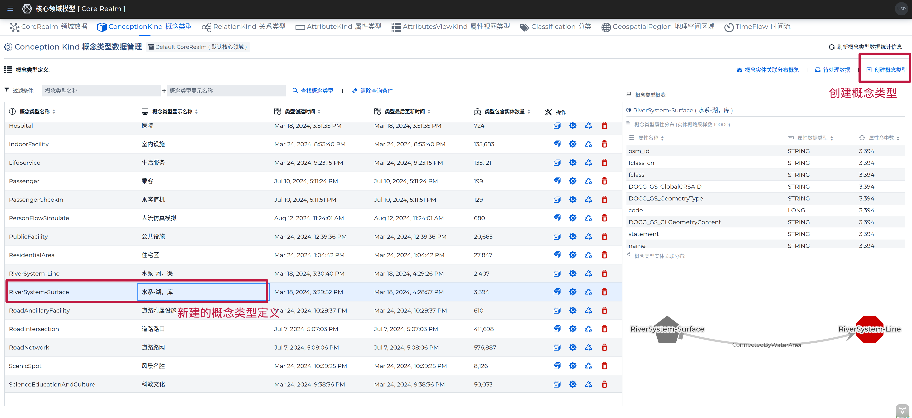
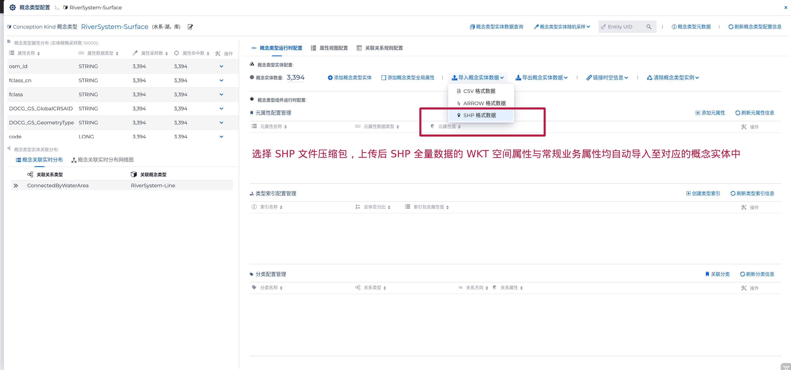
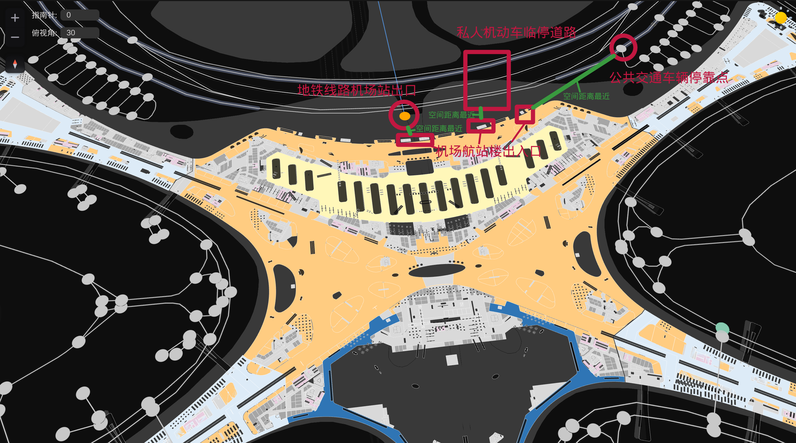
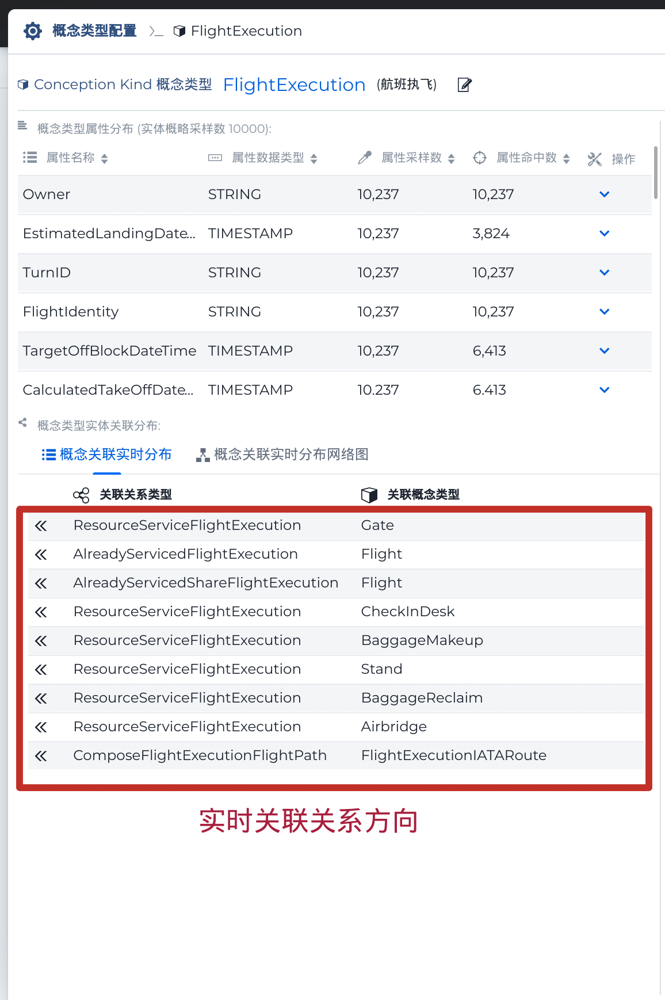
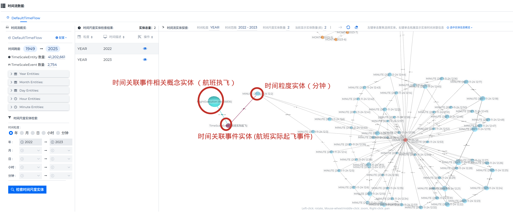
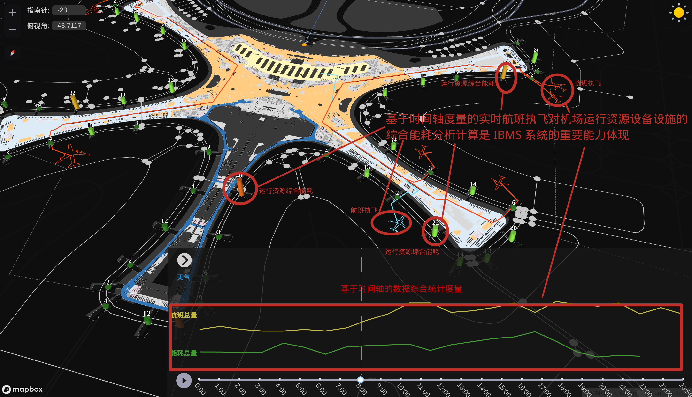

###### Data Ocean & Cloud Graph  数海云图

***

# <span style="color:#CE0000;"> DOCG </span> 数据分析平台快速构建智慧城市数据底座（TOD 相关应用）

##### ◎ 摘要 

> *DOCG 数据分析平台，能够将各种不同类型的数据导入到底层领域模型的概念类型中，通过在各类概念类型间持续的建立数据关联并与时间和空间维度绑定，即可便捷的构建出领域知识图谱。针对此知识图谱，DOCG 平台能够综合利用关联关系分析、时间轴分析、地理空间分析等能力执行复杂的数据分析与知识发现工作。本文将简要介绍一个使用 DOCG 平台构建北京市城市数据底座并将该底座与城市大型交通设施综合应用的案例。本文应用的技术手段能够普遍性的应用在各类 TOD（transit-oriented development，以公共交通为导向的开发）模式信息系统的建设开发中*。


智慧城市数据底座是智慧城市建设的基础和核心，它犹如城市的 “大脑”，负责处理和分析海量的城市数据。这些数据来自城市的各个方面，包括交通、环境、能源、公共设施、社会治安等。通过对这些数据的深入挖掘和分析，可以更加准确地了解城市的运行状况，预测未来发展趋势，制定科学合理的政策和措施。**CIM** (City Information Modeling) 城市信息模型是目前构建城市数据底座的一个主要方式。CIM 城市信息模型是一个概念与方法的理论集成，把城市各类多源异构数据以多种形式整体组织成一个和实体城市全息镜像的城市体系信息模型。它由城市主体的建筑物出发，基于空间关系的关联性，将基础的地理信息、空间坐标系统与具体的城市空间格局应用相结合，形成了以地理信息系统（**GIS**）为底层基础，以建筑信息模型（**BIM**）为中层填充，以数字孪生（**Digital Twin**）技术、物联网（**IoT**）技术为抓手，将城市空间维度的地上地下、室内室外、时间维度的过往历史、当前现状和可期未来的多维信息模型数据和城市感知数据相融合的数字空间城市部件要素信息有机综合体。DOCG 数据分析平台具有构建一个 CIM 模式智慧城市数据底座的全部技术能力。本文通过以下步骤建立一个小型的城市数据底座，并结合一个大型机场的建筑信息与运营信息，介绍一个典型的TOD类的应用场景。

1.  **通过将城市 GIS 数据导入 DOCG 领域模型构建数据底座底层城市基础设施信息模型**
2.  **通过将大型机场 BIM 数据导入 DOCG 领域模型构建中层智慧建筑应用支持信息模型**
3.  **通过将大型机场 动态业务数据 实时导入领域模型构建上层业务应用信息模型**
4.  **综合利用已经构建的城市数据底座与 DOCG 平台的分析能力支持 TOD 相关智慧城市应用**


#### ※ 导入 GIS 地理信息数据构建数据底座底层城市基础设施信息模型

##### <span style="color:#0074D9;"> □ 利用 GIS 数据源构建城市数据底座基底信息</span>

GIS 地理空间数据是构建智慧城市基底信息常用的数据来源。使用已有的 GIS 数据可以轻易的构建出大规模的城市基础设施信息模型。DOCG  平台内建对 SHP（ESRI shape）格式地理信息数据导入的能力。支持全球，全国以及局部三种不同空间尺度的地理信息数据的直接导入，能够直接将 SHP 数据导入领域模型中的概念类型定义中，并保持全部的业务属性与地理空间属性。除各类常规属性的检索查询应用外，从 SHP 数据转化生成的概念实体数据能够参与 DOCG 平台中的全部地理空间分析计算应用。

从 DOCG 数据分析平台的用户界面中可以通过以下步骤导入 GIS 数据，下文以导入北京市 *水系-湖，库* 数据为例 :

1. 在<span style="color:#0074D9;"> *Conception Kind 概念类型数据管理* </span>  界面中点击  [*创建概念类型* ] 按钮 创建 概念类型  **RiverSystem-Surface ( 水系-湖，库 ) **

2. 在概念类型定义列表中选中概念类型 RiverSystem-Surface，点击  [*配置概念类型定义* ] 按钮，打开 <span style="color:#0074D9;"> *概念类型配置* </span> 界面

3. 点击  [*导入概念实体数据* ] -》 [*SHP格式数据* ] 按钮，选择并上传 zip 格式的 SHP 数据压缩包，即可将 SHP 文件中的全部地理空间数据作为概念实体导入概念类型 RiverSystem-Surface

以下为相关界面操作截图：

<span style="color:#777777;"> **概念类型数据管理界面** </span>

<div style="text-align:left;">
    
</div>
<span style="color:#777777;"> **概念类型配置界面:导入 SHP格式的地理信息数据** </span>

<div style="text-align:left;">
    
</div>

由 SHP 文件数据源创建生成的概念实体天然具有 **WKT** 格式的 GIS 地理信息，可以在 DOCG 平台的 <span style="color:#0074D9;"> *概念实体详情* </span>  界面中直接显示

<span style="color:#777777;"> **概念实体详情界面** </span>

<div style="text-align:left;">
    
</div>

也可以在 <span style="color:#0074D9;"> *概念实体空间数据展示* </span>  界面中查看概念类型 **RiverSystem-Surface ( 水系-湖，库 ) ** 中全量数据的地理空间信息

<span style="color:#777777;"> **概念实体空间数据展示界面** </span>

<div style="text-align:left;">
    
</div>


除了通过操作界面单次导入外，DOCG 平台开发 SDK 还提供了 导入 GIS 数据的 API。通过 API 可以实现批量 GIS 数据的规模化快速导入，以下是 GIS 数据导入 API 的操作示例： 

```java
//将 UTF-8 编码的 北京市交通设施服务 GIS全量数据导入到概念类型 TransportationFacility 中
GeospatialOperationUtil.importSHPDataDirectlyToConceptionKind("TransportationFacility",false,
                new File("/media/GIS_DATA/矢量数据/北京市POI/ShapeFile/北京市_交通设施服务.shp"),"UTF-8");
```


通过上文介绍方式依次导入下列 SHP 格式的北京市城市要素数据，即可构建出一个北京市的城市基础设施数字底座。

<table>
<tr>
<td>北京市DEM高程数据</td><td>北京市城市用地类型</td><td>北京市公园绿地</td><td>北京市地铁站</td><td>北京市地铁线</td><td>北京市水系数据</td>
</tr>
<tr>
<td>北京市道路数据</td><td>北京市铁路数据</td><td>北京建筑轮廓</td><td>北京市土壤类型</td><td>北京市湿地自然保护区</td><td>北京市交通设施服务</td>
</tr><tr>
<td>北京市住宿服务</td><td>北京市体育休闲服务</td><td>北京市公共设施</td><td>北京市公司企业</td><td>北京市医疗保健服务</td><td>北京市商务住宅</td>
</tr>
<tr>
<td>北京市地名地址信息</td><td>北京市室内设施</td><td>北京市政府机构及社会团体</td><td>北京市生活服务</td><td>北京市科教文化服务</td><td>北京市购物服务</td>
</tr>
<tr>
<td>北京市通行设施</td><td>北京市道路附属设施</td><td>北京市金融保险服务</td><td>北京市风景名胜</td><td>北京市餐饮服务</td><td></td>
</tr>
</table>


下图是从宏观到微观分三个不同尺度将全部城市基础设施数字底座中的地理信息数据统一显示的可视化示意：

<div style="display: flex;">
    
    
    
</div>


##### <span style="color:#0074D9;"> □  通过空间计算构建城市基础要素的关联</span>

由统一空间坐标系下的 SHP 文件数据源导入创建的各类概念类型实体都具有标准的地理空间属性信息。通过使用 DOCG 平台提供的内置全局地理空间计算分析功能，可以对这些概念类型实体执行空间计算，并根据计算结果构建不同概念实体之间的业务关联。DOCG 平台支持各种类型的 **空间投影**(*Contains,Intersects,Within,Equals,Crosses,Touches,Overlaps,Disjoint,Cover,CoveredBy*)  计算、**空间几何** 计算、**空间距离** 计算、**缓冲区** 计算以及 **KNN** 计算功能。下文代码以 **地铁线路** 和 **地铁站点** 的概念实体数据为例，介绍使用 DOCG  Java SDK 提供的标准空间计算API 构建业务关系的操作:

```java
CoreRealm coreRealm = RealmTermFactory.getDefaultCoreRealm();
//获取地铁线路的概念类型对象        
ConceptionKind lineKind = coreRealm.getConceptionKind("SubWay-Line");
//查询 "7号线二期" 地铁线路的概念实体
QueryParameters queryParameters = new QueryParameters();
queryParameters.setDefaultFilteringItem(new EqualFilteringItem("Line","7号线二期"));
ConceptionEntitiesRetrieveResult conceptionEntitiesRetrieveResult = lineKind.getEntities(queryParameters);
List<ConceptionEntity> conceptionEntityList = conceptionEntitiesRetrieveResult.getConceptionEntities();
for(ConceptionEntity currentLine:conceptionEntityList){
    //在全球尺度 WGS84坐标系 下计算查询 与地铁"7号线二期"线路概念实体空间相交的全部地铁站点（概念类型为SubWay-Station）概念实体
    List<ConceptionEntity> stationEntitiesList = currentLine.getSpatialPredicateMatchedConceptionEntities("SubWay-Station",null, GeospatialScaleCalculable.SpatialPredicateType.Intersects, GeospatialScaleCalculable.SpatialScaleLevel.Global);            
    for(ConceptionEntity currentConceptionEntity:stationEntitiesList){
        	//在所有查询到的地铁站点概念实体与 "7号线二期"线路概念实体之间建立名称为 CanAccessSubWayLine(可进出地铁线路)的业务关联关系 
            currentLine.attachToRelation(currentConceptionEntity.getConceptionEntityUID(),"CanAccessSubWayLine",null,false);
    }
}
```

以上简单的代码片段即可通过空间计算构建出概念实体间的实体业务关联，产生的关联关系数据可在 DOCG 平台的 <span style="color:#0074D9;"> *概念实体详情* </span>  界面中实时显示：

<span style="color:#777777;"> **地铁"7号线二期"线路概念实体数据关联网络图展示界面 (显示了部分与 7号线二期线路 关联的其他概念实体)** </span>

<div style="text-align:left;">
    
</div>
<span style="color:#777777;"> **地铁"7号线二期"线路概念实体全量一度关系3维蒲公英图展示界面** </span>

<div style="text-align:left;">
    
</div>
在 DOCG 平台中内置了全球的基于行政区划 (**CONTINENT[洲际]**、**COUNTRY_REGION[国家，地区]**、**PROVINCE[省级]**、**PREFECTURE[地级]**、**COUNTY[县级]**、**TOWNSHIP[乡级]**、**VILLAGE[村级]**) 组织的特殊地理空间区域实体数据，任意具有地理信息属性的概念实体均可以通过标准的用户界面或 SDK API 链接到指定的行政区划对象中。下文以**地铁线路** 概念类型为例，介绍使用 DOCG 数据分析平台的用户界面执行链接地理空间区域的操作:

1. 在概念类型定义列表中选中概念类型 Subway-Line，点击  [*配置概念类型定义* ] 按钮，打开 <span style="color:#0074D9;"> *概念类型配置* </span>  界面

2. 点击  [*链接时空信息* ] -》 [*链接至地理空间区域* ]  -》 [*根据概念实体地理空间计算链接* ] 按钮，选择相应的运算参数，即可将概念类型下的全部概念实体链接到符合空间计算条件的地理空间区域实体上。在本示例的操作中，通过空间计算，将所有的地铁线路概念实体链接到了各个线路穿行过的街道、镇、乡级地理空间区域中。

<span style="color:#777777;"> **概念类型配置界面：执行全部概念实体与地理空间区域的链接操作** </span>

<div style="text-align:left;">
    
</div>
在链接地理空间区域操作执行完毕后，即可直接在 DOCG 数据分析平台的 <span style="color:#0074D9;"> *概念实体详情* </span>  用户界面中显示概念实体的地理空间区域链接信息。

<span style="color:#777777;"> **地铁"8号线四期"线路概念实体的地理空间区域链接展示界面** </span>

<div style="text-align:left;">
    
</div>
除了具有链接到地理空间区域的能力外，具有内置地理信息数据的概念类型实体还可以与 DOCG 平台内置的地理空间区域（行政区划实体数据）执行各种地理空间计算分析操作，下图展示了在 DOCG 数据分析平台的 <span style="color:#0074D9;"> *概念实体详情* </span>  用户界面中使用此种空间计算能力执行地理空间区域查询的操作：

<span style="color:#777777;"> **在地铁"8号线四期"线路概念实体上通过空间计算功能查询该线路穿行过的乡（街道）级行政区划的地理空间区域** </span>

<div style="text-align:left;">
    
</div>


#### ※ 导入 BIM 建筑信息模型数据构建数据底座中层业务运行支撑要素模型
##### <span style="color:#0074D9;"> □ 实现 BIM 数据的数模分离并与 GIS 数据相融合</span>
BIM（Building Information Modeling）技术是一种应用于工程设计、建造、管理的数据化工具，通过对建筑的数据化、信息化模型整合，在项目策划、运行和维护的全生命周期过程中进行共享和传递，使工程技术人员对各种建筑信息作出正确理解和高效应对，为设计团队以及包括建筑、运营单位在内的各方建设主体提供协同工作的基础，在提高生产效率、节约成本和缩短工期方面发挥重要作用。

<span style="color:#777777;"> **通过 BIM 模型为核心媒介融合各类不同领域与阶段的外部数据** </span>

<div style="text-align:left;">
    
</div>


BIM 模型文件中包含海量的称为构件的基本构成元素，每一个构件都包含有属性类的<span style="color:#0074D9;"> *数据信息* </span>以及描述空间状况的<span style="color:#0074D9;"> *模型信息* </span>。DOCG 数据平台能够解析 BIM 模型文件，将全部的构件转化为概念实体存储在相应的概念类型中。通过特殊的<span style="color:#0074D9;"> *数模分离* </span>技术，将 BIM 构件中的数据信息转化为概念实体常规属性，将 BIM 构件中的模型信息转换为 **WKT** 格式的 GIS 地理信息数据。通过该技术处理，能够实现将 BIM 与 GIS 来源的数据在同一套数据存储与数据分析技术体系下执行统一的全局地理空间计算分析的能力。下文中展示了将一个机场单层建筑空间的 BIM 文件转换为名称为 **AirportBuildingSpace-F02** 的概念类型并将全部 BIM 构件存储为概念实体后可以在 DOCG 数据分析平台用户界面中执行的一些相关操作的示例：

<span style="color:#777777;"> **BIM 文件中的构件能够转化为常规的概念类型中的实体，并在常规的数据属性查询与分析中直接使用 BIM 构件中的属性类数据信息** </span>

<div style="text-align:left;">
    
</div>
<span style="color:#777777;"> **BIM 模型构件生成的概念实体中自动包含有从 BIM 构件中生成的空间信息，该空间信息的坐标系与内容可以与由其他来源产生的地理空间数据相互兼容** </span>

<div style="text-align:left;">
    
</div>
<span style="color:#777777;"> **由 BIM 构件生成的概念实体具有与常规概念实体完全相同的能力** </span>

<div style="text-align:left;">
    
</div>
<span style="color:#777777;"> **在由 BIM 构件生成的概念实体上能够执行常规空间计算功能（查询该建筑空间所在的乡、街道级行政区划的地理空间区域）** </span>

<div style="text-align:left;">
    
</div>

通过上文介绍方式依次导入下列 BIM 模型文件的机场内部建筑与设备设施数据，即可构建出支持机场相关业务运行操作的数字底座中层智慧建筑应用的局部信息模型。

<table>
<tr>
<td>登机桥活动端</td><td>机场建筑空间</td><td>机场行李分拣转盘</td><td>机场行李提取转盘</td>
</tr>
<tr>
<td>机场值机柜台</td><td>登机口</td><td>特种设备-电梯井</td><td>飞机停机位</td>
</tr><tr>
<td>机场开闭站</td><td>机场变压器</td><td>登机门</td><td>机场家具设备设施</td>
</tr>
<tr>
<td>人流动线流向控制节点</td><td>固定登机桥</td><td>机场变（配）电室</td><td></td>
</tr>
</table>


##### <span style="color:#0074D9;"> □  通过空间计算关联 BIM 与 GIS 数据源产生的概念实体</span>

经过数模分离技术处理后导入 DOCG 平台的 BIM 构件概念实体上的建筑空间信息被直接转化为了 **WKT** 格式的 GIS 地理信息数据。因此可以通过 DOCG 平台的空间计算能力与任意其他具有空间信息的概念实体进行空间分析，并根据分析结果建立需要的实体关联。例如下图的示例中通过空间计算建立了机场航站楼内一个 *固定登机桥* 与 *登机桥活动端* 和 *登机门* 之间基于空间相邻确定的业务逻辑的上下游联动关系。

<span style="color:#777777;"> **BIM 构件生成的 固定登机桥 概念实体 和与其空间相连的 登机桥活动端 以及 登机门 概念实体** </span>

<div style="text-align:left;">
    
</div>
将源自 BIM 构件与源自 GIS 城市要素信息的概念实体以空间计算为依据建立起成体系的关联关系后，可以消除在智慧城市和 TOD 类业务应用中面临的一个主要技术障碍： <span style="color:#0074D9;"> **GIS 与 BIM 数据分别对应建筑室外与室内两个领域，两者数据技术上无法联通，无法建立融合统一室内外空间数据的综合应用**</span> 。在解决了室内外空间数据的统一融合问题后，能够处理很多当前技术上难以有效解决的业务需求，以下以机场的运营为场景举两个示例：

<span style="color:#777777;"> **机场飞行区与航站楼基于空间关系的综合业务应用** </span>

<table>
<tr>
<td width="900"> </td><td style="font-size:16px;" width="260">◇ 在常规的机场业务运营与组织架构中，机场飞行区与航站楼是两个并行的独立业务单元。受限于传统的 IT 信息系统提供的技术能力， 缺乏适合的应用场景与应用角色能够将两者的数据结合进而实现业务的深度融合与创新。通过空间计算能力建立飞行区的飞机停机位、道路与航站楼的登机桥固定端、登机门以及人流动线等概念实体之间的空间相邻关系，能够在航班值机，航班接机等业务场景提供跨越业务单元的全域信息支持。</td>
</tr>
</table>


<span style="color:#777777;"> **机场航站楼与城市交通设施基于空间关系的综合业务应用** </span>

<table>
<tr>
<td width="900"> </td><td style="font-size:16px;" width="260">◇ 机场作为一个大型的城市交通设施关键节点，其精确有效的运营依赖于对机场建筑内部的人流状况的准确掌握。机场客流量与城市整体的实时交通运行状况息息相关，但是目前的技术手段并不能在建筑空间出入口与交通通道接泊点这样的细颗粒度层级实现精确到人流级的城市交通状况与建筑空间的信息共享。通过空间计算能力建立机场出入口、停车场等航站楼内部建筑概念实体与地铁出站口，高铁出站口、城市道路路口等城市交通设施概念实体的空间连接关系，能够实现建筑空间内部单点的精确人流数据统计与分析。</td>
</tr>
</table>


#### ※ 接入实时动态业务数据构建数据底座上层业务应用领域模型
##### <span style="color:#0074D9;"> □ 接入外部应用系统数据创建业务领域模型</span>

DOCG 数据平台使用图数据库技术作为底层核心数据存储系统，使用数字孪生领域模型的方式管理数据，能够实现灵活的业务模型与关联关系定义，可以非常便捷的直接导入已有外部业务系统中的数据。根据目标外部业务系统的数据存储形态，DOCG 数据平台可以通过使用外部数据集成工具的方式直接将外部业务系统数据库中的库表结构映射为领域模型，并将数据库内容复制存储入 DOCG 平台中，从而迅速的构建出针对特定业务场景的全域信息模型。构建完成后可以通过 企业 ESB 总线、消息服务、业务数据接口调用 或 数据库增量数据同步等多种技术手段持续性的扩展，更新全域信息模型中的数据信息，支撑 DOCG 平台数据底座中领域知识图谱的持续生长。下文以接入一个机场航班信息系统数据为例介绍构建数据底座上层业务应用领域模型的过程：

航班信息系统中的数据记录一个机场每日的航班起降执飞情况，主要由三个业务对象组成：

- **Flight ( 航班）**：航空公司为旅客提供计划的飞行服务，包括起飞、飞行和降落等环节。航班通常按照一定的计划和时间表进行安排，以确保旅客的出行顺利进行。航班的具体信息包括航班号、起飞时间、起飞地点、目的地等。
- **FlightExecution ( 航班执飞）**： 根据航班的飞行计划执行一次飞行任务的过程。航空公司通过航班执飞为旅客提供真实的飞行服务。
- **FlightExecutionRoute ( 航班执飞航段）**：航段指一次航空运输中，从一个起点飞往一个终点的航行阶段。一个航班可能包含多个航段，即从起点到中途停靠点（中转站）的航段和从中转站到终点的航段。

在机场航班信息系统的数据组成中，数据量最大，包含信息最多的业务对象是 **FlightExecution ( 航班执飞）**，该对象中包含大量的航班飞行计划的静态信息（航班号，航班起飞降落目的地，航班计划飞行时间等）以及与数据底座中时间与空间维度相关的实时运营信息（实际执飞时间，执飞航空器，起降跑道，停机位等）。以下是其中的部分示例：

- **静态信息**： Owner（承运人)，FlightIdentity（航班号），Registration（飞机编号）， AirlineICode（航司编号）， FlightTerminalID（航站楼编号），FlightScheduledDateTime（计划飞行时间） ，OriginAirport（起飞机场） 等
- **动态信息**： EstimatedLandingDateTime（预计着陆时间)，ActualLandingDateTime（实际着陆时间)，AircraftCode（机型编号），Airbridges（登机桥），BaggageReclaims（行李转盘），StandID（飞机停机位），RunwayID（跑道 编号） 等

从 DOCG 数据分析平台中可以通过以下步骤接入数据 :

1. 在 DOCG 数据分析平台用户界面的 <span style="color:#0074D9;">*Conception Kind 概念类型数据管理*</span>  面板中点击  [*创建概念类型* ] 按钮 分别创建 概念类型  **Flight  ( 航班 ) **、**FlightExecution  ( 航班执飞 ) ** 和 **FlightExecutionRoute ( 航班执飞航段）**。

2. 使用数据集成工具（例如 Apache Hop 或 Neo4J ETL）将航班信息系统关系数据库中的数据表 Flight ，FlightExecution ，FlightExecutionRoute 中的内容导入 DOCG 平台的图数据库中。如无法直接访问数据库表内容，可以通过使用 DOCG 平台的 Java SDK 提供的标准数据存取API 执行数据入库操作，以下代码以 FlightExecution 数据示例:
```java
//通过适当的方式获取关系数据库表 FlightExecution 的数据结果集，每一条数据记录的全量数据以 Map<String,Object> 的形式表示，全量数据存储在List中
List<Map<String,Object>> flightExecutionDatabaseReultsetList = ......
//创建批量 DOCG 入库所需数据列表    
List<ConceptionEntityValue> conceptionEntityValuesList = new ArrayList<>();
//关系数据库表数据内容加入 DOCG 入库用数据列表
for(Map<String,Object> currentDataRow:flightExecutionDatabaseReultsetList){
    ConceptionEntityValue currentConceptionEntityValue = new ConceptionEntityValue();
    currentConceptionEntityValue.setEntityAttributesValue(currentDataRow);
    conceptionEntityValuesList.add(currentConceptionEntityValue);
}
//以高CPU使用率的方式将全量数据导入 DOCG 平台 中的 FlightExecution 概念类型中
BatchDataOperationUtil.batchAddNewEntities("FlightExecution",conceptionEntityValuesList,CPUUsageRate.High);
```
3. 在 DOCG 数据分析平台用户界面 <span style="color:#0074D9;">*Relation Kind 关系类型数据管理*</span>  面板中点击  [*创建关系类型* ] 按钮 分别创建 关系类型  *AlreadyServicedFlightExecution ( 航班已执行执飞 )* 、*ComposeFlightExecutionFlightPath ( 组成航班执飞航迹 )*、*ResourceServiceFlightExecution ( 资源服务航班执飞 )*  和 *AlreadyServicedShareFlightExecution ( 共享航班已执行执飞 )*。根据真实的业务状况，使用适当的关系类型定义来配置关联关系规则，定义概念类型 **FlightExecution** 与 其他机场运行相关概念类型之间的业务关系。

<span style="color:#777777;"> **概念类型 FlightExecution 与其他概念类型之间的实时关联关系** </span>

<div style="display: flex;">
    
    
</div>

4. 在 DOCG 数据分析平台用户界面中执行关系类型 *AlreadyServicedFlightExecution ( 航班已执行执飞 )* 、*ComposeFlightExecutionFlightPath ( 组成航班执飞航迹 )*、*ResourceServiceFlightExecution ( 资源服务航班执飞 )*  和 *AlreadyServicedShareFlightExecution ( 共享航班已执行执飞 )*  中的关联关系规则定义， DOCG 系统会根据规则定义中的属性匹配逻辑自动建立所有概念实体之间的关系实体。

<span style="color:#777777;"> **代表航班 CZ3109 的一次航班执飞的概念实体 和与其业务相连的 航班、飞机停机位、行李转盘 以及 航班执飞航段概念实体** </span>

<div style="text-align:left;">
    
</div>


##### <span style="color:#0074D9;"> □ 通过时间关联实现业务领域模型与智慧城市数据底座的融合</span>

通过在<span style="color:#0074D9;"> *由外部应用系统数据接入的概念实体* </span>与<span style="color:#0074D9;"> *由 GIS 或 BIM 数据导入的城市数据底座静态基底概念实体* </span>之间创建由业务驱动的关联关系，可以将业务领域模型中的数据与智慧城市数据底座初步融合。此外还可以在 **时间** 与 **地理空间** 维度实现业务领域模型数据与智慧城市数据底座的融合。地理空间维度的数据融合方式与前文已经介绍的 GIS 类数据的导入方式相同。下文介绍使用 **时间轴关联方式** 的时间维度业务领域模型数据融合。

DOCG 数据分析平台利用核心领域模型以及图数据库技术的特性，在数据底座的图数据库中建立了特殊的代表不同时间粒度的特殊概念类型：**TS_Year** （年时间节点）、**TS_Month**（月时间节点）、**TS_Day**（日时间节点） 、**TS_Hour**（小时时间节点） 、**TS_Minute**（分钟时间节点） 以及特殊的代表不同时间之间联系的关系类型：**TS_Contains**（包含下一级时间节点）、**TS_NextIs**（同级的下一个时间节点）、**TS_FirstChildIs**（下一级的第一个时间节点）、**TS_LastChildIs**（下一级的最后一个时间节点），通过在上述时间粒度概念类型中创建所需的时间概念实体并用适当的时间联系关系类型将这些概念实体相互关联，既可获得指定时间范围的时间轴。

<span style="color:#777777;"> **时间轴在1953年9月的展开片段** </span>

<div style="text-align:left;">
    
</div>
在 DOCG 平台中可以通过标准的用户界面或 SDK API 根据概念类型的指定时间类属性值将概念实体链接到时间流（轴）的对应时间实体中。下文以**航班执飞** 概念类型为例，介绍使用 DOCG 数据分析平台的用户界面执行链接时间流的操作:

1. 在概念类型定义列表中选中概念类型 FlightExecution，点击  [*配置概念类型定义* ] 按钮，打开 <span style="color:#0074D9;"> *概念类型配置* </span>  界面

2. 点击  [*链接时空信息* ] -》 [*链接至时间流* ]  -》 [*根据单一时间属性链接* ] 按钮，选择所需的时间事件属性名称、时间事件的粒度以及业务描述所需的时间事件备注即可将概念类型下的全部概念实体链接到符合时间计算条件的时间流实体上。在本示例的操作中，通过时间计算，将所有的航班执飞概念实体根据属性 ActualTakeOffDateTime 的值链接到了时间流中的 分钟（MINUTE）级时间实体中。

<span style="color:#777777;"> **概念类型配置界面：执行全部概念实体与时间流（时间轴）的链接操作** </span>

<div style="text-align:left;">
    
</div>
在链接时间流操作执行完毕后，即可直接在 DOCG 数据分析平台的 <span style="color:#0074D9;"> *概念实体详情* </span>  用户界面中显示概念实体的时间流链接信息。

<span style="color:#777777;"> **一个 航班执飞 概念实体的时间流链接展示界面** </span>

<div style="text-align:left;">
    
</div>
<span style="color:#777777;"> **该时间流链接信息也可以直接在时间轴的相应时间实体上显示** </span>

<div style="text-align:left;">
    
</div>


#### ※ 使用 DOCG 数据平台构建的智慧城市数字底座在 TOD 方向的应用案例介绍

**交通引导开发（TOD, Transit Oriented Development）** 是指**<span style="color:#0074D9;"> *以公共交通为导向的发展模式* </span>**。其中的公共交通主要是指火车站、机场、地铁、轻轨等轨道交通及巴士干线。然后以机场、轨道交通站点和公交站点等交通枢纽为中心，以400～800米（5～10分钟步行路程）为半径建立城市中心节点。其特点在于集工作、商业、文化、教育、居住等为一身的 “混合用途”，使居民和企业员工在不排斥汽车交通的同时能方便地选用公交、自行车、步行等多种出行方式。TOD 理念不仅适用于*城市宏观层面的规划（推动城市向公交优先、绿色低碳的可持续发展的方向转型）*，也适用于*公交廊道沿线或城市片区尺度的中观层面规划*  以及 *火车站*、*高铁站*、*机场*、*大型地铁与公交枢纽*  等<span style="color:#0074D9;"> *大中运量公共交通站点内部和周边的微观层面的运营管理*</span>。DOCG 数据平台提供了局部视角下*面向任意概念实体的时间、空间与关联关系一体化计算能力* 以及 整体视角下*面向全部概念类型的分布式实时内存分析计算能力*，再结合 DOCG 平台智慧城市数据底座中丰富的城市基础设施信息、智慧建筑应用支持信息以及目标应用场景自身的业务信息，能够在类 TOD 微观应用中提供丰富的技术与业务能力支持。下文以前文已经叙述的内容为背景，简要的介绍 DOCG 数据平台在某大型机场的 类 TOD 运营管理与分析评估领域的一些实际应用案例。 

##### <span style="color:#0074D9;"> □  机场航站楼、飞行区基于航班信息联动的能源管理</span>

在常规的机场运营中，为了保障服务的运行质量，大量的设备设施（例如照明，空调，步道，行李转盘等）在全服务时段内都在运行，这些设备设施的运行产生了大量的能源消耗。但是在实际的业务场景中有相当多的设备运转是无效空耗的（例如在没有航班起降，乘客未到达的机场空间中依然保持照明，暖通，行李转盘等设备的全功率运转）。通过实时航班信息与飞行区和航站楼各类概念实体间的时间与空间关联，能够有效的实现基于航班联动的节能管理策略。下文介绍大致的执行逻辑：

1. 默认状态下，将所有的运行资源设备设施关闭或保持在最低能源消耗状态下运行。

2. 实时航班信息包含每一个航班执飞架次的预计与实际落地时间以及在飞行区中真实的停机机位，通过在飞机停机位与登机桥活动端之间执行空间计算，可以确定该航班与航站楼的空间连接位置（通过 登机桥活动端 -> 固定登机桥 ->登机门 的空间连接确定乘客进入航站楼的具体位置）。

3. 根据乘客进入航站楼的登机门与机场旅客人流动线之间的空间关联关系确定乘客从登机门到行李转盘之间的预计人流运动轨迹。
4. 根据预计人流运动轨迹确定为该轨迹服务的全部设备设施（照明，暖通，步道，行李转盘等）以及相关的能源控制单元，执行设备设施的预启动操作。
5. 根据人流运动轨迹的空间距离，结合乘客移动速度与模式分析算法以及航班信息提供的飞机实际落地时间，计算在航班落地后的各个时间点上旅客可能出现在人流运动轨迹上的位置。
6. 根据各个时间点对应的人流运动轨迹上的位置，获取相关位置的各类运行资源设备的能源控制单元，并在时间点到达时启动或设定相关设备设施保持在正常能源消耗状态下运行。
7. 根据计算，在当次航班执飞结束并且全部乘客依次离开人流运动轨迹上的相关运行资源设备设施服务空间范围后，再次将设备设施关闭或保持在最低能源消耗状态下运行。

<span style="color:#777777;"> **机场航站楼 IBMS 基于航班联动的能源管理** </span>

<table>
<tr>
<td width="900"> </td><td style="font-size:16px;" width="260">◇ 除了基于航班联动的节能这个单一应用场景之外，DOCG 平台还可以直接应用在机场航站楼的IBMS（Intelligent Building Management System）智能建筑管理系统中。平台的各项技术能够直接应用在机场 IBMS 系统的机场基础数据集成管理模块中，可以整合机场各类数据和信息，包括机场展位信息、航班信息、客流量、物流信息等，并通过时间、空间以及复杂关联等维度对数据再次聚合加工与编织梳理。让数据更加全面、准确、实时，从而为机场运营决策提供科学的数据支持。</td>
</tr>
</table>


##### <span style="color:#0074D9;"> □ 机场航站楼基于城市交通与航班信息的运行期实时人流分析</span>

按照 TOD 模式的空间结构理念，需要将人流从城市各地汇聚到 TOD 核心（通常是交通枢纽站），经过疏散、引导和汇集后形成流量、速度合适的慢行活力人流，为整个TOD 地区的各个功能区块带来正效应。该理念同样适用于机场的运营管理（将空港航班到达离开机场的离港人员与乘坐航班起飞的到港人员引导入慢行活力人流，并依次作出后续管理措施）。结合实时航班信息、城市公共交通与机场的交通吞吐信息以及飞行区和航站楼各类概念实体间的时间与空间关联，能够实现对预期慢行活力人流真实状态的实时分析与历史回放，执行 *基于历史人流数据的运行资源使用状况评估*  等复杂分析应用 。下文是其基本执行逻辑：

1.  针对到港人员，参照上节 <span style="color:#0074D9;">   机场航站楼、飞行区基于航班信息联动的能源管理</span>  介绍的内容，通过实时航班信息，可以确定针对该次航班执飞的预期人流运动轨迹（慢行活力人流）。
2.  根据实时航班信息，可以确定该次航班执飞的具体飞机机型，从而可以推导出该次航班的最大可能乘客人数。根据预期人流运动轨迹的空间距离，结合乘客移动速度与模式分析算法以及航班信息提供的飞机实际落地时间，能够估算出各个时间点上每个乘客在慢行活力人流中的大致位置，汇总所有乘客位置状态可以得到针对该航班执飞的慢行活力人流的实时分析数据。
3.  针对离港人员，通过机场附近区域的高铁站出口，地铁站出口，公交站点以及机动车停车区域等交通流起始点与机场建筑空间入口的空间关系计算，能够确定针对该交通流起始点的预期人流运动轨迹（慢行活力人流）。
4.  根据实时交通流量数据，可以确定各个交通流起始点的大致乘客人数。根据各个交通流起始点的预期人流运动轨迹的空间距离，结合乘客移动速度与模式分析算法以及交通流数据的采样时间，能够估算出各个时间点上每个乘客在慢行活力人流中的大致位置，汇总所有乘客位置状态可以得到各个慢行活力人流的实时分析数据。
5.  将到港与离港的所有慢行活力人流分析数据叠加，即可获得任意时刻机场航站楼的全域实时人流分析数据。

<span style="color:#777777;"> **一条机场航站楼离港人流动线的实时分析** </span>

<table>
<tr>
<td width="900"> </td><td style="font-size:16px;" width="260">◇ 根据一次航班执飞的实时数据，获取到该航班落地后的停机机位。由机位出发依次获取相关的 活动登机桥-> 固定登机桥->登机门->登机口->人流动线->行李提取转盘->机场出口 等一系列基于空间连接的慢行活力人流的具体空间位置。以慢行活力人流实际路径和航班的最大乘客数量为输入参数，使用乘客群体移动速度与模式的评估算法，从航班实际落地时刻起按照业务所需的采样频率周期性的计算各个采样时间点动线上的人流分布情况。</td>
</tr>
</table>


<span style="color:#777777;"> **机场航站楼运行期实时服务资源使用状况分析评估** </span>

<table>
<tr>
<td width="900"> </td><td style="font-size:16px;" width="260">◇ 将到港与离港的所有人流动线数据叠加，能够获得航站楼内部全域实时人流分布状况数据。结合使用该人流分布数据与航站楼运营服务资源（例如座椅，饮水机，卫生间，充电杆等）的使用率评估算法（例如使用空间缓冲区算法计算卫生间周边可能的人员数量，再结合人员卫生间使用状况经验公式计算卫生间在特定时段的使用率），可以实时获取到运行期航站楼内部的全部服务资源使用状态，标识出服务紧张的设备设施并迅速采取应对措施。</td>
</tr>
</table>


<div style="text-align:right;">
    
</div>