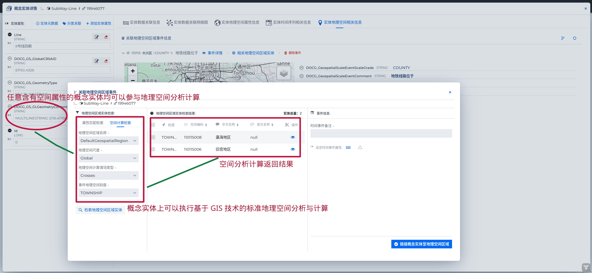
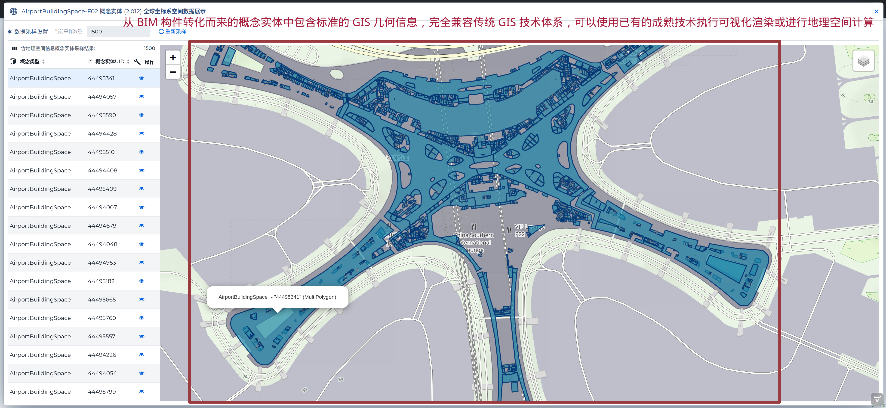

###### Data Ocean & Cloud Graph  数海云图

***

# <span style="color:#CE0000;"> DOCG </span> 数据分析平台快速构建智慧城市数据底座（TOD应用方向）

##### ◎ 摘要 

> *DOCG 数据分析平台，能够将各种不同类型的数据导入到底层领域模型的概念类型中，通过在各类概念类型间持续的建立数据关联并与时间和空间维度绑定，即可便捷的构建出领域知识图谱。针对此知识图谱，DOCG 平台能够综合利用关联关系分析、时间轴分析、地理空间分析等能力执行复杂的数据分析与知识发现工作。本文将简要介绍一个使用 DOCG 平台构建北京市城市数据底座并将该底座与城市大型交通设施综合应用的案例。本文应用的技术手段能够普遍性的应用在各类 TOD（transit-oriented development，以公共交通为导向的开发）模式信息系统的建设开发中*。


智慧城市数据底座是智慧城市建设的基础和核心，它犹如城市的 “大脑”，负责处理和分析海量的城市数据。这些数据来自城市的各个方面，包括交通、环境、能源、公共设施、社会治安等。通过对这些数据的深入挖掘和分析，可以更加准确地了解城市的运行状况，预测未来发展趋势，制定科学合理的政策和措施。**CIM** (City Information Modeling) 城市信息模型是目前构建城市数据底座的一个主要方式。CIM 城市信息模型是一个概念与方法的理论集成，把城市各类多源异构数据以多种形式整体组织成一个和实体城市全息镜像的城市体系信息模型。它由城市主体的建筑物出发，基于空间关系的关联性，将基础的地理信息、空间坐标系统与具体的城市空间格局应用相结合，形成了以地理信息系统（**GIS**）为底层基础，以建筑信息模型（**BIM**）为中层填充，以数字孪生（**Digital Twin**）技术、物联网（**IoT**）技术为抓手，将城市空间维度的地上地下、室内室外、时间维度的过往历史、当前现状和可期未来的多维信息模型数据和城市感知数据相融合的数字空间城市部件要素信息有机综合体。DOCG 数据分析平台具有构建一个 CIM 模式智慧城市数据底座的全部技术能力。本文通过以下步骤建立一个小型的城市数据底座，并结合一个大型机场的建筑信息与运营信息，介绍一个典型的TOD类的应用场景。

##### 1. 通过将城市 GIS 数据导入 DOCG 领域模型构建数据底座底层城市基础设施信息模型。
##### 2. 通过将大型机场 BIM 数据导入 DOCG 领域模型构建中层智慧建筑应用支持信息模型。
##### 3. 通过将大型机场 动态业务数据 实时导入领域模型构建上层业务应用信息模型。
#####  4. 综合应用已经构建的城市数据底座与 DOCG 平台的分析能力创建 示例 TOD类智慧城市应用


#### ※ 导入 GIS 地理信息数据构建数据底座底层城市基础设施信息模型

##### <span style="color:#0074D9;"> 利用 GIS 数据源构建城市数据底座基底信息</span>

GIS 地理空间数据是构建智慧城市基底信息常用的数据来源。使用已有的 GIS 数据可以轻易的构建出大规模的城市基础设施信息模型。DOCG  平台内建对 SHP（ESRI shape）格式地理信息数据导入的能力。支持全球，全国以及局部三种不同空间尺度的地理信息数据的直接导入，能够直接将 SHP 数据导入领域模型中的概念类型定义中，并保持全部的业务属性与地理空间属性。除各类常规属性的检索查询应用外，从 SHP 数据转化生成的概念实体数据能够参与 DOCG 平台中的全部地理空间分析计算应用。

从 DOCG 数据分析平台的用户界面中可以通过以下步骤导入 GIS 数据，下文以导入北京市 *水系-湖，库* 数据为例 :

1. 在<span style="color:#0074D9;"> *Conception Kind 概念类型数据管理* </span>  界面中点击  [*创建概念类型* ] 按钮 创建 概念类型  **RiverSystem-Surface ( 水系-湖，库 ) **

2. 在概念类型定义列表中选中概念类型 RiverSystem-Surface，点击  [*配置概念类型定义* ] 按钮，打开 <span style="color:#0074D9;"> *概念类型配置* </span> 界面

3. 点击  [*导入概念实体数据* ] -》 [*SHP格式数据* ] 按钮，选择并上传 zip 格式的 SHP 数据压缩包，即可将 SHP 文件中的全部地理空间数据作为概念实体导入概念类型 RiverSystem-Surface

以下为相关界面操作截图：

###### 概念类型数据管理界面
<div style="text-align:left;">
    
</div>

###### 概念类型配置界面:导入 SHP格式的地理信息数据

<div style="text-align:left;">
    
</div>

由 SHP 文件数据源创建生成的概念实体天然具有 **WKT** 格式的 GIS 地理信息，可以在 DOCG 平台的 <span style="color:#0074D9;"> *概念实体详情* </span>  界面中直接显示

###### 概念实体详情界面
<div style="text-align:left;">
    
</div>

也可以在 <span style="color:#0074D9;"> *概念实体空间数据展示* </span>  界面中查看概念类型 **RiverSystem-Surface ( 水系-湖，库 ) ** 中全量数据的地理空间信息

###### 概念实体空间数据展示界面
<div style="text-align:left;">
    
</div>


除了通过操作界面单次导入外，DOCG 平台开发 SDK 还提供了 导入 GIS 数据的 API。通过 API 可以实现批量 GIS 数据的规模化快速导入，以下是 GIS 数据导入 API 的操作示例： 

```java
//将 UTF-8 编码的 北京市交通设施服务 GIS全量数据导入到概念类型 TransportationFacility 中
GeospatialOperationUtil.importSHPDataDirectlyToConceptionKind("TransportationFacility",false,
                new File("/media/GIS_DATA/矢量数据/北京市POI/ShapeFile/北京市_交通设施服务.shp"),"UTF-8");
```


通过上文介绍方式依次导入下列 SHP 格式的北京市城市要素数据，即可构建出一个北京市的城市基础设施数字底座。

<table>
<tr>
<td>北京市DEM高程数据</td><td>北京市城市用地类型</td><td>北京市公园绿地</td><td>北京市地铁站</td><td>北京市地铁线</td><td>北京市水系数据</td>
</tr>
<tr>
<td>北京市道路数据</td><td>北京市铁路数据</td><td>北京建筑轮廓</td><td>北京市土壤类型</td><td>北京市湿地自然保护区</td><td>北京市交通设施服务</td>
</tr><tr>
<td>北京市住宿服务</td><td>北京市体育休闲服务</td><td>北京市公共设施</td><td>北京市公司企业</td><td>北京市医疗保健服务</td><td>北京市商务住宅</td>
</tr>
<tr>
<td>北京市地名地址信息</td><td>北京市室内设施</td><td>北京市政府机构及社会团体</td><td>北京市生活服务</td><td>北京市科教文化服务</td><td>北京市购物服务</td>
</tr>
<tr>
<td>北京市通行设施</td><td>北京市道路附属设施</td><td>北京市金融保险服务</td><td>北京市风景名胜</td><td>北京市餐饮服务</td><td></td>
</tr>
</table>


下图是从宏观到微观分三个不同尺度将全部城市基础设施数字底座中的地理信息数据统一显示的可视化示意：

<div style="display: flex;">
    
    
    
</div>


##### <span style="color:#0074D9;"> 通过空间计算构建城市基础要素的关联</span>

由统一空间坐标系下的 SHP 文件数据源导入创建的各类概念类型实体都具有标准的地理空间属性信息。通过使用 DOCG 平台提供的内置全局地理空间计算分析功能，可以对这些概念类型实体执行空间计算，并根据计算结果构建不同概念实体之间的业务关联。DOCG 平台支持各种类型的 **空间投影**(*Contains,Intersects,Within,Equals,Crosses,Touches,Overlaps,Disjoint,Cover,CoveredBy*)  计算、**空间几何**计算、**空间距离**计算、**缓冲区**计算以及 **KNN** 计算功能。下文代码以**地铁线路** 和 **地铁站点** 的概念实体数据为例，介绍使用 DOCG  Java SDK 提供的标准空间计算API 构建业务关系的操作:

```java
CoreRealm coreRealm = RealmTermFactory.getDefaultCoreRealm();
//获取地铁线路的概念类型对象        
ConceptionKind lineKind = coreRealm.getConceptionKind("SubWay-Line");
//查询 "7号线二期" 地铁线路的概念实体
QueryParameters queryParameters = new QueryParameters();
queryParameters.setDefaultFilteringItem(new EqualFilteringItem("Line","7号线二期"));
ConceptionEntitiesRetrieveResult conceptionEntitiesRetrieveResult = lineKind.getEntities(queryParameters);
List<ConceptionEntity> conceptionEntityList = conceptionEntitiesRetrieveResult.getConceptionEntities();
for(ConceptionEntity currentLine:conceptionEntityList){
    //在全球尺度 WGS84坐标系 下计算查询 与地铁"7号线二期"线路概念实体空间相交的全部地铁站点（概念类型为SubWay-Station）概念实体
    List<ConceptionEntity> stationEntitiesList = currentLine.getSpatialPredicateMatchedConceptionEntities("SubWay-Station",null, GeospatialScaleCalculable.SpatialPredicateType.Intersects, GeospatialScaleCalculable.SpatialScaleLevel.Global);            
    for(ConceptionEntity currentConceptionEntity:stationEntitiesList){
        	//在所有查询到的地铁站点概念实体与 "7号线二期"线路概念实体之间建立名称为 CanAccessSubWayLine(可进出地铁线路)的业务关联关系 
            currentLine.attachToRelation(currentConceptionEntity.getConceptionEntityUID(),"CanAccessSubWayLine",null,false);
    }
}
```

以上简单的代码片段即可通过空间计算构建出概念实体间的实体业务关联，产生的关联关系数据可在 DOCG 平台的 <span style="color:#0074D9;"> *概念实体详情* </span>  界面中实时显示：

###### 地铁"7号线二期"线路概念实体数据关联网络图展示界面
<div style="text-align:left;">
    
</div>
###### 地铁"7号线二期"线路概念实体全量一度关系3维蒲公英图展示界面

<div style="text-align:left;">
    
</div>
在 DOCG 平台中内置了全球的基于行政区划 (**CONTINENT[洲际]**、**COUNTRY_REGION[国家，地区]**、**PROVINCE[省级]**、**PREFECTURE[地级]**、**COUNTY[县级]**、**TOWNSHIP[乡级]**、**VILLAGE[村级]**) 组织的特殊地理空间区域实体数据，任意具有地理信息属性的概念实体均可以通过标准的用户界面或 SDK API 链接到指定的行政区划对象中。下文以**地铁线路** 概念类型为例，介绍使用 DOCG 数据分析平台的用户界面执行链接地理空间区域的操作:

1. 在概念类型定义列表中选中概念类型 Subway-Line，点击  [*配置概念类型定义* ] 按钮，打开 <span style="color:#0074D9;"> *概念类型配置* </span>  界面

2. 点击  [*链接时空信息* ] -》 [*链接至地理空间区域* ]  -》 [*根据概念实体地理空间计算链接* ] 按钮，选择相应的运算参数，即可将概念类型下的全部概念实体链接到符合空间计算条件的地理空间区域实体上。在本示例的操作中，通过空间计算，将所有的地铁线路概念实体链接到了各个线路穿行过的街道、镇、乡级地理空间区域中。

###### 概念类型配置界面：执行全部概念实体与地理空间区域的链接操作
<div style="text-align:left;">
    
</div>
在链接地理空间区域操作执行完毕后，即可直接在 DOCG 数据分析平台的 <span style="color:#0074D9;"> *概念实体详情* </span>  用户界面中显示概念实体的地理空间区域链接信息。

###### 地铁"8号线四期"线路概念实体的地理空间区域链接展示界面

<div style="text-align:left;">
    
</div>
除了具有链接到地理空间区域的能力外，具有内置地理信息数据的概念类型实体还可以与 DOCG 平台内置的地理空间区域（行政区划实体数据）执行各种地理空间计算分析操作，下图展示了在 DOCG 数据分析平台的 <span style="color:#0074D9;"> *概念实体详情* </span>  用户界面中使用此种空间计算能力执行地理空间区域查询的操作：
###### 在地铁"8号线四期"线路概念实体上通过空间计算功能查询该线路穿行过的乡（街道）级行政区划的地理空间区域
<div style="text-align:left;">
    
</div>


#### ※ 导入 BIM 建筑信息模型数据构建数据底座中层业务运行支撑要素模型
##### <span style="color:#0074D9;"> 实现BIM数据的数模分离并与 GIS 数据相融合</span>
BIM（Building Information Modeling）技术是一种应用于工程设计、建造、管理的数据化工具，通过对建筑的数据化、信息化模型整合，在项目策划、运行和维护的全生命周期过程中进行共享和传递，使工程技术人员对各种建筑信息作出正确理解和高效应对，为设计团队以及包括建筑、运营单位在内的各方建设主体提供协同工作的基础，在提高生产效率、节约成本和缩短工期方面发挥重要作用。


###### 通过 BIM 模型为核心媒介融合各类不同领域与阶段的外部数据
<div style="text-align:left;">
    
</div>


BIM 模型文件中包含海量的称为构件的基本构成元素，每一个构件都包含有属性类的<span style="color:#0074D9;"> *数据信息* </span>以及描述空间状况的<span style="color:#0074D9;"> *模型信息* </span>。DOCG 数据平台能够解析 BIM 模型文件，将全部的构件转化为概念实体存储在相应的概念类型中。通过特殊的<span style="color:#0074D9;"> *数模分离* </span>技术，将 BIM 构件中的数据信息转化为概念实体常规属性，将 BIM 构件中的模型信息转换为 **WKT** 格式的 GIS 地理信息数据。通过该技术处理，能够实现将 BIM 与 GIS 来源的数据在同一套数据存储与数据分析技术体系下执行统一的全局地理空间计算分析的能力。下文中展示了将一个机场单层建筑空间的 BIM 文件转换为名称为 **AirportBuildingSpace-F02** 的概念类型并将全部 BIM 构件存储为概念实体后可以在 DOCG 数据分析平台用户界面中执行的一些相关操作的示例：

###### BIM 文件中的构件能够转化为常规的概念类型中的实体，并在常规的数据属性查询与分析中直接使用 BIM 构件中的属性类数据信息

<div style="text-align:left;">
    
</div>

######  BIM 模型构件生成的概念实体中自动包含有从 BIM 构件中生成的空间信息，该空间信息的坐标系与内容可以与由其他来源产生的地理空间数据相互兼容 

<div style="text-align:left;">
    
</div>

######  由 BIM 构件生成的概念实体具有与常规概念实体完全相同的能力
<div style="text-align:left;">
    
</div>

######  在由 BIM 构件生成的概念实体上能够执行常规空间计算功能（查询该建筑空间所在的乡、街道级行政区划的地理空间区域）
<div style="text-align:left;">
    
</div>

通过上文介绍方式依次导入下列 BIM 模型文件的机场内部建筑与设备设施数据，即可构建出支持机场相关业务运行操作的数字底座中层智慧建筑应用的局部信息模型。

<table>
<tr>
<td>登机桥活动端</td><td>机场建筑空间</td><td>机场行李分拣转盘</td><td>机场行李提取转盘</td>
</tr>
<tr>
<td>机场值机柜台</td><td>登机口</td><td>特种设备-电梯井</td><td>飞机停机位</td>
</tr><tr>
<td>机场开闭站</td><td>机场变压器</td><td>登机门</td><td>机场家具设备设施</td>
</tr>
<tr>
<td>流向节点</td><td>固定登机桥</td><td>机场变（配）电室</td><td></td>
</tr>
</table>

##### <span style="color:#0074D9;"> 通过空间计算关联 BIM 与GIS 数据源产生的概念实体</span>

由经过数模分离技术后导入的 由统一空间坐标系下的 SHP 文件数据源导入创建的各类概念类型实体都具有标准的地理空间属性信息。通过使用 DOCG 平台提供的内置全局地理空间计算分析功能，可以对这些概念类型实体执行空间计算，并根据计算结果构建不同概念实体之间的业务关联。DOCG 平台支持各种类型的 **空间投影**(*Contains,Intersects,Within,Equals,Crosses,Touches,Overlaps,Disjoint,Cover,CoveredBy*)  计算、**空间几何**计算、**空间距离**计算、**缓冲区**计算以及 **KNN** 计算功能。下文代码以**地铁线路** 和 **地铁站点** 的概念实体数据为例，介绍使用 DOCG  Java SDK 提供的标准空间计算API 构建业务关系的操作:


##### <span style="color:#0074D9;"> 实现BIM数据的数模分离并与 GIS 数据相融合</span>

<div style="text-align:right;">
    
</div>