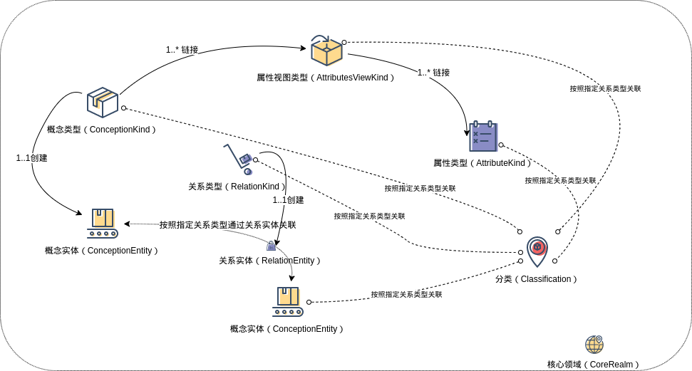

###### Data Ocean & Cloud Graph  数海云图

***
# <span style="color:#CE0000;"> DOCG Core Realm  </span>数据分析平台开发指南

#### ➜ 术语 - Term 

DOCG 数据分析平台的业务模型使用以下的术语来描述实现一个业务领域模型所需要的各种对象的概念。通过组合使用这些对象的功能，可以实现针对特定领域模型的全部数据管理与分析相关的业务需求。

**概念类型**（*ConceptionKind*）：表示特定领域模型中能够包含的任意真实或逻辑概念的类型表达。包含该类型的对象中能够包含的所有属性视图类型以及该类型的对象上能够执行的关系附着规则类型定义。

**概念实体**（*ConceptionEntity*）：概念实体是一个特定概念类型的真实数据表达，表示一个真实世界中存在的客观事物或一个逻辑概念中存在的虚拟事物。

**属性类型**（*AttributeKind*）：表示一个概念类型中包含的一项数据信息的基本结构。属性类型包含该项属性的名称，描述以及属性的数据类型。

**属性视图类型**（*AttributesViewKind*）：属性视图类型是包含若干属性类型的视图容器，在一个属性视图类型中可以包含多个属性类型。属性视图类型与概念类型直接关联，描述一个概念类型中包含的某一个特定类别的属性信息集合。

**关系类型**（*RelationKind*）:关系类型描述概念实体之间的一种特定的关联方式，例如两个实体对象在空间上的包含关系，或者两个实体对象在逻辑上的依赖关系。

**关系实体**（*RelationEntity*）:关系实体是一个特定关系类型的真实数据表达，它表示特定领域模型中两个概念实体之间的一个客观关联。

**关系附着规则类型**（*RelationAttachKind*）：表示将两种特定概念类型的实体数据相互关联的具体执行规则。

**分类**（*Classification*）：代表一类客观存在的，不依赖具体的业务和分析目标而变化的实体对象，例如时间，行政区划，建筑类型分类等。它普遍性的与特定领域模型中的各种概念类型的实体对象产生交互，是在领域模型中进行多维数据分析的一个重要目标。

各个术语代表的对象间的基本交互关系说明如下：




​	1. 一个概念类型（*ConceptionKind*）可以和不限数量的属性视图类型（*AttributesViewKind*）相关联，这些关联定义了一个概念类型中所能表述的所有不同业务类型的属性的集合。

​	2. 一个属性视图类型（*AttributesViewKind*）可以和不限数量的属性类型（*AttributeKind*）相关联，这些关联定义了一个属性视图类型中能够包含的所有属性的详细定义。

​	3. 针对一个概念类型（*ConceptionKind*）能够创建不限数量的概念实体（*ConceptionEntity*）。这些概念实体中包含的数据种类严格遵循 概念类型中的定义。表示真实世界中的一个特定类型的事物的数字化镜像。

​	4. 根据所属的概念类型中关联的属性视图类型（*AttributesViewKind*），一个概念实体（*ConceptionEntity*）中包含相应数量的属性（*AttributeKind*）。

​	5. 根据所属的属性视图类型，一个属性视图（*AttributesViewKind*）中包含相应数量的属性值（*AttributeKind*）。

​	6. 使用关系类型（*RelationKind*）来描述业务领域模型中需要表述的概念实体之间的各种不同性质、不同类型的抽象关联关系的定义。在一个领域模型中可以定义不限数量的关系类型来描述各类实体间的复杂抽象关系。使用关系实体（*RelationEntity*）来表达领域模型中真实存在的实体对象之间的实际关系。在一个领域模型中可以包含任意数量的关系实体。每一个关系实体都必须属于一个特定的关系类型。每一个关系实体都具有方向，必须指向一个源概念实体和一个目标概念实体。

​	7. 在业务领域模型中可以为任意两个指定的概念类型（*ConceptionKind*）指定一个特定的关系类型（*RelationKind*）。从而能够在创建概念实体（*ConceptionEntity*）时自动的创建该关系类型的关系实体。通过访问任何概念实体（*ConceptionEntity*）均可获取到与其相关联的所有关系实体（*RelationEntity*），进而获取到通过该关系实体与其相关的另一个领域模型中的概念实体。

​	8. 通过使用分类（*Classification*）这一概念来表述业务领域模型中需要进行全局分析的各类业务维度（例如时间，空间等）。在一个领域模型中可以定义任意数量的分类。领域模型中的所有概念类型（*ConceptionKind*）、概念实体（*ConceptionEntity*）、关系类型（*RelationKind*）、属性视图类型（*AttributesViewKind*）和*属性类型*（*AttributeKind*）均可使用任何关系类型与这些分类建立关联关系。


#### ➜ JAVA SDK

###### *数据建模类对象*

- CoreRealm：定义，维护业务领域模型中的各类对象
- ConceptionKind：定义，维护概念类型
- AttributesViewKind：定义，维护属性视图类型
- AttributeKind：定义，维护属性类型
- RelationKind：定义，维护关系类型
- RelationAttachKind：定义，维护基本关联关系创建规则

**对象方法概述**

###### ↳ CoreRealm

---

```java
   /**
     * 获取底层图数据库的实现技术，可能的类型有 NEO4J 或 ORIENTDB
     *
     * @return 底层图数据库实现技术枚举
     */
    public CoreRealmStorageImplTech getStorageImplTech();

    /**
     * 根据名称获取概念类型对象
     *
     * @param conceptionKindName String 需要获取的概念类型名称
     *
     * @return 概念类型对象
     */
    public ConceptionKind getConceptionKind(String conceptionKindName);

    /**
     * 创建新的概念类型
     *
     * @param conceptionKindName String 需要创建的概念类型名称，不能与已有概念类型重名
     * @param conceptionKindDesc String 需要创建的概念类型描述
     *
     * @return 概念类型对象
     */
    public ConceptionKind createConceptionKind(String conceptionKindName,String conceptionKindDesc);

    /**
     * 创建新的概念类型并指定父概念类型，该方法在 NEO4J 实现类型下无效
     *
     * @param conceptionKindName String 需要创建的概念类型名称，不能与已有概念类型重名,非空输入值
     * @param conceptionKindDesc String 需要创建的概念类型描述
     * @param parentConceptionKindName String 父概念类型名称
     *
     * @return 概念类型对象
     */
    public ConceptionKind createConceptionKind(String conceptionKindName,String conceptionKindDesc,String parentConceptionKindName)
            throws CoreRealmFunctionNotSupportedException;

    /**
     * 根据名称删除概念类型
     *
     * @param conceptionKindName String 需要删除的概念类型名称
     * @param deleteExistEntities boolean 是否删除该概念类型的全部已经存在的概念实体对象
     *
     * @return 如果操作成功返回 true
     */
    public boolean removeConceptionKind(String conceptionKindName,boolean deleteExistEntities) throws CoreRealmServiceRuntimeException;

    /**
     * 根据对象唯一ID获取属性视图类型对象
     *
     * @param attributesViewKindUID String 需要获取的属性视图类型唯一ID
     *
     * @return 属性视图类型对象
     */
    public AttributesViewKind getAttributesViewKind(String attributesViewKindUID);

    /**
     * 创建新的属性视图类型
     *
     * @param attributesViewKindName String 需要创建的属性视图类型名称，能够与已有属性视图类型重名,非空输入值
     * @param attributesViewKindDesc String 需要创建的属性视图类型描述
     * @param attributesViewKindDataForm AttributesViewKindDataForm 需要创建的属性视图类型的数据存储结构,默认为 SINGLE_VALUE 类型
     *
     * @return 属性视图类型对象
     */
    public AttributesViewKind createAttributesViewKind(String attributesViewKindName,String attributesViewKindDesc, AttributesViewKind.AttributesViewKindDataForm attributesViewKindDataForm);

    /**
     * 根据唯一ID删除属性视图类型
     *
     * @param attributesViewKindUID String 需要删除的属性视图类型唯一ID
     *
     * @return 如果操作成功返回 true
     */
    public boolean removeAttributesViewKind(String attributesViewKindUID) throws CoreRealmServiceRuntimeException;

    /**
     * 根据输入条件查询属性视图类型对象,所有查询条件均为可选输入，各个查询条件精确匹配输入值，互相间为 AND 的组合关系
     *
     * @param attributesViewKindName String 需要查询的属性视图类型名称
     * @param attributesViewKindDesc String 需要查询的的属性视图类型描述
     * @param attributesViewKindDataForm AttributesViewKindDataForm 需要查询的属性视图类型的数据存储结构
     *
     * @return 属性视图类型对象列表
     */
    public List<AttributesViewKind> getAttributesViewKinds(String attributesViewKindName, String attributesViewKindDesc, AttributesViewKind.AttributesViewKindDataForm attributesViewKindDataForm);

    /**
     * 根据对象唯一ID获取属性类型对象
     *
     * @param attributeKindUID String 需要获取的属性类型唯一ID
     *
     * @return 属性类型对象
     */
    public AttributeKind getAttributeKind(String attributeKindUID);

    /**
     * 创建新的属性类型
     *
     * @param attributeKindName String 需要创建的属性类型名称，能够与已有属性类型重名,非空输入值
     * @param attributeKindDesc String 需要创建的属性类型描述
     * @param attributeDataType AttributeDataType 需要创建的属性类型的数据类型,非空输入值
     *
     * @return 属性类型对象
     */
    public AttributeKind createAttributeKind(String attributeKindName,String attributeKindDesc, AttributeDataType attributeDataType);

    /**
     * 根据唯一ID删除属性类型
     *
     * @param attributeKindUID String 需要删除的属性类型唯一ID
     *
     * @return 如果操作成功返回 true
     */
    public boolean removeAttributeKind(String attributeKindUID) throws CoreRealmServiceRuntimeException;

    /**
     * 根据输入条件查询属性类型对象,所有查询条件均为可选输入，各个查询条件精确匹配输入值，互相间为 AND 的组合关系
     *
     * @param attributeKindName String 需要查询的属性类型名称
     * @param attributeKindDesc String 需要查询的的属性类型描述
     * @param attributeDataType AttributesViewKindDataForm 需要查询的属性类型的数据类型
     *
     * @return 属性类型对象列表
     */
    public List<AttributeKind> getAttributeKinds(String attributeKindName,String attributeKindDesc,AttributeDataType attributeDataType);

    /**
     * 根据名称获取关系类型对象
     *
     * @param relationKindName String 需要获取的关系类型名称
     *
     * @return 关系类型对象
     */
    public RelationKind getRelationKind(String relationKindName);

    /**
     * 创建新的关系类型
     *
     * @param relationKindName String 需要创建的关系类型名称，不能与已有关系类型重名
     * @param relationKindDesc String 需要创建的关系类型描述
     *
     * @return 关系类型对象
     */
    public RelationKind createRelationKind(String relationKindName,String relationKindDesc);

    /**
     * 创建新的关系类型并指定父关系类型，该方法在 NEO4J 实现类型下无效
     *
     * @param relationKindName String 需要创建的关系类型名称，不能与已有关系类型重名,非空输入值
     * @param relationKindDesc String 需要创建的关系类型描述
     * @param parentRelationKindName String 父关系类型名称
     *
     * @return 关系类型对象
     */
    public RelationKind createRelationKind(String relationKindName,String relationKindDesc,String parentRelationKindName)
            throws CoreRealmFunctionNotSupportedException;

    /**
     * 根据名称删除关系类型
     *
     * @param relationKindName String 需要删除的关系类型名称
     * @param deleteExistEntities boolean 是否删除该关系类型的全部已经存在的关系实体对象
     *
     * @return 如果操作成功返回 true
     */
    public boolean removeRelationKind(String relationKindName, boolean deleteExistEntities) throws CoreRealmServiceRuntimeException;

     /**
     * 根据输入条件查询关系附着规则类型对象,所有查询条件均为可选输入，各个查询条件精确匹配输入值，互相间为 AND 的组合关系
     *
     * @param relationAttachKindName String 需要查询的关系附着规则类型名称
     * @param relationAttachKindDesc String 需要查询的关系附着规则类型描述
     * @param sourceConceptionKindName String 需要查询的关联关系源概念类型名称
     * @param targetConceptionKindName String 需要查询的关联关系目标概念类型名称
     * @param relationKindName String 需要查询的关联关系类型名称
     * @param allowRepeatableRelationKind String 需要查询的关系附着规则类型是否允许重复创建相同关系类型的关联
     *
     * @return 关系附着规则类型列表
     */
    public List<RelationAttachKind> getRelationAttachKinds(String relationAttachKindName, String relationAttachKindDesc, String sourceConceptionKindName, String targetConceptionKindName,String relationKindName,boolean allowRepeatableRelationKind);

     /**
     * 根据对象唯一ID获取关系附着规则类型对象
     *
     * @param relationAttachKindUID String 需要获取的关系附着规则类型唯一ID
     *
     * @return 关系附着规则类型
     */
    public RelationAttachKind getRelationAttachKind(String relationAttachKindUID);

    /**
     * 创建新的关系附着规则类型
     *
     * @param relationAttachKindName String 需要创建的关系附着规则类型名称
     * @param relationAttachKindDesc String 需要创建的关系附着规则类型描述
     * @param sourceConceptionKindName String 关联关系源概念类型名称
     * @param targetConceptionKindName String 关联关系目标概念类型名称
     * @param relationKindName String 关联关系类型名称
     * @param allowRepeatableRelationKind String 是否允许重复创建相同关系类型的关联
     *
     * @return 关系附着规则类型
     */
    public RelationAttachKind createRelationAttachKind(String relationAttachKindName, String relationAttachKindDesc, String sourceConceptionKindName, String targetConceptionKindName,String relationKindName,boolean allowRepeatableRelationKind)
            throws CoreRealmFunctionNotSupportedException;

    /**
     * 根据对象唯一ID删除关系附着规则类型
     *
     * @param relationAttachKindUID String 需要删除的关系附着规则类型唯一ID
     *
     * @return 如果操作成功返回 true
     */
    public boolean removeRelationAttachKind(String relationAttachKindUID) throws CoreRealmServiceRuntimeException;

    /**
     * 根据名称获取分类对象
     *
     * @param classificationName String 需要获取的分类名称
     *
     * @return 分类对象
     */
    public Classification getClassification(String classificationName);

    /**
     * 创建新的分类
     *
     * @param classificationName String 需要创建的分类名称，不能与已有分类重名
     * @param classificationDesc String 需要创建的分类描述
     *
     * @return 分类对象
     */
    public Classification createClassification(String classificationName,String classificationDesc);

    /**
     * 创建新的分类并指定父分类
     *
     * @param classificationName String 需要创建的分类名称，不能与已有分类重名
     * @param classificationDesc String 需要创建的分类描述
     * @param parentClassificationName String 需要创建的分类的父分类名称
     *
     * @return 分类对象
     */
    public Classification createClassification(String classificationName,String classificationDesc,String parentClassificationName)
            throws CoreRealmServiceRuntimeException;

    /**
     * 根据名称删除分类
     *
     * @param classificationName String 需要删除的分类名称
     *
     * @return 如果操作成功返回 true
     */
    public boolean removeClassification(String classificationName) throws CoreRealmServiceRuntimeException;

    /**
     * 根据名称删除分类及所有后代分类
     *
     * @param classificationName String 需要删除的分类名称
     *
     * @return 如果操作成功返回 true
     */
    public boolean removeClassificationWithOffspring(String classificationName) throws CoreRealmServiceRuntimeException;

    /**
     * 创建一个属于多概念类型的概念实体对象
     *
     * @param conceptionKindNames String[] 所属的概念类型数组
     * @param conceptionEntityValue ConceptionEntityValue 概念实体属性值
     * @param addPerDefinedRelation boolean 是否根据预定义的关联逻辑建立关系链接
     *
     * @return 概念实体对象
     */
    public ConceptionEntity newMultiConceptionEntity(String[] conceptionKindNames,ConceptionEntityValue conceptionEntityValue, boolean addPerDefinedRelation) throws CoreRealmServiceRuntimeException;

    /**
     * 创建一个属于多概念类型的概念实体对象并根据输入的关系附着规则类型建立关系链接
     *
     * @param conceptionKindNames String[] 所属的概念类型数组
     * @param conceptionEntityValue ConceptionEntityValue 概念实体属性值
     * @param relationAttachKindList List<RelationAttachKind> 建立链接所需的关系附着规则类型列表
     *
     * @return 概念实体对象
     */
    public ConceptionEntity newMultiConceptionEntity(String[] conceptionKindNames,ConceptionEntityValue conceptionEntityValue,List<RelationAttachKind> relationAttachKindList) throws CoreRealmServiceRuntimeException;

    /**
     * 创建多个属于多概念类型的概念实体对象
     *
     * @param conceptionKindNames String[] 所属的概念类型数组
     * @param conceptionEntityValues List<ConceptionEntityValue> 概念实体属性值列表
     * @param addPerDefinedRelation boolean 是否根据预定义的关联逻辑建立关系链接
     *
     * @return 实体对象操作返回结果
     */
    public EntitiesOperationResult newMultiConceptionEntities(String[] conceptionKindNames,List<ConceptionEntityValue> conceptionEntityValues, boolean addPerDefinedRelation) throws CoreRealmServiceRuntimeException;

    /**
     * 创建多个属于多概念类型的概念实体对象
     *
     * @param conceptionKindNames String[] 所属的概念类型数组
     * @param conceptionEntityValues List<ConceptionEntityValue> 概念实体属性值列表
     * @param relationAttachKindList List<RelationAttachKind> 建立链接所需的关系附着规则类型列表
     *
     * @return 实体对象操作返回结果
     */
    public EntitiesOperationResult newMultiConceptionEntities(String[] conceptionKindNames,List<ConceptionEntityValue> conceptionEntityValues, List<RelationAttachKind> relationAttachKindList) throws CoreRealmServiceRuntimeException;

    /**
     * 开启全局会话，此操作会创建一个持久化的后端数据库连接，执行该操作后由当前 CoreRealm 所创建的所有对象（以及这些对象创建的后续对象）将继承性的共享该持久化后端数据库连接。
     */
    public void openGlobalSession();

    /**
     * 关闭全局会话，此操作会关闭由 openGlobalSession() 创建的持久化后端数据库连接。该操作后由当前 CoreRealm 所创建的所有对象（以及这些对象创建的后续对象）将各自分别独立的维护其内部的瞬态后端数据库连接。
     */
    public void closeGlobalSession();
```
###### ↳ ConceptionKind

---
```java
    /**
     * 获取当前概念类型对象名称
     *
     * @return 概念类型对象名称
     */
    public String getConceptionKindName();

    /**
     * 获取当前概念类型对象描述
     *
     * @return 概念类型对象描述
     */
    public String getConceptionKindDesc();

    /**
     * 计算当前概念类型的所有概念实体数量
     *
     * @return 概念实体数量
     */
    public Long countConceptionEntities() throws CoreRealmServiceRuntimeException;

    /**
     * 计算当前概念类型（包含所有后代概念类型）的所有概念实体数量，该方法在 NEO4J 实现类型下无效
     *
     * @return 概念实体数量
     */
    public Long countConceptionEntitiesWithOffspring() throws CoreRealmFunctionNotSupportedException;

    /**
     * 获取当前概念类型的所有子概念类型对象，该方法在 NEO4J 实现类型下无效
     *
     * @return 概念类型对象列表
     */
    public List<ConceptionKind> getChildConceptionKinds() throws CoreRealmFunctionNotSupportedException;

    /**
     * 获取当前概念类型的父概念类型对象，该方法在 NEO4J 实现类型下无效
     *
     * @return 概念类型对象
     */
    public ConceptionKind getParentConceptionKind() throws CoreRealmFunctionNotSupportedException;

    /**
     * 获取当前概念类型的所有后代概念类型对象，该方法在 NEO4J 实现类型下无效
     *
     * @return 概念类型对象继承树
     */
    public InheritanceTree<ConceptionKind> getOffspringConceptionKinds() throws CoreRealmFunctionNotSupportedException;

    /**
     * 创建一个属于当前概念类型的概念实体对象
     *
     * @param conceptionEntityValue ConceptionEntityValue 概念实体属性值
     * @param addPerDefinedRelation boolean 是否根据预定义的关联逻辑建立关系链接
     *
     * @return 概念实体对象
     */
    public ConceptionEntity newEntity(ConceptionEntityValue conceptionEntityValue, boolean addPerDefinedRelation);

    /**
     * 创建一个属于当前概念类型的概念实体对象
     *
     * @param conceptionEntityValue ConceptionEntityValue 概念实体属性值
     * @param relationAttachKindList List<RelationAttachKind> 建立链接所需的关系附着规则类型列表
     *
     * @return 概念实体对象
     */
    public ConceptionEntity newEntity(ConceptionEntityValue conceptionEntityValue,List<RelationAttachKind> relationAttachKindList);

    /**
     * 创建多个属于当前概念类型的概念实体对象
     * @param conceptionEntityValues List<ConceptionEntityValue> 概念实体属性值列表
     * @param addPerDefinedRelation boolean 是否根据预定义的关联逻辑建立关系链接
     *
     * @return 实体对象操作返回结果
     */
    public EntitiesOperationResult newEntities(List<ConceptionEntityValue> conceptionEntityValues, boolean addPerDefinedRelation);

    /**
     * 创建多个属于当前概念类型的概念实体对象
     *
     * @param conceptionEntityValues List<ConceptionEntityValue> 概念实体属性值列表
     * @param relationAttachKindList List<RelationAttachKind> 建立链接所需的关系附着规则类型列表
     *
     * @return 实体对象操作返回结果
     */
    public EntitiesOperationResult newEntities(List<ConceptionEntityValue> conceptionEntityValues, List<RelationAttachKind> relationAttachKindList);

    /**
     * 更新一个当前概念类型的概念实体对象的属性信息
     *
     * @param conceptionEntityValueForUpdate ConceptionEntityValue 需要更新的概念实体信息
     *
     * @return 更新后的概念实体对象
     */
    public ConceptionEntity updateEntity(ConceptionEntityValue conceptionEntityValueForUpdate) throws CoreRealmServiceRuntimeException;

    /**
     * 更新多个当前概念类型的概念实体对象的属性信息
     *
     * @param entityValues List<ConceptionEntityValue> 需要更新的概念实体信息
     *
     * @return 实体对象操作返回结果
     */
    public EntitiesOperationResult updateEntities(List<ConceptionEntityValue> entityValues);

    /**
     * 删除一个当前概念类型的概念实体对象
     *
     * @param conceptionEntityUID String 需要删除的概念实体的唯一ID
     *
     * @return 如操作成功，返回结果为 true
     */
    public boolean deleteEntity(String conceptionEntityUID) throws CoreRealmServiceRuntimeException;

    /**
     * 更新多个当前概念类型的概念实体对象
     *
     * @param conceptionEntityUIDs List<String> 需要删除的概念实体的唯一ID列表
     *
     * @return 实体对象操作返回结果
     */
    public EntitiesOperationResult deleteEntities(List<String> conceptionEntityUIDs) throws CoreRealmServiceRuntimeException;

    /**
     * 删除当前概念类型的所有概念实体
     *
     * @return 实体对象操作返回结果
     */
    public EntitiesOperationResult purgeAllEntities() throws CoreRealmServiceRuntimeException;

    /**
     * 计算符合过滤条件的当前概念类型的概念实体对象数量
     *
     * @param attributesParameters AttributesParameters 查询过滤条件
     * @param isDistinctMode boolean 是否不允许重复数据
     *
     * @return 概念实体数量
     */
    public Long countEntities(AttributesParameters attributesParameters,boolean isDistinctMode) throws CoreRealmServiceEntityExploreException, CoreRealmServiceRuntimeException;

    /**
     * 查询符合过滤条件的当前概念类型的概念实体对象
     *
     * @param queryParameters QueryParameters 查询过滤条件
     *
     * @return 概念实体查询结果集
     */
    public ConceptionEntitiesRetrieveResult getEntities(QueryParameters queryParameters) throws CoreRealmServiceEntityExploreException;

    /**
     * 根据唯一ID获取当前概念类型的概念实体对象
     *
     * @param conceptionEntityUID String 需要获取的概念实体唯一ID
     *
     * @return 概念实体对象
     */
    public ConceptionEntity getEntityByUID(String conceptionEntityUID);

    /**
     * 查询符合过滤条件的当前概念类型的概念实体对象,并根据输入的 SINGLE_VALUE 数据存储结构的属性视图类型列表，合并其中包含的属性类型返回相应的属性值
     *
     * @param attributesViewKindNames List<String> 属性视图类型列表
     * @param exploreParameters QueryParameters 查询过滤条件
     *
     * @return 概念实体属性查询结果集
     */
    public ConceptionEntitiesAttributesRetrieveResult getSingleValueEntityAttributesByViewKinds(List<String> attributesViewKindNames, QueryParameters exploreParameters) throws CoreRealmServiceEntityExploreException;

    /**
     * 查询符合过滤条件的当前概念类型的概念实体对象,并根据输入的属性类型返回相应的属性值
     *
     * @param attributeNames List<String> 属性类型列表
     * @param exploreParameters QueryParameters 查询过滤条件
     *
     * @return 概念实体属性查询结果集
     */
    public ConceptionEntitiesAttributesRetrieveResult getSingleValueEntityAttributesByAttributeNames(List<String> attributeNames, QueryParameters exploreParameters) throws CoreRealmServiceEntityExploreException;

    /**
     * 为当前概念类型附加属性视图类型
     *
     * @param attributesViewKindUID String 需要附加的属性视图类型唯一ID
     *
     * @return 如操作成功，返回结果为 true
     */
    public boolean attachAttributesViewKind(String attributesViewKindUID) throws CoreRealmServiceRuntimeException;

    /**
     * 获取当前概念类型附加的全部属性视图类型
     *
     * @return 属性视图类型对象列表
     */
    public List<AttributesViewKind> getContainsAttributesViewKinds();

    /**
     * 获取当前概念类型附加的全部符合名称查询条件的属性视图类型
     *
     * @param attributesViewKindName String 需要返回的属性视图类型名称，本查询的数值匹配规则为 Equal 匹配
     *
     * @return 属性视图类型对象列表
     */
    public List<AttributesViewKind> getContainsAttributesViewKinds(String attributesViewKindName);

    /**
     * 从当前概念类型上移除已经附加的属性视图类型
     *
     * @param attributesViewKindUID String 需要移除的属性视图类型唯一ID
     *
     * @return 如操作成功，返回结果为 true
     */
    public boolean detachAttributesViewKind(String attributesViewKindUID) throws CoreRealmServiceRuntimeException;

    /**
     * 获取当前概念类型包含的全部 SINGLE_VALUE 数据存储结构的属性视图类型中包含的属性类型
     *
     * @return 属性类型对象列表
     */
    public List<AttributeKind> getContainsSingleValueAttributeKinds();

    /**
     * 获取当前概念类型包含的全部符合名称查询条件的 SINGLE_VALUE 数据存储结构的属性视图类型中包含的属性类型
     *
     * @param attributeKindName String 需要返回的属性类型名称，本查询的数值匹配规则为 Equal 匹配
     *
     * @return 属性类型对象列表
     */
    public List<AttributeKind> getContainsSingleValueAttributeKinds(String attributeKindName);   
```
###### ↳ RelationKind

---
```java
    /**
     * 获取当前关系类型对象名称
     *
     * @return 关系类型对象名称
     */
    public String getRelationKindName();

    /**
     * 获取当前关系类型对象描述
     *
     * @return 关系类型对象描述
     */
    public String getRelationKindDesc();

    /**
     * 获取当前关系类型的父关系类型对象，该方法在 NEO4J 实现类型下无效
     *
     * @return 关系类型对象
     */
    public RelationKind getParentRelationKind() throws CoreRealmFunctionNotSupportedException;

    /**
     * 获取当前关系类型的所有子关系类型对象，该方法在 NEO4J 实现类型下无效
     *
     * @return 关系类型对象列表
     */
    public List<RelationKind> getChildRelationKinds() throws CoreRealmFunctionNotSupportedException;

    /**
     * 获取当前关系类型的所有后代关系类型对象，该方法在 NEO4J 实现类型下无效
     *
     * @return 关系类型对象继承树
     */
    public InheritanceTree<RelationKind> getOffspringRelationKinds() throws CoreRealmFunctionNotSupportedException;

    /**
     * 计算当前关系类型的所有关系实体数量
     *
     * @return 关系实体数量
     */
    public Long countRelationEntities() throws CoreRealmServiceRuntimeException;

    /**
     * 计算当前关系类型（包含所有后代关系类型）的所有关系实体数量，该方法在 NEO4J 实现类型下无效
     *
     * @return 关系实体数量
     */
    public Long countRelationEntitiesWithOffspring() throws CoreRealmFunctionNotSupportedException;

    /**
     * 计算符合过滤条件的当前关系类型的关系实体对象数量
     *
     * @param attributesParameters AttributesParameters 查询过滤条件
     * @param isDistinctMode boolean 是否不允许重复数据
     * @return 关系实体数量
     */
    public Long countRelationEntities(AttributesParameters attributesParameters, boolean isDistinctMode)  throws CoreRealmServiceEntityExploreException, CoreRealmServiceRuntimeException;

    /**
     * 查询符合过滤条件的当前关系类型的关系实体对象
     *
     * @param queryParameters QueryParameters 查询过滤条件
     *
     * @return 关系实体查询结果集
     */
    public RelationEntitiesRetrieveResult getRelationEntities(QueryParameters queryParameters)  throws CoreRealmServiceEntityExploreException;

    /**
     * 删除当前关系类型的所有关系实体
     *
     * @return 实体对象操作返回结果
     */
    public EntitiesOperationResult purgeAllRelationEntities() throws CoreRealmServiceRuntimeException;   
```
###### ↳ AttributesViewKind
---
```java
    /**
     * 属性视图类型的数据存储结构
     * SINGLE_VALUE : 该视图中包含的属性值为单值，每一个 Entity 对象中该视图中包含的属性只有一个值。属性值存储在实体对象内部。
     * LIST_VALUE : 该视图中包含的属性值为列表值，每一个 Entity 对象中该视图中包含的属性可以有多个值。属性值存储在实体对象内部。
     * RELATED_VALUE :该视图中包含的属性值为列表值，每一个 Entity 对象中该视图中包含的属性可以有多个值。属性值存储在与该实体相关的其他实体对象中。
     * EXTERNAL_VALUE :该视图中包含的属性值为列表值，每一个 Entity 对象中该视图中包含的属性可以有多个值。属性值存储在与该实体相关的其他外部数据源中。
     */
    public enum AttributesViewKindDataForm {SINGLE_VALUE, LIST_VALUE, RELATED_VALUE, EXTERNAL_VALUE}

    /**
     * 获取当前属性视图类型对象唯一ID
     *
     * @return 属性视图类型对象唯一ID
     */
    public String getAttributesViewKindUID();

    /**
     * 获取当前属性视图类型对象名称
     *
     * @return 属性视图类型对象名称
     */
    public String getAttributesViewKindName();

    /**
     * 获取当前属性视图类型对象描述
     *
     * @return 属性视图类型对象描述
     */
    public String getAttributesViewKindDesc();

    /**
     * 判断当前属性视图类型是否是集合类属性视图
     *
     * @return 如果数据存储结构是 LIST_VALUE, RELATED_VALUE, EXTERNAL_VALUE 则返回 true
     */
    public boolean isCollectionAttributesViewKind();

    /**
     * 获取当前属性视图类型的数据存储结构
     *
     * @return 数据存储结构枚举值
     */
    public AttributesViewKindDataForm getAttributesViewKindDataForm();

    /**
     * 为当前属性视图类型附加属性类型
     *
     * @param attributeKindUID String 需要附加的属性类型唯一ID
     *
     * @return 如操作成功，返回结果为 true
     */
    public boolean attachAttributeKind(String attributeKindUID) throws CoreRealmServiceRuntimeException;

    /**
     * 为当前属性视图类型附加属性类型,并在链接中添加自定义元数据信息
     *
     * @param attributeKindUID String 需要附加的属性类型唯一ID
     * @param properties Map<String,Object> 链接上的自定义属性
     *
     * @return 如操作成功，返回结果为 true
     */
    public boolean attachAttributeKind(String attributeKindUID, Map<String,Object> properties) throws CoreRealmServiceRuntimeException;

    /**
     * 为已经附加在当前属性视图类型上的属性类型设置链接上的元数据信息
     *
     * @param attributeKindUID String 需要附加的属性类型唯一ID
     * @param properties Map<String,Object> 链接上的自定义属性
     *
     * @return 操作成功的元数据名称列表
     */
    public List<String> setAttributeKindAttachMetaInfo(String attributeKindUID,Map<String,Object> properties);

    /**
     * 从已经附加在当前属性视图类型上的属性类型链接中删除指定的元数据属性
     *
     * @param attributeKindUID String 需要附加的属性类型唯一ID
     * @param metaPropertyName String 需要删除的元数据属性名称
     *
     * @return 如操作成功，返回结果为 true
     */
    public boolean removeAttributeKindAttachMetaInfo(String attributeKindUID,String metaPropertyName) throws CoreRealmServiceRuntimeException;

    /**
     * 获取当前属性视图类型中的某一特定元数据属性信息
     *
     * @param metaPropertyName String 需要获取的元数据属性名称
     *
     * @return 查询结果 Map，其中 Key 为含有该元数据的属性类型的唯一ID，Value 该元数据属性的属性值
     */
    public Map<String,Object> getAttributeKindsAttachMetaInfo(String metaPropertyName);

    /**
     * 获取当前属性视图类型中包含的某一特定属性类型的指定元数据属性信息
     *
     * @param attributeKindUID String 需要获取的属性类型唯一ID
     * @param metaPropertyName String 需要获取的元数据属性名称
     *
     * @return 查询结果 该元数据属性的属性值
     */
    public Object getAttributeKindAttachMetaInfo(String attributeKindUID,String metaPropertyName);

    /**
     * 从当前属性视图类型上移除已附加的属性类型链接
     *
     * @param attributeKindUID String 需要移除链接的属性类型唯一ID
     *
     * @return 如操作成功，返回结果为 true
     */
    public boolean detachAttributeKind(String attributeKindUID) throws CoreRealmServiceRuntimeException;

    /**
     * 获取当前属性视图类型包含的所有属性类型对象
     *
     * @return 属性类型对象列表
     */
    public List<AttributeKind> getContainsAttributeKinds();

    /**
     * 获取所有包含当前属性视图类型的概念类型对象
     *
     * @return 概念类型对象列表
     */
    public List<ConceptionKind> getContainerConceptionKinds();   
```
###### ↳ AttributeKind

---
```java
    /**
     * 获取当前属性类型对象名称
     *
     * @return 属性类型对象名称
     */
    public String getAttributeKindName();

    /**
     * 获取当前属性类型对象唯一ID
     *
     * @return 属性类型对象唯一ID
     */
    public String getAttributeKindUID();

    /**
     * 获取当前属性类型对象描述
     *
     * @return 属性类型对象描述
     */
    public String getAttributeKindDesc();

    /**
     * 获取当前属性类型对象数据类型,数据类型可能选项是：
     * BOOLEAN,INT,SHORT,LONG,FLOAT,DOUBLE,DATE,STRING,BYTE,DECIMAL,
     * BOOLEAN_ARRAY,INT_ARRAY,SHORT_ARRAY,LONG_ARRAY,FLOAT_ARRAY,DOUBLE_ARRAY,DATE_ARRAY,STRING_ARRAY,BYTE_ARRAY,DECIMAL_ARRAY,
     * BINARY
     * @return 属性类型对象数据类型枚举值
     */
    public AttributeDataType getAttributeDataType();

    /**
     * 获取所有包含当前属性类型的属性视图类型对象
     *
     * @return 属性视图类型对象列表
     */
    public List<AttributesViewKind> getContainerAttributesViewKinds();
```

###### ↳ RelationAttachKind

---
```java
    /**
     * 构建关联关系时当前实体在关系中所属的角色
     * SOURCE : 当前实体是关联关系的出发方 (FROM)。
     * TARGET : 当前实体是关联关系的目标方 (TO)。
     */
    public enum EntityRelateRole {SOURCE, TARGET}    

    /**
     * 获取当前关系附着规则类型对象唯一ID
     *
     * @return 关系附着规则类型对象唯一ID
     */
    public String getRelationAttachKindUID();

    /**
     * 获取当前关系附着规则类型的来源概念类型名称
     *
     * @return 来源概念类型名称
     */
    public String getSourceConceptionKindName();

    /**
     * 获取当前关系附着规则类型的目标概念类型名称
     *
     * @return 目标概念类型名称
     */
    public String getTargetConceptionKindName();

    /**
     * 获取当前关系附着规则类型的关系类型名称
     *
     * @return 关系类型名称
     */
    public String getRelationKindName();

     /**
     * 获取当前关系附着规则类型名称
     *
     * @return 关系附着规则类型名称
     */
    public String getRelationAttachKindName();

    /**
     * 获取当前关系附着规则类型描述
     *
     * @return 关系附着规则类型描述
     */
    public String getRelationAttachKindDesc();

    /**
     * 获取当前关系附着规则类型的描述
     *
     * @param newDesc String 新的关系附着规则类型描述
     *
     * @return 如操作成功，返回结果为 true
     */
    public boolean updateRelationAttachKindDesc(String newDesc);

    /**
     * 获取当前关系附着规则类型的所有关系附着逻辑规则
     *
     * @return 关系附着逻辑规则列表
     */
    public List<RelationAttachLinkLogic> getRelationAttachLinkLogic();

    /**
     * 为当前关系附着规则类型创建新的关系附着逻辑规则
     *
     * @param relationAttachLinkLogic RelationAttachLinkLogic 新的关系附着逻辑规则对象
     *
     * @return 新建的关系附着逻辑规则逻辑
     */
    public RelationAttachLinkLogic createRelationAttachLinkLogic(RelationAttachLinkLogic relationAttachLinkLogic) throws CoreRealmServiceRuntimeException;

    /**
     * 删除当前关系附着规则类型中已有的关系附着逻辑规则
     *
     * @param relationAttachLinkLogicUID String 要删除的关系附着逻辑规则对象唯一ID
     *
     * @return 如操作成功，返回结果为 true
     */
    public boolean removeRelationAttachLinkLogic(String relationAttachLinkLogicUID) throws CoreRealmServiceRuntimeException;

    /**
     * 使用当前关系附着规则类型的逻辑创建新的关系实体
     *
     * @param conceptionEntityUID String 概念实体对象唯一ID
     * @param entityRelateRole EntityRelateRole 概念实体在关系中的角色
     * @param relationData Map<String,Object> 关系实体上的自定义属性
     *
     * @return 关系附着逻辑规则列表
     */
    public boolean newRelationEntities(String conceptionEntityUID, EntityRelateRole entityRelateRole, Map<String,Object> relationData);

     /**
     * 使用当前关系附着规则类型的定义在领域内的全部数据上创建符合条件的关系实体
     *
     * @param relationData Map<String,Object> 关系实体上的自定义属性
     * @return 实体对象操作返回结果
     */
    public EntitiesOperationResult newUniversalRelationEntities(Map<String,Object> relationData);

    /**
     * 是否允许在同样的两个实体之间创建相同关系类型的关系实体
     *
     * @return 如允许则返回 true
     */
    public boolean isRepeatableRelationKindAllow();

    /**
     * 设定是否允许在同样的两个实体之间创建相同关系类型的关系实体
     *
     * @param allowRepeatableRelationKind boolean 是否允许创建相同关系类型的实体
     *
     * @return 返回最新的是否允许状态
     */
    public boolean setAllowRepeatableRelationKind(boolean allowRepeatableRelationKind);
```
###### *数据操作类对象*

- ConceptionEntity：对指定概念类型中的概念实体数据执行CRUD操作

- RelationEntity：对指定关系类型中的关系实体数据执行CRUD操作

- Classification：对领域模型中的各类分类数据执行CRUD与关联分析操作

**对象方法概述**

###### ↳ ConceptionEntity

---
```java
    /**
     * 获取当前概念实体对象唯一ID
     *
     * @return 概念实体对象唯一ID
     */
    public String getConceptionEntityUID();

    /**
     * 获取当前操作上下文中概念实体对象所属的概念类型名称
     *
     * @return 概念类型名称
     */
    public String getConceptionKindName();

    /**
     * 获取当前概念实体对象所属的所有概念类型名称
     *
     * @return 概念类型名称列表
     */
    public List<String> getAllConceptionKindNames();
```
###### ↳ RelationEntity

---

```java
    /**
     * 获取当前关系实体对象唯一ID
     *
     * @return 关系实体对象唯一ID
     */
    public String getRelationEntityUID();

    /**
     * 获取当前关系实体所属关系类型名称
     *
     * @return 关系类型名称
     */
    public String getRelationKindName();

    /**
     * 获取当前关系实体的来源概念实体唯一ID
     *
     * @return 概念实体对象唯一ID
     */
    public String getFromConceptionEntityUID();

    /**
     * 获取当前关系实体的目标概念实体唯一ID
     *
     * @return 概念实体对象唯一ID
     */
    public String getToConceptionEntityUID();
```
###### ↳ Classification

---

```java
    /**
     * 获取当前分类名称
     *
     * @return 分类名称
     */
    public String getClassificationName();

    /**
     * 获取当前分类描述
     *
     * @return 分类描述
     */
    public String getClassificationDesc();

    /**
     * 判断当前分类是否为根节点分类
     *
     * @return 如果当前分类没有父分类则返回 true
     */
    public boolean isRootClassification();

    /**
     * 获取当前分类的父分类
     *
     * @return 父分类对象
     */
    public Classification getParentClassification();

    /**
     * 获取当前分类的子分类列表
     *
     * @return 子分类对象列表
     */
    public List<Classification> getChildClassifications();

    /**
     * 获取当前分类的所有后代分类
     *
     * @return 分类对象继承树
     */
    public InheritanceTree<Classification> getOffspringClassifications();

    /**
     * 为当前分类附加已经存在的子分类
     *
     * @param childClassificationName String 需要附加的子分类名称
     *
     * @return 如操作成功，返回结果为 true
     */
    public boolean attachChildClassification(String childClassificationName) throws CoreRealmServiceRuntimeException;

    /**
     * 从当前分类上移除已经附加的子分类的父子关系
     *
     * @param childClassificationName String 需要移除父子关系的子分类名称
     *
     * @return 如操作成功，返回结果为 true
     */
    public boolean detachChildClassification(String childClassificationName) throws CoreRealmServiceRuntimeException;

    /**
     * 为当前分类创建新的子分类
     *
     * @param classificationName String 新建的子分类名称
     * @param classificationDesc String 新建的子分类描述
     *
     * @return 新建的子分类对象
     */
    public Classification createChildClassification(String classificationName,String classificationDesc) throws CoreRealmServiceRuntimeException;

    /**
     * 删除当前分类的子分类
     *
     * @param classificationName String 需要删除的子分类名称
     *
     * @return 如操作成功，返回结果为 true
     */
    public boolean removeChildClassification(String classificationName) throws CoreRealmServiceRuntimeException;

    /**
     * 获取与当前分类关联的概念分类对象
     *
     * @param relationKindName String 关联的关系类型名称
     * @param relationDirection RelationDirection 关联的关系方向
     * @param includeOffspringClassifications boolean 是否获取后代分类关联的数据
     * @param offspringLevel int 包含的后代分类层级数
     *
     * @return 概念分类对象列表
     */
    public List<ConceptionKind> getRelatedConceptionKind(String relationKindName, RelationDirection relationDirection,boolean includeOffspringClassifications,int offspringLevel) throws CoreRealmServiceRuntimeException;

    /**
     * 获取与当前分类关联的关系分类对象
     *
     * @param relationKindName String 关联的关系类型名称
     * @param relationDirection RelationDirection 关联的关系方向
     * @param includeOffspringClassifications boolean 是否获取后代分类关联的数据
     * @param offspringLevel int 包含的后代分类层级数
     *
     * @return 关系分类对象列表
     */
    public List<RelationKind> getRelatedRelationKind(String relationKindName, RelationDirection relationDirection,boolean includeOffspringClassifications,int offspringLevel) throws CoreRealmServiceRuntimeException;

    /**
     * 获取与当前分类关联的属性类型对象
     *
     * @param relationKindName String 关联的关系类型名称
     * @param relationDirection RelationDirection 关联的关系方向
     * @param includeOffspringClassifications boolean 是否获取后代分类关联的数据
     * @param offspringLevel int 包含的后代分类层级数
     *
     * @return 属性类型对象列表
     */
    public List<AttributeKind> getRelatedAttributeKind(String relationKindName, RelationDirection relationDirection,boolean includeOffspringClassifications,int offspringLevel) throws CoreRealmServiceRuntimeException;

    /**
     * 获取与当前分类关联的属性视图类型对象
     *
     * @param relationKindName String 关联的关系类型名称
     * @param relationDirection RelationDirection 关联的关系方向
     * @param includeOffspringClassifications boolean 是否获取后代分类关联的数据
     * @param offspringLevel int 包含的后代分类层级数
     *
     * @return 属性视图类型对象列表
     */
    public List<AttributesViewKind> getRelatedAttributesViewKind(String relationKindName, RelationDirection relationDirection,boolean includeOffspringClassifications,int offspringLevel) throws CoreRealmServiceRuntimeException;

    /**
     * 获取与当前分类关联的概念实体对象
     *
     * @param relationKindName String 关联的关系类型名称
     * @param relationDirection RelationDirection 关联的关系方向
     * @param queryParameters QueryParameters 概念实体查询过滤条件
     * @param includeOffspringClassifications boolean 是否获取后代分类关联的数据
     * @param offspringLevel int 包含的后代分类层级数
     *
     * @return 概念实体对象列表
     */
    public List<ConceptionEntity> getRelatedConceptionEntity(String relationKindName, RelationDirection relationDirection, QueryParameters queryParameters,boolean includeOffspringClassifications, int offspringLevel) throws CoreRealmServiceRuntimeException, CoreRealmServiceEntityExploreException;
```

###### *通用功能特性*

- AttributesMeasurable：具有此特性的对象能够执行对自定义属性的CRUD操作

  ​	具有此特性的对象：|___Classification___|___ConceptionEntity___|___RelationEntity___|

- ClassificationAttachable：具有此特性的对象能够执行各类与分类关联相关的操作
  ​	具有此特性的对象：|___AttributeKind___|___AttributesViewKind___|___ConceptionEntity___|___ConceptionKind___|___RelationAttachKind___|___RelationKind___|

- EntityRelationable：具有此特性的对象能够执行与各类概念实体的关联操作
  ​	具有此特性的对象：|___ConceptionEntity___|
  
- MetaAttributeFeatureSupportable：具有此特性的对象能够执行对系统全局定义的元数据属性的获取与更新操作
  ​	具有此特性的对象：|___AttributeKind___|___AttributesViewKind___|___Classification___|___ConceptionKind___|___RelationAttachKind___|___RelationKind___|

- MetaConfigItemFeatureSupportable：具有此特性的对象能够执行对自定义配置信息的CRUD操作
  	具有此特性的对象：|___AttributeKind___|___AttributesViewKind___|___ConceptionKind___|___RelationAttachKind___|___RelationKind___|
  
- MultiConceptionKindsSupportable：具有此特性的对象能够执行对多概念分类的隶属关系的定义操作
  ​	具有此特性的对象：|___ConceptionEntity___|
  
- StatisticalAndEvaluable：具有此特性的对象能够执行对自身包含的数值类数据的统计与评估相关的操作
  ​	具有此特性的对象：|___ConceptionKind___|

**对象方法概述**

###### ↳ AttributesMeasurable

---

```java
    /**
     * 删除当前对象中包含的属性信息
     *
     * @param attributeName String 需要删除的属性名称
     *
     * @return 如操作成功，返回结果为 true
     */
    public boolean removeAttribute(String attributeName) throws CoreRealmServiceRuntimeException;

    /**
     * 获取当前对象中包含的所有属性信息
     *
     * @return 属性信息值列表
     */
    public List<AttributeValue> getAttributes();

    /**
     * 判断当前对象中是否包含的特定的属性信息
     *
     * @param attributeName String 需要判断的属性名称
     *
     * @return 如包含该属性，返回结果为 true
     */
    public boolean hasAttribute(String attributeName);

    /**
     * 获取当前对象中包含的所有属性名称
     *
     * @return 属性名称列表
     */
    public List<String> getAttributeNames();

    /**
     * 获取当前对象中包含的指定属性信息值
     *
     * @param attributeName String 需要获取的属性名称
     *
     * @return 属性信息值
     */
    public AttributeValue getAttribute(String attributeName);

    /**
     * 在当前对象中添加 boolean 类型的属性信息
     *
     * @param attributeName String 需要添加的属性名称
     * @param attributeValue boolean 需要添加的属性值
     *
     * @return 新建的属性信息值
     */
    public AttributeValue addAttribute(String attributeName, boolean attributeValue) throws CoreRealmServiceRuntimeException;

    /**
     * 在当前对象中添加 int 类型的属性信息
     *
     * @param attributeName String 需要添加的属性名称
     * @param attributeValue int 需要添加的属性值
     *
     * @return 新建的属性信息值
     */
    public AttributeValue addAttribute(String attributeName, int attributeValue) throws CoreRealmServiceRuntimeException;

    /**
     * 在当前对象中添加 short 类型的属性信息
     *
     * @param attributeName String 需要添加的属性名称
     * @param attributeValue short 需要添加的属性值
     *
     * @return 新建的属性信息值
     */
    public AttributeValue addAttribute(String attributeName, short attributeValue) throws CoreRealmServiceRuntimeException;

    /**
     * 在当前对象中添加 long 类型的属性信息
     *
     * @param attributeName String 需要添加的属性名称
     * @param attributeValue long 需要添加的属性值
     *
     * @return 新建的属性信息值
     */
    public AttributeValue addAttribute(String attributeName, long attributeValue) throws CoreRealmServiceRuntimeException;

    /**
     * 在当前对象中添加 float 类型的属性信息
     *
     * @param attributeName String 需要添加的属性名称
     * @param attributeValue float 需要添加的属性值
     *
     * @return 新建的属性信息值
     */
    public AttributeValue addAttribute(String attributeName, float attributeValue) throws CoreRealmServiceRuntimeException;

    /**
     * 在当前对象中添加 double 类型的属性信息
     *
     * @param attributeName String 需要添加的属性名称
     * @param attributeValue double 需要添加的属性值
     *
     * @return 新建的属性信息值
     */
    public AttributeValue addAttribute(String attributeName, double attributeValue) throws CoreRealmServiceRuntimeException;

    /**
     * 在当前对象中添加 Date 类型的属性信息
     *
     * @param attributeName String 需要添加的属性名称
     * @param attributeValue Date 需要添加的属性值
     *
     * @return 新建的属性信息值
     */
    public AttributeValue addAttribute(String attributeName, Date attributeValue) throws CoreRealmServiceRuntimeException;

    /**
     * 在当前对象中添加 String 类型的属性信息
     *
     * @param attributeName String 需要添加的属性名称
     * @param attributeValue String 需要添加的属性值
     *
     * @return 新建的属性信息值
     */
    public AttributeValue addAttribute(String attributeName, String attributeValue) throws CoreRealmServiceRuntimeException;

    /**
     * 在当前对象中添加 byte 类型的属性信息
     *
     * @param attributeName String 需要添加的属性名称
     * @param attributeValue byte 需要添加的属性值
     *
     * @return 新建的属性信息值
     */
    public AttributeValue addAttribute(String attributeName, byte attributeValue) throws CoreRealmServiceRuntimeException;

    /**
     * 在当前对象中添加 BigDecimal 类型的属性信息
     *
     * @param attributeName String 需要添加的属性名称
     * @param attributeValue BigDecimal 需要添加的属性值
     *
     * @return 新建的属性信息值
     */
    public AttributeValue addAttribute(String attributeName, BigDecimal attributeValue) throws CoreRealmServiceRuntimeException;

    /**
     * 在当前对象中添加 Boolean[] 类型的属性信息
     *
     * @param attributeName String 需要添加的属性名称
     * @param attributeValue Boolean[] 需要添加的属性值
     *
     * @return 新建的属性信息值
     */
    public AttributeValue addAttribute(String attributeName, Boolean[] attributeValue) throws CoreRealmServiceRuntimeException;

    /**
     * 在当前对象中添加 Integer[] 类型的属性信息
     *
     * @param attributeName String 需要添加的属性名称
     * @param attributeValue Integer[] 需要添加的属性值
     *
     * @return 新建的属性信息值
     */
    public AttributeValue addAttribute(String attributeName, Integer[] attributeValue) throws CoreRealmServiceRuntimeException;

    /**
     * 在当前对象中添加 Short[] 类型的属性信息
     *
     * @param attributeName String 需要添加的属性名称
     * @param attributeValue Short[] 需要添加的属性值
     *
     * @return 新建的属性信息值
     */
    public AttributeValue addAttribute(String attributeName, Short[] attributeValue) throws CoreRealmServiceRuntimeException;

    /**
     * 在当前对象中添加 Long[] 类型的属性信息
     *
     * @param attributeName String 需要添加的属性名称
     * @param attributeValue Long[] 需要添加的属性值
     *
     * @return 新建的属性信息值
     */
    public AttributeValue addAttribute(String attributeName, Long[] attributeValue) throws CoreRealmServiceRuntimeException;

    /**
     * 在当前对象中添加 Float[] 类型的属性信息
     *
     * @param attributeName String 需要添加的属性名称
     * @param attributeValue Float[] 需要添加的属性值
     *
     * @return 新建的属性信息值
     */
    public AttributeValue addAttribute(String attributeName, Float[] attributeValue) throws CoreRealmServiceRuntimeException;

    /**
     * 在当前对象中添加 Double[] 类型的属性信息
     *
     * @param attributeName String 需要添加的属性名称
     * @param attributeValue Double[] 需要添加的属性值
     *
     * @return 新建的属性信息值
     */
    public AttributeValue addAttribute(String attributeName, Double[] attributeValue) throws CoreRealmServiceRuntimeException;

    /**
     * 在当前对象中添加 Date[] 类型的属性信息
     *
     * @param attributeName String 需要添加的属性名称
     * @param attributeValue Date[] 需要添加的属性值
     *
     * @return 新建的属性信息值
     */
    public AttributeValue addAttribute(String attributeName, Date[] attributeValue) throws CoreRealmServiceRuntimeException;

    /**
     * 在当前对象中添加 String[] 类型的属性信息
     *
     * @param attributeName String 需要添加的属性名称
     * @param attributeValue String[] 需要添加的属性值
     *
     * @return 新建的属性信息值
     */
    public AttributeValue addAttribute(String attributeName, String[] attributeValue) throws CoreRealmServiceRuntimeException;

    /**
     * 在当前对象中添加 Byte[] 类型的属性信息
     *
     * @param attributeName String 需要添加的属性名称
     * @param attributeValue Byte[] 需要添加的属性值
     *
     * @return 新建的属性信息值
     */
    public AttributeValue addAttribute(String attributeName, Byte[] attributeValue) throws CoreRealmServiceRuntimeException;

    /**
     * 在当前对象中添加 BigDecimal[] 类型的属性信息
     *
     * @param attributeName String 需要添加的属性名称
     * @param attributeValue BigDecimal[] 需要添加的属性值
     *
     * @return 新建的属性信息值
     */
    public AttributeValue addAttribute(String attributeName, BigDecimal[] attributeValue) throws CoreRealmServiceRuntimeException;

    /**
     * 在当前对象中添加 byte[] 类型的属性信息
     *
     * @param attributeName String 需要添加的属性名称
     * @param attributeValue byte[] 需要添加的属性值
     *
     * @return 新建的属性信息值
     */
    public AttributeValue addAttribute(String attributeName, byte[] attributeValue) throws CoreRealmServiceRuntimeException;

    /**
     * 更新当前对象中已有的 boolean 类型的属性信息值
     *
     * @param attributeName String 需要更新的属性名称
     * @param attributeValue boolean 新的属性值
     *
     * @return 新建的属性信息值
     */
    public AttributeValue updateAttribute(String attributeName, boolean attributeValue) throws CoreRealmServiceRuntimeException;

    /**
     * 更新当前对象中已有的 int 类型的属性信息值
     *
     * @param attributeName String 需要更新的属性名称
     * @param attributeValue int 新的属性值
     *
     * @return 新建的属性信息值
     */
    public AttributeValue updateAttribute(String attributeName, int attributeValue) throws CoreRealmServiceRuntimeException;

    /**
     * 更新当前对象中已有的 short 类型的属性信息值
     *
     * @param attributeName String 需要更新的属性名称
     * @param attributeValue short 新的属性值
     *
     * @return 新建的属性信息值
     */
    public AttributeValue updateAttribute(String attributeName, short attributeValue) throws CoreRealmServiceRuntimeException;

    /**
     * 更新当前对象中已有的 long 类型的属性信息值
     *
     * @param attributeName String 需要更新的属性名称
     * @param attributeValue long 新的属性值
     *
     * @return 新建的属性信息值
     */
    public AttributeValue updateAttribute(String attributeName, long attributeValue) throws CoreRealmServiceRuntimeException;

    /**
     * 更新当前对象中已有的 float 类型的属性信息值
     *
     * @param attributeName String 需要更新的属性名称
     * @param attributeValue float 新的属性值
     *
     * @return 新建的属性信息值
     */
    public AttributeValue updateAttribute(String attributeName, float attributeValue) throws CoreRealmServiceRuntimeException;

    /**
     * 更新当前对象中已有的 double 类型的属性信息值
     *
     * @param attributeName String 需要更新的属性名称
     * @param attributeValue double 新的属性值
     *
     * @return 新建的属性信息值
     */
    public AttributeValue updateAttribute(String attributeName, double attributeValue) throws CoreRealmServiceRuntimeException;

    /**
     * 更新当前对象中已有的 Date 类型的属性信息值
     *
     * @param attributeName String 需要更新的属性名称
     * @param attributeValue Date 新的属性值
     *
     * @return 新建的属性信息值
     */
    public AttributeValue updateAttribute(String attributeName, Date attributeValue) throws CoreRealmServiceRuntimeException;

    /**
     * 更新当前对象中已有的 String 类型的属性信息值
     *
     * @param attributeName String 需要更新的属性名称
     * @param attributeValue String 新的属性值
     *
     * @return 新建的属性信息值
     */
    public AttributeValue updateAttribute(String attributeName, String attributeValue) throws CoreRealmServiceRuntimeException;

    /**
     * 更新当前对象中已有的 byte 类型的属性信息值
     *
     * @param attributeName String 需要更新的属性名称
     * @param attributeValue byte 新的属性值
     *
     * @return 新建的属性信息值
     */
    public AttributeValue updateAttribute(String attributeName, byte attributeValue) throws CoreRealmServiceRuntimeException;

    /**
     * 更新当前对象中已有的 BigDecimal 类型的属性信息值
     *
     * @param attributeName String 需要更新的属性名称
     * @param attributeValue BigDecimal 新的属性值
     *
     * @return 新建的属性信息值
     */
    public AttributeValue updateAttribute(String attributeName, BigDecimal attributeValue) throws CoreRealmServiceRuntimeException;

    /**
     * 更新当前对象中已有的 Boolean[] 类型的属性信息值
     *
     * @param attributeName String 需要更新的属性名称
     * @param attributeValue Boolean[] 新的属性值
     *
     * @return 新建的属性信息值
     */
    public AttributeValue updateAttribute(String attributeName, Boolean[] attributeValue) throws CoreRealmServiceRuntimeException;

    /**
     * 更新当前对象中已有的 Integer[] 类型的属性信息值
     *
     * @param attributeName String 需要更新的属性名称
     * @param attributeValue Integer[] 新的属性值
     *
     * @return 新建的属性信息值
     */
    public AttributeValue updateAttribute(String attributeName, Integer[] attributeValue) throws CoreRealmServiceRuntimeException;

    /**
     * 更新当前对象中已有的 Short[] 类型的属性信息值
     *
     * @param attributeName String 需要更新的属性名称
     * @param attributeValue Short[] 新的属性值
     *
     * @return 新建的属性信息值
     */
    public AttributeValue updateAttribute(String attributeName, Short[] attributeValue) throws CoreRealmServiceRuntimeException;

    /**
     * 更新当前对象中已有的 Long[] 类型的属性信息值
     *
     * @param attributeName String 需要更新的属性名称
     * @param attributeValue Long[] 新的属性值
     *
     * @return 新建的属性信息值
     */
    public AttributeValue updateAttribute(String attributeName, Long[] attributeValue) throws CoreRealmServiceRuntimeException;

    /**
     * 更新当前对象中已有的 Float[] 类型的属性信息值
     *
     * @param attributeName String 需要更新的属性名称
     * @param attributeValue Float[] 新的属性值
     *
     * @return 新建的属性信息值
     */
    public AttributeValue updateAttribute(String attributeName, Float[] attributeValue) throws CoreRealmServiceRuntimeException;

    /**
     * 更新当前对象中已有的 Double[] 类型的属性信息值
     *
     * @param attributeName String 需要更新的属性名称
     * @param attributeValue Double[] 新的属性值
     *
     * @return 新建的属性信息值
     */
    public AttributeValue updateAttribute(String attributeName, Double[] attributeValue) throws CoreRealmServiceRuntimeException;

    /**
     * 更新当前对象中已有的 Date[] 类型的属性信息值
     *
     * @param attributeName String 需要更新的属性名称
     * @param attributeValue Date[] 新的属性值
     *
     * @return 新建的属性信息值
     */
    public AttributeValue updateAttribute(String attributeName, Date[] attributeValue) throws CoreRealmServiceRuntimeException;

    /**
     * 更新当前对象中已有的 String[] 类型的属性信息值
     *
     * @param attributeName String 需要更新的属性名称
     * @param attributeValue String[] 新的属性值
     *
     * @return 新建的属性信息值
     */
    public AttributeValue updateAttribute(String attributeName, String[] attributeValue) throws CoreRealmServiceRuntimeException;

    /**
     * 更新当前对象中已有的 Byte[] 类型的属性信息值
     *
     * @param attributeName String 需要更新的属性名称
     * @param attributeValue Byte[] 新的属性值
     *
     * @return 新建的属性信息值
     */
    public AttributeValue updateAttribute(String attributeName, Byte[] attributeValue) throws CoreRealmServiceRuntimeException;

    /**
     * 更新当前对象中已有的 BigDecimal[] 类型的属性信息值
     *
     * @param attributeName String 需要更新的属性名称
     * @param attributeValue BigDecimal[] 新的属性值
     *
     * @return 新建的属性信息值
     */
    public AttributeValue updateAttribute(String attributeName, BigDecimal[] attributeValue) throws CoreRealmServiceRuntimeException;

    /**
     * 更新当前对象中已有的 byte[] 类型的属性信息值
     *
     * @param attributeName String 需要更新的属性名称
     * @param attributeValue byte[] 新的属性值
     *
     * @return 新建的属性信息值
     */
    public AttributeValue updateAttribute(String attributeName, byte[] attributeValue) throws CoreRealmServiceRuntimeException;

    /**
     * 在当前对象中添加多个属性信息
     *
     * @param properties Map<String,Object> 需要添加的属性信息键值对
     *
     * @return 添加成功的属性名称列表
     */
    public List<String> addAttributes(Map<String,Object> properties);

    /**
     * 更新当前对象中已有的多个属性信息
     *
     * @param properties Map<String,Object> 需要更新的属性信息键值对
     *
     * @return 更新成功的属性名称列表
     */
    public List<String> updateAttributes(Map<String,Object> properties);

    /**
     * 在当前对象中添加多个属性信息，如果该属性存在，则执行更新操作
     *
     * @param properties Map<String,Object> 需要添加或更新的属性信息键值对
     *
     * @return 操作成功的属性名称列表
     */
    public List<String> addNewOrUpdateAttributes(Map<String, Object> properties);
```
###### ↳ ClassificationAttachable

---
```java
    /**
     * 将当前对象关联到指定的分类上
     *
     * @param relationAttachInfo RelationAttachInfo 关联附着信息
     * @param classificationName String 分类名称
     *
     * @return 关联成功创建的关系实体
     */
    RelationEntity attachClassification(RelationAttachInfo relationAttachInfo, String classificationName) throws CoreRealmServiceRuntimeException;

    /**
     * 删除当前对象到指定分类的已有关联
     *
     * @param classificationName String 分类名称
     * @param relationKindName String 关系类型名称
     * @param relationDirection RelationDirection 关联方向
     *
     * @return 如操作成功，返回结果为 true
     */
    boolean detachClassification(String classificationName, String relationKindName, RelationDirection relationDirection) throws CoreRealmServiceRuntimeException ;

    /**
     * 获取当前对象已经关联的分类
     *
     * @param relationKindName String 关系类型名称
     * @param relationDirection RelationDirection 关联方向
     *
     * @return 符合条件的分类列表
     */
    List<Classification> getAttachedClassifications(String relationKindName, RelationDirection relationDirection);
```
###### ↳ EntityRelationable

---
```java
    /**
     * 计算当前实体的所有数据关联数量
     *
     * @return 关联数量
     */
    public Long countAllRelations();

    /**
     * 计算当前实体的特定关系类型下的数据关联数量
     *
     * @param relationType String 关系类型名称
     * @param relationDirection RelationDirection 关系关联方向
     *
     * @return 符合条件的关联数量
     */
    public Long countAllSpecifiedRelations(String relationType, RelationDirection relationDirection) throws CoreRealmServiceRuntimeException;

    /**
     * 计算当前实体的符合特定查询条件的数据关联数量
     *
     * @param exploreParameters QueryParameters 关系属性查询条件
     * @param relationDirection RelationDirection 关系关联方向
     *
     * @return 符合条件的关联数量
     */
    public Long countSpecifiedRelations(QueryParameters exploreParameters, RelationDirection relationDirection) throws CoreRealmServiceRuntimeException;

    /**
     * 获取与当前实体相关的所有数据关系实体
     *
     * @return 关系实体列表
     */
    public List<RelationEntity> getAllRelations();

    /**
     * 获取当前实体的特定关系类型下的关系实体
     *
     * @param relationKind String 关系类型名称
     * @param relationDirection RelationDirection 关系关联方向
     *
     * @return 关系实体列表
     */
    public List<RelationEntity> getAllSpecifiedRelations(String relationKind, RelationDirection relationDirection) throws CoreRealmServiceRuntimeException;

    /**
     * 获取当前实体的符合特定查询条件的关系实体
     *
     * @param exploreParameters QueryParameters 关系属性查询条件
     * @param relationDirection RelationDirection 关系关联方向
     *
     * @return 关系实体列表
     */
    public List<RelationEntity> getSpecifiedRelations(QueryParameters exploreParameters, RelationDirection relationDirection) throws CoreRealmServiceRuntimeException;

    /**
     * 为当前实体附着源数据关联
     *
     * @param targetRelationableUID String 目标实体唯一ID
     * @param relationKind String 关系类型名称
     * @param initRelationProperties Map<String,Object> 新建的关系实体上的初始属性信息
     * @param repeatable boolean 是否允许重复建立已有关系类型的数据关联
     *
     * @return 新建的关系实体
     */
    public RelationEntity attachFromRelation(String targetRelationableUID, String relationKind, Map<String,Object> initRelationProperties, boolean repeatable) throws CoreRealmServiceRuntimeException;

    /**
     * 为当前实体附着目标数据关联
     *
     * @param targetRelationableUID String 目标实体唯一ID
     * @param relationKind String 关系类型名称
     * @param initRelationProperties Map<String,Object> 新建的关系实体上的初始属性信息
     * @param repeatable boolean 是否允许重复建立已有关系类型的数据关联
     *
     * @return 新建的关系实体
     */
    public RelationEntity attachToRelation(String targetRelationableUID, String relationKind, Map<String,Object> initRelationProperties, boolean repeatable) throws CoreRealmServiceRuntimeException;

    /**
     * 根据关系实体唯一ID删除当前实体的特定数据关联
     *
     * @param relationEntityUID String 需要删除的关系实体唯一ID
     *
     * @return 如操作成功，返回结果为 true
     */
    public boolean detachRelation(String relationEntityUID) throws CoreRealmServiceRuntimeException;

    /**
     * 删除当前实体的所有数据关联
     *
     * @return 删除成功的关系实体唯一ID列表
     */
    public List<String> detachAllRelations();

    /**
     * 删除当前实体的特定关系类型下的关系实体
     *
     * @param relationType String 关系类型名称
     * @param relationDirection RelationDirection 关系关联方向
     *
     * @return 删除成功的关系实体唯一ID列表
     */
    public List<String> detachAllSpecifiedRelations(String relationType, RelationDirection relationDirection) throws CoreRealmServiceRuntimeException;

    /**
     * 删除当前实体的符合特定查询条件的关系实体
     *
     * @param exploreParameters QueryParameters 关系属性查询条件
     * @param relationDirection RelationDirection 关系关联方向
     *
     * @return 删除成功的关系实体唯一ID列表
     */
    public List<String> detachSpecifiedRelations(QueryParameters exploreParameters, RelationDirection relationDirection) throws CoreRealmServiceRuntimeException;

    /**
     * 计算与当前实体关联的概念实体数量
     *
     * @param targetConceptionKind String 目标概念类型名称
     * @param relationKind String 目标关系类型名称
     * @param relationDirection RelationDirection 关系关联方向
     * @param maxJump int 关联传播的最大跳数
     *
     * @return 符合条件的概念实体数量
     */
    public Long countRelatedConceptionEntities(String targetConceptionKind, String relationKind,RelationDirection relationDirection,int maxJump);

    /**
     * 获取与当前实体关联的概念实体
     *
     * @param targetConceptionKind String 目标概念类型名称
     * @param relationKind String 目标关系类型名称
     * @param relationDirection RelationDirection 关系关联方向
     * @param maxJump int 关联传播的最大跳数
     *
     * @return 符合条件的概念实体对象列表
     */
    public List<ConceptionEntity> getRelatedConceptionEntities(String targetConceptionKind, String relationKind, RelationDirection relationDirection, int maxJump);
    
    /**
     * 计算与当前实体关联的概念实体数量
     *
     * @param targetConceptionKind String 目标概念类型名称
     * @param relationKind String 目标关系类型名称
     * @param relationDirection RelationDirection 关系关联方向
     * @param maxJump int 关联传播的最大跳数
     * @param relationAttributesParameters AttributesParameters 需要获取的数据的关系实体属性查询条件
     * @param conceptionAttributesParameters AttributesParameters 需要获取的数据的概念实体属性查询条件
     * @param isDistinctMode boolean 是否不允许重复数据
     *
     * @return 符合条件的概念实体数量
     */
    public Long countRelatedConceptionEntities(String targetConceptionKind, String relationKind, RelationDirection relationDirection, int maxJump, AttributesParameters relationAttributesParameters, AttributesParameters conceptionAttributesParameters, boolean isDistinctMode) throws CoreRealmServiceEntityExploreException;

    /**
     * 获取与当前实体关联的概念实体
     *
     * @param targetConceptionKind String 目标概念类型名称
     * @param relationKind String 目标关系类型名称
     * @param relationDirection RelationDirection 关系关联方向
     * @param maxJump int 关联传播的最大跳数
     * @param relationAttributesParameters AttributesParameters 需要获取的数据的关系实体属性查询条件
     * @param conceptionAttributesParameters AttributesParameters 需要获取的数据的概念实体属性查询条件
     * @param resultEntitiesParameters ResultEntitiesParameters 返回概念实体数据的控制参数
     *
     * @return 符合条件的概念实体对象列表
     */
    public List<ConceptionEntity> getRelatedConceptionEntities(String targetConceptionKind, String relationKind, RelationDirection relationDirection, int maxJump, AttributesParameters relationAttributesParameters, AttributesParameters conceptionAttributesParameters, ResultEntitiesParameters resultEntitiesParameters) throws CoreRealmServiceEntityExploreException;
```
###### ↳ MetaAttributeFeatureSupportable

---
```java
    /**
     * 获取当前对象创建时间
     *
     * @return 创建时间
     */
    Date getCreateDateTime();

    /**
     * 获取当前对象最后更新时间
     *
     * @return 最后更新时间
     */
    Date getLastModifyDateTime();

    /**
     * 获取当前对象创建人ID
     *
     * @return 创建人ID
     */
    String getCreatorId();

    /**
     * 获取当前对象数据原始来源
     *
     * @return 数据原始来源
     */
    String getDataOrigin();

    /**
     * 更新当前对象最后更新时间
     *
     * @return 如操作成功，返回结果为 true
     */
    boolean updateLastModifyDateTime();

    /**
     * 更新当前对象创建人ID
     *
     * @param creatorId String 新的创建人ID
     *
     * @return 如操作成功，返回结果为 true
     */
    boolean updateCreatorId(String creatorId);

    /**
     * 更新当前对象数据原始来源
     *
     * @param dataOrigin String 新的数据原始来源
     *
     * @return 如操作成功，返回结果为 true
     */
    boolean updateDataOrigin(String dataOrigin);
```
###### ↳ MultiConceptionKindsSupportable

---
```java
    /**
     * 将当前实体对象加入更多的概念类型中
     *
     * @param newKindNames String[] 需要加入的概念类型列表
     *
     * @return 如操作成功，返回结果为 true
     */
    public boolean joinConceptionKinds(String[] newKindNames) throws CoreRealmServiceRuntimeException;

    /**
     * 将当前实体对象退出指定概念类型
     *
     * @param kindName String 需要退出的概念类型
     *
     * @return 如操作成功，返回结果为 true
     */
    public boolean retreatFromConceptionKind(String kindName) throws CoreRealmServiceRuntimeException;
```
###### ↳ MetaConfigItemFeatureSupportable

---
```java
    /**
     * 为当前对象添加自定义配置项，如该配置项已经存在，则执行更新操作
     *
     * @param itemName String 配置项名称
     * @param itemValue Object 配置项值
     *
     * @return 如操作成功，返回结果为 true
     */
    boolean addOrUpdateMetaConfigItem(String itemName,Object itemValue);

    /**
     * 获取当前对象的所有自定义配置项
     *
     * @return 自定义配置项键值对
     */
    Map<String,Object> getMetaConfigItems();

    /**
     * 获取当前对象的指定自定义配置项
     *
     * @param itemName String 配置项名称
     *
     * @return 自定义配置项键值对
     */
    Object getMetaConfigItem(String itemName);

    /**
     * 删除当前对象的指定自定义配置项
     *
     * @param itemName String 配置项名称
     *
     * @return 如操作成功，返回结果为 true
     */
    boolean deleteMetaConfigItem(String itemName);
```

###### ↳ StatisticalAndEvaluable

---

```java
    /**
     * 统计数值类属性信息
     *
     * @param queryParameters QueryParameters 待统计数据查询条件
     * @param statisticCondition List<NumericalAttributeStatisticCondition> 数值类属性数据统计条件列表
     *
     * @return 统计结果键值对
     */
    public Map<String,Number> statisticNumericalAttributes(QueryParameters queryParameters,List<NumericalAttributeStatisticCondition> statisticCondition)  throws CoreRealmServiceEntityExploreException;

    /**
     * 按属性值分组统计数值类属性信息
     *
     * @param groupByAttribute String 待分组属性名称
     * @param queryParameters QueryParameters 待统计数据查询条件
     * @param statisticConditions  List<NumericalAttributeStatisticCondition>  数值类属性数据统计条件列表
     *
     * @return 带分组信息的统计结果键值对列表
     */
    public List<GroupNumericalAttributesStatisticResult> statisticNumericalAttributesByGroup(String groupByAttribute, QueryParameters queryParameters, List<NumericalAttributeStatisticCondition> statisticConditions) throws CoreRealmServiceEntityExploreException;

    /**
     * 统计特定实体对象按照指定关联规律与分类的关联分组
     *
     * @param queryParameters QueryParameters 待统计数据查询条件
     * @param relationKindName String 与分类关联的关系类型名称
     * @param relationDirection RelationDirection 与分类关联的关系方向
     *
     * @return 统计结果键值对，Key 为分类名称， Value 为与其相关的概念实体列表
     */
    public Map<String,List<ConceptionEntity>> statisticRelatedClassifications(QueryParameters queryParameters, String relationKindName, RelationDirection relationDirection);
```