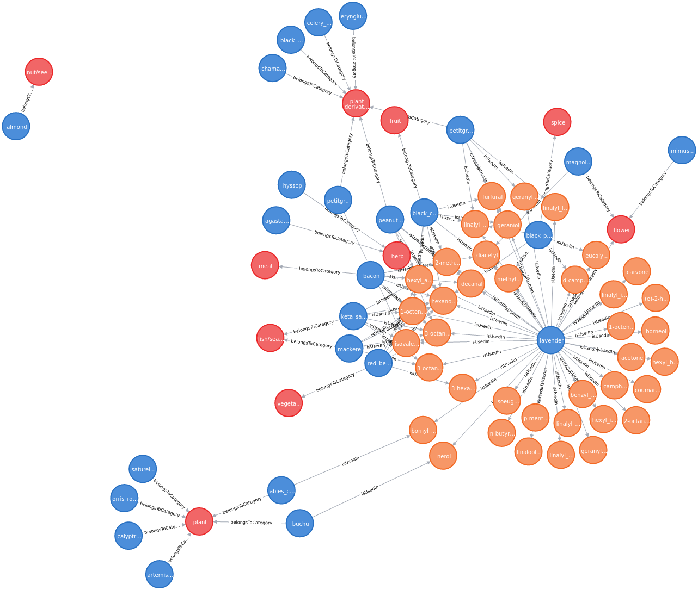
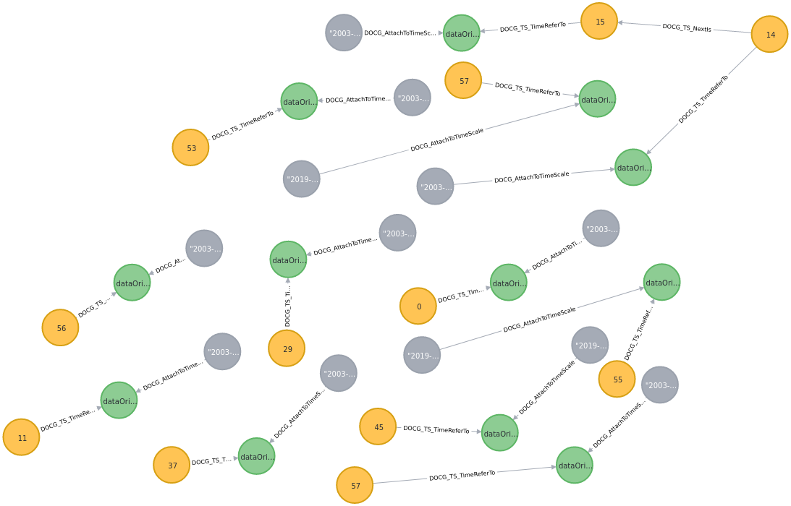
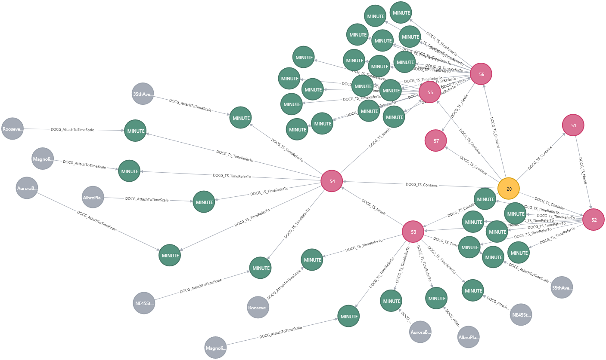
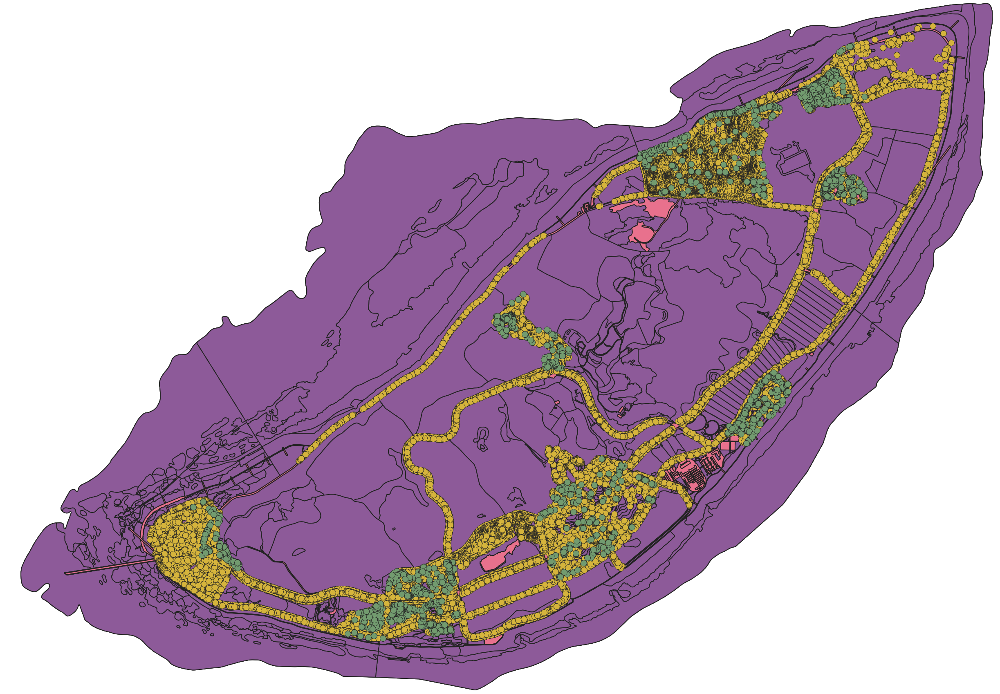
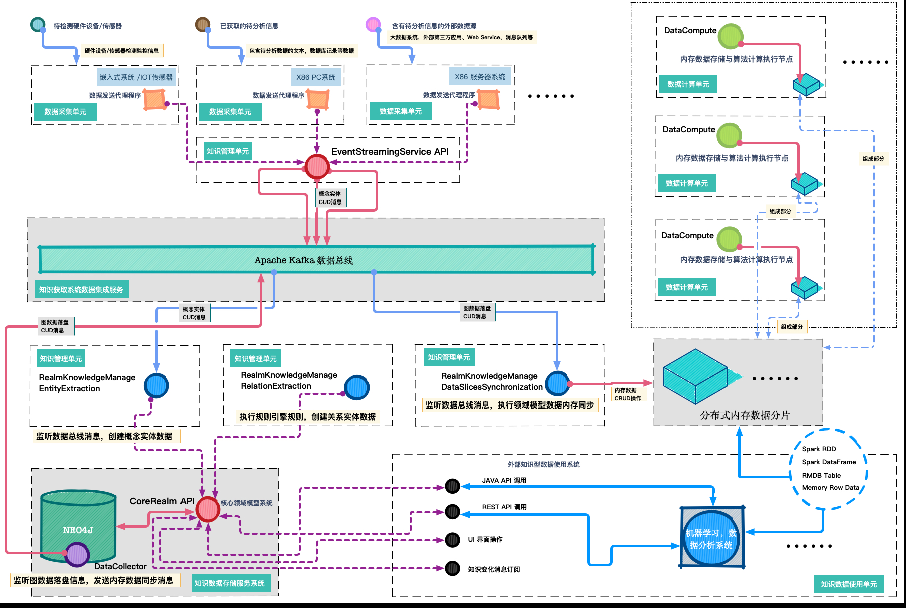

###### Data Ocean & Cloud Graph  数海云图

***
# <span style="color:#CE0000;"> DOCG Platform  </span>数据分析平台开发指南

#### ➜ 概述 

DOCG 数据分析平台是以DDD领域驱动设计，图数据分析以及内存实时计算技术为核心的数据分析工具集。它能够以易于理解的面向业务的视角综合利用关联关系分析，时间分析，平面地理空间（GIS）分析等能力执行高度复杂的数据分析工作。

#### ➜ 概念术语 - Term 

DOCG 数据分析平台的业务模型使用以下的术语来描述实现一个业务领域模型所需要的各种对象的概念。通过组合使用这些对象的功能，可以实现针对特定领域模型的全部数据管理与分析相关的业务需求。

**概念类型**（*ConceptionKind*）：表示特定领域模型中能够包含的任意真实或逻辑概念的类型表达。包含该类型的对象中能够包含的所有属性视图类型以及该类型的对象上能够执行的关系附着规则类型定义。

**概念实体**（*ConceptionEntity*）：概念实体是一个特定概念类型的真实数据表达，表示一个真实世界中存在的客观事物或一个逻辑概念中存在的虚拟事物。

**属性类型**（*AttributeKind*）：表示一个概念类型中包含的一项数据信息的基本结构。属性类型包含该项属性的名称，描述以及属性的数据类型。

**属性视图类型**（*AttributesViewKind*）：属性视图类型是包含若干属性类型的视图容器，在一个属性视图类型中可以包含多个属性类型。属性视图类型与概念类型直接关联，描述一个概念类型中包含的某一个特定类别的属性信息集合。

**关系类型**（*RelationKind*）: 关系类型描述概念实体之间的一种特定的关联方式，例如两个实体对象在空间上的包含关系，或者两个实体对象在逻辑上的依赖关系。

**关系实体**（*RelationEntity*）: 关系实体是一个特定关系类型的真实数据表达，它表示特定领域模型中两个概念实体之间的一个客观关联。

**关系附着规则类型**（*RelationAttachKind*）：表示将两种特定概念类型的实体数据相互关联的具体执行规则。

**分类**（*Classification*）：代表一类客观存在的，不依赖具体的业务和分析目标而变化的字典类概念，例如性别,人种，建筑类型分类等。它普遍性的与特定领域模型中的各种概念类型的实体对象产生交互，是在领域模型中进行多维数据分析的一个重要目标。

**时间流**（*TimeFlow*）：实体化的表示一段连续的时间。时间流上包含一系列的各种颗粒度的时间刻度实体，通过时间流可以使用多种方式创建，遍历，获取时间刻度实体。时间流是在领域模型中进行时域分析的重要方式。

**时间刻度实体**（*TimeScaleEntity*）：是一种特殊的概念实体，每一个时间刻度实体代表一个固定的时间点，例如一个特定的年份或者分钟。一系列连续的时间刻度实体相互关联，构成时间流的一个片段。通过时间刻度事件，一个时间刻度实体可以与任意数量的概念实体关联，表述时域分析所需的时间相关信息。

**时间刻度事件**（*TimeScaleEvent*）：代表一个常规概念实体在特定时刻上的与时间相关的事件。一个常规概念实体通过一个唯一的时间刻度事件与一个特定的表述该时间点的时间刻度实体相关联，来表述概念实体在特定时间点上的业务信息。

**地理空间区域**（*GeospatialRegion*）：实体化的表示一个地理空间的区域范围。地理空间区域中包含一系列的各种颗粒度的代表不同级别行政区划的地理空间刻度实体，通过地理空间区域可以使用多种方式创建，遍历，获取地理空间刻度实体。地理空间区域是在领域模型中进行空间分析的重要方式。

**地理空间刻度实体**（*GeospatialScaleEntity*）：是一种特殊的概念实体，每一个地理空间刻度实体代表一个特定的行政区划，例如一个特定的国家或者街道社区。一系列连续的地理空间刻度实体相互关联，构成地理空间区域的一个组中部分。通过地理空间刻度事件，一个地理空间刻度实体可以与任意数量的概念实体关联，表述空间分析所需的地理位置相关信息。

**地理空间刻度事件**（*GeospatialScaleEvent*）：代表一个常规概念实体在特定地理位置上的与空间相关的事件。一个常规概念实体通过一个唯一的地理空间刻度事件与一个特定的表述该地理位置所属行政区划的地理空间刻度实体相关联，来表述概念实体在特定地理位置上的业务信息。

各个术语代表的对象间的基本交互关系说明如下：


​	1. 一个概念类型（*ConceptionKind*）可以和不限数量的属性视图类型（*AttributesViewKind*）相关联，这些关联定义了一个概念类型中所能表述的所有不同业务类型的属性的集合。

​	2. 一个属性视图类型（*AttributesViewKind*）可以和不限数量的属性类型（*AttributeKind*）相关联，这些关联定义了一个属性视图类型中能够包含的所有属性的详细定义。

​	3. 针对一个概念类型（*ConceptionKind*）能够创建不限数量的概念实体（*ConceptionEntity*）。这些概念实体中包含的数据种类严格遵循 概念类型中的定义。表示真实世界中的一个特定类型的事物的数字化镜像。

​	4. 根据所属的概念类型中关联的属性视图类型（*AttributesViewKind*），一个概念实体（*ConceptionEntity*）中包含相应数量的属性（*AttributeKind*）。

​	5. 根据所属的属性视图类型，一个属性视图（*AttributesViewKind*）中包含相应数量的属性值（*AttributeKind*）。

​	6. 使用关系类型（*RelationKind*）来描述业务领域模型中需要表述的概念实体之间的各种不同性质、不同类型的抽象关联关系的定义。在一个领域模型中可以定义不限数量的关系类型来描述各类实体间的复杂抽象关系。使用关系实体（*RelationEntity*）来表达领域模型中真实存在的实体对象之间的实际关系。在一个领域模型中可以包含任意数量的关系实体。每一个关系实体都必须属于一个特定的关系类型。每一个关系实体都具有方向，必须指向一个源概念实体和一个目标概念实体。

​	7. 在业务领域模型中可以为任意两个指定的概念类型（*ConceptionKind*）指定一个特定的关系类型（*RelationKind*）。从而能够在创建概念实体（*ConceptionEntity*）时自动的创建该关系类型的关系实体。通过访问任何概念实体（*ConceptionEntity*）均可获取到与其相关联的所有关系实体（*RelationEntity*），进而获取到通过该关系实体与其相关的另一个领域模型中的概念实体。

​	8. 通过使用分类（*Classification*）这一概念来表述业务领域模型中需要进行全局分析的各类业务维度（例如时间，空间等）。在一个领域模型中可以定义任意数量的分类。领域模型中的所有概念类型（*ConceptionKind*）、概念实体（*ConceptionEntity*）、关系类型（*RelationKind*）、属性视图类型（*AttributesViewKind*）和*属性类型*（*AttributeKind*）均可使用任何关系类型与这些分类建立关联关系。

#### ➜ 领域模型数据处理工具

###### *领域模型数据存储 SDK*

 DOCG 数据分析平台的 docg_coreRealm 模块的 ***CoreRealm SDK*** 提供 OLTP 类数据操作功能所需的各类API。该SDK结合使用DDD领域驱动设计的业务模型描述方法与DOCG平台的概念术语构建了统一的基于领域模型概念的数据操作模型，将所有的数据透明的存储在后端的图数据库中。该SDK使用 Java 技术开发，详细技术说明请参考文档 Documentation\coreRealm\Java SDK API.md 。

###### *领域模型数据计算 SDK*

DOCG 数据分析平台的 docg_dataCompute 模块的 ***DataCompute SDK*** 提供基于实时内存查询技术的高速数据缓存操作所需的各类API。该SDK结合使用DataSlice数据切片概念与DOCG平台的概念术语构建了统一的基于领域模型概念的数据缓存操作模型，将所有的数据透明的存储在后端的分布式内存存储节点集群中。该SDK使用 Java 技术开发，详细技术说明请参考文档 Documentation\dataCompute\Java SDK API.md 。

###### *领域模型数据关联 SDK*

DOCG 数据分析平台的 docg_realmKnowledgeManage 模块提供基于图数据库、Kafka消息队列与规则引擎技术的自动化业务数据自动关联功能。该模块使用知识管理的概念来分项实现复杂业务数据的关联关系管理操作。详细技术说明请参考文档 Documentation\realmKnowledgeManage\usageGuide.md 。

#### ➜ 领域模型数据分析工具

DOCG 数据分析平台具有 OLTP 类联机事务处理与 OLAP 类联机数据分析双重能力。使用中可以通过 docg_coreRealm 模块的 ***CoreRealm SDK*** 执行与实时业务处理相关的数据操作，产生的各类数据变更会存储在底层的图数据库集群中，并根据分析需求动态的同步到由 docg_dataCompute 模块提供的待分析数据分布式缓存中。之后在OLAP类数据分析场景中，可以联合使用  docg_dataCompute 模块的 ***DataCompute SDK***   ，docg_coreRealm 模块的 ***CoreRealm SDK*** 和  docg_analysisProvider 模块的 ***DataAnalysis SDK***  执行基于 Spark，实时内存与领域模型技术的 图计算，平面地理空间分析，时间轴分析，机器学习分析与常规的业务数据查询分析。

各个不同模块在数据分析场景的作用与交互关系说明如下：


###### *领域模型数据分析 SDK*

DOCG 数据分析平台的 docg_analysisProvider 模块提供基于领域模型概念的图数据分析，平面地理空间分析，时间轴分析，机器学习分析与常规的业务数据查询分析等功能。详细技术说明请参考文档 Documentation\dataAnalysis\usageGuide.md 。


#### ➜  Demo 领域模型创建

DOCG 数据分析平台的 docg_realmExample 模块中包含若干内置的模拟领域模型数据集。通过执行Demo领域模型创建程序， 可以生成对应的领域模型定义与实体对象。

###### ↳ Chemical Products Realm

小型领域模型，包含概念实体 ***Compound***  （数量1107个），  ***Ingredient*** （数量1530），关系实体 ***isUsedIn***  （数量36781个），***belongsToCategory*** （数量1530个）。

领域概念类型关联关系示例：



创建程序：

```java
com.viewfunction.docg.realmExample.generator.ChemicalProducts_Realm_Generator
```

###### ↳ Underground Pipeline Network Realm

小型领域模型，包含概念实体 ***PipePoint***  （数量9696个），  ***PipeTubulation*** （数量9281个），关系实体 ***connectTo*** （数量17044个）。

领域概念类型关联关系示例：

创建程序：

```java
com.viewfunction.docg.realmExample.generator.UndergroundPipelineNetwork_Realm_Generator
```

###### ↳ Song Playlists Realm

中型领域模型包含概念实体 ***Song***（数量9775个） ， ***MusicTag***（数量250个）  ，***Playlist***（数量188064个），关系实体 ***playedInList*** （数量1790143个）， ***belongsToMusicType***（数量149041个）。

领域概念类型关联关系示例：

创建程序：

```java
com.viewfunction.docg.realmExample.generator.SongPlaylists_Realm_Generator
```

###### ↳ Seattle RealTime Fire 911 Calls Realm

中型领域模型,包含概念实体 ***Fire911Call***（数量 1471980个） ，时间刻度事件实体 ***occurredAt*** （数量 1471980个）。

领域概念类型关联关系示例：

创建程序：

```java
com.viewfunction.docg.realmExample.generator.SeattleRealTimeFire911Calls_Realm_Generator
```

###### ↳ Road Weather Information Stations Records Realm

中型领域模型,包含概念实体 ***RoadWeatherRecords***（数量 1790049个） ， 时间刻度事件实体 ***recordedAt*** （数量1790049个）。

领域概念类型关联关系示例：

创建程序：

```java
com.viewfunction.docg.realmExample.generator.RoadWeatherInformationStationsRecords_Realm_Generator
```

###### ↳ Island GeoSpatial Data Realm

中型领域模型,包含GIS地理空间类概念实体 ***IndividualTree*** ，***Frutex*** ，***FunctionalZone*** ，***SectionBlock*** ，***Road*** ，***Building*** ，***ConstructionLand*** 。该领域中的数据描述了一个小型岛屿的设施与植被数据，所有概念实体均可进行地理空间类型的数据分析计算。

领域概念类型关联关系示例：

创建程序：

```java
com.viewfunction.docg.realmExample.generator.Island_GeoData_Realm_Generator
```

#### 

#### ➜ 平台架构组件

###### *系统架构图*

