###### Data Ocean & Cloud Graph  数海云图

***

#  DOCG   数据智能平台：本体驱动的认知智能系统

##### ◎ 摘要 

> *DOGG 数据智能平台是一个以本体论（Ontology）为核心的智能数据分析与 AI 算法平台。它通过构建统一的、可扩展的领域本体模型，将多源异构数据融合为一个语义一致的动态知识网络。平台以图数据库为底层存储，结合实时内存计算、时空一体化分析与图算法，支持从微观实体到宏观系统的全维度认知与推理。在此基础上，DOGG 平台基于 LLM（大语言模型） 与 GraphRAG（基于图的检索增强生成）技术，构建了 “本体->知识图谱->生成式推理” 的智能分析链路。实现了可解释、可溯源、高精度的知识检索与生成推理。通过将符号化的本体表示与神经化的语言生成能力深度融合，并引入 LLM 的 Function Calling 能力，DOGG 数据智能平台实现了从 “数据驱动” 向 “知识驱动与认知智能” 的迈进。*

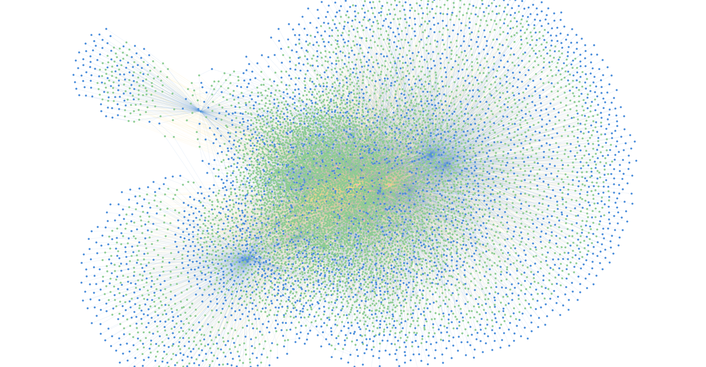

##  §  一、平台概述

DOCG 数据智能平台是一个以**领域本体模型（Ontology）** 为核心构建的新一代智能数据分析与AI算法平台。它彻底突破了传统数据平台以表、列、文档为基本单位的组织方式，转而通过构建统一、可扩展、可演化的领域本体模型，将多源异构数据融合为一个语义一致、动态生长的知识网络。平台以图数据库为底层存储与计算引擎，结合实时内存计算、时空一体化分析、图算法挖掘与 LLM（大语言模型）推理能力，支持从微观实体到宏观系统的全维度认知、分析与推理。

通过将数据融合为一个语义一致的动态知识图谱的方式，DOCG平台提供远超传统关系型信息系统的关联分析与认知推理能力。平台能够将各种来源的业务数据整合到同一个语义网络中，并通过 **时间**、**空间**、**关联关系** 等维度，以面向业务的视角，综合利用图算法、时空分析、GIS 技术与 AI 能力执行高度复杂的数据分析，发现隐含知识。平台将 LLM 作为认知入口与操作代理，使用户能够以自然语言对话的方式，直接调用平台内置的分析功能。

在技术架构上，DOCG平台构建了 “**本体 -> 知识图谱 -> 生成式推理**” 的智能分析链路，深度融合 **GraphRAG（基于图的检索增强生成）** 技术与 LLM 的 **Function Calling** 能力。与传统RAG系统不同，DOCG不是简单地做向量相似度检索，而是以知识图谱作为检索与推理的核心媒介，实现了可解释、可溯源、高精度的知识检索与推理生成。通过将符号化的本体表达与神经化的语言生成能力深度融合，DOCG平台完成了从“数据驱动”向“知识驱动与认知智能”的关键跃迁。

以下是 DOCG 数据分析平台的独特功能：

- 以本体论为核心的 领域模型构建（LLM 辅助本体工程）

- 数字孪生的 领域知识图谱 + GraphRAG 可解释检索增强生成

- 针对任何领域数据对象的 关联性数据分析（图算法 + LLM 语义解读）

- 针对任何领域数据对象的 时空一体化分析（自然语言驱动的时空查询）

- 通过 实时内存计算 与 LLM Function Calling 实现智能代理调度，与主流大数据、机器学习、人工智能系统无缝集成
  

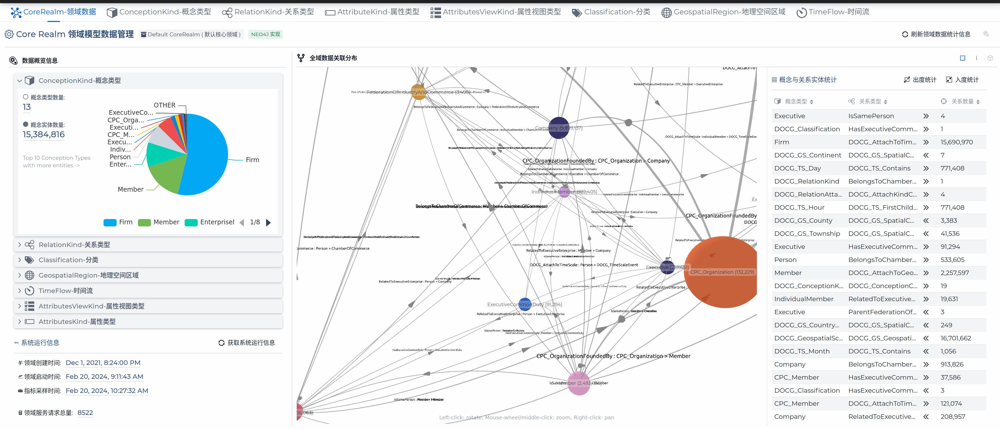

DOCG 数据智能平台核心功能操作界面

## §  二、核心理念与技术架构

### 1. 本体驱动的数据整合：从信息孤岛到语义统一

DOCG 数据智能平台是一个 **多源异构信息的存储，融合，访问，分析以及操作的 IT 数据处理系统。使用统一的数据表达与管理手段，将各类不同信息系统中的数据组织，融合在一起。**它提供了概念统一并且富有灵活性的建模能力，能够描述各种不同类型的外部数据源的技术与业务信息，并通过更高层的建模描述将这些信息对应的数据资源统合在一个本体化的业务场景中使用。此外它还提供统一的多元异构数据的获取与操作能力，能够将获取各类不同数据存储系统中业务数据的技术复杂性屏蔽，使用户只需要从本体业务领域模型的角度考虑业务应用问题，而无需关注具体的数据存取的技术细节。

在传统数据系统中，不同业务系统之间的数据往往存在严重的语义异构问题：同一现实对象在不同系统中可能有不同的命名、结构、粒度甚至矛盾的含义。DOCG平台通过支持多态的本体建模从根本上解决了这一问题。在 DOGG 平台中，现实世界的业务实体、事件、关系与属性被抽象为本体模型中的 **概念类型**、**关系类型** 与 **属性类型**。每一类本体都是平台理解世界的“语言”。通过本体建模，平台能够在不同业务系统之间建立语义映射，消除信息孤岛，实现数据的 **语义统一** 与 **逻辑融合**。为了支持本体的高效构建与演化，DOGG 平台集成了 **大语言模型（LLM）辅助的本体工程能力**。用户可以使用自然语言描述业务需求，LLM 自动抽取出候选的概念类型、关系类型与属性类型，并建议其之间的层次结构与约束规则。平台还可以基于已有数据实例，利用 LLM 进行 **半自动的本体补全与对齐**，显著降低本体建模的专业门槛与人工成本。

为了实现 **本体建模（Ontology Modeling）**这一核心功能，DOCG 数据智能平台通过使用一套本体化领域模型概念体系来使用统一的逻辑和术语兼容表述各类行业场景的所有不同业务信息，进而实现其 **抽象定义**，**真实映射** 和 **孪生分析** 的核心数据建模与处理能力。为支持本体的高效构建与演化，DOCG 平台集成了 **LLM 辅助的本体工程能力**：

- 用户可以使用自然语言描述业务需求，如“我们需要管理建筑工地、运输车辆、危险品及其运输路径”。

- LLM 自动抽取出候选的概念类型、关系类型与属性类型，并建议其之间的层次结构与约束规则。

- 平台还可以基于已有数据实例，利用 LLM 进行半自动的本体补全与对齐，显著降低本体建模的专业门槛与人工成本。
  

**DOCG本体核心概念体系：**

以下是该体系的主要术语，通过组合使用这些术语代表的能力可以实现任意业务场景所需要本体领域模型的全部对象与概念。

**概念类型**（*ConceptionKind*）：特定领域模型中能够包含的任意真实或逻辑概念的类型表达，如“建筑工地”，“危险品运输车辆”，“加油站”。

**概念实体**（*ConceptionEntity*）：一个特定概念类型的真实数据表达，如“海淀区A建筑工地”。

**属性类型**（*AttributeKind*）：概念类型中包含的一项数据信息的基本结构，如“建筑工地的开工日期”。

**属性视图类型**（*AttributesViewKind*）：属性视图类型是包含若干属性类型的视图容器，描述一个概念类型中包含的某一个特定类别的属性信息集合，便于复杂对象的语义分组。

**关系类型**（*RelationKind*）: 概念实体之间的一种特定的关联方式，如“位于”“运输至”“关联企业”。

**关系实体**（*RelationEntity*）: 一个特定关系类型的真实数据表达，表示特定领域模型中两个概念实体之间的一个客观关联。

**分类**（*Classification*）：代表一类客观存在的，不依赖具体的业务和分析目标而变化的字典类概念，如“危险品等级”。

**时间刻度实体**（*TimeScaleEntity*）：一种特殊的概念实体，每一个时间刻度实体代表一个固定的时间点。

**时间刻度事件**（*TimeScaleEvent*）：代表一个常规概念实体在特定时刻上的与时间相关的事件。

**地理空间刻度实体**（*GeospatialScaleEntity*）：是一种特殊的概念实体，每一个地理空间刻度实体代表一个特定的行政区划。

**地理空间刻度事件**（*GeospatialScaleEvent*）：代表一个常规概念实体在特定地理位置上的与空间相关的事件。

本体领域概念交互逻辑

### 2. 知识图谱：本体的实例化表达

DOCG 数据智能平台旨在对领域模型本体中的概念类型定义、概念实体管理、关系类型定义与关系实体管理、数据服务和数据相关配置等各方面进行综合、统一的应用管理。实现有效的统一管理之后，就可以对这些海量业务领域数据进行孪生分析，既在数据层面上通过在各种不同的概念实体之间建立关联关系来再现真实世界中复杂的业务关联，进而对数据进行有效率有针对性的分析与操作。

本体是数据的“骨架”，知识图谱是“血肉”。DOCG 平台使用图数据库提供复杂关联数据的存储与分析技术，将本体模型实例化为领域知识图谱。

在图谱中：

- **概念实体（ConceptionEntity）** 对应图中的 **节点**，代表现实世界中的对象（人、地点、设备、事件）。
- **关系实体（RelationEntity）** 对应图中的 **边**，代表对象之间的语义连接（属于、相邻、导致、运输）。

通过这种本体驱动的图结构，平台能够自然地表达 **时间关系、空间关系、社会关系、组织关系** 等复杂语义，并支持 **数字孪生** 式的业务再现。

在知识图谱的构建过程中，LLM 被广泛用于 **实体识别、关系抽取与事件检测**。平台可以接收非结构化文本（如工作报告、新闻、日志），利用 LLM 从中抽取出符合本体定义的实体与关系，并自动关联到已有的知识图谱中。对于结构化数据（如数据库表），LLM 能够理解字段语义并建议其与本体的映射方式，从而实现**从文本到知识** 的自动转化。此外使用图数据库技术实现的 DOCG 数据智能平台具有以下两个独特的技术优点：

1. 通过使用基于图数据库的实现方式，可以消除关系模型在大规模数据集合和复杂数据类型及关联关系的应用场景下所无法解决的 **实现工程复杂性** 方面的问题。

2. 基于图数据模型的特点以及图论算法的支持，对多维度条件下的关联信息查找和发现提供了比传统关系模型 **更加强大的功能和性能支持**。

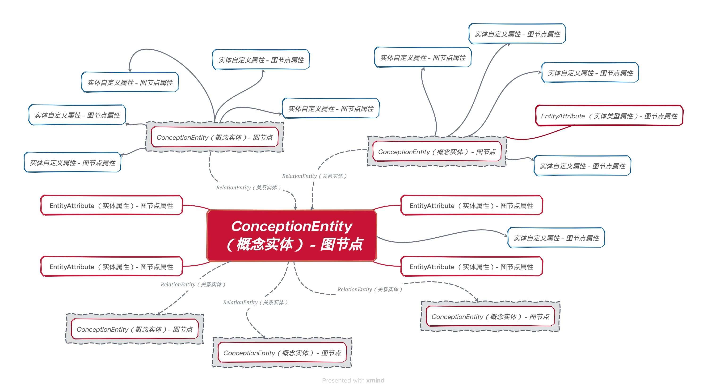

图数据结构实现本体领域模型实体

### 3. 本体的演化与跨领域融合

DOCG 数据智能平台通过使用本体领域模型建模创建的数据网络，天然就是一个面向特定业务目标的行业领域知识图谱。使用者能够以面向业务描述的理解方式，根据真实场景以数字镜像（数字孪生）的方式简洁、透明的定义出能够真实反映实际业务的领域知识图谱。数据世界不是静止的，业务需求也在不断变化。DOCG 数据智能平台支持本体的 **持续演化**：新的概念、关系、属性可以在不影响已有分析任务的前提下动态加入。更重要的是，多个独立的小型领域知识图谱（如“城市交通图谱”，“环境监测图谱”，“应急资源图谱”）可以通过**本体对齐与映射**，融合为大型跨领域知识图谱。这种融合不是简单拼接，而是基于本体语义的一致性合并：

- 相同的概念类型自动合并（如两个图谱中的“车辆”概念统一）。
- 关系类型经过语义映射后贯通（如“途径”与“经过”对齐）。
- 实体之间建立跨图谱的链接。

通过持续不断地在不同领域定义并完善相关的领域知识图谱，并将这些图谱按真实世界的逻辑融合起来，DOCG 平台最终能够构建出一个能够 **持续自我成长、自我完善、自我演化** 的大型跨领域知识图谱，并不断产生新的深层知识。

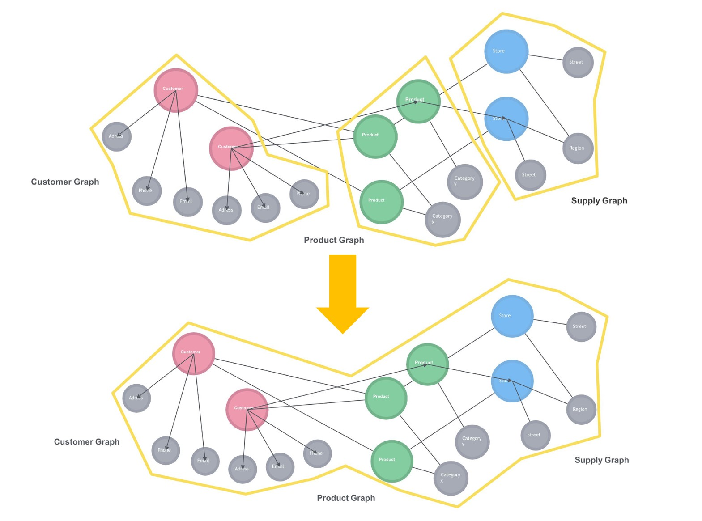

独立小型领域知识图谱无缝融合构成大型跨领域知识图谱

## §  三、GraphRAG：图增强的检索与生成

### 1. 传统 RAG 的局限性

传统的检索增强生成系统通常采用“向量检索 + LLM ”的模式：将文档切块后向量化，用户问题也向量化，通过相似度搜索召回相关文本块，再交由 LLM 生成回答。这种方法存在几个根本性问题：
- **语义结构丢失**：实体之间的复杂关系（如A位于B、B隶属于C、C与D存在上下游关系）在向量检索中被扁平化。
- **长程依赖缺失**：跨多个文档、多跳关系的知识难以被有效召回。
- **不可解释**：用户无法知道召回的依据是什么，生成结果难以溯源。

### 2. GraphRAG 工作流

GraphRAG 利用知识图谱的图结构来捕捉实体间的多跳关系与全局上下文，并基于分片社区摘要进行查询召回。其优点是能有效处理需要跨信息源融合的复杂、聚合性问题，显著提升答案的全面性和连贯性，同时缓解传统 RAG 中长文本切断和上下文丢失的问题。

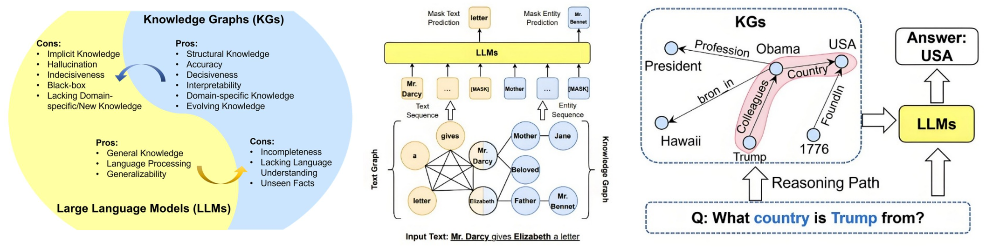

GraphRAG 技术优势与特点

DOCG 数据智能平台引入的 GraphRAG 技术将已经构建完成的本体领域知识图谱作为检索与推理的核心媒介，完整工作流包括四个阶段：

**第一步：查询理解**
LLM 将用户的自然语言问题解析为一个或多个图谱查询片段，包括：

- 起点实体类型或具体实体（如“危险品运输车辆”）
- 目标关系类型（如“经过”“运输”“停放”）
- 路径长度与约束（如“路径长度不超过3跳”“时间在2024年以内”）
- 聚合与排序要求（如“找出出现次数最多的加油站”）

**第二步：图检索**
平台在知识图谱上执行语义路径搜索，返回与问题最相关的**子图**，而非简单的文本片段。支持的检索模式包括：
- 邻居扩展（从种子节点出发检索1~N跳邻居）
- 路径查找（查找两个实体之间的连通路径）
- 子图匹配（查找符合特定拓扑结构的子图）
- 时序与空间约束检索（如“2024年6月以后”，“海淀区范围内”）

**第三步：上下文注入**
检索到的子图被序列化为结构化文本，常见序列化方式包括：

- 三元组列表（(实体1, 关系, 实体2)）
- JSON-LD 格式
- 自然语言描述（如“车辆V001经过了检查点P002，该检查点位于海淀路与中关村大街交叉口”）
序列化后的子图连同原始问题一起提交给 LLM。

**第四步：生成推理**
LLM 基于子图提供的精确语义关系与事实，生成可解释、可回溯的回答或推理结论。用户不仅可以得到答案，还可以查看模型输出结论所依赖的具体路径。

### 3. GraphRAG 的独特优势

GraphRAG 的优势在于，每一个生成结果都可以**追溯到具体的实体与关系**，用户可以查看是哪一条路径、哪一个节点支持了模型的结论。这极大提升了在高风险决策场景中对 AI 输出的信任度：

- **可解释性**：每一个生成结果都可以追溯到具体的实体与关系，满足高风险决策场景（如应急指挥、金融风控）中对 AI 输出的审计与信任需求。

- **高精度**：避免了向量检索中的语义漂移问题，尤其在多跳推理任务上精度显著提升。

- **动态更新**：知识图谱可以实时更新，GraphRAG 立即感知，无需重新索引。

  

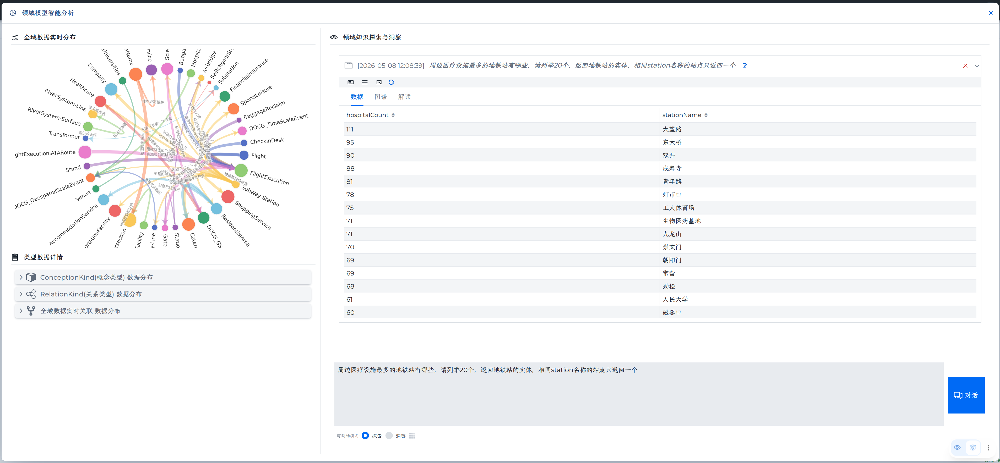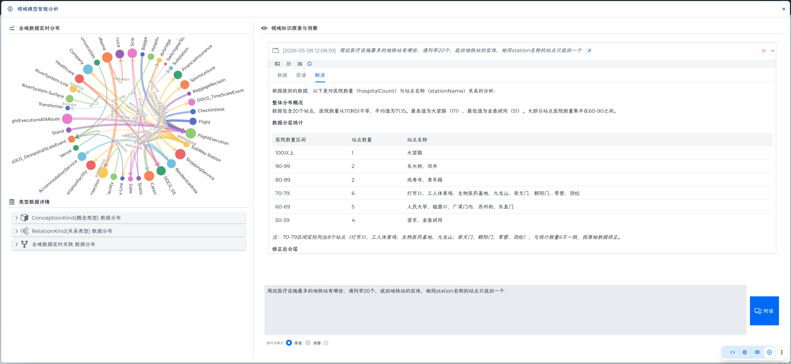

自然语言数据检索 与 GraphRAG LLM内容智能解读 示例

## §  四、时空一体化分析：时间与空间作为一等实体
时间与空间要素是在数字孪生场景下实现多源数据融合的有效手段。***时间，空间和常规属性是任意场景中业务数据本身固有的三种基本要素，是反映业务数据实体的状态和演变过程的重要组成部分***。尽管不同来源的数据使用的表达形式和技术实现方式各不相同，但在语义上是相同的。在知识图谱中通过使用时间和空间要素做为桥梁，可以将各种不同来源的数据有效的融合在一起。

### 1. 时空建模的独特设计
在许多数据平台中，时间和空间仅仅是属性字段（如“create_time”，“longitude/latitude”）。而在DOCG 数据智能平台的本体模型中，**时间与空间不再是从属属性，而是一等实体**：

- **时间** 被建模为 **时间刻度实体**，每一个时间刻度实体代表一个固定的时间点（如“2024-06-01 14:30:00”），所有时间刻度实体沿时间轴排列，形成统一的、可比较的时间轴网络。
- **空间** 被建模为 **地理空间刻度实体**，每一个实体代表一个特定的行政区划、网格单元或兴趣区域（如“海淀区”，“中关村街道”，“500米缓冲区”），形成层次化的地理空间网络。
- 任何业务实体都可以通过 **时间事件** 与 **空间事件** 和本体中的时空维度建立语义关联。例如：“建筑工地A”与“2024-06-01”之间通过“开工”时间事件关联；“危险品仓库B”与“海淀区”之间通过“位于”空间事件关联。

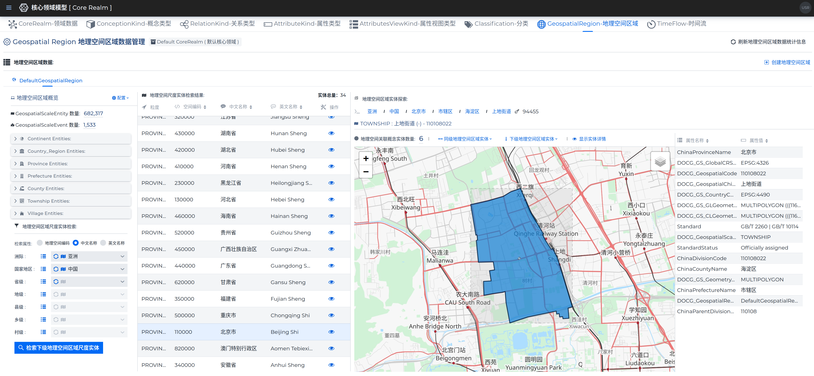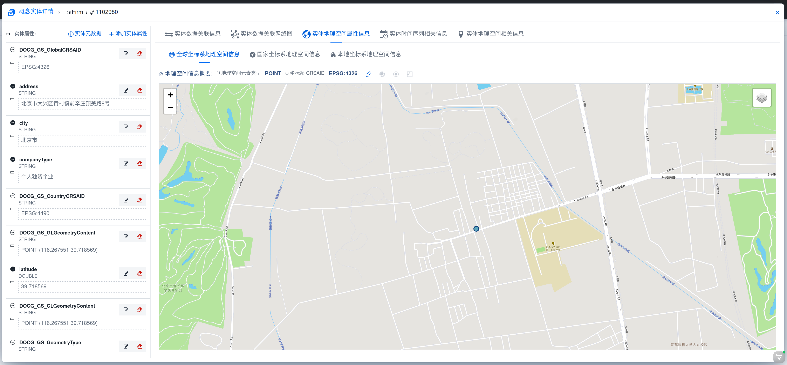

地理空间区域管理 与 概念实体地理空间信息

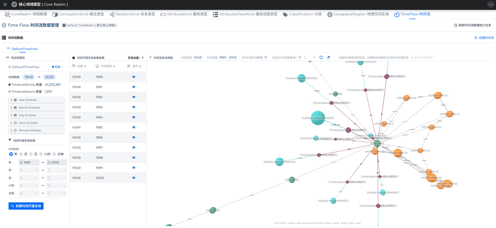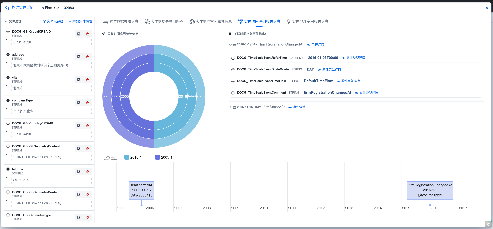

时间流管理功能 与 概念实体时间流事件信息

### 2. 复杂的时空推理能力

通过将不同数据节点中的时间和空间属性标准化并相互关联，能够执行传统上只能由 ArcGIS 类型的地理空间分析软件执行的空间分析计算。并且进一步的能够在这些空间分析算法中集成时间分析和普通的业务分析。进而提供了综合的 **时空一体化分析能力**。这种能力使得DOCG平台天然支持复杂的时空推理任务，例如：

- “2015年海淀区新建建筑周边500米范围内的危险源分析”
- “去年夏天暴雨期间，哪个加油站周边1000米内发生过两次以上交通拥堵？”
- “过去三年中，每年第一季度交通事故高发的路口，其周边2公里内是否有学校或医院？”

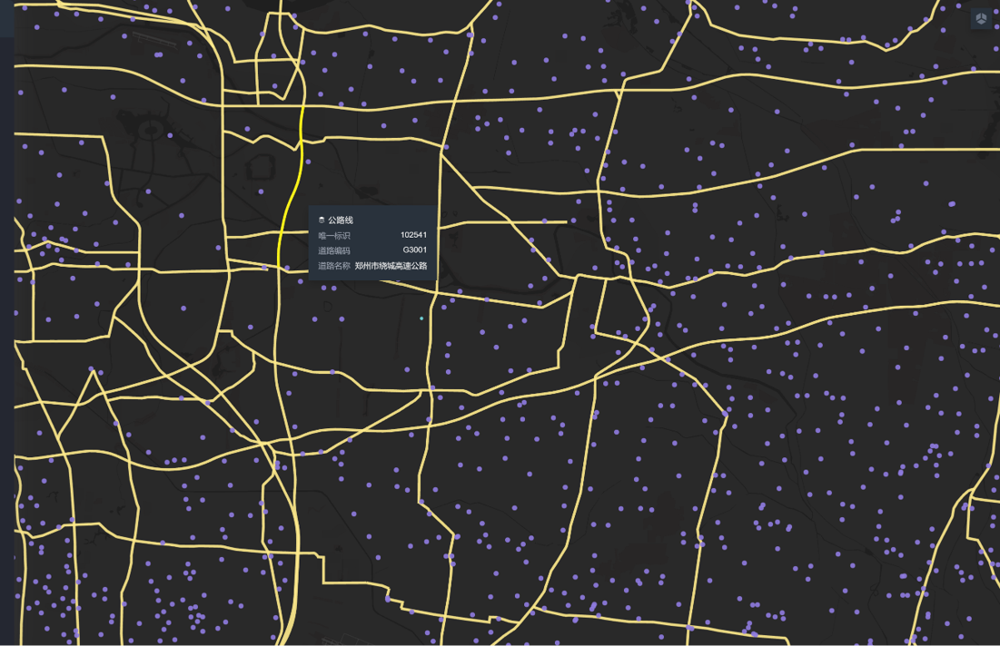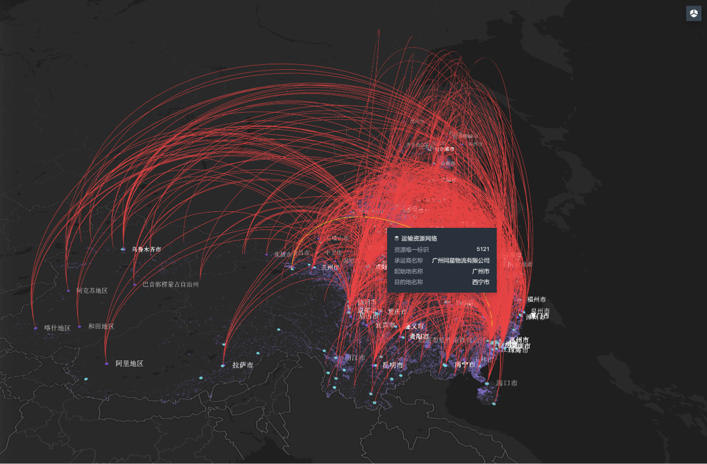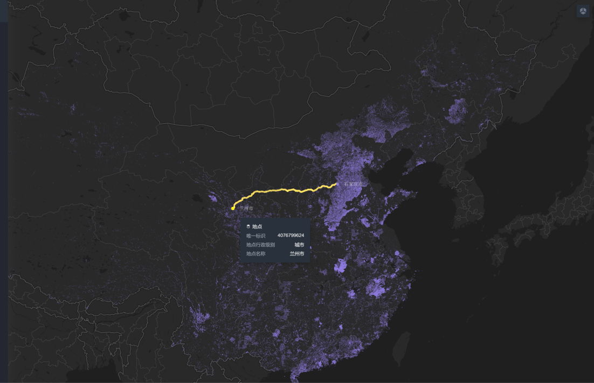

时空一体化分析应用示例

### 3. LLM 驱动的自然语言时空查询

LLM 在时空推理中发挥独特作用：用户可以使用完全自然的语言描述时空查询，无需学习任何查询语法。LLM 自动将其解析为对时间轴节点、空间区域节点与业务事件节点的联合图查询，并在 GraphRAG 框架下完成检索与推理。

例如，用户问：“去年暴雨预警发布后24小时内，哪些建筑工地的运输车辆经过了积水点周边区域？”
LLM 会将其解析为：

- 时间约束：去年、暴雨预警发布后24小时内
- 空间约束：积水点周边区域（需先检索“积水点”实体及其几何边界）
- 业务约束：建筑工地、运输车辆、经过关系
- 图查询：在知识图谱中查找满足上述所有约束的路径

这使得**时空一体化分析的门槛大幅降低**，非专业用户也可以通过对话获得深度洞察。

## §  五、多维度关联分析能力

通过本体定义的语义关系,利用知识图谱提供的技术能力，可以使用数字孪生的方式，自动发现实体之间的直接与间接关联。例如：查找“某供应商”与“某安全事故”之间是否存在三层以内的关联路径。以此方式，DOCG 平台能够通过在不同类型的实体数据间定义各种类型的关联关系映射来完全再现特定业务领域的各个业务环节之间的相互关联，还可以有针对性的完成基于关联关系拓扑的复杂业务分析与展示功能。典型应用包括供应链风险传导分析、关联担保网络挖掘、社交关系溯源等。DOCG 平台支持两种观察粒度的知识图谱分析，分别服务于不同场景的分析目标：

- 微观层面：通过针对单个（或若干个）节点对象的关联关系分析，来发现局部数据中的知识信息，常用领域为EDA（探索性数据分析），推荐引擎（相似性分析），关系查找（最短路径分析，关联性分析等）。

- 宏观层面：使用知识图谱技术，通过对图谱中所有或大量的节点对象和关系对象执行高阶知识图谱分析分析算法（PageRank，Triangle Count，Connected Components，Label Propagation等）来发现数据中整体性，规律性的全局知识。例如基于度分布的中枢节点发现，基于最大连通图的社区发现，基于三角计算的关系衡量，基于随机游走的用户属性传播等。

在 DOCG 数据分析平台中，有丰富的数据分析工具（SDK / API）与操作界面能够用来完成针对上述两种途径的数据分析与展示。

### 1. 微观层面分析

微观层面聚焦于**局部结构**，通常从单个或若干个节点对象出发，分析其关联关系，发现局部数据中的知识信息。

**典型应用领域**：

- **探索性数据分析（EDA）**：从一个实体出发，不断扩展邻域，逐步理解该实体所处的业务上下文。
- **推荐引擎（相似性分析）**：通过“共同邻居”,“相似路径”等指标，推荐与当前实体相似的其它实体。
- **关联性查找**：最短路径分析、间接关联发现、实体验证与溯源。

在 DOCG 平台操作界面中，用户只需右键点击任意概念实体，选择“展开关联”或“路径查找”，即可交互式地执行上述分析，结果以可视化图形式呈现。

例如在面向城市建设与管理类应用的城市数据领域知识图谱中完成如下分析任务：

**关联性查找**

- 示例：分析一个机械装备和一个建设工程项目之间的最短路径关联关系（如装备→所属企业→参与项目→建设工程）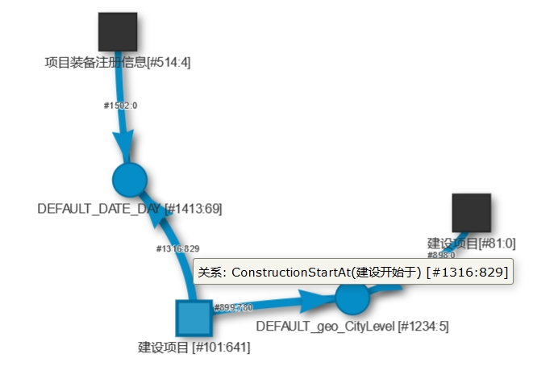

**推荐引擎（相似性分析）**

- 示例：分析和一个建设工程相似的其他数据对象（关联到同一个企事业单位、同一批供应商或同一类许可审批的其他工程项目）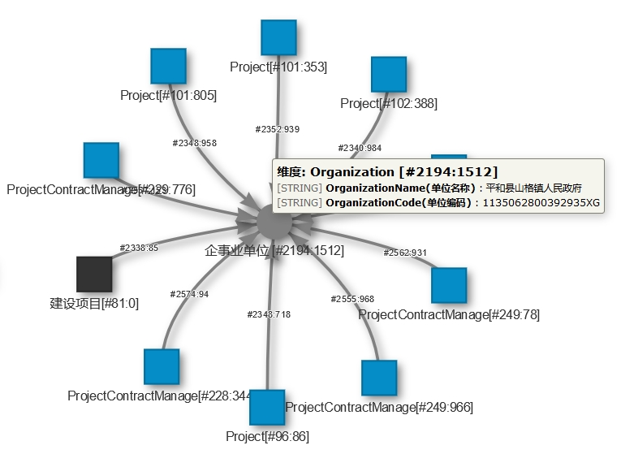

**探索性数据分析（EDA）**

从任意概念实体出发，用户可以动态扩展其语义邻域（1跳、2跳、N跳），观察该实体在知识图谱中的连接模式。支持数据沙箱式的交互分析，用户可以逐步、探索式地发现未知关联。例如，从一个建设工程出发，探索它与建筑公司、监管部门、周边居民区、历史事故记录之间的关联网络。

- 示例：从一个建设工程出发，探索性地分析它与建筑公司、监理单位、周边社区、历史投诉、环境监测点等各类对象之间的关联关系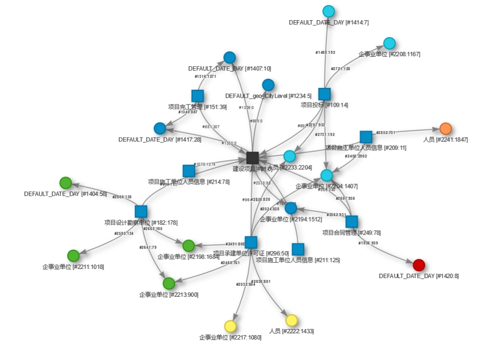

在 DOCG 数据智能平台中，所有的 概念实体（*ConceptionEntity*） 均可以通过关联关系与其他的概念实体相互联接。通过将任意的概念实体作为分析起点，均可以执行面向局部图谱的关联关系分析与可视化展示。以下示例展示了使用 DOCG 数据智能平台操作界面执行微观层面关联关系分析的方法：

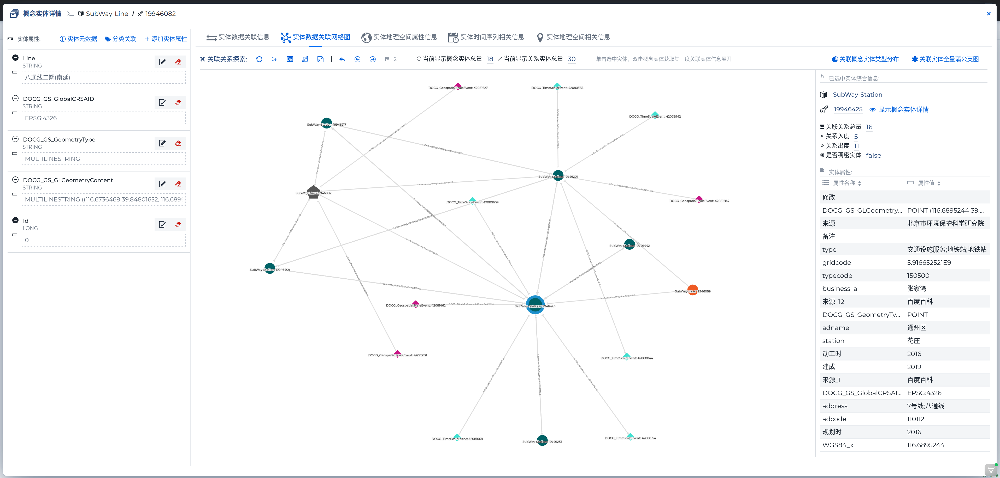

从任意概念实体出发执行知识图谱 EDA 探索性数据分析

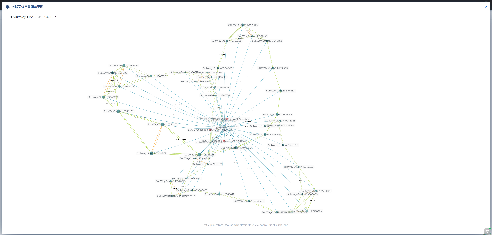

从任意概念实体出发执行知识图谱实体1度关系展开

### 2. 宏观层面分析

宏观层面聚焦于**整体结构**，通过对图谱中所有或大量节点和关系执行高阶图算法，发现数据中的整体性、规律性的全局知识。

**典型应用方向**：

- **中枢节点发现**：基于度分布或中介中心性，找出网络中具有控制力或关键位置的节点。
- **社区发现**：基于最大连通图或 Louvain 算法，识别业务上的稳定群体（如利益团体、兴趣圈子、协同作业群组）。
- **关系强度衡量**：基于三角计数或共现频率，评估关系的紧密程度。
- **属性传播**：基于随机游走或标签传播，将已知属性（如风险等级、用户偏好）传播到未知节点。
- **路径查找**：建立在图搜索算法的基础上,探索节点之间的路径,从一个节点开始,遍历关系,直到到达目的节点，用于识别图中的最优路由。

DOCG 数据智能平台的 DataScienceOperator 工具（位于CoreRealm SDK中）提供了 **可分析图（AnalyzableGraph）** 功能，内置了近40种常用的中心性和社区发现图算法，可在任意概念实体集合上直接调用。

在本体实例化的知识图谱上执行高阶图算法，主要包括：

**路径查找算法**：

- 最短路径（Shortest Path）及其变体A*和Yen算法：找到两个节点之间的最优路径
- 所有结对最短路径（APSP）与单源最短路径（SSSP）
- 最小生成树（MST）：找到连接所有节点的最小成本树结构
- 随机行走（Random Walk）：作为机器学习工作流的预处理/采样步骤

**中心性评估算法**：

- 度中心性：查找图中“流行”的节点（连接数量最多）
- 中介中心性：识别连接图不同部分的关键桥梁节点，常用于交通网络关键路口识别
- 接近中心性与调和中心性：度量节点到所有其他节点的平均距离
- 特征向量中心性：度量节点的传递影响力，连接高分节点的节点得分更高
- PageRank：根据连接数量与源节点重要性综合评估节点重要性

**社区发现算法**：

- Louvain算法：在大型网络中检测层次化社区结构
- 标签传播算法（LPA）：通过节点标签的迭代传播快速识别密集连接群体
- 弱连通子图与强连通子图计算：判断图的整体连通性
- 三角计数算法：计算每个节点参与的三角形数量，用于评估网络稳定性与聚类系数

具体应用示例：

**路径查找 (*Path finding*) **

- 示例：最短路径(*shortest path*)  - 找到两个指定节点之间的最短路径，用于物流计划规划 
  
  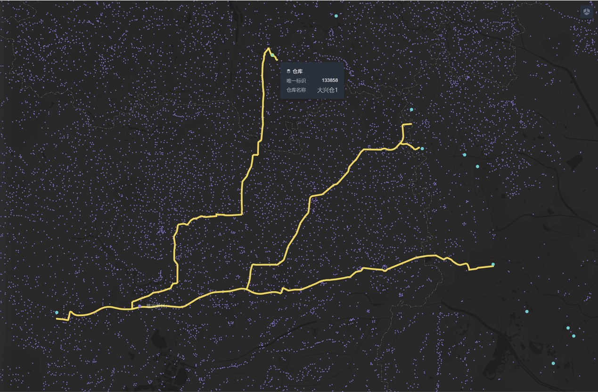
  
- 示例：最小生成树(*Minimum Spanning Tree , MST*) - 找到一个连接树结构,在这个结构中,从指定节点访问所有节点的成本最小，用于识别最短的管道巡检路线

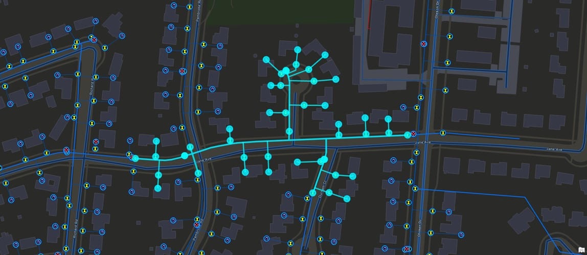

**中心性算法（*Centrality*）**

- 示例：中介中心性算法 - 寻找图的一部分到另一部分的桥梁的节点，用于识别关键交通节点   

  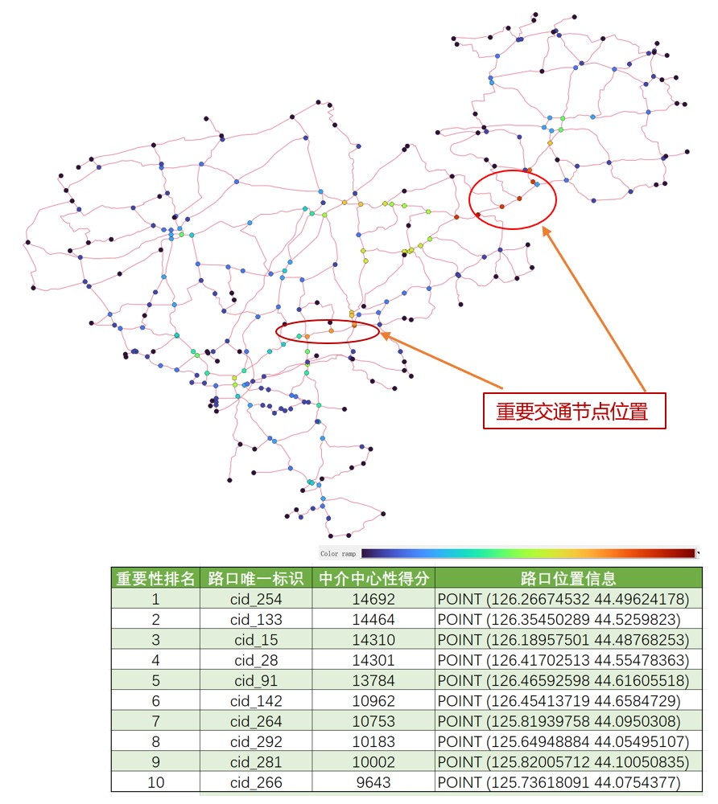

**社区发现算法（*Community Detection*）**

- 示例：Louvain算法 - 评估一个社区内节点的连接密度，用于识别社交网络中的稳定朋友圈 
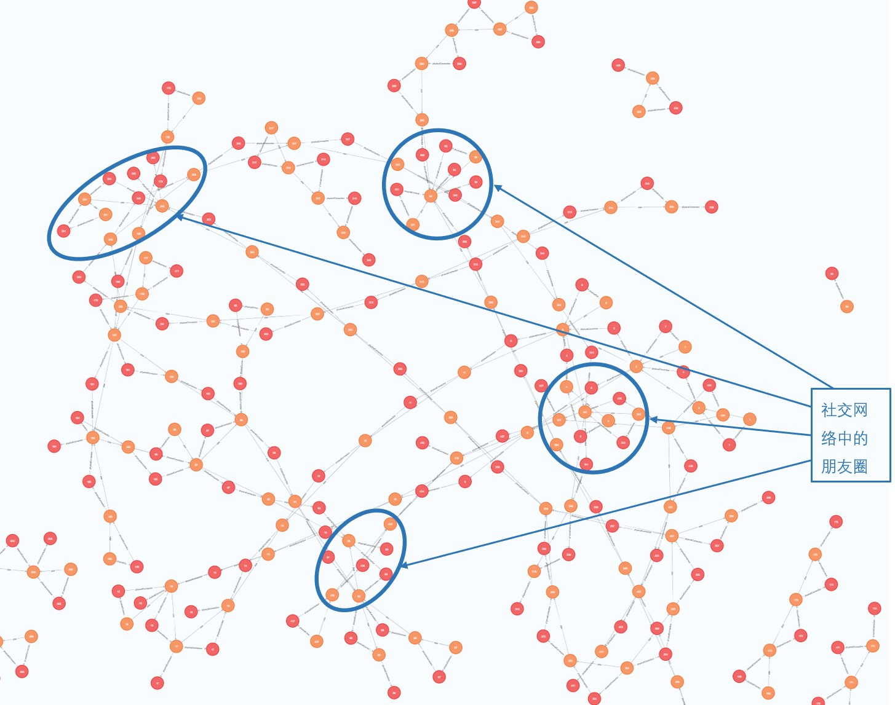

### 3. 图算法 + LLM 高阶语义解读

DOCG 数据智能平台的独特能力之一。平台允许用户将图算法分析结果输出直接接入 LLM，获得自然语言的深度解读，例如：

| 图算法输出               | LLM 解读示例                                                 |
| ------------------------ | ------------------------------------------------------------ |
| 最短路径节点序列         | “推荐的物资运输路线为：起点仓库 → A高速入口 → B服务区 → C出口 → 目的地。其中B服务区周边近期有施工，建议备用路线。” |
| 中介中心性得分前10的节点 | “以下路口为该城市交通网络中的关键桥梁节点：…… 这些路口一旦发生拥堵，将影响全市30%以上的主干道通行。” |
| 社区发现结果（节点分组） | “检测到三个稳定兴趣群体：群体A以户外运动为主，群体B以亲子教育为主，群体C以电子产品评测为主。群体A与群体B在内容消费上存在显著差异。” |
| 度中心性分布             | “该网络呈现典型的长尾分布，头部5%的节点连接了超过60%的边，存在明显的枢纽节点。” |

这种 **图算法 + LLM** 的组合，使得原本需要数据分析师花费数小时解读的数值结果，转化为秒级就可以获得的、易于理解和行动的自然语言洞察。

## §  六、实时内存计算与分析协同

DOCG 数据智能平台采用 **OLTP** 联机事务处理 + **OLAP** 联机数据分析 **双引擎架构**,兼顾事务处理的高一致性要求与分析查询的高性能需求。在使用中可以通过 docg_coreRealm 模块的 ***CoreRealm SDK*** 执行与 OLTP 实时业务处理相关的数据操作，产生的各类数据变更会存储在底层的图数据库集群中，并根据分析需求动态的同步到由 docg_dataCompute 模块提供的待分析数据分布式内存缓存中。之后在 OLAP 类数据分析场景中，可以联合使用  docg_dataCompute 模块的 ***DataCompute SDK*** ，docg_coreRealm 模块的 ***CoreRealm SDK*** 和  docg_analysisProvider 模块的 ***DataAnalysis SDK***  执行基于 Spark，实时内存与领域模型技术的 图计算，平面地理空间分析，时间轴分析，机器学习分析与常规的业务数据查询分析。

各个不同模块在数据分析场景的作用与交互关系说明如下：

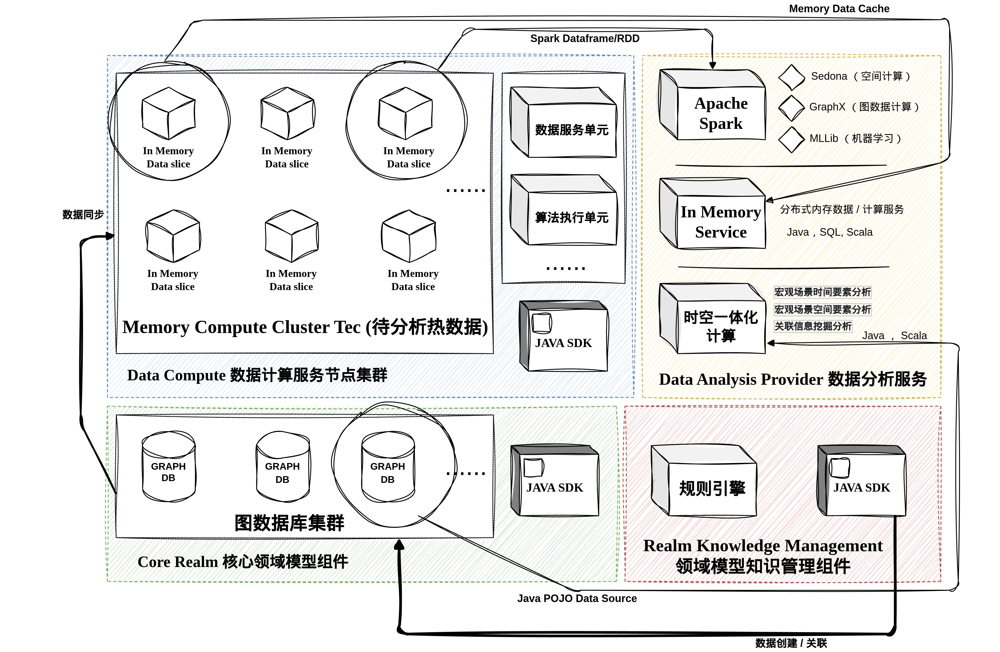

 DOCG 数据智能平台实时内存计算功能模块交互

### 核心功能模块

####   ○ 数据计算网格

DOCG 数据分析平台的 docg_dataCompute 模块的 ***DataCompute SDK*** 提供基于实时内存查询技术的高速数据缓存操作所需的各类 API。该 SDK 结合使用DataSlice 数据切片概念与 DOCG 数据分析平台的概念术语构建了统一的基于领域模型概念的数据缓存操作模型，将所有的数据透明的存储在后端的分布式内存存储节点集群中。该SDK使用 Java 技术开发 。

####   ○ 知识图谱数据管理

DOCG 数据分析平台的 docg_realmKnowledgeManage 模块提供基于图数据库、消息队列与规则引擎技术的自动化业务数据自动关联功能。该模块使用知识管理的概念来分项实现复杂业务数据的关联关系管理操作。知识图谱的构建遵循知识抽取、知识融合、知识加工、知识应用的基本流程。从海量结构化和非结构化数据中进行实体、关系、属性和事件的信息提取，通过本体和实体对齐、指代消解解决多种类型的数据冲突问题，完成知识融合。将知识存储到知识库中，最后进行进一步的知识推理和图谱应用。

####   ○ 时空一体化数据分析服务

DOCG 数据分析平台的 docg_analysisProvider 模块提供基于领域模型概念的图数据分析，平面地理空间分析，时间轴分析，机器学习分析与常规的业务数据查询分析等功能。

####   ○ 各模块交互关系

- **docg_coreRealm（事务模块）**：数据写入与本体定义变更的入口。
- **docg_dataCompute（内存计算模块）**：从图数据库异步或同步拉取变更，维护分布式内存缓存。
- **docg_analysisProvider（分析提供模块）**：封装图算法、时空分析、机器学习接口，调用底层 DataAnalysis SDK 与 DataCompute SDK。
- **docg_realmKnowledgeManage（知识管理模块）**：基于图数据库、消息队列与规则引擎，实现知识抽取、融合、加工的自动化流程。

## §  七、平台组成与开发接口

DOCG 数据智能平台提供了一整套 SDK 与可调用模块，方便上层应用集成与二次开发：

| 模块/SDK             | 主要功能                                   | 适用场景                   |
| -------------------- | ------------------------------------------ | -------------------------- |
| CoreRealm SDK        | 本体定义、概念实体/关系实体CRUD、事务操作  | 业务系统嵌入、数据接入开发 |
| DataCompute SDK      | 分布式内存缓存、数据切片、分析网格构建     | 高性能查询、实时分析       |
| DataAnalysis SDK     | 图算法、时空分析、机器学习、探索性分析     | 数据分析师、算法工程师     |
| 知识图谱数据管理模块 | 知识抽取、融合、加工、推理                 | 非结构化/半结构化数据接入  |
| 时空一体化分析服务   | 平面地理空间分析、时间轴分析、时空关联查询 | 智慧城市、物流、应急       |

### 核心功能 SDK

- **CoreRealm SDK（事务引擎）**：负责本体定义的联机事务处理（OLTP），所有概念实体、关系实体、属性变更实时写入底层图数据库集群，保证ACID事务特性。
- **DataCompute SDK（内存计算引擎）**：将本体实例实时或准实时同步至分布式内存缓存中，构建分析数据网格（Data Grid）。该网格按**数据切片（DataSlice）**组织，支持水平扩展。
- **DataAnalysis SDK（分析引擎）**：在内存数据网格上执行图计算、空间分析、时间推理与机器学习任务，结果可写回或单独存储。

所有功能均提供丰富的 Java SDK 以及可视化操作界面，支持：

- 无代码/低代码的分析配置
- 可视化的本体建模工具
- 交互式的知识图谱浏览与探索
- 分析任务调度与自动化流水线

## §  八、典型应用场景概述

### 1. 智慧城市与数字孪生

DOCG 数据智能平台可构建城市数据知识图谱，整合规划、建设、交通、环保、安防等多个部门的数据。通过本体模型统一“道路”“建筑工地”“监测站点”“事件”等概念，实现：
- 城市关键交通节点识别（中介中心性算法）
- 新建建筑周边危险源自动分析
- 重大活动保障中的应急资源图谱推演

### 2. 应急管理与公共安全

在应急指挥场景下，时间与空间是关键维度。DOCG 数据智能平台支持：
- 灾害事件发生后的“黄金24小时”资源调度路径规划
- 危险品运输车辆实时轨迹监控与风险预警
- 基于 GraphRAG 的智能指挥问答：“距离爆炸点3公里内、有医疗资质的机构有哪些？其当前床位占用情况如何？”

### 3. 金融风控与反欺诈

通过构建企业、自然人、担保、投资、交易等实体及关系的知识图谱，DOCG 数据智能支持：
- 关联担保网络中的隐性风险传导路径发现
- 中介中心性识别“关键中间人”
- 社区发现识别异常交易团体
- LLM 对可疑交易模式进行自然语言解释，辅助合规审核

### 4. 供应链优化与物流管理

基于DOCG本体模型，供应链中的“仓库”、“车辆”、“订单”、“路径”、“时段”等均可语义建模。分析能力包括：
- 最小生成树算法识别最短管道巡检路线或配送网络优化
- 实时时空查询：“当前哪些配送车辆可能因前方拥堵而延误？”
- 图算法+LLM：“请解释为什么建议将中转中心设在节点X，并列出前三的替代方案。”

### 5. 社交网络分析与用户洞察

结合用户行为数据、内容数据与关系数据，DOCG 数据智能平台支持：
- 基于 Louvain 算法的稳定兴趣群体发现
- PageRank 识别关键意见领袖
- 三角计数衡量社交圈凝聚力
- LLM 自动生成群体画像描述

## §  九、技术优势总结

| 维度     | DOCG 数据智能平台的独特优势                      |
| -------- | ------------------------------------------------ |
| 数据模型 | 本体驱动，语义统一，消除信息孤岛                 |
| 存储引擎 | 图数据库原生支持复杂关联，性能远超关系型         |
| 检索生成 | GraphRAG 框架，可解释、可溯源、高精度            |
| 时空分析 | 时间/空间为一等实体，支持复杂时空推理            |
| 算法能力 | 40+图算法内置，支持 OLAP 级图计算                |
| 实时性   | 内存计算网格，毫秒级子图检索                     |
| 交互方式 | 自然语言驱动（LLM Function Calling）+ 可视化探索 |
| 可扩展性 | 本体可演化，领域图谱可融合为跨领域大型图谱       |
| 可解释性 | 每个分析结果可回溯至具体实体、关系与路径         |

## §  十、总结：从数据到知识，从知识到智能

DOCG 数据智能平台不仅仅是一个数据管理工具或 BI 分析工具，更是一个**本体驱动的认知系统**。它通过本体模型统一语义，通过知识图谱表达关系，通过图算法与实时计算实现洞察，通过 LLM 与 GraphRAG 实现**自然语言驱动的图增强推理**。在技术栈上实现了五个层次的递进：

1. **数据层**：多源异构数据接入与统一存储
2. **本体层**：语义统一的领域模型，作为系统的“概念骨架”
3. **知识层**：本体实例化为知识图谱，表达实体与关系的动态网络
4. **算法层**：图算法与时空计算，实现深度洞察
5. **认知层**：LLM + GraphRAG，实现自然语言驱动的图增强推理

在DOCG平台中，用户不再面对冰冷的数据表、复杂的 SQL 或晦涩的 API，而是通过**对话、探索与推理**，与一个真正“理解”业务的知识系统协同工作。无论是数据分析师、业务决策者还是开发人员，都可以在各自熟悉的抽象层级上与平台互动。这标志着信息系统的演进迈出了关键一步：从“数据驱动”到“知识驱动”，再到“认知智能”。DOCG 数据智能平台，正是这一演进道路上的典型代表与基础设施。

 

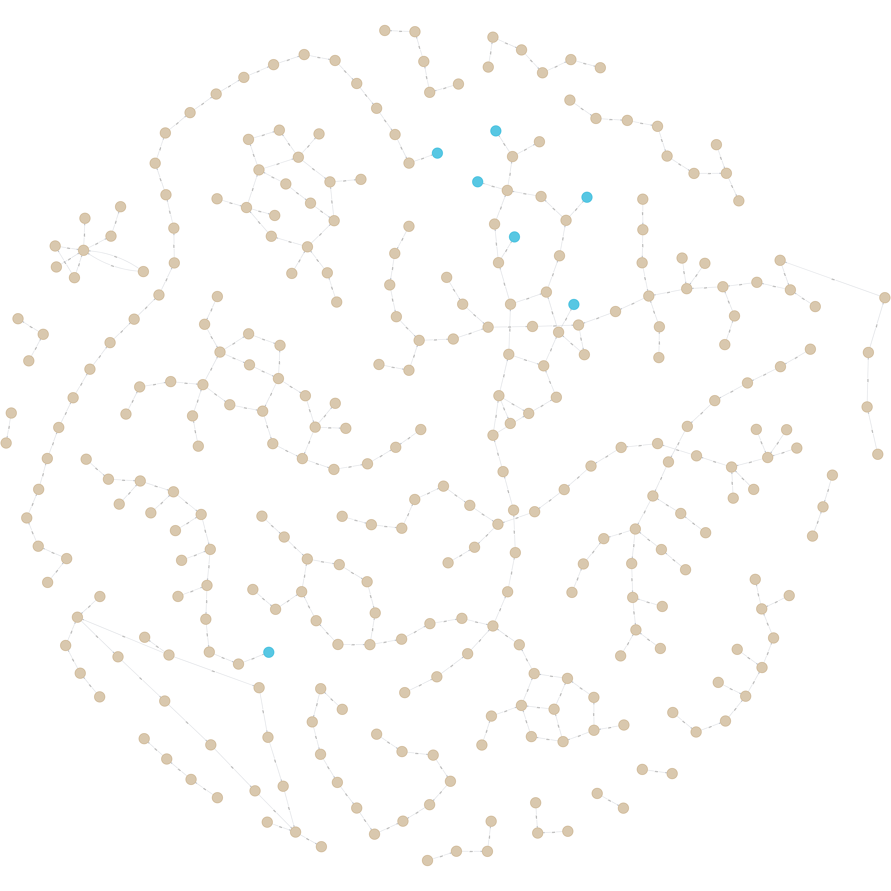