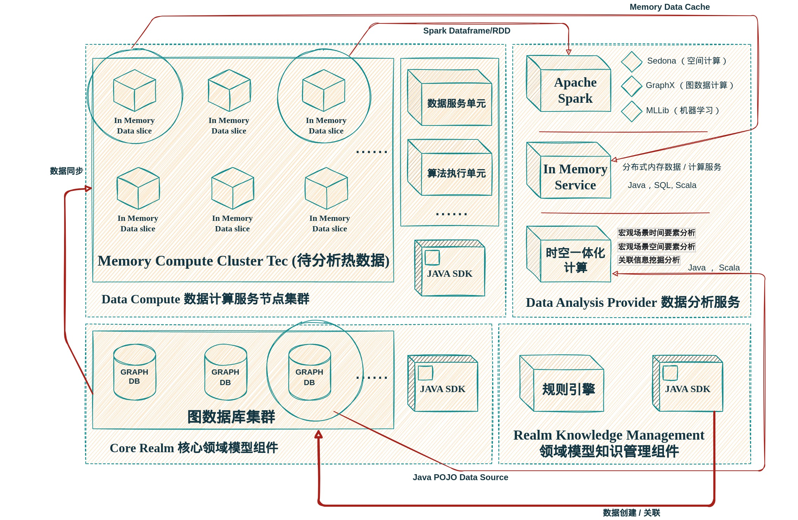

###### Data Ocean & Cloud Graph  数海云图

***

#  DOCG   数据分析平台概述

##### ◎ 摘要 

> *DOCG 数据分析平台是一个以图数据（属性图）库做为核心数据存储系统，以领域模型（领域知识图谱）概念做为核心数据模型，以图数据分析以及内存实时计算做为核心技术能力的综合数据分析与AI算法平台。它能够综合利用关联关系分析、时间轴分析、地理空间分析等能力执行复杂的数据分析与知识发现工作。能够有效的应用在时空一体化分析，多维度关联数据分析以及 EDA 探索性数据分析等新兴的应用领域。*

DOCG 数据分析平台是一个技术领先的 **综合数据分析与 AI 算法平台**。它使用图数据库技术作为底层核心数据存储系统，能够提供较传统基于关系数据库的信息系统更加强大、先进的数据分析能力，从而助力业务数据的价值发现。平台能够将各种来源的业务数据融合到同一个数据网络中，并通过 **时间**，**空间**，**关联关系** 等维度，以易于理解的面向业务的视角，综合利用关联关系分析、时间分析、平面地理空间（GIS）分析以及AI算法等先进技术手段执行高度复杂的数据分析并发现隐含的知识。以下是DOCG 数据分析平台的独特功能：

- ####  以 DDD 领域驱动设计为核心的 领域模型构建

- #### 数字孪生的 领域知识图谱

- ####  针对任何领域数据对象的 关联性数据分析

- ####  针对任何领域数据对象的 时空一体化分析

- #### 通过 实时内存计算 技术与主流大数据和机器学习，人工智能系统无缝集成

  

DOCG 数据分析平台核心功能操作界面

### § 领域模型构建

现代 IT 信息技术基础能力在持续的高速发展，与之相应，真实业务中客户需求的深度与广度也随之迅速提升，产生了越来越多的在企业全局视角下针对复杂场景的跨行业，跨业务线的高难度数据分析需求。这些分析需求涉及的各个行业的数据体系有其自身的业务独特性，也有跨行业间的共通性，需要一个科学合理的立足于整体的宏观数据模型体系来实现对各类繁乱复杂的业务数据的统一表述，管理和使用。

为了解决这个问题，需要有一个针对 **多源异构信息** 处理分析的数据管理系统，它必须具备一个核心能力：**能够使用统一的数据表达与管理手段，将各类不同信息系统中的数据组织，融合在一起**。为实现这种能力，该数据管理系统需要提供一种概念统一并且富有灵活性的建模能力，能够描述各种不同类型的外部数据源的技术与业务细节信息，并通过更高层的建模描述将这些信息对应的数据资源统合在一个业务场景中使用。此外它还必须提供一种统一的多元异构数据的获取与操作能力，能够将获取各类不同数据存储系统中业务数据的技术复杂性屏蔽，使用户只需要从业务领域模型的角度考虑业务应用问题，而无需关注具体的数据存取的技术细节。

DOCG 数据分析平台本质上就是这样的一个 **多源异构的信息存储，融合，访问，分析的IT数据处理系统，**它使用以下方法解决了上述问题：

1.通过使用数据管理 **领域模型** 内置的标准多源异构数据映射功能将各种IT业务系统的数据源中的数据直接导入到 DOCG 数据分析平台。在不改变任何现有信息系统的前提下，透明的实现对不同尺度下的所有不同来源数据的统一管理和使用。

2.通过使用 **图数据库技术** 来构建数据管理领域模型，实现灵活的业务模型与关联关系定义。

3.通过在各种不同数据管理领域模型之间建立业务关联，使IT系统在数据层面上再现真实世界中复杂的业务关系（如时间关联，地理空间关联等）。进而利用各种高阶数据分析算法对数据进行有效率，有针对性的分析。

####   ○ 使用 DDD 领域驱动设计实现 DOCG 数据分析平台的核心领域模型建模

为了实现 **建模（Modeling）**这一核心特征，需要提出一套相应的领域模型概念，使 DOCG 数据分析平台能够以统一的逻辑和术语来兼容表述各类行业领域的所有不同业务信息，进而实现其 **抽象定义**，**真实映射** 和 **孪生分析** 的核心数据处理能力。DOCG 数据分析平台的业务模型使用以下的主要术语来描述实现一个业务领域模型所需要的各种对象的概念。通过组合使用这些对象的功能，可以实现针对特定领域模型的全部数据管理与分析相关的业务需求。

**概念类型**（*ConceptionKind*）：特定领域模型中能够包含的任意真实或逻辑概念的类型表达。

**概念实体**（*ConceptionEntity*）：一个特定概念类型的真实数据表达。

**属性类型**（*AttributeKind*）：概念类型中包含的一项数据信息的基本结构。

**属性视图类型**（*AttributesViewKind*）：属性视图类型是包含若干属性类型的视图容器，描述一个概念类型中包含的某一个特定类别的属性信息集合。

**关系类型**（*RelationKind*）: 概念实体之间的一种特定的关联方式。

**关系实体**（*RelationEntity*）: 一个特定关系类型的真实数据表达，表示特定领域模型中两个概念实体之间的一个客观关联。

**分类**（*Classification*）：代表一类客观存在的，不依赖具体的业务和分析目标而变化的字典类概念。

**时间刻度实体**（*TimeScaleEntity*）：一种特殊的概念实体，每一个时间刻度实体代表一个固定的时间点。

**时间刻度事件**（*TimeScaleEvent*）：代表一个常规概念实体在特定时刻上的与时间相关的事件。

**地理空间刻度实体**（*GeospatialScaleEntity*）：是一种特殊的概念实体，每一个地理空间刻度实体代表一个特定的行政区划。

**地理空间刻度事件**（*GeospatialScaleEvent*）：代表一个常规概念实体在特定地理位置上的与空间相关的事件。

核心领域概念交互逻辑

以下是相关技术信息的详细内容介绍：

- [DOCG 数据分析平台核心领域模型概念详细说明](./Documentation/modeling/modeling.md)
- [DOCG 数据分析平台核心领域模型 CoreRealm SDK 详细说明](./Documentation/coreRealm/JavaSDK_API.md)
- [DOCG 数据分析平台领域模型数据管理工作台](./Documentation/sysAdmin/sysadminConsole.md)

####   ○  DOCG 数据分析平台使用图数据库技术的核心设计实现

DOCG 数据分析平台旨在对核心领域模型数据的概念类型定义、概念实体管理、关系类型定义与关系实体管理、数据服务和数据相关配置等各方面进行综合、统一的应用管理。实现有效的统一管理之后，就可以对这些海量的业务领域数据进行孪生分析，既在数据层面上通过在各种不同的概念实体之间建立关联关系来再现真实世界中复杂的业务关联，进而对数据进行有效率有针对性的分析。图数据库是一种非常适应该场景的复杂关联数据的存储与分析技术。                      

图数据库（Graph Database） 将整个数据集合建模成一个大型稠密的网络结构，使用图论来构建数据存取的模型。图论（Graph Theory）是数学的一个分支，它以图为研究对象。图论中的图是由若干给定的点及连接两点的线所构成的网状数据图形，这种结构拓扑通常用来描述某些事物之间的某种特定关系，用点代表事物，用连接两点的线表示相应两个事物间具有这种关系。而当前在负责业务场景的领域模型应用中，有大量的对于相互关联的  **关联数据 Relational Data** （例如包含、控制、接触、联络、群体依附和集结等）的查询和探索的需求，例如：

- 发现城市建筑网络中的关键影响因素、桥接实体和群体。 
- 智能发现建筑维修隐患以增强维修预警时效性并给出更明智、更专业的建议。
- 发现指示危险源头行为的模式及关系。 

针对这类“多对多对多”的关系查询和遍历计算以及定量分析，图论模型更是具有先天的优势。

此外使用图数据库技术实现的 DOCG 数据分析平台核心领域模型具有以下两个独特的技术优点：

1. 通过使用基于图形数据库的实现方式，可以消除关系模型在大规模数据集合和复杂数据类型及关联关系的应用场景下所无法解决的**实现复杂性**方面的问题。

2. 基于图数据模型的特点以及图论算法的支持，对多维度条件下的关联信息查找和发现提供了比传统关系模型 **更加强大的功能支持以及更加快捷的性能支持**。

图数据结构实现领域模型实体

以下是使用图数据库技术研发实现 DOCG 数据分析平台核心领域模型的核心策略:

- 通过使用图数据库来构建 DOCG 核心领域模型中的各个逻辑组件，实现灵活的概念模型与关联关系定义。

- 通过使用 DOCG 核心领域模型将各种类型的异构数据源中的数据导入到数据分析平台，实现对数据的管理和使用。

- 根据 DOCG 数据分析平台的领域模型定义，使用图数据库技术设计开发核心元数据与关联关系数据存储系统，其中存储核心领域模型中所有对象实体的元数据以及所有对象实体之间的关联关系。

- 当对 DOCG 数据分析平台的概念实体进行基本存取和关联关系分析时，根据数据分析平台的领域模型定义直接操作核心元数据与关联关系数据存储系统。

- 当对DOCG 数据分析平台的概念实体进行复杂的跨外部异构数据源操作时，从核心元数据与关联关系数据存储系统中获取跨数据源操作所需的元数据信息，并以访问属性视图的形式将多源异构数据源中的数据返回给用户。

- 通过在各种不同 DOCG 概念类型之间建立业务关联关系映射，使IT系统在数据层面上再现真实世界中复杂的业务关联（如时空一体化分析等），从而对数据进行有效率有针对性的分析。

   
### § 领域知识图谱

知识图谱是一种用图模型来描述知识和建模世界万物之间关联关系的大规模语义网络，是大数据时代知识表示的重要方式之一。它通过对海量结构化和非结构化数据进行知识萃取并关联形成网状知识结构，对概念间的关系属性进行联结和转换，支持非线性的、高阶关系的分析，为描绘物理世界生产生活行为提供了有效的方法与工具，是认知智能的底层支撑。

知识图谱是符号主义人工智能的代表，核心在于 ***对多模、多源异构数据和多维复杂关系的高效处理与可视化展示，将社会生活与生产活动中难以用数学模型直接表示的关联属性，融合成一张以关系为纽带的数据网络***。通过对关系的挖掘与分析，能够 ***找到隐藏在行为之下的关联，并进行直观的展示***。基于知识图谱的上述优势，适宜解决关系复杂的问题，如深度搜索、规范业务流程、规则和经验性预测等相关研究课题。知识图谱还可以帮助机器实现认知智能的 “***理解*** ”  和 “***解释*** ” 能力：通过建立从数据到知识图谱中实体、概念、关系的映射，使机器能理解数据，从数据中提炼出行业或领域内高精度的知识；通过利用知识图谱中实体、概念和关系来解释现实世界中的事物和现象，使机器能解释现象。更进一步的，基于知识图谱和逻辑规则或统计规律，机器能推理出实体或概念间深层的、隐含的关系，实现认知智能的“推理”能力。

根据覆盖范围的不同，知识图谱可以区分为应用相对广泛的通用知识图谱和专属于某个特定领域的行业领域知识图谱：通用知识图谱覆盖范围广，注重横向广度，强调融合更多的实体，通常采用自底向上的构建方式，从开放链接数据(“信息”)中抽取出置信度高的实体，再逐层构建实体与实体之间的联系；行业领域知识图谱指向一个特定的垂直行业，注重纵向深度，具有丰富的实体属性和数据模式，通常采用自顶向下的构建方式，先定义好本体与数据模式，再抽取实体加入到知识库。

下图示例描述了在城市建设阶段针对建设工程管理的一个行业知识图谱领域模型定义的案例：

建筑工程建设知识图谱相关领域模型

DOCG 数据分析平台通过使用核心领域模型建模创建的数据网络，天然就是一个面向特定业务目标的行业领域知识图谱。通过使用 概念类型（*ConceptionKind*），概念实体（*ConceptionEntity*），关系类型（*RelationKind*），关系实体（*RelationEntity*）以及 属性类型（*AttributeKind*）等核心模型概念，使用者能够以面向业务描述的理解方式，根据真实场景以数字镜像（数字孪生）的方式简洁、透明的定义出能够真实反映实际业务的领域知识图谱。

通过持续不断的在不同的领域定义并完善相关的领域知识图谱，并将这些图谱按真实世界的逻辑融合起来，即可得到一个 **能够持续自我成长，自我完善，自我演化，并不断产生新的深层知识的大型跨领域知识图谱**  。 

独立小型领域知识图谱无缝融合构成大型跨领域知识图谱

### § 关联性数据分析

在使用图数据库技术的 DOCG 数据分析平台中导入各类业务数据并完成数据关联后，实质上形成了一个业务领域的知识图谱。通过使用该知识图谱，可以完成基于关联关系拓扑的复杂分析与展示功能。从观察粒度看针对知识图谱主要有两种分析途径：

- 微观层面：通过针对单个（或若干个）节点对象的关联关系分析，来发现局部数据中的知识信息，常用领域为EDA（探索性数据分析），推荐引擎（相似性分析），关联性查找（最短路径分析，关联性分析等）。

- 宏观层面：使用知识图谱技术，通过对图谱中所有或大量的节点对象和关系对象执行高阶知识图谱分析分析算法（PageRank，Triangle Count，Connected Components，Label Propagation等），来发现数据中整体性，规律性的全局知识。例如基于度分布的中枢节点发现，基于最大连通图的社区发现，基于三角计算的关系衡量，基于随机游走的用户属性传播等。

在 DOCG 数据分析平台中，有丰富的数据分析工具（SDK / API）与操作界面能够用来完成针对上述两种途径的数据分析与展示。

####   ○  在基于图数据库技术的 DOCG 数据分析平台上执行微观层面关联关系分析

利用知识图谱提供的技术能力，可以使用数字孪生的方式，通过在不同类型的实体数据间定义各种类型的关联关系映射来完全再现特定业务领域的各个业务环节之间的相互关联并展开有针对性的业务关系分析。例如在面向城市建设与管理类应用的城市数据领域知识图谱中完成如下分析任务：

- 分析和一个建设工程相似的其他数据对象（关联到同一个企事业单位的其他数据）

- 分析一个机械装备和一个建设工程项目之间的最短路径的关联关系

- 从一个建设工程出发，探索性的分析它与各类其他对象之间的关联关系

在 DOCG 数据分析平台中，所有的 概念实体（*ConceptionEntity*） 均可以通过关联关系与其他的概念实体相互联接。通过将任意的概念实体作为分析起点，均可以执行面向局部图谱的关联关系分析与可视化展示。以下示例展示了使用 DOCG 数据分析平台操作界面执行微观层面关联关系分析的方法：

从任意概念实体出发执行知识图谱 EDA 探索性数据分析

从任意概念实体出发执行知识图谱实体1度关系展开

####   ○  在基于图数据库技术的 DOCG 数据分析平台上执行高阶知识图谱数据分析

在 DOCG 数据分析平台中，表述领域模型的 概念实体（*ConceptionEntity*）与 关系实体（*RelationEntity*）是存储在图数据库中的 **顶点（*vertex*）**与  **边（*edge*）**，因此可以使用各种类型的图算法来针对领域模型执行高阶知识图谱分析。图算法的类型有很多，从应用的目的来说主要分为 **路径查找（*Path finding*）**, **中心性评估（*Centrality*）**以及 **社区发现（*Community Detection*）** 三类 :

**路径查找算法 (*Path finding*) ** 是建立在图搜索算法的基础上,它探索节点之间的路径,从一个节点开始,遍历关系,直到到达目的节点。这些算法用于识别图中的最优路由,算法可以用于诸如物流规划、最低成本呼叫或游戏模拟等用途。最常用的路径查找算法包括:

- 最短路径(*shortest path*),以及它的两种变体(*A Star*和 *Yen's*):找到两个指定节点之间的最短路径。
- 所有结对最短路径(*All Pairs Shortest Path , APSP*)和单源最短路径(*SingleSource Shortest Path,SSSP*):用于查找所有节点对之间的最短路径,或从选定节点到所有其他所有节点的最短路径。
- 最小生成树(*Minimum Spanning Tree , MST*):用于找到一个连接树结构,在这个结构中,从指定节点访问所有节点的成本最小 。
- 随机行走(*Random Walk*):它是机器学习工作流或其他图算法的一个有用的预处理/采样步骤。

**中心性算法（*Centrality*）** 用于判断网络中节点的重要程度,最常用的中心性算法包括:

- 点度中心性算法：度中心性算法可用于查找图中“流行”的节点。度量一个节点的传入或传出(或两者都有)关系的数量。

- 中介中心性算法：一般用于弱连通图的计算。（即两节点之间至少有一条关系连接）中介中心性算法是一种检测节点对图中信息流影响程度的方法。它通常用于寻找图的一部分到另一部分的桥梁的节点。该算法计算图中所有节点对之间的最短路径。每个节点都会根据经过该节点的最短路径的数量获得一个分数。更频繁地位于其他节点之间最短路径上的节点将具有更高的中介中心性得分。

- 接近中心性与调和中心算法：接近中心性算法一般用于连通图的计算。调和中心性可用于不连通图的计算。接近中心性度量一个节点到所有其他节点的平均距离(逆距离)。得分高的节点与所有其他节点之间的距离最短。调和中心性算法在接近中心性算法的基础上，调整算法解决了两节点直接不链接（正无穷）的问题。

- 特征向量中心性算法：一种度量节点传递影响的算法。来自高分节点的关系比来自低分节点的连接对节点得分的贡献更大。高特征向量得分意味着一个节点连接到许多本身得分较高的节点。

- PageRank 算法：根据输入关系的数量和相应源节点的重要性来测量图中每个节点的重要性。

**社区发现（*Community Detection*）**算法用于评估节点组的聚类和划分。

- Louvain算法：一种大型网络中检测社区的算法，评估一个社区内节点的连接密度。它以层次聚类的方式将集群递归地合并到一个节点上，同一集群的节点之间的关系成为自关系，改集群节点与其他集群的节点的关系连接到集群的代表点上。然后使用这个压缩图运行下一级别的集群运算。重复该过程，直到集群稳定。
- 标签传播算法：LPA算法首先对每个节点都使用唯一的标识符进行初始化。这些标签通过图网络传播。在每次传播迭代中，节点会将其标签更新为其邻居数量最多的标签。当每个节点都有大多数相邻节点共有的标签时，LPA达到收敛并停止。随着标签的传播，密集连接的节点组很快共有同一标签。在传播结束时，只有少数标签将会保留。在收敛时具有相同团体标签的节点属于同一个团体。LPA可以用来为节点分配初步标签，作为半监督的方式来寻找一些初始集群。

- 弱连通子图与强连通子图计算：判断图中弱连通子图与强联通子图的个数。弱连通图指图中任意两点间之在不考虑方向的情况下可以连通。而在强连通图中，任意两节点必须双向连通。图连通性的判断可帮助维持后续其他算法正确性。

- 三角计数算法：该算法计算图中每个节点的三角形数量。三角形是由三个节点组成的集合，每个节点都与其他两个节点有关系。三角计数法在社会网络分析中很受欢迎，它被用来检测和衡量社区的凝聚力。也可以用来确定图的稳定性，并且经常被用作网络指数(如聚类系数)计算的一部分。还可用于计算局部聚类系数。

在 DOCG 数据分析平台的核心领域模型 CoreRealm SDK 中 提供了 DataScienceOperator 工具， 它通过提供 可分析图（*AnalyzableGraph*） 功能的形式提供了近 40 种 常用的中心性和社区发现图算法。在核心领域模型中的任意概念实体（*ConceptionEntity*）上均可以执行路径查找算法。

以下是相关技术信息的详细内容介绍：

- [DOCG 数据分析平台核心领域模型 可分析图应用说明](./Documentation/coreRealm/AnalyzGraph.md)

### § 时空一体化分析

时间与空间要素是在数字孪生场景下实现多源数据融合的有效手段。***时间，空间和常规属性是任意场景中业务数据本身固有的三种基本要素，是反映业务数据实体的状态和演变过程的重要组成部分***。尽管不同来源的数据使用的表达形式和技术实现方式各不相同，但在语义上是相同的。在知识图谱中通过使用时间和空间要素做为桥梁，可以将各种不同来源的数据有效的融合在一起。

通过将不同数据节点中的时间和空间属性标准化并相互关联，能够执行传统上只能由 ArcGIS 类型的空间分析软件执行的空间分析计算。并且进一步的能够在这些空间分析算法中集成时间分析和普通的业务分析。进而提供了综合的 **时空一体化分析能力**。以下是该能力一些可能的使用场景示例：

- 招商选址 - 规划地块查询，供热点，道路和供水管道数据。使用空间查询算法找出所有在周围1000米内有供热点，距离道路小于300米，距离供水管小于100米，且用地性质为商业用地，面积大于10000平米的地块。

- LBS高级查询 - 查询在指定路口半径500米范围内的所有城市部件。
- 危险源分析 - 查找出自2010年到2015间年海淀区所有新建的层高超过30层，周边100米内坐落有危险源（加油站，储气站等），距离消防设施超过1KM，建设方是富力地产的建筑。
- 合规性分析 - 根据2010年的中关村软件园规划数据，从2012年开始，查询五年内每年新建成且在合法规划片区之外的建筑物。

时空一体化分析应用示例

####   ○ 构建领域知识图谱空间要素

DOCG 数据分析平台利用核心领域模型以及图数据库技术的特性，使用如下方式构建了领域知识图谱的各级空间要素：

1. 
   结合全球与中国的行政区划设计，在知识图谱的图数据库中建立特殊的代表不同行政区划粒度的节点类型

   GS_CountryRegion ：国家地区节点
   GS_Province ：省级节点
   GS_Prefecture ：地级节点
   GS_County ：县级节点
   GS_Township ：乡级节点
   GS_Village ：村级节点

2. 在知识图谱的图数据库中建立特殊的代表不同地理空间之间联系的关系类型

   GS_SpatialContains ：包含下一级空间节点
   GS_SpatialIdentical ：相同的空间节点
   GS_SpatialAdjacency ：相邻的空间节点

3. 根据业务需要的地理空间范围，结合使用 GIS 空间地理数据与空间关系计算功能，构建各个粒度的地理空间节点并相互建立空间关联，构成全局统一的地理空间行政管理体系

4. 获取具有 GIS 地理空间属性的各类业务数据，在图数据库中按照业务分类创建数据节点，通过 GIS 空间关系计算功能，在数据节点与行政区划节点和其他数据节点之间建立空间关联关系，构成领域知识图谱的空间形态

时空领域知识图谱可视化地理空间局部

 下图展示了 DOCG 数据分析平台操作界面的地理空间区域管理功能：

地理空间区域管理

####   ○ 构建领域知识图谱时间要素

DOCG 数据分析平台利用核心领域模型以及图数据库技术的特性，使用如下方式构建了领域知识图谱的各级时间要素：

1. 在知识图谱的图数据库中建立特殊的代表不同时间粒度的节点类型

   1. TS_Year ：年时间节点
   2. TS_Month ：月时间节点
   3. TS_Day ：日时间节点
   4. TS_Hour ：小时时间节点
   5. TS_Minute ：分钟时间节点

2. 在知识图谱的图数据库中建立特殊的代表不同时间之间联系的关系类型

   1. TS_Contains ：包含下一级时间节点
   2. TS_NextIs：同级的下一个时间节点
   3. TS_FirstChildIs：下一级的第一个时间节点
   4. TS_LastChildIs：下一级的最后一个时间节点

3. 根据业务需要的时间范围创建各个粒度的时间节点并相互建立时间关联关系，构成全局统一的时间轴

4. 获取具有时间属性的各类业务数据，在图数据库中按照业务分类创建数据节点，在数据节点与时间轴上对应的时间节点之间建立时间关联关系，构成领域知识图谱的时间形态

时空领域知识图谱时间轴片段

下图展示了 DOCG 数据分析平台操作界面时间流管理功能：

时间流管理

### § 实时内存计算

DOCG 数据分析平台具有 **OLTP** 类联机事务处理与 **OLAP** 类联机数据分析双重能力。使用中可以通过 docg_coreRealm 模块的 ***CoreRealm SDK*** 执行与实时业务处理相关的数据操作，产生的各类数据变更会存储在底层的图数据库集群中，并根据分析需求动态的同步到由 docg_dataCompute 模块提供的待分析数据分布式内存缓存中。之后在 OLAP 类数据分析场景中，可以联合使用  docg_dataCompute 模块的 ***DataCompute SDK*** ，docg_coreRealm 模块的 ***CoreRealm SDK*** 和  docg_analysisProvider 模块的 ***DataAnalysis SDK***  执行基于 Spark，实时内存与领域模型技术的 图计算，平面地理空间分析，时间轴分析，机器学习分析与常规的业务数据查询分析。

各个不同模块在数据分析场景的作用与交互关系说明如下：

 DOCG 数据分析平台实时内存计算功能模块交互

####   ○ 数据计算网格

DOCG 数据分析平台的 docg_dataCompute 模块的 ***DataCompute SDK*** 提供基于实时内存查询技术的高速数据缓存操作所需的各类 API。该 SDK 结合使用DataSlice 数据切片概念与 DOCG 数据分析平台的概念术语构建了统一的基于领域模型概念的数据缓存操作模型，将所有的数据透明的存储在后端的分布式内存存储节点集群中。该SDK使用 Java 技术开发 。

以下是相关技术信息的详细内容介绍：

- [DOCG 数据分析平台 Data Compute 应用指南](./Documentation/dataCompute/Java SDK API.md)

  

####   ○ 知识图谱数据管理

DOCG 数据分析平台的 docg_realmKnowledgeManage 模块提供基于图数据库、消息队列与规则引擎技术的自动化业务数据自动关联功能。该模块使用知识管理的概念来分项实现复杂业务数据的关联关系管理操作。知识图谱的构建遵循知识抽取、知识融合、知识加工、知识应用的基本流程。从海量结构化和非结构化数据中进行实体、关系、属性和事件的信息提取，通过本体和实体对齐、指代消解解决多种类型的数据冲突问题，完成知识融合。将知识存储到知识库中，最后进行进一步的知识推理和图谱应用。

以下是相关技术信息的详细内容介绍：

- [DOCG 数据分析平台 知识图谱数据管理 应用指南](./Documentation/realmKnowledgeManage/usageGuide.md)

  

####   ○ 时空一体化数据分析服务

DOCG 数据分析平台的 docg_analysisProvider 模块提供基于领域模型概念的图数据分析，平面地理空间分析，时间轴分析，机器学习分析与常规的业务数据查询分析等功能。

以下是相关技术信息的详细内容介绍：

- [DOCG 数据分析平台 Data Analysis provider 应用指南](./Documentation/dataAnalysis/usageGuide.md)

